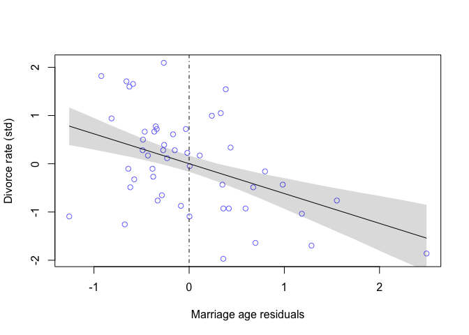
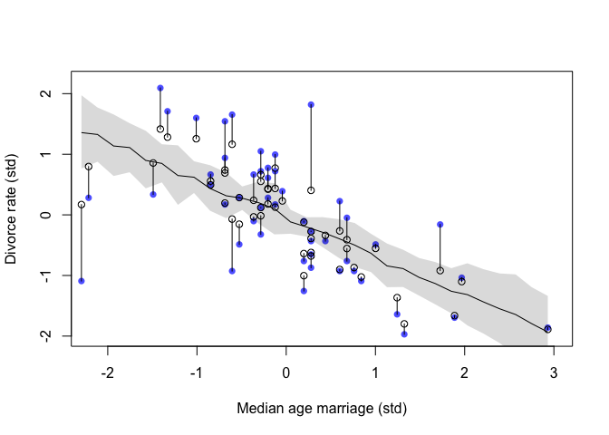
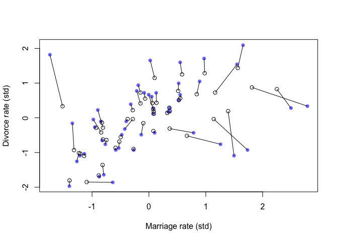

WaffleDivorce
================

# Instalation

``` r
rm(list=ls())
```

``` r
library(MASS)
library(rstan)
library(shape)
library(tidyr)
library(ggplot2)
library(dagitty)
library(gtools)
library(ellipse)
library(tidyverse)
library(rethinking)
```

``` r
options(mc.cores = parallel::detectCores())
rstan_options(auto_write = TRUE)
```

# Load Data

``` r
data("WaffleDivorce")
d <- WaffleDivorce
```

``` r
d$D <- standardize(d$Divorce)
d$M <- standardize(d$Marriage)
d$A <- standardize(d$MedianAgeMarriage)
```

# 1.Spurious association

In this part, we are going to examine a misleading correlation between
Divorce rate with several predictor variables in the data

## Initial statistical models


## Prior predictive checks

``` r
N <- 100
a <- rnorm(N,0,0.2)
bA <- rnorm(N,0,0.5)
sigma <- rexp(N,1)
```

``` r
set.seed(1)
plot(NULL, xlim=range(d$A), ylim=c(-3,3),
     xlab="Marriage Age (standardized)", ylab="Divorce rate (standardized)")
for (i in 1:50){
  curve(a[i]+bA[i]*x,from=min(d$A),to=max(d$A),add=TRUE, col=col.alpha(rangi2,0.4))
}
```

<!-- -->

We have a weakly informative prior that allows the standardized value of
mean of D varies in range of (-2,2). We are going to fit the model

## Fitting the model

``` r
dlist <- list(
  N = nrow(d),
  D = d$D,
  A = d$A,
  M = d$M
)
```

``` r
code_m1.1 <- "
data{
  int N;
  vector[N] D;
  vector[N] A;
}
parameters{
  real a;
  real bA;
  real<lower=0> sigma;
}
model{
  vector[N] mu;
  a ~ normal(0,0.2);
  bA ~ normal(0,0.5);
  sigma ~ exponential(1);
  for(i in 1:N){
    mu[i] = a + bA*A[i];
  }
  D ~ normal(mu, sigma);
}
generated quantities{
  vector[N] log_lik;
  vector[N] mu;
  for(i in 1:N){
    mu[i] = a + bA*A[i];
  }
  for(i in 1:N){
    log_lik[i] = normal_lpdf(D[i]|mu[i],sigma);
  }
}
"
```

``` r
m1.1 <- stan(model_code=code_m1.1,data=dlist, chains=4, cores=4)
```

``` r
precis(m1.1)
```

    ##               mean        sd       5.5%      94.5%    n_eff     Rhat4
    ## a      0.001706141 0.1029572 -0.1610999  0.1649101 3699.333 0.9999048
    ## bA    -0.565729656 0.1148323 -0.7500387 -0.3841718 3599.514 1.0005044
    ## sigma  0.821882577 0.0839570  0.7016973  0.9636089 3703.142 0.9998747

The estimate for bA is reliably negative. Should we believe that
marriage age negatively impacts divorce rates?

We run an extra model that regresses divorce rate on marriage rate

``` r
code_m1.2 <- "
data{
  int N;
  vector[N] D;
  vector[N] M;
}
parameters{
  real a;
  real bM;
  real<lower=0> sigma;
}
model{
  vector[N] mu;
  a ~ normal(0,0.2);
  bM ~ normal(0,0.5);
  sigma ~ exponential(1);
  for(i in 1:N){
    mu[i] = a + bM*M[i];
  }
  D ~ normal(mu, sigma);
}
generated quantities{
  vector[N] log_lik;
  vector[N] mu;
  for(i in 1:N){
    mu[i] = a + bM*M[i];
  }
  for(i in 1:N){
    log_lik[i] = normal_lpdf(D[i]|mu[i],sigma);
  }
}
"
```

``` r
m1.2 <- stan(model_code=code_m1.2, data=dlist, chains=4, cores=4)
```

``` r
precis(m1.2)
```

    ##               mean         sd       5.5%     94.5%    n_eff     Rhat4
    ## a     -0.001648854 0.11195826 -0.1802670 0.1768978 3800.804 0.9996018
    ## bM     0.347361560 0.12858854  0.1422035 0.5511897 3827.491 0.9992584
    ## sigma  0.946201807 0.09741669  0.8011730 1.1146728 3747.008 0.9995000

The second model suggests a positive impact of marriage rate into
divorce rate although the impact is less than the previous one

Let’s plot these two posteriors

## Posterior predictive checks

``` r
post.1 <- extract.samples(m1.1)
A_seq <- seq(from=min(d$A), to=max(d$A), length.out=30)
mu.1 <- sapply(A_seq, function(A){post.1$a + post.1$bA*A})
# mu.1 <- link(m1.1, data=list(A=A_seq))
mu.mean.1 <- apply(mu.1, 2, mean)
mu.pi.1 <- apply(mu.1, 2, PI, prob=0.89)
```

``` r
plot(NULL, xlim=range(d$A), ylim=range(d$D),
     xlab="Marriage Age (standardized)", ylab="Divorce rate (standardized)")
points(x=d$A, y=d$D, col=rangi2)
lines(x=A_seq, y=mu.mean.1)
shade(mu.pi.1, A_seq)
```

<!-- -->

``` r
post.2 <- extract.samples(m1.2)
M_seq <- seq(from=min(d$M), to=max(d$M), length.out=30)
mu.2 <- sapply(M_seq, function(M){post.1$a + post.1$bA*M})
# mu.2 <- link(m1.2, data=list(M=M_seq))
mu.mean.2 <- apply(mu.2, 2, mean)
mu.pi.2 <- apply(mu.2, 2, PI, prob=0.89)
```

``` r
plot(NULL, xlim=range(d$M), ylim=range(d$D),
     xlab="Marriage rate (standardized)", ylab="Divorce rate (standardized)")
points(x=d$M, y=d$D, col=rangi2)
lines(x=M_seq, y=mu.mean.2)
shade(mu.pi.2, M_seq)
```

<!-- -->

Both of these models is showing us a correlation between marriage age
with divorce rate and marriage rate with divorce rate. Our ultimate goal
is to find out the causality, not correlation. How can we do it?

## Directed Acyclic Graphs (DAGs)

Let’s think before we regress and causal diagrams are essential

These models draw us the DAG below as A and M impacts D. Is there any
arrow connecting A and M?

``` r
dag1.1 <- dagitty("dag{A -> D; M -> D}")
coordinates(dag1.1) <- list(x=c(A=0,D=1, M=2), y=c(A=0,D=1,M=0))
drawdag(dag1.1)
```

<!-- -->

``` r
code_m1.3 <- "
data{
  int N;
  vector[N] M;
  vector[N] A;
}
parameters{
  real a;
  real bAM;
  real<lower=0> sigma;
}
model{
  vector[N] mu;
  a ~ normal(0,0.2);
  bAM ~ normal(0,0.5);
  sigma ~ exponential(1);
  for(i in 1:N){
    mu[i] = a + bAM*A[i];
  }
  M ~ normal(mu, sigma);
}
generated quantities{
  vector[N] log_lik;
  vector[N] mu;
  for(i in 1:N){
    mu[i] = a + bAM*A[i];
  }
  for(i in 1:N){
    log_lik[i] = normal_lpdf(M[i]|mu[i],sigma);
  }
}
"
```

``` r
m1.3 <- stan(model_code=code_m1.3, data=dlist, chains=4, cores=4)
```

``` r
precis(m1.3)
```

    ##                mean         sd       5.5%      94.5%    n_eff     Rhat4
    ## a     -0.0004773467 0.09225134 -0.1471790  0.1459474 3754.729 0.9994380
    ## bAM   -0.6910836353 0.10192404 -0.8502120 -0.5249307 3438.432 0.9997720
    ## sigma  0.7125739794 0.07372123  0.6053477  0.8358610 3846.678 0.9994053

``` r
code_m1.4 <- "
data{
  int N;
  vector[N] M;
  vector[N] A;
}
parameters{
  real a;
  real bMA;
  real<lower=0> sigma;
}
model{
  vector[N] mu;
  a ~ normal(0,0.2);
  bMA ~ normal(0,0.5);
  sigma ~ exponential(1);
  for(i in 1:N){
    mu[i] = a + bMA*M[i];
  }
  A ~ normal(mu, sigma);
}
generated quantities{
  vector[N] log_lik;
  vector[N] mu;
  for(i in 1:N){
    mu[i] = a + bMA*M[i];
  }
  for(i in 1:N){
    log_lik[i] = normal_lpdf(A[i]|mu[i],sigma);
  }
}
"
```

``` r
m1.4 <- stan(model_code=code_m1.4, data=dlist, chains=4, cores=4)
```

``` r
precis(m1.4)
```

    ##               mean         sd       5.5%      94.5%    n_eff     Rhat4
    ## a     -0.001438977 0.09154109 -0.1497101  0.1431043 3986.684 1.0001523
    ## bMA   -0.690530982 0.10126122 -0.8527521 -0.5293898 3514.537 1.0003527
    ## sigma  0.713596059 0.07255868  0.6070323  0.8398958 3604.406 0.9998666

The third and fourth models consistently show a negative relationship
between marriage rate and marriage age. So, the next question is whether
marriage age causes marriage rate or the other way. The common sense is
the former one that marriage age negatively impacts marriage rate. Thus,
we can go ahead and update our DAG

``` r
dag1.2 <- dagitty("dag{A -> D; M -> D; A -> M}")
coordinates(dag1.2) <- list(x=c(A=0,D=1, M=2), y=c(A=0,D=1,M=0))
drawdag(dag1.2)
```

<!-- -->

Based on the DAG, we are able to see that A has direct impacts and
indirect impact through M on D. The indirect path is known as mediation
and M is called mediator

The indirect path A -> M -> D is a pipe or a chain. Theoretically, it is
a backdoor path that allows indirect impact of A onto D

In the first model, we get the estimate for bA is (-0.57) which is a sum
of direct and indirect impact of A onto D. In order to extract the
direct impact only, we should close the backdoor path by conditioning on
D

## Updated statistical models


``` r
code_m1.5 <- "
data{
  int N;
  vector[N] M;
  vector[N] A;
  vector[N] D;
}
parameters{
  real a;
  real bM;
  real bA;
  real<lower=0> sigma;
}
model{
  vector[N] mu;
  a ~ normal(0,0.2);
  bM ~ normal(0,0.5);
  bA ~ normal(0,0.5);
  sigma ~ exponential(1);
  for(i in 1:N){
    mu[i] = a + bM*M[i] + bA*A[i];
  }
  D ~ normal(mu, sigma);
}
generated quantities{
  vector[N] log_lik;
  vector[N] mu;
  for(i in 1:N){
    mu[i] = a + bM*M[i] + bA*A[i];
  }
  for(i in 1:N){
    log_lik[i] = normal_lpdf(D[i]|mu[i],sigma);
  }
}
"
```

``` r
m1.5 <- stan(model_code = code_m1.5, data=dlist, chains=4, cores=4)
```

``` r
precis(m1.5)
```

    ##               mean         sd       5.5%      94.5%    n_eff     Rhat4
    ## a      0.003190949 0.09872400 -0.1513162  0.1634789 3412.076 1.0000955
    ## bM    -0.063275008 0.15493165 -0.3102761  0.1797606 2888.180 0.9997050
    ## bA    -0.606133186 0.15594112 -0.8495745 -0.3613730 3010.357 1.0000629
    ## sigma  0.826640732 0.08544998  0.7023138  0.9704723 3338.877 0.9996977

Eventually, the model reveals the direct impact of A onto D. By closing
the backdoor path, the indirect impact through M is disappeared

``` r
# post1.1 <- extract.samples(m1.1)
# mean_bA.1.1 <- mean(post1.1$bA)
# pi_bA.1.1 <- PI(post1.1$bA,prob=0.89)
# pi_bA.1.1
```

``` r
# plot(NULL, xlim=c(-1,1), ylim=c(0,9),yaxt="n",ylab="",xlab="Value")
# axis(side=2, at=0:9, labels=c("","m1.1","m1.2","m1.5","bM","","m1.1","m1.2","m1.5","bA"), las=2, tick=FALSE)
# abline(v=0,lty=2,col=col.alpha(rangi2,0.5))
# points(x=mean_bA.1.1,y=1)
# lines(x=pi_bA.1.1,y=rep(1,2))
```

``` r
# plot(coeftab(m1.1, m1.2, m1.5), par=c("bA","bM"))
```

We can say that D is conditionally independent on M given A

``` r
DMA_dag1.2 <- dagitty("dag{D <- A -> M}")
impliedConditionalIndependencies(DMA_dag1.2)
```

    ## D _||_ M | A

## Three interpretive plots

### Predictor residual plots

A predictor residual is the average prediction error when we use all of
the other predictor variables to model a predictor of interest. We did
it in the third and fourth models

``` r
post1.3 <- extract.samples(m1.3)
mu.1.3 <- post1.3$mu
# mu.1.3 <- link(m1.3)
mu.mean.1.3 <- apply(mu.1.3, 2, mean)
mu.resid.1.3 <- d$M - mu.mean.1.3
```

``` r
dlist$MR = mu.resid.1.3
```

``` r
code_m1.6 <- "
data{
  int N;
  vector[N] MR;
  vector[N] D;
}
parameters{
  real a;
  real bMR;
  real<lower=0> sigma;
}
model{
  vector[N] mu;
  a ~ normal(0,0.2);
  bMR ~ normal(0,0.5);
  sigma ~ exponential(1);
  for(i in 1:N){
    mu[i] = a + bMR*MR[i];
  }
  D ~ normal(mu, sigma);
}
generated quantities{
  vector[N] log_lik;
  vector[N] mu;
  for(i in 1:N){
    mu[i] = a + bMR*MR[i];
  }
  for(i in 1:N){
    log_lik[i] = normal_lpdf(D[i]|mu[i],sigma);
  }
}
"
```

``` r
m1.6 <- stan(model_code=code_m1.6, data=dlist, chains=4, cores=4)
```

``` r
precis(m1.6)
```

    ##               mean        sd       5.5%     94.5%    n_eff     Rhat4
    ## a     -0.001473176 0.1169094 -0.1869147 0.1822722 4017.413 0.9993051
    ## bMR   -0.071553871 0.1933749 -0.3754302 0.2361265 3464.123 1.0002908
    ## sigma  1.019552069 0.1049568  0.8681280 1.1996271 3777.229 0.9994786

``` r
post1.6 <- extract.samples(m1.6)
MR_seq <- seq(from=min(dlist$MR), to=max(dlist$MR), length.out=30)
mu.1.6 <- sapply(MR_seq, function(MR){post1.6$a + post1.6$bMR*MR})
# mu.1.6 <- link(m1.6, data=list(MR=MR_seq))
mu.mean.1.6 <- apply(mu.1.6,2,mean)
mu.pi.1.6 <- apply(mu.1.6,2,PI,prob=0.89)
```

``` r
plot(NULL, xlim=range(mu.resid.1.3), ylim=range(d$D),
     xlab="Marriage rate residuals", ylab="Divorce rate (std)")
points(x=mu.resid.1.3, y=d$D, col=rangi2)
abline(v=0, lty=16)
lines(x=MR_seq, y=mu.mean.1.6)
shade(mu.pi.1.6, MR_seq)
```

<!-- -->

After extracting the indirect impact of A onto D through M, the
remaining impact of M onto D is close to 0

``` r
post1.4 <- extract.samples(m1.4)
mu.1.4 <- post1.4$mu
# mu.1.4 <- link(m1.4)
mu.mean.1.4 <- apply(mu.1.4,2,mean)
mu.resid.1.4 <- d$A - mu.mean.1.4
```

``` r
dlist$AR <- mu.resid.1.4
```

``` r
code_m1.7 <- "
data{
  int N;
  vector[N] AR;
  vector[N] D;
}
parameters{
  real a;
  real bAR;
  real<lower=0> sigma;
}
model{
  vector[N] mu;
  a ~ normal(0,0.2);
  bAR ~ normal(0,0.5);
  sigma ~ exponential(1);
  for(i in 1:N){
    mu[i] = a + bAR*AR[i];
  }
  D ~ normal(mu, sigma);
}
generated quantities{
  vector[N] log_lik;
  vector[N] mu;
  for(i in 1:N){
    mu[i] = a + bAR*AR[i];
  }
  for(i in 1:N){
    log_lik[i] = normal_lpdf(D[i]|mu[i],sigma);
  }
}
"
```

``` r
m1.7 <- stan(model_code = code_m1.7, data=dlist, chains = 4, cores = 4)
```

``` r
precis(m1.7)
```

    ##              mean         sd       5.5%      94.5%    n_eff    Rhat4
    ## a      0.00159713 0.10628753 -0.1673025  0.1727201 3736.137 1.000118
    ## bAR   -0.61882886 0.17024971 -0.8850391 -0.3460888 4078.396 1.000354
    ## sigma  0.89679150 0.09411139  0.7603663  1.0559645 2957.243 1.000100

``` r
post1.7 <- extract.samples(m1.7)
AR_seq <- seq(from=min(dlist$AR), to=max(dlist$AR), length.out=30)
mu.1.7 <- sapply(AR_seq, function(AR){post1.7$a + post1.7$bAR*AR})
# mu.1.7 <- link(m1.7, data=list(AR=AR_seq))
mu.mean.1.7 <- apply(mu.1.7, 2, mean)
mu.pi.1.7 <- apply(mu.1.7, 2, PI, prob=0.89)
```

``` r
plot(NULL, xlim=range(dlist$AR), ylim=range(dlist$D),
     xlab="Marriage age residuals", ylab="Divorce rate (std)")
points(x=dlist$AR, y=dlist$D, col=rangi2)
abline(v=0, lty=16)
lines(x=AR_seq, y=mu.mean.1.7)
shade(mu.pi.1.7,AR_seq)
```

<!-- -->

The chart reconfirms the DAG and the multivariate regression as A
negatively impacts D

### Posterior prediction plots

``` r
post1.5 <- extract.samples(m1.5)
mu.1.5 <- post1.5$mu
# mu.1.5 <- link(m1.5)
mu.mean.1.5 <- apply(mu.1.5,2,mean)
mu.pi.1.5 <- apply(mu.1.5,2,PI,prob=0.89)
```

``` r
D.sim.1.5 <- mapply(function(A,M){rnorm(n=1e4,mean=post1.5$a + post1.5$bM*M + post1.5$bA*A,sd=post1.5$sigma)},A=dlist$A, M=dlist$M)
D.mean <- apply(D.sim.1.5,2,mean)
D.pi <- apply(D.sim.1.5,2,PI,prob=0.89)
```

``` r
plot(NULL, xlim=range(dlist$D), ylim=c(-2,2),
     xlab="Observed divorce", ylab="Predicted divorce")
points(x=dlist$D, y=mu.mean.1.5, col=rangi2)
abline(a=0,b=1, lty=2)
for(i in 1:length(dlist$D)){
  lines(x=rep(dlist$D[i], each=2), y=mu.pi.1.5[,i], col=rangi2, add=TRUE)
}
```

<!-- -->

The chart implies that the model m1.5 under-predicts for States with
very high divorce rates while it over-predicts for States with very low
divorce rates

### Counterfactual plots

The use of a counterfactual plot is to see how the outcome would change
as we change one predictor at a time

There is a basic recipe: 
Pick a variable to manipulate, the intervention variable 
Define the range of values to set the intervention variable to 
For each value of the intervention variable, and for each sample in posterior, use the causal model to simulate the
values of other variables, include the outcome

Step 1: Pick a variable to manipulate, the intervention variable. Here,
we are dealing with marriage age (std)

We are going to run two regressions at the same time

``` r
code_m1.5_A <- "
data{
  int N;
  vector[N] M;
  vector[N] A;
  vector[N] D;
}
parameters{
  real a;
  real bM;
  real bA;
  real<lower=0> sigma;
  real aM;
  real bAM;
  real<lower=0> sigma_M;
}
model{
  vector[N] mu;
  vector[N] mu_M;
  
  aM ~ normal(0,0.2);
  bAM ~ normal(0,0.5);
  sigma_M ~ exponential(1);
  for(i in 1:N){
    mu_M[i] = aM + bAM*A[i];
  }
  M ~ normal(mu_M, sigma_M);

  a ~ normal(0,0.2);
  bM ~ normal(0,0.5);
  bA ~ normal(0,0.5);
  sigma ~ exponential(1);
  for(i in 1:N){
    mu[i] = a + bM*M[i] + bA*A[i];
  }
  D ~ normal(mu, sigma);
}
generated quantities{
  vector[N] mu;
  vector[N] mu_M;
  vector[N] log_lik;
  for(i in 1:N){
    mu_M[i] = aM + bAM*A[i];
  }
  for(i in 1:N){
    mu[i] = a + bM*M[i] + bA*A[i];
  }
  for(i in 1:N){
    log_lik[i] = normal_lpdf(D[i]|mu[i],sigma);
  }
}
"
```

``` r
m1.5_A <- stan(model_code=code_m1.5_A, data=dlist, chains=4, cores=4)
```

``` r
precis(m1.5_A)
```

    ##                 mean         sd       5.5%      94.5%    n_eff     Rhat4
    ## a       -0.003400087 0.10146981 -0.1657867  0.1569605 5686.245 0.9996822
    ## bM      -0.058816574 0.16116379 -0.3135513  0.2059188 3728.082 1.0002260
    ## bA      -0.604383300 0.16209983 -0.8582579 -0.3467105 3659.977 1.0002968
    ## sigma    0.829148380 0.08743135  0.7049961  0.9760643 4575.065 1.0007277
    ## aM      -0.002943890 0.09077004 -0.1461608  0.1415332 5659.330 0.9992359
    ## bAM     -0.692856415 0.09649808 -0.8479550 -0.5371096 5003.913 1.0000268
    ## sigma_M  0.711180651 0.07409738  0.6024457  0.8368705 5596.946 0.9995328

Step 2: Define the range of values to set the intervention variable to

``` r
A_seq <- seq( from=-2 , to=2 , length.out=30 )
```

Step 3: Simulate the value of variables

``` r
post <- extract.samples(m1.5_A)
M_sim <- with(post,sapply(A_seq[1:30],FUN=function(A){rnorm(n=500,mean=aM + bAM*A, sd=sigma_M)}))
```

``` r
D_sim <- matrix(,nrow=1e3, ncol=30)
for(i in 1:30){D_sim[,i] = rnorm(n=1e3,mean=post$a + post$bA*A_seq[i] + post$bM*M_sim[,i],sd=post$sigma)}
```

``` r
plot(NULL, xlim=c(-2,2), ylim=c(-2,2),
     xlab="manipulated A", ylab="counterfactual D")
lines(x=A_seq, y=colMeans(D_sim))
shade(apply(D_sim, 2, PI, prob=0.89), A_seq)
mtext("Total counterfactual effect of A on D")
```

<!-- -->

``` r
plot(NULL, xlim=c(-2,2), ylim=c(-2,2),
     xlab="manipulated A", ylab="counterfactual M")
lines(x=A_seq, y=colMeans(M_sim))
shade(apply(M_sim, 2, PI, prob=0.89), A_seq)
mtext("Total counterfactual effect of A on M")
```

<!-- -->

``` r
M_seq <- seq(from=-2,to=2,length.out=30)
A <- 0
D_sim <- matrix(,nrow=1e3, ncol=30)
for(i in 1:30){D_sim[,i] = rnorm(n=1e3,mean=post$a + post$bA*A + post$bM*M_seq[i],sd=post$sigma)}

plot( M_seq , colMeans(D_sim) , ylim=c(-2,2) , type="l" ,
    xlab="manipulated M" , ylab="counterfactual D"  )
shade( apply(D_sim,2,PI) , M_seq )
mtext( "Total counterfactual effect of M on D" )
```

<!-- -->

## Model comparison

``` r
set.seed(2)
compare(m1.1, m1.2, m1.5, func=PSIS)
```

    ##          PSIS        SE     dPSIS       dSE    pPSIS       weight
    ## m1.1 125.8451 12.841736  0.000000        NA 3.676647 0.6770071563
    ## m1.5 127.3302 12.801585  1.485127 0.7707084 4.589210 0.3221824989
    ## m1.2 139.3011  9.978486 13.455954 9.3219422 2.956788 0.0008103448

While the model m1.5 allows us to measure the direct causal impact of A
onto D, the model m1.1 lands on top in term of predictive power

The difference between the top two models are mild because marriage rate
has very little association with the outcome

The notification of high Pareto k values implies that the smoothing
approximation is unreliable for some points. Let draw PSIS k values and
WAIC penalty to find out that outlier

#2. Outlier detection

``` r
set.seed(3)
PSIS.m.1.5 <- PSIS(m1.5, pointwise = TRUE)
WAIC.m.1.5 <- WAIC(m1.5, pointwise = TRUE)
plot(PSIS.m.1.5$k, WAIC.m.1.5$penalty, xlab="PSIS Pareto k",
     ylab="WAIC penalty", col=rangi2, lwd=2)
abline(v=0.5, lty=2)
```

<!-- -->

Theoretically, the sum of all WAIC penalty, called the effective number
of parameters, tends to be equal to the number of free parameters in the
model

The presence of outliers is able to cause additional overfitting risk.
While the outlier is a real event, we need a way to both use these
outliers and reduce their influence

One way is to employ *Robust Regression*. Here, we will replace the
Gaussian model with a thicker-tailed distribution, *Student’s T*

Student’s T distribution has three parameters, mean, standard deviation,
and shape. With a very large data set, we can estimate the shape
parameter. But when using robust regression, we just assume the shape
parameter is small in order to reduce the influence of outliers

We will rerun the model m1.5 with Student’s T distribution

``` r
code_m1.5.t <- "
data{
  int N;
  vector[N] M;
  vector[N] A;
  vector[N] D;
}
parameters{
  real a;
  real bM;
  real bA;
  real<lower=0> sigma;
}
model{
  vector[N] mu;
  a ~ normal(0,0.2);
  bM ~ normal(0,0.5);
  bA ~ normal(0,0.5);
  sigma ~ exponential(1);
  for(i in 1:N){
    mu[i] = a + bM*M[i] + bA*A[i];
  }
  D ~ student_t(2, mu, sigma);
}
generated quantities{
  vector[N] log_lik;
  vector[N] mu;
  for(i in 1:N){
    mu[i] = a + bM*M[i] + bA*A[i];
  }
  for(i in 1:N){
    log_lik[i] = student_t_lpdf(D[i]|2, mu[i],sigma);
  }
}
"
```

``` r
m1.5t <- stan(model_code=code_m1.5.t, data=dlist, chains=4, cores=4)
```

``` r
precis(m1.5t)
```

    ##              mean         sd       5.5%      94.5%    n_eff     Rhat4
    ## a      0.02006673 0.09995468 -0.1403964  0.1779318 3668.850 0.9993701
    ## bM     0.04483267 0.20243815 -0.2599644  0.3854124 3345.943 0.9997775
    ## bA    -0.69899029 0.14835182 -0.9361753 -0.4673171 3340.281 0.9997702
    ## sigma  0.58042324 0.08894834  0.4498048  0.7330030 3733.491 0.9996092

``` r
set.seed(4)
PSIS.m.1.5t <- PSIS(m1.5t, pointwise = TRUE)
WAIC.m.1.5t <- WAIC(m1.5t, pointwise = TRUE)
plot(PSIS.m.1.5t$k, WAIC.m.1.5t$penalty, xlab="PSIS Pareto k",
     ylab="WAIC penalty", col=rangi2, lwd=2)
abline(v=0.5, lty=2)
```

<!-- -->

Now, the relative influence of the outlier has been reduced. We do not
get any warnings about PSIS k values and WAIC penalty

#3. Measurement error

The original data has a lot of variation in how uncertain the observed
divorce rate is. In this part, we will deal with the measurement error
on the outcome as well as on the predictor variables

``` r
plot(NULL, ylim=c(4,15),xlim=range(d$MedianAgeMarriage), xlab="Median age marriage", ylab="Divorce rate")
points(x=d$MedianAgeMarriage, y=d$Divorce, col=rangi2)
for (i in 1:nrow(d)){
  ci <- d$Divorce[i] + c(-1,1)*d$Divorce.SE[i]
  x <- d$MedianAgeMarriage[i]
  lines(rep(x,2), ci, col=rangi2)
}
```

<!-- -->

``` r
plot(NULL, ylim=c(4,15),xlim=c(0,4), xlab="Log population", ylab="Divorce rate")
points(x=log(d$Population), y=d$Divorce, col=rangi2)
for (i in 1:nrow(d)){
  ci <- d$Divorce[i] + c(-1,1)*d$Divorce.SE[i]
  x <- log(d$Population[i])
  lines(rep(x,2), ci, col=rangi2)
}
```

<!-- -->

## Error on the outcome

We can generate a causal model to illustrate the impact of measurement
error. See the DAG below

``` r
dag1.1 <- dagitty("dag{A -> D; M -> D}")
coordinates(dag1.1) <- list(x=c(A=0,D=1, M=2), y=c(A=0,D=1,M=0))
drawdag(dag1.1)
```

<!-- -->

``` r
dag1.3 <- dagitty("dag{D [unobserved]
                  e [unobserved]
                  A -> M -> D -> D_obs <- e
                  A ->D -> D_obs <- e}")
coordinates(dag1.3) <- list(x=c(A=0,M=1,D=1,D_obs=2,e=3),
                            y=c(A=0,M=-1,D=1,D_obs=1,e=1))
drawdag(dag1.3)
```

<!-- -->

Here the true divorce rate cannot be observed. We get to observe D,
which is a function of both the true rate and some unobserved error

### Statistical models

We have a new statistical model counting error on the outcome


``` r
dlist <- list(
  D_obs = standardize(d$Divorce),
  D_sd = d$Divorce.SE/sd(d$Divorce),
  M = standardize(d$Marriage),
  A = standardize(d$MedianAgeMarriage),
  N = nrow(d)
)
```

``` r
code_m3.1 <- "
data{
  int N;
  vector[N] D_obs;
  vector[N] D_sd;
  vector[N] A;
  vector[N] M;
}
parameters{
  vector[N] D_true;
  real a;
  real bA;
  real bM;
  real<lower=0> sigma;
}
model{
  vector[N] mu;
  sigma ~ exponential(1);
  a ~ normal(0,0.2);
  bA ~ normal(0,0.5);
  bM ~ normal(0,0.5);
  for(i in 1:N){
    mu[i] = a + bA*A[i] + bM*M[i];
  }
  D_true ~ normal(mu, sigma);
  D_obs ~ normal(D_true, D_sd);
}
generated quantities{
  vector[N] log_lik;
  vector[N] mu;
  for(i in 1:N){
    mu[i] = a + bA*A[i] + bM*M[i];
  }
  for(i in 1:N){
    log_lik[i] = normal_lpdf(D_obs[i]| D_true, D_sd[i]);
  }
}
"
```

``` r
m.3.1 <- stan(model_code=code_m3.1, data=dlist, chains=4, cores=4)
```

``` r
precis(m.3.1)
```

    ##              mean         sd       5.5%       94.5%    n_eff     Rhat4
    ## a     -0.05580851 0.09530585 -0.2057672  0.09669703 5686.255 1.0001771
    ## bA    -0.61517168 0.16245155 -0.8750793 -0.35966311 4344.621 0.9994571
    ## bM     0.05241322 0.16802352 -0.2219788  0.31624319 3991.342 0.9995297
    ## sigma  0.58920358 0.10910572  0.4214027  0.77006322 1827.756 1.0026575

Compared with the model 1.5, the estimate for bA is slightly higher or
the association between divorce rate and marriage age has been reduced

We are going to plot the new posterior predictive checks

### Posterior predictive checks

``` r
set.seed(5)
post.3.1 <- extract.samples(m.3.1)
D_est <- colMeans(post.3.1$D_true)
D_adj <- D_est - dlist$D_obs
```

``` r
plot(NULL,xlim=c(0.2,1.5),ylim=c(-1.5,1.5),xlab="D_sd",ylab="D_est - D_obs")
points(x=dlist$D_sd, y=D_adj, col=rangi2)
abline(h=0, lty=2)
```

<!-- -->

``` r
A_seq <- seq(from=min(dlist$A), to=max(dlist$A), length.out=30)
mu.3.1 <- matrix(,nrow=length(post.3.1$a), ncol=30)
for(i in 1:30){mu.3.1[,i] = post.3.1$a + post.3.1$bA*A_seq[i] + post.3.1$bM*dlist$M[i]}
# mu3.1 <- link(m3.1, data = list(A=A_seq, M=dlist$M))
mu.mean.3.1 <- apply(mu.3.1, 2, mean)
mu.pi.3.1 <- apply(mu.3.1, 2, PI, prob=0.89)
```

``` r
plot(NULL, xlim=c(-2.2,3), ylim=c(-2,2.2),
     xlab="Median age marriage (std)", ylab="Divorce rate (std)")
points(x=dlist$A, y=dlist$D_obs, pch=16, col=col.alpha("blue",0.7))
lines(x=A_seq, y=mu.mean.3.1)
shade(mu.pi.3.1, A_seq)
points(x=dlist$A, y=D_est)
for (i in 1:dlist$N){
  lines(y=c(dlist$D_obs[i],D_est[i]), x=rep(dlist$A[i],2))
}
```

<!-- -->

While states with extreme low and high median age marriage tend to have
more uncertain divorce rates, they also experience the most shrinkage
toward the grand mean

## Errors on both outcome and predictor

It is true that all measured variables are able to suffer from
measurement error. The next part will considers the scenario that
marriage rate and divorce rate have measurement errors but their causes
are irrelevant

### DAG

``` r
dag1.4 <- dagitty("dag{M [unobserved]
                      D [unobserved]
                      em [unobserved]
                      ed [unobserved]
                      A->M->M_obs<-em
                      A->D->D_obs<-ed
                      M->D}")
coordinates(dag1.4) <- list(x=c(A=0,M=1,D=1,D_obs=2,ed=3,M_obs=2,em=3),
                            y=c(A=0,M=-1,D=1,D_obs=1,ed=1,M_obs=-1,em=-1))
drawdag(dag1.4)
```

<!-- -->

### Statistical models


``` r
dlist <- list(
  D_obs = standardize(d$Divorce),
  D_sd = d$Divorce.SE/sd(d$Divorce),
  M_obs = standardize(d$Marriage),
  M_sd = d$Marriage.SE/sd(d$Marriage),
  A = standardize(d$MedianAgeMarriage),
  N = nrow(d)
)
```

``` r
code_m3.2 <- "
data{
  int N;
  vector[N] D_obs;
  vector[N] D_sd;
  vector[N] M_obs;
  vector[N] M_sd;
  vector[N] A;
}
parameters{
  vector[N] D_true;
  vector[N] M_true;
  real a;
  real bA;
  real bM;
  real<lower=0> sigma;
}
model{
  vector[N] mu;
  sigma ~ exponential(1);
  a ~ normal(0,0.2);
  bA ~ normal(0,0.5);
  bM ~ normal(0,0.5);
  M_true ~ normal(0,1);
  M_obs ~ normal(M_true, M_sd);
  for(i in 1:N){
    mu[i] = a + bA*A[i] + bM*M_true[i];
  }
  D_true ~ normal(mu, sigma);
  D_obs ~ normal(D_true, D_sd);
}
generated quantities{
  vector[N] log_lik;
  vector[N] mu;
  for(i in 1:N){
    mu[i] = a + bA*A[i] + bM*M_true[i];
  }
  for(i in 1:N){
    log_lik[i] = normal_lpdf(D_obs[i]| D_true, D_sd[i]);
  }
}
"
```

``` r
m.3.2 <- stan(model_code=code_m3.2, data=dlist, chains=4, cores=4)
```
``` r
precis(m.3.2)
```

    ##              mean        sd       5.5%      94.5%    n_eff    Rhat4
    ## a     -0.03849334 0.0969334 -0.1924974  0.1170095 3949.549 1.000143
    ## bA    -0.54408895 0.1613961 -0.7930251 -0.2857436 2302.311 1.000605
    ## bM     0.19014982 0.2044547 -0.1384197  0.5195776 1947.517 1.000408
    ## sigma  0.56905760 0.1091599  0.4015788  0.7504461 1280.796 1.000450

``` r
post <- extract.samples(m.3.2)
D_true <- apply(post$D_true,2,mean)
M_true <- apply(post$M_true,2,mean)
```

``` r
plot(dlist$M_obs, dlist$D_obs, pch=16, col=rangi2,
     xlab="Marriage rate (std)", ylab="Divorce rate (std)")
points(M_true, D_true)
for(i in 1:nrow(d)){
  lines(c(dlist$M_obs[i], M_true[i]), c(dlist$D_obs[i], D_true[i]))
}
```

<!-- -->

Apparently, both divorce rate and marriage rate shrink toward the grand
mean. In the model, we use a standardized Normal (0,1) prior for the M
values. Recall that A directly impact the true value of M. Thus, the
next step is to encode the information about impact of A onto M_true

``` r
code_m3.3 <- "
data{
  int N;
  vector[N] D_obs;
  vector[N] D_sd;
  vector[N] M_obs;
  vector[N] M_sd;
  vector[N] A;
}
parameters{
  vector[N] D_true;
  vector[N] M_true;
  real a;
  real aM;
  real bA;
  real bM;
  real bAM;
  real<lower=0> sigma;
}
model{
  vector[N] mu;
  vector[N] mu_M;
  sigma ~ exponential(1);
  a ~ normal(0,0.2);
  bA ~ normal(0,0.5);
  bM ~ normal(0,0.5);
  for(i in 1:N){
    mu_M[i] = aM + bAM*A[i];
  }
  M_true ~ normal(mu_M,1);
  M_obs ~ normal(M_true, M_sd);
  for(i in 1:N){
    mu[i] = a + bA*A[i] + bM*M_true[i];
  }
  D_true ~ normal(mu, sigma);
  D_obs ~ normal(D_true, D_sd);
}
generated quantities{
  vector[N] log_lik;
  vector[N] mu;
  for(i in 1:N){
    mu[i] = a + bA*A[i] + bM*M_true[i];
  }
  for(i in 1:N){
    log_lik[i] = normal_lpdf(D_obs[i]| D_true, D_sd[i]);
  }
}
"
```

``` r
m.3.3 <- stan(model_code=code_m3.3,data=dlist, chains=4, cores=4)
```

``` r
precis(m.3.3)
```

    ##              mean         sd       5.5%      94.5%    n_eff     Rhat4
    ## a     -0.04545881 0.09961585 -0.2056443  0.1142144 3563.491 1.0000471
    ## aM    -0.05975953 0.14801567 -0.2994294  0.1754785 8016.457 0.9995715
    ## bA    -0.56434457 0.17440199 -0.8446104 -0.2910716 2011.776 0.9999320
    ## bM     0.13706849 0.20581607 -0.1824149  0.4711121 1616.242 1.0001501
    ## bAM   -0.69678829 0.15874651 -0.9524239 -0.4486612 5733.694 0.9992681
    ## sigma  0.57156465 0.10909389  0.4059275  0.7510994 1161.504 1.0029743

``` r
post <- extract.samples(m.3.3)
D_true <- apply(post$D_true,2,mean)
M_true <- apply(post$M_true,2,mean)
```

``` r
plot(dlist$M_obs, dlist$D_obs, pch=16, col=rangi2,
     xlab="Marriage rate (std)", ylab="Divorce rate (std)")
points(M_true, D_true)
for(i in 1:nrow(d)){
  lines(c(dlist$M_obs[i], M_true[i]), c(dlist$D_obs[i], D_true[i]))
}
```

<!-- -->

``` r
compare(m.3.1, m.3.2, m.3.3, func=WAIC)
```

    ##           WAIC       SE    dWAIC      dSE    pWAIC weight
    ## m.3.3 441544.6 185664.8    0.000       NA 207722.8      1
    ## m.3.1 444388.3 185482.3 2843.735 2880.490 209281.7      0
    ## m.3.2 450162.1 188500.7 8617.477 4796.448 211738.0      0

``` r
compare(m.3.1, m.3.2, m.3.3, func=PSIS)
```

    ##           PSIS       SE      dPSIS      dSE    pPSIS       weight
    ## m.3.3 50540.48 10211.23    0.00000       NA 12220.70 9.999999e-01
    ## m.3.2 50573.67 10094.81   33.19253 177.0563 11943.79 6.199156e-08
    ## m.3.1 52149.39 10595.21 1608.91302 633.4422 13162.18 0.000000e+00

WAIC and PSIS agree on the well-performed predictive power of the model
m3.2. However, we see the warnings about PSIS k values. Let’s replace
the normal distribution of D with Student’s T distribution

``` r
code_m3.1t <- "
data{
  int N;
  vector[N] D_obs;
  vector[N] D_sd;
  vector[N] A;
  vector[N] M_obs;
}
parameters{
  vector[N] D_true;
  real a;
  real bA;
  real bM;
  real<lower=0> sigma;
}
model{
  vector[N] mu;
  sigma ~ exponential(1);
  a ~ normal(0,0.2);
  bA ~ normal(0,0.5);
  bM ~ normal(0,0.5);
  for(i in 1:N){
    mu[i] = a + bA*A[i] + bM*M_obs[i];
  }
  D_true ~ normal(mu, sigma);
  D_obs ~ student_t(2, D_true, D_sd);
}
generated quantities{
  vector[N] log_lik;
  vector[N] mu;
  for(i in 1:N){
    mu[i] = a + bA*A[i] + bM*M_obs[i];
  }
  for(i in 1:N){
    log_lik[i] = student_t_lpdf(D_obs[i]| 2, D_true, D_sd[i]);
  }
}
"
```

``` r
m.3.1t <- stan(model_code=code_m3.1t, data=dlist, chains=4, cores=4)
```

``` r
precis(m.3.1t)
```

    ##              mean        sd        5.5%      94.5%     n_eff    Rhat4
    ## a     -0.02240044 0.0861678 -0.16142538  0.1189583 886.50041 1.004691
    ## bA    -0.70293668 0.1398061 -0.90998235 -0.4597868 709.92578 1.007016
    ## bM     0.23955567 0.1810079 -0.07004774  0.5016052 155.04016 1.049942
    ## sigma  0.30664463 0.1357954  0.10688508  0.5300794  10.49531 1.231893

``` r
code_m3.2t <- "
data{
  int N;
  vector[N] D_obs;
  vector[N] D_sd;
  vector[N] M_obs;
  vector[N] M_sd;
  vector[N] A;
}
parameters{
  vector[N] D_true;
  vector[N] M_true;
  real a;
  real bA;
  real bM;
  real<lower=0> sigma;
}
model{
  vector[N] mu;
  sigma ~ exponential(1);
  a ~ normal(0,0.2);
  bA ~ normal(0,0.5);
  bM ~ normal(0,0.5);
  M_true ~ normal(0,1);
  M_obs ~ normal(M_true, M_sd);
  for(i in 1:N){
    mu[i] = a + bA*A[i] + bM*M_true[i];
  }
  D_true ~ normal(mu, sigma);
  D_obs ~ student_t(2, D_true, D_sd);
}
generated quantities{
  vector[N] log_lik;
  vector[N] mu;
  for(i in 1:N){
    mu[i] = a + bA*A[i] + bM*M_true[i];
  }
  for(i in 1:N){
    log_lik[i] = student_t_lpdf(D_obs[i]| 2, D_true, D_sd[i]);
  }
}
"
```

``` r
m.3.2t <- stan(model_code=code_m3.2t, data=dlist, chains=4, cores=4)
```

``` r
precis(m.3.2t)
```

    ##              mean         sd         5.5%      94.5%    n_eff    Rhat4
    ## a     -0.01941839 0.09961769 -0.187258895  0.1350602 189.7461 1.021406
    ## bA    -0.64894741 0.15767246 -0.897828877 -0.3990537 686.9122 1.011073
    ## bM     0.34197256 0.19900454  0.001440779  0.6517736 680.4079 1.003909
    ## sigma  0.30358594 0.12734364  0.089315398  0.5152932 115.6804 1.005412

``` r
code_m3.3t <- "
data{
  int N;
  vector[N] D_obs;
  vector[N] D_sd;
  vector[N] M_obs;
  vector[N] M_sd;
  vector[N] A;
}
parameters{
  vector[N] D_true;
  vector[N] M_true;
  real a;
  real aM;
  real bA;
  real bM;
  real bAM;
  real<lower=0> sigma;
}
model{
  vector[N] mu;
  vector[N] mu_M;
  sigma ~ exponential(1);
  a ~ normal(0,0.2);
  bA ~ normal(0,0.5);
  bM ~ normal(0,0.5);
  for(i in 1:N){
    mu_M[i] = aM + bAM*A[i];
  }
  M_true ~ normal(mu_M,1);
  M_obs ~ normal(M_true, M_sd);
  for(i in 1:N){
    mu[i] = a + bA*A[i] + bM*M_true[i];
  }
  D_true ~ normal(mu, sigma);
  D_obs ~ student_t(2, D_true, D_sd);
}
generated quantities{
  vector[N] log_lik;
  vector[N] mu;
  for(i in 1:N){
    mu[i] = a + bA*A[i] + bM*M_true[i];
  }
  for(i in 1:N){
    log_lik[i] = student_t_lpdf(D_obs[i]| 2, D_true, D_sd[i]);
  }
}
"
```

``` r
m.3.3t <- stan(model_code=code_m3.3t,data=dlist, chains=4, cores=4)
```

``` r
precis(m.3.3t)
```

    ##              mean         sd        5.5%      94.5%     n_eff     Rhat4
    ## a     -0.01559030 0.09496859 -0.16780569  0.1329550 1679.1056 1.0004209
    ## aM    -0.05598276 0.15302627 -0.29904155  0.1852698 5014.4003 1.0000923
    ## bA    -0.64383662 0.17050916 -0.91103893 -0.3723544 1228.6552 1.0016353
    ## bM     0.30906341 0.21605562 -0.04824634  0.6443576  579.1992 1.0086091
    ## bAM   -0.69596991 0.15547910 -0.94298960 -0.4454381 4920.3736 0.9995614
    ## sigma  0.33316754 0.11378143  0.16826811  0.5317218  273.3266 1.0212816

``` r
compare(m.3.1t, m.3.2t, m.3.3t, func=WAIC)
```

    ##            WAIC       SE    dWAIC       dSE    pWAIC        weight
    ## m.3.1t 14324.51 641.8608   0.0000        NA 2435.445  1.000000e+00
    ## m.3.3t 14552.87 686.5880 228.3602  70.22203 2554.908  2.583468e-50
    ## m.3.2t 14864.46 764.5777 539.9468 173.88617 2825.162 5.649916e-118

``` r
diagnosis <- function(model.name){
  PSIS.m <- PSIS(model.name, pointwise = TRUE)
  WAIC.m <- WAIC(model.name, pointwise = TRUE)
  plot(PSIS.m$k, WAIC.m$penalty, xlab="PSIS Pareto k",
     ylab="WAIC penalty", col=rangi2, lwd=2)
abline(v=0.5, lty=2)
}
```

``` r
diagnosis(m.3.2t)
```

<!-- -->

``` r
d[which.max(PSIS(m.3.2t, pointwise = TRUE)$k),]
```

    ##    Location Loc Population MedianAgeMarriage Marriage Marriage.SE Divorce
    ## 43    Texas  TX      25.15              25.2     21.5        0.61      10
    ##    Divorce.SE WaffleHouses South Slaves1860 Population1860 PropSlaves1860
    ## 43       0.35           99     1     182566         604215            0.3
    ##            D        M          A
    ## 43 0.1713519 0.364938 -0.6866993
