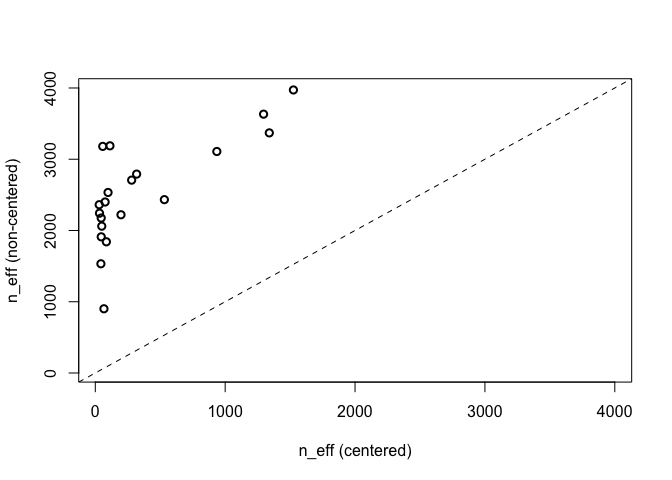
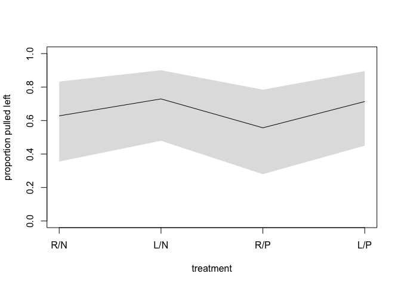

Chimpanzees
================

# Introduction

The data comes from an experiment aimed at evaluating the prosocial
tendencies of chimpanzees. The research question is whether a focal
chimpanzee chooses the prosocial option more often when another animal
is present

# Instalation

``` r
rm(list=ls())
```

``` r
library(MASS)
library(rstan)
library(shape)
library(tidyr)
require(visdat)
library(ggplot2)
library(dagitty)
library(gtools)
library(ellipse)
library(tidyverse)
library(rethinking)
```

``` r
options(mc.cores = parallel::detectCores())
rstan_options(auto_write = TRUE)
```

# Load data

``` r
data("chimpanzees")
d <- chimpanzees
```

There are four combinations of prosoc_left and condition:
* prosoc_left = 0 and condition = 0
* prosoc_left = 1 and condition = 0
* prosoc_left = 0 and condition = 1
* prosoc_left = 1 and condition = 1

We’re going to build an index variable containing the values 1 through 4 
to index the combinations

``` r
d$treatment <- 1 + d$prosoc_left + 2*d$condition
```

``` r
xtabs(~ treatment + prosoc_left + condition, d)
```

    ## , , condition = 0
    ## 
    ##          prosoc_left
    ## treatment   0   1
    ##         1 126   0
    ##         2   0 126
    ##         3   0   0
    ##         4   0   0
    ## 
    ## , , condition = 1
    ## 
    ##          prosoc_left
    ## treatment   0   1
    ##         1   0   0
    ##         2   0   0
    ##         3 126   0
    ##         4   0 126

# 1. Logistic regression

## 1.1 Models with interaction effects

### Initial statistical models


Before moving to the prior predictive check, it’s worth noting that the
model considers the interaction effect between the location of prosocial
option and the presence of a partner. The interaction is hidden by the
treatment

### Prior predictive checks

We need to determine the priors for these parameters. Let’s start with
alpha first by considering a linear model below

.png)

We will test the distribution of p given a weak and a strong prior of
alpha

``` r
dlist <- list(
  pulled_left = d$pulled_left,
  actor = d$actor,
  treatment = as.integer(d$treatment),
  N = nrow(d)
)
```

``` r
code_m1.1a <- "
data{
  int N;
  int pulled_left[N];
}
parameters{
  real a;
}
model{
  real p;
  a ~ normal(0,10);
  p = a;
  p = inv_logit(p);
  pulled_left ~ binomial(1,p);
}
generated quantities{
  real p;
  vector[N] log_lik;
  p = a;
  p = inv_logit(p);
  for(i in 1:N){
    log_lik[i] = binomial_lpmf(pulled_left[i] | 1 , p);
  }
}
"
```

``` r
m.1.1a <- stan(model_code=code_m1.1a, data=dlist, chains=4, cores=4)
```

``` r
precis(m.1.1a)
```

    ##        mean         sd      5.5%     94.5%    n_eff     Rhat4
    ## a 0.3192455 0.09059289 0.1728747 0.4615683 1462.766 0.9998966
    ## p 0.5789837 0.02205043 0.5431114 0.6133862 1458.286 0.9999160

``` r
code_m1.1b <- "
data{
  int N;
  int pulled_left[N];
}
parameters{
  real a;
}
model{
  real p;
  a ~ normal(0,1.5);
  p = a;
  p = inv_logit(p);
  pulled_left ~ binomial(1,p);
}
generated quantities{
  real p;
  vector[N] log_lik;
  p = a;
  p = inv_logit(p);
  for(i in 1:N){
    log_lik[i] = binomial_lpmf(pulled_left[i] | 1 , p);
  }
}
"
```

``` r
m.1.1b <- stan(model_code=code_m1.1b, data=dlist, chains=4, cores=4)
```

``` r
precis(m.1.1b)
```

    ##        mean         sd      5.5%     94.5%    n_eff    Rhat4
    ## a 0.3163466 0.09342502 0.1660278 0.4645552 1516.319 1.003373
    ## p 0.5782675 0.02273527 0.5414119 0.6140942 1517.882 1.003386

``` r
set.seed(1)
p.1.1a <- inv_logit(rnorm(1e4,0,10))
p.1.1b <- inv_logit(rnorm(1e4,0,1.5))
```

``` r
dens(p.1.1a, adj=0.1, ylab="Density", xlab="prior prob pull left")
text(0.2,10,"a ~ dnorm(0,10)")
dens(p.1.1b, adj=0.1, add=TRUE, col=col.alpha("blue",0.7))
text(0.3,3,"a ~ dnorm(0,1.5)", col=col.alpha("blue",0.7))
```

<!-- -->

The point is that a flat prior of alpha pushes the probability toward
two extreme values of 0 and 1. In other words, a flat prior in the logit
space is not a flat prior in the outcome probability space. Thus, we’re
going to use the Normal(0,1.5) prior for alpha

Let’s determine the prior of beta. Similarly, we also test the
prediction of two priors of beta given the model below

.png)

``` r
dlist <- list(
  pulled_left = d$pulled_left,
  actor = d$actor,
  treatment = as.integer(d$treatment),
  N = nrow(d)
)
```

``` r
code_m1.2a <- "
data{
  int N;
  int pulled_left[N];
  int treatment[N];
}
parameters{
  real a;
  vector[4] b;
}
model{
  vector[N] p;
  a ~ normal(0,1.5);
  b ~ normal(0,10);
  for(i in 1:N){
    p[i] = a + b[treatment[i]];
    p[i] = inv_logit(p[i]);
  }
  pulled_left ~ binomial(1, p);
}
generated quantities{
  vector[N] log_lik;
  vector[N] p;
  for(i in 1:N){
    p[i] = a + b[treatment[i]];
    p[i] = inv_logit(p[i]);
  }
  for(i in 1:N){
    log_lik[i] = binomial_lpmf(pulled_left[i] | 1, p[i]);
  }
}
"
```

``` r
m.1.2a <- stan(model_code=code_m1.2a, data=dlist, chains=4, cores=4)
```

``` r
precis(m.1.2a,2,pars=c("a", "b"))
```

    ##             mean       sd      5.5%    94.5%    n_eff    Rhat4
    ## a    -0.11734968 1.395016 -2.338292 2.123214 462.6250 1.005610
    ## b[1]  0.31364102 1.407683 -1.953970 2.580449 463.2135 1.005680
    ## b[2]  0.77958657 1.410222 -1.466794 3.069140 471.3635 1.005536
    ## b[3]  0.01839325 1.403874 -2.251466 2.296246 466.1246 1.005991
    ## b[4]  0.67515221 1.406580 -1.596449 2.926133 466.3803 1.005668

``` r
code_m1.2b <- "
data{
  int N;
  int pulled_left[N];
  int treatment[N];
}
parameters{
  real a;
  vector[4] b;
}
model{
  vector[N] p;
  a ~ normal(0,1.5);
  b ~ normal(0,0.5);
  for(i in 1:N){
    p[i] = a + b[treatment[i]];
    p[i] = inv_logit(p[i]);
  }
  pulled_left ~ binomial(1, p);
}
generated quantities{
  vector[N] log_lik;
  vector[N] p;
  for(i in 1:N){
    p[i] = a + b[treatment[i]];
    p[i] = inv_logit(p[i]);
  }
  for(i in 1:N){
    log_lik[i] = binomial_lpmf(pulled_left[i] | 1, p[i]);
  }
}
"
```

``` r
m.1.2b <- stan(model_code=code_m1.2b, data=dlist, chains=4, cores=4)
```

``` r
precis(m.1.2b,2,pars=c("a", "b"))
```

    ##            mean        sd       5.5%     94.5%     n_eff    Rhat4
    ## a     0.3049899 0.2644050 -0.1135125 0.7138895  979.9574 1.006481
    ## b[1] -0.1005151 0.2855045 -0.5390122 0.3668590 1158.0328 1.004932
    ## b[2]  0.3104035 0.2928456 -0.1469856 0.7696185 1205.1495 1.003806
    ## b[3] -0.3513094 0.2930978 -0.8235927 0.1156306 1204.1991 1.005091
    ## b[4]  0.2189758 0.2905033 -0.2467636 0.6828323 1197.5099 1.004734

We will plot the absolute prior difference between the first two
treatments

``` r
set.seed(2)
b1 <- matrix(0,nrow=1e4,ncol=4)
for(i in 1:4){b1[,i] = rnorm(1e4,0,0.5)}

b2 <- matrix(0,nrow=1e4,ncol=4)
for(i in 1:4){b2[,i] = rnorm(1e4,0,10)}

a <- rnorm(1e4,0,1.5)

p1 <- matrix(0,nrow=1e4,ncol=4)
for(i in 1:4){p1[,i] = inv_logit(a + b1[,i])}

p2 <- matrix(0,nrow=1e4,ncol=4)
for(i in 1:4){p2[,i] = inv_logit(a + b2[,i])}
```

``` r
dens(abs(p2[,1] - p2[,2]), adj=0.1, xlab="prior diff between treatments", ylab="Density")
text(0.8,10,"b ~ dnorm(0,10)")
dens(abs(p1[,1] - p1[,2]), adj=0.1, add=TRUE, col=rangi2)
text(0.3,5,"b ~ dnorm(0,0.5)",col=rangi2)
```

<!-- -->

Similar to the case of alpha, a flat prior of beta forces the prior
probability to pile up on zero and one. Thus, we will employ the
Normal(0,0.5) prior for beta

### Updated statistical models


``` r
dlist <- list(
  pulled_left = d$pulled_left,
  actor = d$actor,
  treatment = as.integer(d$treatment),
  N = nrow(d),
  N_actor = length(unique(d$actor)),
  N_treatment = length(unique(d$treatment))
)
```

``` r
code_m1.3 <- "
data{
  int N;
  int N_actor;
  int N_treatment;
  int pulled_left[N];
  int treatment[N];
  int actor[N];
}
parameters{
  vector[N_treatment] b;
  vector[N_actor] a;
}
model{
  vector[N] p;
  a ~ normal(0,1.5);
  b ~ normal(0,0.5);
  for(i in 1:N){
    p[i] = a[actor[i]] + b[treatment[i]];
    p[i] = inv_logit(p[i]);
  }
  pulled_left ~ binomial(1, p);
}
generated quantities{
  vector[N] log_lik;
  vector[N] p;
  for(i in 1:N){
    p[i] = a[actor[i]] + b[treatment[i]];
    p[i] = inv_logit(p[i]);
  }
  for(i in 1:N){
    log_lik[i] = binomial_lpmf(pulled_left[i] | 1, p[i]);
  }
}
"
```

``` r
m.1.3 <- stan(model_code=code_m1.3, data=dlist, chains=4, cores=4)
```

``` r
precis(m.1.3,2, pars=c("a", "b"))
```

    ##             mean        sd        5.5%       94.5%    n_eff    Rhat4
    ## a[1] -0.44358862 0.3305991 -0.97123606  0.09101038 1368.852 1.001593
    ## a[2]  3.91657481 0.7656707  2.79862897  5.19183708 3499.021 1.000724
    ## a[3] -0.74492751 0.3345614 -1.28969501 -0.21164298 1356.905 1.002382
    ## a[4] -0.74761121 0.3345740 -1.28064667 -0.21636012 1472.940 1.001013
    ## a[5] -0.44879345 0.3345672 -0.98466592  0.07632263 1454.794 1.001043
    ## a[6]  0.47871796 0.3393727 -0.07581235  1.01931009 1486.303 1.001890
    ## a[7]  1.95079614 0.4186846  1.28880808  2.63798613 1942.540 1.000760
    ## b[1] -0.03878547 0.2814991 -0.47443944  0.42280727 1205.812 1.002162
    ## b[2]  0.48054861 0.2858389  0.02451454  0.93600802 1249.147 1.001998
    ## b[3] -0.38151239 0.2901706 -0.84407140  0.08751701 1224.470 1.003483
    ## b[4]  0.36820734 0.2896627 -0.09774680  0.83857580 1246.758 1.001144

### Posterior predictive checks

``` r
post.1.3 <- extract.samples(m.1.3)
```

The chart below shows us the tendency of each individual to pull the
left lever. Individuals #2 and #7 have strong preference of pulling
left. Individuals #1,3,4, and 5 have the opposite preference

``` r
p_left <- inv_logit(post.1.3$a)
plot(precis(as.data.frame(p_left)), xlim=c(0,1))
```

<!-- -->

We’re going to extract the information about difference in focal
chimpanzees’ actions in treatments. We need to calculate the contrasts
between the no-partner and partner treatments

There isn’t any compelling evidence of prosocial choice in the
experiment

``` r
diffs <- list(
    db13 = post.1.3$b[,1] - post.1.3$b[,3],
    db24 = post.1.3$b[,2] - post.1.3$b[,4] )
plot( precis(diffs) )
```

<!-- -->

To go deeply, we’ll plot the proportions of left pulls for each actor in
each treatment. There are two plots, one for the original data and one
for the posterior predictions

``` r
pl <- by(data=d$pulled_left, INDICES=list(d$actor, d$treatment),FUN=mean)
pl[7,]
```

    ##         1         2         3         4 
    ## 0.7777778 0.8333333 0.9444444 1.0000000

``` r
plot(NULL, xlim=c(1,28),  ylim=c(0,1),xlab="",
     ylab="proportion left lever",  xaxt="n", yaxt="n")
axis(side=2,at=c(0,0.5,1), labels=c(0,0.5,1))
abline(h=0.5, lty=2)

for(i in 1:7){abline(v=(i-1)*4+4.5, lwd=0.5)}
for(i in 1:7){text(x=(i-1)*4+2.5,y=1.1,concat("actor ",i), xpd=TRUE)}

# points(x=1:28,y=t(pl),pch=16, col="white",cex=1.7)
points(x=1:28,y=t(pl),pch=c(1,1,16,16), col=rangi2, lwd=2)
for(j in (1:7)[-2]){
  lines( (j-1)*4+c(1,3) , pl[j,c(1,3)] , lwd=2 , col=rangi2 )
  lines( (j-1)*4+c(2,4) , pl[j,c(2,4)] , lwd=2 , col=rangi2 )
}

yoff <- 0.01
text( 1 , pl[1,1]-yoff , "R/N" , pos=1 , cex=0.8 )
text( 2 , pl[1,2]+yoff , "L/N" , pos=3 , cex=0.8 )
text( 3 , pl[1,3]-yoff , "R/P" , pos=1 , cex=0.8 )
text( 4 , pl[1,4]+yoff , "L/P" , pos=3 , cex=0.8 )
mtext( "observed proportions\n" )
```

<!-- -->

Apparently, individual #2 always pulls left. Individuals #2,3,4,5,6
shows decreases in proportion of left pulls when a partner is present

``` r
post.1.3 <- extract.samples(m.1.3)
ppost <- matrix(0,nrow=nrow(post.1.3$a),ncol=28)
dat <- list(actor=rep(1:7, each=4), treatment=rep(1:4, times=7))
for(i in 1:28){ppost[,i] = inv_logit(post.1.3$a[,dat$actor[i]] + post.1.3$b[,dat$treatment[i]])}
# p_post <- link(m1.3, data=dat)
p_mu <- apply(ppost, 2, mean)
p_pi <- apply(ppost, 2,PI, prob=0.89)
```

``` r
plot(NULL, xlim=c(1,28),  ylim=c(0,1),xlab="",
     ylab="proportion left lever",  xaxt="n", yaxt="n")
axis(side=2,at=c(0,0.5,1), labels=c(0,0.5,1))
abline(h=0.5, lty=2)

for(i in 1:7){abline(v=(i-1)*4+4.5, lwd=0.5)}
for(i in 1:7){text(x=(i-1)*4+2.5,y=1.1,concat("actor ",i), xpd=TRUE)}

# points(x=1:28,y=t(pl),pch=16, col="white",cex=1.7)
points(x=1:28,y=p_mu,pch=c(1,1,16,16), col=rangi2, lwd=2)
for(j in (1:7)[-2]){
  lines( (j-1)*4+c(1,3) , p_mu[(j-1)*4+c(1,3)] , lwd=2 , col=rangi2 )
  lines( (j-1)*4+c(2,4) , p_mu[(j-1)*4+c(2,4)] , lwd=2 , col=rangi2 )
}

for(j in (1:28)){
  lines(x=rep(j,2), p_pi[,j] , lwd=2 , col=rangi2 )
}

yoff <- 0.08
text( 1 , p_mu[1]-yoff , "R/N" , pos=1 , cex=0.8 )
text( 2 , p_mu[2]+yoff , "L/N" , pos=3 , cex=0.8 )
text( 3 , p_mu[3]-yoff , "R/P" , pos=1 , cex=0.8 )
text( 4 , p_mu[4]+yoff , "L/P" , pos=3 , cex=0.8 )
mtext( "posterior proportions\n" )
```

<!-- -->

When adding a partner, the model expects almost no change in decisions
of focal chimpanzees

## 1.2 Models without interaction effects


``` r
d$side <- d$prosoc_left + 1
d$cond <- d$condition + 1
```

``` r
# dlist <- list(
#   pulled_left = d$pulled_left,
#   actor = d$actor,
#   treatment = as.integer(d$treatment),
#   N = nrow(d),
#   N_actor = length(unique(d$actor)),
#   N_treatment = length(unique(d$treatment))
# )
```

``` r
dlist.2 <- list(
  pulled_left = d$pulled_left,
  actor = d$actor,
  side = d$side,
  cond = d$cond,
  N = nrow(d),
  N_actor = length(unique(d$actor)),
  N_side = length(unique(d$side)),
  N_cond = length(unique(d$cond))
)
```

``` r
code_m1.4 <- "
data{
  int N;
  int N_actor;
  int N_side;
  int N_cond;
  int pulled_left[N];
  int side[N];
  int cond[N];
  int actor[N];
}
parameters{
  vector[N_side] bs;
  vector[N_cond] bc;
  vector[N_actor] a;
}
model{
  vector[N] p;
  a ~ normal(0,1.5);
  bs ~ normal(0,0.5);
  bc ~ normal(0,0.5);
  for(i in 1:N){
    p[i] = a[actor[i]] + bs[side[i]] + bc[cond[i]];
    p[i] = inv_logit(p[i]);
  }
  pulled_left ~ binomial(1, p);
}
generated quantities{
  vector[N] log_lik;
  vector[N] p;
  for(i in 1:N){
    p[i] = a[actor[i]] + bs[side[i]] + bc[cond[i]];
    p[i] = inv_logit(p[i]);
  }
  for(i in 1:N){
    log_lik[i] = binomial_lpmf(pulled_left[i] | 1, p[i]);
  }
}
"
```

``` r
m.1.4 <- stan(model_code=code_m1.4, data=dlist.2, chains=4, cores=4)
```

``` r
precis(m.1.4,2,pars=c("a","bs","bc"))
```

    ##              mean        sd        5.5%       94.5%    n_eff    Rhat4
    ## a[1]  -0.62486943 0.4394327 -1.33666563  0.06047846 1040.119 1.000297
    ## a[2]   3.74652710 0.7968615  2.55602103  5.05028896 2120.462 1.000870
    ## a[3]  -0.92976006 0.4435995 -1.63956273 -0.23149698 1165.220 1.000164
    ## a[4]  -0.92900689 0.4431498 -1.64275387 -0.21539863 1141.584 1.000091
    ## a[5]  -0.62922884 0.4443798 -1.33654285  0.09215337 1077.649 1.000328
    ## a[6]   0.29256752 0.4408589 -0.41255839  0.99555621 1142.795 1.000793
    ## a[7]   1.78519215 0.5157125  0.97449197  2.61525226 1319.072 1.000190
    ## bs[1] -0.19345304 0.3273349 -0.71066954  0.33073541 1181.310 1.002899
    ## bs[2]  0.49236205 0.3297096 -0.02569002  1.02169363 1150.301 1.003075
    ## bc[1]  0.26801575 0.3265166 -0.25127843  0.78270189 1411.818 1.002126
    ## bc[2]  0.02214001 0.3267113 -0.50070735  0.53911264 1258.088 1.002748

We should be careful of the orders of side and cond when constructing
the chart. These orders generate the treatments we have before

``` r
post.1.4 <- extract.samples(m.1.4)
ppost <- matrix(0,nrow=length(post.1.4$a),ncol=dlist.2$N_actor*dlist.2$N_side*dlist.2$N_cond)
dat <- list(actor=rep(1:7, each=4),side=rep(1:2, times=14), cond=rep(c(1,1,2,2), times=7))
for(i in 1:28){ppost[,i] = inv_logit(post.1.4$a[,dat$actor[i]] + post.1.4$bs[,dat$side[i]] + post.1.4$bc[,dat$cond[i]])}

# p_post <- link(m1.4, data=dat)
p_mu <- apply(ppost, 2, mean)
p_pi <- apply(ppost, 2,PI, prob=0.89)
```

``` r
plot(NULL, xlim=c(1,28),  ylim=c(0,1),xlab="",
     ylab="proportion left lever",  xaxt="n", yaxt="n")
axis(side=2,at=c(0,0.5,1), labels=c(0,0.5,1))
abline(h=0.5, lty=2)

for(i in 1:7){abline(v=(i-1)*4+4.5, lwd=0.5)}
for(i in 1:7){text(x=(i-1)*4+2.5,y=1.1,concat("actor ",i), xpd=TRUE)}

# points(x=1:28,y=t(pl),pch=16, col="white",cex=1.7)
points(x=1:28,y=p_mu,pch=c(1,1,16,16), col=rangi2, lwd=2)
for(j in (1:7)[-2]){
  lines( (j-1)*4+c(1,3) , p_mu[(j-1)*4+c(1,3)] , lwd=2 , col=rangi2 )
  lines( (j-1)*4+c(2,4) , p_mu[(j-1)*4+c(2,4)] , lwd=2 , col=rangi2 )
}

for(j in (1:28)){
  lines(x=rep(j,2), p_pi[,j] , lwd=2 , col=rangi2 )
}

yoff <- 0.08
text( 1 , p_mu[1]-yoff , "R/N" , pos=1 , cex=0.8 )
text( 2 , p_mu[2]+yoff , "L/N" , pos=3 , cex=0.8 )
text( 3 , p_mu[3]-yoff , "R/P" , pos=1 , cex=0.8 )
text( 4 , p_mu[4]+yoff , "L/P" , pos=3 , cex=0.8 )
mtext( "posterior proportions\n" )
```

<!-- -->

### Model comparison

``` r
compare(m.1.3, m.1.4, func=PSIS)
```

    ##           PSIS       SE    dPSIS      dSE    pPSIS    weight
    ## m.1.4 530.7177 19.11196 0.000000       NA 7.704652 0.6639598
    ## m.1.3 532.0797 18.90271 1.361981 1.281421 8.411089 0.3360402

The model without interaction is better in expected predictive accuracy.
However, the difference is mild as both models tell us the same story
that individuals are expected to do no differences with(out) the
presence of partners

## 1.3 Models with aggregated data

### Aggregated data

``` r
d.aggregated <- aggregate(
  d$pulled_left, list(treatment=d$treatment, actor=d$actor,
                      side=d$side, cond=d$cond), FUN=sum
)
colnames(d.aggregated)[5] <- "left_pulls"
head(d.aggregated)
```

    ##   treatment actor side cond left_pulls
    ## 1         1     1    1    1          6
    ## 2         1     2    1    1         18
    ## 3         1     3    1    1          5
    ## 4         1     4    1    1          6
    ## 5         1     5    1    1          6
    ## 6         1     6    1    1         14

``` r
dlist.3 <- with(d.aggregated, list(
  left_pulls = left_pulls,
  treatment = treatment,
  actor = actor,
  side = side,
  cond = cond,
  N = 28,
  N_treatment = length(unique(treatment)),
  N_actor = length(unique(actor))
))
```

``` r
code_m1.5 <- "
data{
  int N;
  int N_actor;
  int N_treatment;
  int left_pulls[N];
  int treatment[N];
  int actor[N];
}
parameters{
  vector[N_treatment] b;
  vector[N_actor] a;
}
model{
  vector[N] p;
  a ~ normal(0,1.5);
  b ~ normal(0,0.5);
  for(i in 1:N){
    p[i] = a[actor[i]] + b[treatment[i]];
    p[i] = inv_logit(p[i]);
  }
  left_pulls ~ binomial(N, p);
}
generated quantities{
  vector[N] log_lik;
  vector[N] p;
  for(i in 1:N){
    p[i] = a[actor[i]] + b[treatment[i]];
    p[i] = inv_logit(p[i]);
  }
  for(i in 1:N){
    log_lik[i] = binomial_lpmf(left_pulls[i] | N, p[i]);
  }
}
"
```

``` r
m.1.5 <- stan(model_code=code_m1.5, data=dlist.3, chains=4, cores=4)
```

``` r
precis(m.1.5,2,pars=c("a","b"))
```

    ##             mean        sd       5.5%       94.5%     n_eff    Rhat4
    ## a[1] -0.91706858 0.3113351 -1.4133455 -0.41619814  937.8714 1.004027
    ## a[2]  0.68428490 0.3010540  0.2074983  1.17216467  915.4383 1.004007
    ## a[3] -1.15921215 0.3123130 -1.6570356 -0.65764761 1010.7659 1.004283
    ## a[4] -1.15837576 0.3154924 -1.6686006 -0.64945985 1125.2686 1.003324
    ## a[5] -0.91762355 0.3127911 -1.4193814 -0.41290458 1042.5705 1.003350
    ## a[6] -0.26896851 0.2966431 -0.7435488  0.19666400  971.6508 1.002777
    ## a[7]  0.38250652 0.2955081 -0.0780920  0.86000741  871.2315 1.003805
    ## b[1] -0.18203108 0.2653586 -0.6055177  0.22965411  876.6781 1.004195
    ## b[2]  0.13068409 0.2639080 -0.2905935  0.54959688  821.2574 1.004756
    ## b[3] -0.39000349 0.2628482 -0.8157572  0.02018669  828.4908 1.004072
    ## b[4]  0.06491138 0.2641361 -0.3589710  0.47233161  828.0308 1.005174

### Posterior predictive checks

``` r
post.1.5 <- extract.samples(m.1.5)
ppost <- matrix(0,nrow=nrow(post.1.5$a),ncol=28)
dat <- list(actor=rep(1:7, each=4), treatment=rep(1:4, times=7))
for(i in 1:28){ppost[,i] = inv_logit(post.1.5$a[,dat$actor[i]] + post.1.5$b[,dat$treatment[i]])}

# p.post <- link(m.1.5, data=dat)
p_mu <- apply(ppost, 2, mean)
p_pi <- apply(ppost, 2,PI, prob=0.89)
```

``` r
plot(NULL, xlim=c(1,28),  ylim=c(0,1),xlab="",
     ylab="proportion left lever",  xaxt="n", yaxt="n")
axis(side=2,at=c(0,0.5,1), labels=c(0,0.5,1))
abline(h=0.5, lty=2)

for(i in 1:7){abline(v=(i-1)*4+4.5, lwd=0.5)}
for(i in 1:7){text(x=(i-1)*4+2.5,y=1.1,concat("actor ",i), xpd=TRUE)}

# points(x=1:28,y=t(pl),pch=16, col="white",cex=1.7)
points(x=1:28,y=p_mu,pch=c(1,1,16,16), col=rangi2, lwd=2)
for(j in (1:7)[-2]){
  lines( (j-1)*4+c(1,3) , p_mu[(j-1)*4+c(1,3)] , lwd=2 , col=rangi2 )
  lines( (j-1)*4+c(2,4) , p_mu[(j-1)*4+c(2,4)] , lwd=2 , col=rangi2 )
}

for(j in (1:28)){
  lines(x=rep(j,2), p_pi[,j] , lwd=2 , col=rangi2 )
}

yoff <- 0.08
text( 1 , p_mu[1]-yoff , "R/N" , pos=1 , cex=0.8 )
text( 2 , p_mu[2]+yoff , "L/N" , pos=3 , cex=0.8 )
text( 3 , p_mu[3]-yoff , "R/P" , pos=1 , cex=0.8 )
text( 4 , p_mu[4]+yoff , "L/P" , pos=3 , cex=0.8 )
mtext( "posterior proportions\n" )
```

<!-- --> The
posterior prediction is closely similar to the previous two models

### Model comparison

``` r
compare(m.1.3, m.1.4, m.1.5, func=PSIS)
```

    ##           PSIS        SE    dPSIS      dSE    pPSIS       weight
    ## m.1.5 133.4965  5.043783   0.0000       NA 7.253607 1.000000e+00
    ## m.1.4 530.7177 19.111956 397.2212 28.33131 7.704652 5.552937e-87
    ## m.1.3 532.0797 18.902710 398.5831 28.14268 8.411089 2.810427e-87

There are two points about the mode m.1.5: \* It has a higher expected
predictive accuracy than the other two models \* It records warnings
about Pareto k values that are not observed in the other models.
However, the warnings was due to the structure of the data as aggregated
data makes the aggregated probabilities larger

# 2. Multilevel models

## 2.1 Models with Centralization

### Statistical models


``` r
dlist.4 <- list(
  pulled_left = d$pulled_left,
  actor = d$actor,
  block_id = d$block,
  treatment = as.integer(d$treatment),
  N = nrow(d),
  N_actor = length(unique(d$actor)),
  N_treatment = length(unique(d$treatment))
)
```

``` r
code_m2.1 <- "
data{
  int N;
  int N_actor;
  int N_treatment;
  int pulled_left[N];
  int actor[N];
  int treatment[N];
}
parameters{
  real a_bar;
  real sigma_a;
  real sigma_b;
  vector[N_actor] a;
  vector[N_treatment] b;
}
model{
  vector[N] p;
  a_bar ~ normal(0,1.5);
  sigma_a ~ exponential(1);
  sigma_b ~ exponential(1);
  a ~ normal(a_bar, sigma_a);
  b ~ normal(0, sigma_b);
  for(i in 1:N){
    p[i] = a[actor[i]] + b[treatment[i]];
    p[i] = inv_logit(p[i]);
  }
  pulled_left ~ binomial(1, p);
}
generated quantities{
  vector[N] log_lik;
  vector[N] p;
  for(i in 1:N){
    p[i] = a[actor[i]] + b[treatment[i]];
    p[i] = inv_logit(p[i]);
  }
  for(i in 1:N){
    log_lik[i] = binomial_lpmf(pulled_left[i] | 1, p[i]);
  }
}
"
```

``` r
m.2.1 <- stan(model_code=code_m2.1, data=dlist.4, chains=4, cores=4)
```

``` r
precis(m.2.1, 2, pars=c("a_bar", "sigma_a", "sigma_b"))
```

    ##             mean        sd       5.5%    94.5%     n_eff    Rhat4
    ## a_bar   0.603878 0.7419944 -0.5926166 1.803372 1525.5444 1.001287
    ## sigma_a 2.009249 0.6473749  1.2074526 3.150670 1225.3043 1.003221
    ## sigma_b 0.591466 0.3788226  0.2014229 1.228936  451.3036 1.002490

Before moving to the posterior predictive check, there are two things
about the sampling process of the model. We’re going to deal with them
in the next section The number of effective sample, n_eff, varies a lot
across parameters. The common reason is that some parameters spend a lot
of time near a boundary. Those are a sign of inefficient sampling There
is a warning about *Divergent Transitions*

``` r
post.2.1 <- extract.samples(m.2.1, n=1e4)
dens(post.2.1$sigma_a, col=rangi2, ylim=c(0,2), xlim=c(-0.1,4))
text(x=2.5,y=0.7,"actor", col=rangi2)
dens(post.2.1$sigma_b, add=TRUE)
text(x=0.5,y=2,"block")
```

<!-- -->

### Posterior predictive checks

``` r
post.2.1 <- extract.samples(m.2.1)
ppost <- matrix(0,nrow=nrow(post.2.1$a),ncol=28)
dat <- list(actor=rep(1:7, each=4), treatment=rep(1:4, times=7))
for(i in 1:28){ppost[,i] = inv_logit(post.2.1$a[,dat$actor[i]] + post.2.1$b[,dat$treatment[i]])}

# dat <- list(actor=rep(1:7, each=4), treatment=rep(1:4, times=7))
# p_post <- link(m2.1, data=dat)
p_mu <- apply(ppost, 2, mean)
p_pi <- apply(ppost, 2,PI, prob=0.89)
```

``` r
plot(NULL, xlim=c(1,28),  ylim=c(0,1),xlab="",
     ylab="proportion left lever",  xaxt="n", yaxt="n")
axis(side=2,at=c(0,0.5,1), labels=c(0,0.5,1))
abline(h=0.5, lty=2)

for(i in 1:7){abline(v=(i-1)*4+4.5, lwd=0.5)}
for(i in 1:7){text(x=(i-1)*4+2.5,y=1.1,concat("actor ",i), xpd=TRUE)}

# points(x=1:28,y=t(pl),pch=16, col="white",cex=1.7)
points(x=1:28,y=p_mu,pch=c(1,1,16,16), col=rangi2, lwd=2)
for(j in (1:7)[-2]){
  lines( (j-1)*4+c(1,3) , p_mu[(j-1)*4+c(1,3)] , lwd=2 , col=rangi2 )
  lines( (j-1)*4+c(2,4) , p_mu[(j-1)*4+c(2,4)] , lwd=2 , col=rangi2 )
}

for(j in (1:28)){
  lines(x=rep(j,2), p_pi[,j] , lwd=2 , col=rangi2 )
}

yoff <- 0.08
text( 1 , p_mu[1]-yoff , "R/N" , pos=1 , cex=0.8 )
text( 2 , p_mu[2]+yoff , "L/N" , pos=3 , cex=0.8 )
text( 3 , p_mu[3]-yoff , "R/P" , pos=1 , cex=0.8 )
text( 4 , p_mu[4]+yoff , "L/P" , pos=3 , cex=0.8 )
mtext( "posterior proportions\n" )
```

<!-- -->

The multilevel model re-confirms the previous conclusion about no
differences in focal chimpanzees’ choices with(out) partners

### Models with more clusters


``` r
dlist.5 <- list(
  pulled_left = d$pulled_left,
  actor = d$actor,
  block_id = d$block,
  treatment = as.integer(d$treatment),
  N = nrow(d),
  N_actor = length(unique(d$actor)),
  N_treatment = length(unique(d$treatment)),
  N_block = length(unique(d$block))
)
```

``` r
code_m2.2 <- "
data{
  int N;
  int N_actor;
  int N_treatment;
  int N_block;
  int pulled_left[N];
  int actor[N];
  int treatment[N];
  int block_id[N];
}
parameters{
  real a_bar;
  real sigma_a;
  real sigma_g;
  vector[N_actor] a;
  vector[N_treatment] b;
  vector[N_block] g;
}
model{
  vector[N] p;
  a_bar ~ normal(0,1.5);
  sigma_a ~ exponential(1);
  sigma_g ~ exponential(1);
  a ~ normal(a_bar, sigma_a);
  b ~ normal(0, 0.5);
  g ~ normal(0, sigma_g);
  for(i in 1:N){
    p[i] = a[actor[i]] + b[treatment[i]] + g[block_id[i]];
    p[i] = inv_logit(p[i]);
  }
  pulled_left ~ binomial(1, p);
}
generated quantities{
  vector[N] log_lik;
  vector[N] p;
  for(i in 1:N){
    p[i] = a[actor[i]] + b[treatment[i]] + g[block_id[i]];
    p[i] = inv_logit(p[i]);
  }
  for(i in 1:N){
    log_lik[i] = binomial_lpmf(pulled_left[i] | 1, p[i]);
  }
}
"
```

``` r
m.2.2 <- stan(model_code=code_m2.2, data=dlist.5, chains=4, cores=4)
```

``` r
precis(m.2.2, 2, pars=c("a_bar", "sigma_a", "sigma_g", "a", "b", "g"))
```

    ##                mean        sd        5.5%       94.5%      n_eff    Rhat4
    ## a_bar    0.77425501 0.8088850 -0.44332298  1.96186017   66.51096 1.067032
    ## sigma_a  2.12337324 0.7136693  1.24724948  3.58920034   43.16339 1.122785
    ## sigma_g  0.18165989 0.1632375  0.01282227  0.47701286   85.17925 1.020930
    ## a[1]    -0.34980868 0.4018020 -0.95265767  0.22092835   32.39621 1.088208
    ## a[2]     5.01344945 1.4906696  3.11409910  7.01459906   57.30122 1.066523
    ## a[3]    -0.63392536 0.4670389 -1.61313935  0.25303529   30.04265 1.128703
    ## a[4]    -0.64056696 0.3489944 -1.20039632 -0.08380049  531.83328 1.009339
    ## a[5]    -0.29811319 0.3690662 -0.86937291  0.23722322   98.07872 1.061741
    ## a[6]     0.63202290 0.4068909  0.03038583  1.48950409   45.63676 1.057118
    ## a[7]     2.18280951 0.4620311  1.48026003  2.88246303  112.73639 1.054498
    ## b[1]    -0.19200092 0.3360904 -0.89005496  0.28788972   45.38080 1.068875
    ## b[2]     0.34186829 0.3254934 -0.16142682  0.83154907   49.73788 1.081722
    ## b[3]    -0.52142605 0.3101462 -0.98161143 -0.04810323   75.50637 1.048355
    ## b[4]     0.25621210 0.2887559 -0.17162141  0.72126965  197.77872 1.027592
    ## g[1]    -0.13851480 0.2057001 -0.51978738  0.07366768  279.94985 1.011812
    ## g[2]     0.03736299 0.1728159 -0.20253622  0.32929974 1339.79263 1.001135
    ## g[3]     0.05068358 0.1725874 -0.18011408  0.34421471  935.71925 1.003502
    ## g[4]     0.01196939 0.1665520 -0.23742043  0.26676071 1525.47839 1.000265
    ## g[5]    -0.02233931 0.1697348 -0.30108271  0.22635956 1295.71332 1.002049
    ## g[6]     0.10011947 0.1905613 -0.11869823  0.45706110  318.19787 1.003658

``` r
plot(precis(m.2.2, 2, pars=c("a_bar", "sigma_a", "sigma_g", "a", "b", "g")))
```

<!-- -->

##2.2 Models with Non-centralization

As mentioned previously, the multilevel model, m2.1 and m2.2, observed
warnings of divergent transitions. Intuitively, that implies of
unreliable sampling process. Theoretically, there are two ways to reduce
the impact of divergent transitions Tune the simulation by doing more
warmup with a higher target acceptance rate Reparameterize the model

We will go through the second way

### Statistical models


``` r
dlist.5 <- list(
  pulled_left = d$pulled_left,
  actor = d$actor,
  block_id = d$block,
  treatment = as.integer(d$treatment),
  N = nrow(d),
  N_actor = length(unique(d$actor)),
  N_treatment = length(unique(d$treatment)),
  N_block = length(unique(d$block))
)
```

``` r
code_m2.3 <- "
data{
  int N;
  int N_actor;
  int N_treatment;
  int N_block;
  int pulled_left[N];
  int actor[N];
  int treatment[N];
  int block_id[N];
}
parameters{
  real a_bar;
  real<lower=0> sigma_a;
  real<lower=0> sigma_g;
  vector[N_actor] z;
  vector[N_treatment] b;
  vector[N_block] x;
}
model{
  vector[N] p;
  a_bar ~ normal(0,1.5);
  sigma_a ~ exponential(1);
  sigma_g ~ exponential(1);
  z ~ normal(0, 1);
  b ~ normal(0, 0.5);
  x ~ normal(0, 1);
  for(i in 1:N){
    p[i] = a_bar + z[actor[i]]*sigma_a + b[treatment[i]] + x[block_id[i]]*sigma_g;
    p[i] = inv_logit(p[i]);
  }
  pulled_left ~ binomial(1, p);
}
generated quantities{
  vector[N] log_lik;
  vector[N] p;
  vector[N_actor] a;
  vector[N_block] g;
  
  a = a_bar + z*sigma_a;
  g = x*sigma_g;
  
  for(i in 1:N){
    p[i] = a_bar + z[actor[i]]*sigma_a + b[treatment[i]] + x[block_id[i]]*sigma_g;
    p[i] = inv_logit(p[i]);
  }
  for(i in 1:N){
    log_lik[i] = binomial_lpmf(pulled_left[i] | 1, p[i]);
  }
}
"
```

``` r
m.2.3 <- stan(model_code=code_m2.3, data=dlist.5, chains=4, cores=4)
```

``` r
precis(m.2.3, 2, pars=c("a_bar", "sigma_a", "sigma_g", "a", "g"))
```

    ##                mean        sd        5.5%       94.5%     n_eff     Rhat4
    ## a_bar    0.59978333 0.7480481 -0.61691909  1.80820787  901.2363 1.0036080
    ## sigma_a  2.00043072 0.6440410  1.21665098  3.12822063 1532.6774 1.0024437
    ## sigma_g  0.20606293 0.1802763  0.01750463  0.51366798 1841.2001 1.0000763
    ## a[1]    -0.36351085 0.3664851 -0.94683422  0.22173497 2242.8463 1.0013941
    ## a[2]     4.67451755 1.3507595  2.99549949  6.94390983 3180.2924 1.0002789
    ## a[3]    -0.65972896 0.3712094 -1.25143352 -0.07289549 2361.6507 1.0011674
    ## a[4]    -0.66827871 0.3707768 -1.26002286 -0.07910520 2432.8304 1.0017538
    ## a[5]    -0.36858054 0.3601585 -0.97473832  0.19312299 2533.7149 1.0003752
    ## a[6]     0.58101825 0.3661671 -0.01293586  1.15846787 1911.0483 1.0012422
    ## a[7]     2.09582902 0.4561322  1.37206876  2.85010422 3188.2111 1.0021151
    ## g[1]    -0.15783928 0.2149263 -0.55535783  0.07151624 2706.7358 1.0002349
    ## g[2]     0.03969069 0.1785448 -0.21259214  0.33433179 3369.8802 1.0000684
    ## g[3]     0.05634733 0.1846705 -0.19082472  0.36630496 3108.6098 1.0020097
    ## g[4]     0.01146704 0.1772505 -0.24714976  0.30100566 3972.3406 1.0001455
    ## g[5]    -0.02821740 0.1756423 -0.32182484  0.22392496 3632.6467 1.0007154
    ## g[6]     0.11026682 0.1943763 -0.11630567  0.46623930 2791.4352 0.9999053

``` r
precis.2.2 <- precis(m.2.2, 2)
precis.2.3 <- precis(m.2.3,2)
pars <- c( paste("a[",1:7,"]",sep="") , paste("g[",1:6,"]",sep="") ,
           paste("b[",1:4,"]",sep="") , "a_bar" , "sigma_a" , "sigma_g" )
neff_table <- cbind(precis.2.2[pars,"n_eff"] , precis.2.3[pars,"n_eff"] )
plot( neff_table , xlim=range(neff_table) , ylim=range(neff_table) ,
    xlab="n_eff (centered)" , ylab="n_eff (non-centered)" , lwd=2 )
abline( a=0 , b=1 , lty=2 )
```

<!-- -->

# 3. Multilevel posterior predictions

## Posterior prediction for same clusters

We’re going to compute the posterior predictions for actor number 2

``` r
chimp <- 2
d_pred <- list(
  actor = rep(chimp,4),
  treatment = 1:4,
  block_id = rep(1,4)
)
```

``` r
post <- extract.samples(m.2.3)
p <- matrix(0, nrow=length(post$a_bar), ncol=4)
for(i in 1:4){p[,i] = inv_logit(post$a_bar + post$sigma_a*post$z[,d_pred$actor[i]] + post$sigma_g*post$x[,d_pred$block_id[i]] + post$b[,d_pred$treatment[i]])}
# p <- link(m2.3, data=d_pred)
p_mu <- apply(p,2,mean)
p_pi <- apply(p,2,PI,prob=0.89)
```

``` r
dim(post$z)
```

    ## [1] 4000    7

``` r
p_mu
```

    ## [1] 0.9785436 0.9871309 0.9702628 0.9855046

``` r
p_pi
```

    ##          [,1]      [,2]      [,3]      [,4]
    ## 5%  0.9384460 0.9625617 0.9152169 0.9576136
    ## 94% 0.9986286 0.9992267 0.9982357 0.9991514

## Posterior prediction for new clusters

We will construct posterior predictions for a new, previously unobserved
average actor. Note that, we assume the average block effect is about
zero

``` r
p_link_abar <- function( treatment ) {
    logodds <- with( post , a_bar + b[,treatment] )
    return( inv_logit(logodds) )
}
```

``` r
post <- extract.samples(m.2.2)
p_raw <- sapply( 1:4 , function(i) p_link_abar( i ) )
p_mu <- apply( p_raw , 2 , mean )
p_ci <- apply( p_raw , 2 , PI )
plot( NULL , xlab="treatment" , ylab="proportion pulled left" ,
    ylim=c(0,1) , xaxt="n" , xlim=c(1,4) )
axis( 1 , at=1:4 , labels=c("R/N","L/N","R/P","L/P") )
lines( 1:4 , p_mu )
shade( p_ci , 1:4 )
```

<!-- -->

``` r
a_sim <- with( post , rnorm( length(post$a_bar) , a_bar , sigma_a ) )
p_link_asim <- function( treatment ) {
    logodds <- with( post , a_sim + b[,treatment] )
    return( inv_logit(logodds) )
}
p_raw_asim <- sapply( 1:4 , function(i) p_link_asim( i ) )
```

``` r
plot( NULL , xlab="treatment" , ylab="proportion pulled left" ,
    ylim=c(0,1) , xaxt="n" , xlim=c(1,4) )
axis( 1 , at=1:4 , labels=c("R/N","L/N","R/P","L/P") )
for ( i in 1:100 ) lines( 1:4 , p_raw_asim[i,] , col=grau(0.25) , lwd=2 )
```

<!-- -->
