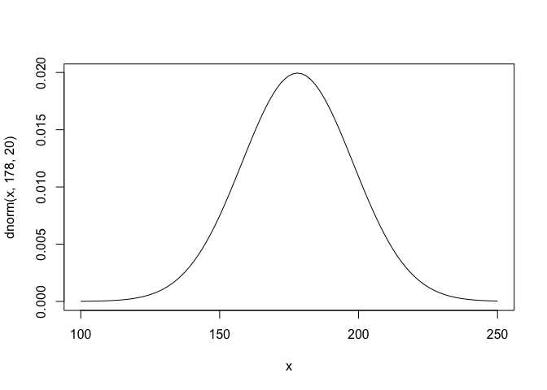

Howell1
================

# Instalation


``` r
rm(list=ls())
```

``` r
library(MASS)
library(rstan)
library(shape)
library(tidyr)
library(ggplot2)
library(dagitty)
library(gtools)
library(ellipse)
library(tidyverse)
library(rethinking)
```

``` r
options(mc.cores = parallel::detectCores())
rstan_options(auto_write = TRUE)
```

# Loading data

The data are partial census data for the Dobe area !Kung San which is
the most famous foraging population of the twentieth century.

``` r
data("Howell1")
d <- Howell1
```

``` r
str(d)
```

    ## 'data.frame':    544 obs. of  4 variables:
    ##  $ height: num  152 140 137 157 145 ...
    ##  $ weight: num  47.8 36.5 31.9 53 41.3 ...
    ##  $ age   : num  63 63 65 41 51 35 32 27 19 54 ...
    ##  $ male  : int  1 0 0 1 0 1 0 1 0 1 ...

``` r
d2 <- d[d$age >= 18, ]
```

# 1.Linear prediction

## Initial statistical models

$$
h\_{i} \\sim Normal(\\mu\_{i},\\sigma)\\\\
\\mu\_{i} = \\alpha + \\beta(x\_{i} - \\bar x)\\\\
\\alpha \\sim Normal(178,20)\\\\
\\beta \\sim Normal(0,10)\\\\
\\sigma \\sim Uniform(0,50)
$$

## Prior predictive checks

The prior of alpha states that if an individual has an average height,
the average height centers around 178 cm.

``` r
curve(dnorm(x,178,20), from=100, to=250)
```

<!-- -->

The prior of sigma is a truly flat prior that constrain the variation to
have positive probability between 0 and 50 cm

``` r
curve(dunif(x,0,50), from=-10, to=60)
```

<!-- -->

Look at the prior of beta, its initial prior results in unreasonable
predictions of heights as some is smaller than 0 cm and some is higher
than 272 cm.

``` r
set.seed(2971)
N <- 100
a <- rnorm(n=N, mean = 178, sd = 20)
b <- rnorm(n=N, mean=0, sd=10)

plot(NULL, xlim=range(d2$weight), ylim=c(-100,400),
     xlab='weight', ylab='height')
abline(h=0, lty=2)
abline(h=272, lty=1, lwd=0.5)
mtext('b ~ dnorm(0,10)')
xbar <- mean(d2$weight)
for(i in 1:N){
  curve(a[i] + b[i]*(x - xbar),
        from=min(d2$weight), to=max(d2$weight), add=TRUE,
        col=col.alpha('black',0.2))
}
```

<!-- -->

Assume that average height increases with average weight, we should
restrict the value of beta to be positive. So, Log-Normal is an
alternative.

``` r
set.seed(2971)
N <- 100
a <- rnorm(n=N, mean = 178, sd = 20)
b <- rlnorm(n=N, meanlog=0, sdlog=1)

plot(NULL, xlim=range(d2$weight), ylim=c(-100,400),
     xlab='weight', ylab='height')
abline(h=0, lty=2)
abline(h=272, lty=1, lwd=0.5)
mtext('log(b) ~ dnorm(0,1)')
xbar <- mean(d2$weight)
for(i in 1:N){
  curve(a[i] + b[i]*(x - xbar),
        from=min(d2$weight), to=max(d2$weight), add=TRUE,
        col=col.alpha('black',0.2))
}
```

<!-- -->

## Adjusted statistical model

$$
h\_{i} \\sim Normal(\\mu\_{i},\\sigma)\\\\
\\mu\_{i} = \\alpha + \\beta(x\_{i} - \\bar x)\\\\
\\alpha \\sim Normal(178,20)\\\\
\\beta \\sim LogNormal(0,1)\\\\
\\sigma \\sim Uniform(0,50)
$$

``` r
xbar <- mean(d2$weight)
xbar
```

    ## [1] 44.99049

``` r
dlist <- list(N=nrow(d2),weight=d2$weight,height=d2$height)
```

``` r
code_m1.1 <- "
data{
  int N;
  vector[N] height;
  vector[N] weight;
}
parameters{
  real a;
  real<lower=0> b;
  real<lower=0,upper=50> sigma;
}
model{
  vector[N] mu;
  sigma ~ uniform(0,50);
  a ~ normal(178,20);
  b ~ lognormal(0,1);
  for(i in 1:N){
    mu[i] = a + b*(weight[i] - 44.99049);
  }
  height ~ normal(mu, sigma);
}
generated quantities{
  vector[N] log_lik;
  vector[N] mu;
  for(i in 1:N){
    mu[i] = a + b*(weight[i] - 44.99049);
  }
  for(i in 1:N){
    log_lik[i] = normal_lpdf(height[i]|mu[i],sigma);
  }
}
"
```

``` r
m1.1 <- stan(model_code = code_m1.1, data = dlist, chains=4, cores=4)
precis(m1.1,2)
```

    ##                mean         sd        5.5%       94.5%    n_eff     Rhat4
    ## a       154.5980340 0.27452404 154.1632281 155.0425878 3899.881 0.9999897
    ## b         0.9031346 0.04234077   0.8344219   0.9713863 3685.888 0.9994727
    ## sigma     5.1058532 0.19400322   4.8066545   5.4276959 4344.830 1.0003352
    ## mu[1]   157.1585258 0.30040651 156.6834250 157.6418720 3982.430 0.9996321
    ## mu[2]   146.9171603 0.45124225 146.2034720 147.6373335 3621.581 1.0000261
    ## mu[3]   142.7438038 0.61809570 141.7604894 143.7332795 3611.890 0.9998724
    ## mu[4]   161.8695539 0.43922161 161.1822701 162.5689479 3918.996 0.9993130
    ## mu[5]   151.2441372 0.31538931 150.7417056 151.7608055 3713.916 1.0001882
    ## mu[6]   170.8563521 0.81199528 169.5558309 172.1566942 3804.433 0.9992953
    ## mu[7]   148.5045719 0.39478175 147.8733269 149.1325913 3638.871 1.0000980
    ## mu[8]   164.0714475 0.52379304 163.2385400 164.9077276 3879.574 0.9992835
    ## mu[9]   145.4577657 0.50725475 144.6534603 146.2650941 3614.413 0.9999651
    ## mu[10]  163.1753280 0.48850965 162.4046706 163.9542906 3894.669 0.9992911
    ## mu[11]  159.0275750 0.34540261 158.4826090 159.5748676 3972.458 0.9994429
    ## mu[12]  151.1929304 0.31657814 150.6892537 151.7106460 3711.776 1.0001877
    ## mu[13]  146.5075057 0.46663118 145.7688641 147.2547206 3618.926 1.0000083
    ## mu[14]  157.0450862 0.29828623 156.5725218 157.5275872 3981.464 0.9996466
    ## mu[15]  144.5360428 0.54409496 143.6730241 145.3973130 3612.448 0.9999305
    ## mu[16]  157.8242145 0.31437738 157.3291174 158.3221705 3983.841 0.9995536
    ## mu[17]  152.1914635 0.29605815 151.7211836 152.6768364 3759.080 1.0001809
    ## mu[18]  148.6069856 0.39134546 147.9805461 149.2301685 3640.477 1.0001027
    ## mu[19]  158.2082657 0.32353434 157.7022963 158.7232567 3981.817 0.9995139
    ## mu[20]  152.5499113 0.29018398 152.0874248 153.0235968 3778.703 1.0001690
    ## mu[21]  146.0210408 0.48525905 145.2526719 146.7964072 3616.471 0.9999878
    ## mu[22]  148.1973310 0.40525715 147.5517157 148.8428116 3634.463 1.0000841
    ## mu[23]  145.9954374 0.48624932 145.2253030 146.7721557 3616.361 0.9999867
    ## mu[24]  150.3736211 0.33735761 149.8358767 150.9199912 3681.756 1.0001715
    ## mu[25]  163.7386031 0.51056889 162.9299103 164.5514187 3885.016 0.9992858
    ## mu[26]  147.8388832 0.41777425 147.1738619 148.5015972 3630.035 1.0000677
    ## mu[27]  148.7350027 0.38709095 148.1154143 149.3528935 3642.587 1.0001084
    ## mu[28]  156.0575790 0.28339720 155.6096529 156.5148553 3962.606 0.9997833
    ## mu[29]  149.0422436 0.37707407 148.4382747 149.6473302 3648.141 1.0001219
    ## mu[30]  146.0978510 0.48229394 145.3338210 146.8702716 3616.814 0.9999909
    ## mu[31]  156.7744746 0.29355568 156.3066028 157.2490258 3978.207 0.9996823
    ## mu[32]  157.2097326 0.30138946 156.7336465 157.6926776 3982.792 0.9996256
    ## mu[33]  158.5923170 0.33341291 158.0669875 159.1233371 3978.158 0.9994783
    ## mu[34]  158.5667135 0.33273315 158.0425648 159.0964990 3978.446 0.9994806
    ## mu[35]  165.0443772 0.56314736 164.1447358 165.9484441 3864.776 0.9992796
    ## mu[36]  149.2982778 0.36894856 148.7097795 149.8869739 3653.338 1.0001327
    ## mu[37]  159.0275750 0.34540261 158.4826090 159.5748676 3972.458 0.9994429
    ## mu[38]  151.2185338 0.31598201 150.7154299 151.7353485 3712.842 1.0001880
    ## mu[39]  148.7862095 0.38540217 148.1680699 149.4023042 3643.463 1.0001107
    ## mu[40]  152.2584729 0.29489614 151.7902697 152.7420696 3762.654 1.0001791
    ## mu[41]  154.2909434 0.27479858 153.8558533 154.7386844 3882.570 1.0000277
    ## mu[42]  166.8878230 0.63999617 165.8578782 167.9177217 3840.989 0.9992800
    ## mu[43]  156.1599926 0.28462772 155.7115959 156.6171343 3965.478 0.9997685
    ## mu[44]  153.9068922 0.27619969 153.4723675 154.3544305 3859.828 1.0000705
    ## mu[45]  159.9351169 0.37276184 159.3514534 160.5318188 3957.069 0.9993845
    ## mu[46]  163.0217075 0.48256929 162.2609333 163.7904362 3897.395 0.9992930
    ## mu[47]  155.4174937 0.27747081 154.9790850 155.8613718 3939.831 0.9998766
    ## mu[48]  157.3377497 0.30391591 156.8557923 157.8235953 3983.502 0.9996098
    ## mu[49]  161.1270549 0.41262238 160.4885895 161.7809842 3933.695 0.9993336
    ## mu[50]  156.9793019 0.29709335 156.5070935 157.4596593 3980.798 0.9996551
    ## mu[51]  155.1870629 0.27610564 154.7512250 155.6272925 3929.700 0.9999096
    ## mu[52]  152.2682738 0.29472860 151.8005936 152.7512806 3763.180 1.0001788
    ## mu[53]  146.9171603 0.45124225 146.2034720 147.6373335 3621.581 1.0000261
    ## mu[54]  164.4811021 0.54024332 163.6215122 165.3469322 3873.143 0.9992813
    ## mu[55]  147.5572456 0.42781532 146.8813339 148.2355165 3627.038 1.0000548
    ## mu[56]  157.5937838 0.30925645 157.1038793 158.0838918 3984.122 0.9995794
    ## mu[57]  147.6852627 0.42322967 147.0131398 148.3559571 3628.351 1.0000607
    ## mu[58]  156.5696473 0.29029269 156.1112652 157.0387061 3974.808 0.9997104
    ## mu[59]  156.6720609 0.29188926 156.2081443 157.1431702 3976.611 0.9996963
    ## mu[60]  165.9404967 0.60017914 164.9781990 166.9017535 3852.557 0.9992788
    ## mu[61]  148.2229344 0.40437497 147.5790709 148.8666014 3634.808 1.0000852
    ## mu[62]  156.5952507 0.29068522 156.1354286 157.0671402 3975.279 0.9997069
    ## mu[63]  152.9851693 0.28422603 152.5327999 153.4453293 3803.964 1.0001468
    ## mu[64]  159.3604194 0.35508966 158.8034699 159.9275108 3967.251 0.9994192
    ## mu[65]  149.5287085 0.36182010 148.9515457 150.1067305 3658.493 1.0001421
    ## mu[66]  159.7445555 0.36677705 159.1671191 160.3319178 3960.577 0.9993952
    ## mu[67]  149.5799153 0.36026084 149.0055017 150.1556432 3659.703 1.0001441
    ## mu[68]  146.7379364 0.45793943 146.0132462 147.4699023 3620.347 1.0000183
    ## mu[69]  155.7503380 0.28016731 155.3079575 156.2009043 3952.698 0.9998281
    ## mu[70]  152.1402567 0.29696547 151.6691681 152.6286994 3756.380 1.0001822
    ## mu[71]  156.9793019 0.29709335 156.5070935 157.4596593 3980.798 0.9996551
    ## mu[72]  164.2762748 0.53199510 163.4284044 165.1266664 3876.321 0.9992823
    ## mu[73]  157.8242145 0.31437738 157.3291174 158.3221705 3983.841 0.9995536
    ## mu[74]  152.6267216 0.28903684 152.1654004 153.0967086 3783.059 1.0001657
    ## mu[75]  145.6369896 0.50020981 144.8438653 146.4347114 3614.987 0.9999721
    ## mu[76]  165.2236011 0.57049852 164.3115930 166.1424165 3862.227 0.9992792
    ## mu[77]  160.2565388 0.38311674 159.6639538 160.8688971 3950.944 0.9993682
    ## mu[78]  156.6208541 0.29108217 156.1596034 157.0929889 3975.736 0.9997033
    ## mu[79]  150.9368962 0.32272454 150.4247545 151.4603301 3701.549 1.0001844
    ## mu[80]  143.5119063 0.58605025 142.5795482 144.4483638 3611.731 0.9998959
    ## mu[81]  165.5052387 0.58210782 164.5753262 166.4410827 3858.329 0.9992789
    ## mu[82]  152.7803420 0.28686442 152.3246891 153.2469799 3791.910 1.0001583
    ## mu[83]  150.0407768 0.34666026 149.4873015 150.5997632 3671.723 1.0001610
    ## mu[84]  155.4687005 0.27783032 155.0302621 155.9167655 3941.950 0.9998691
    ## mu[85]  151.0905167 0.31899671 150.5840952 151.6113153 3707.591 1.0001866
    ## mu[86]  156.9536985 0.29663644 156.4818644 157.4321733 3980.517 0.9996585
    ## mu[87]  147.8388832 0.41777425 147.1738619 148.5015972 3630.035 1.0000677
    ## mu[88]  154.6237878 0.27453532 154.1894108 155.0677446 3901.286 0.9999864
    ## mu[89]  152.1402567 0.29696547 151.6691681 152.6286994 3756.380 1.0001822
    ## mu[90]  163.5081724 0.50149386 162.7163277 164.3082559 3888.899 0.9992877
    ## mu[91]  162.3048119 0.45532938 161.5853682 163.0320781 3910.617 0.9993040
    ## mu[92]  161.1014515 0.41172701 160.4643332 161.7538880 3934.207 0.9993344
    ## mu[93]  152.2682738 0.29472860 151.8005936 152.7512806 3763.180 1.0001788
    ## mu[94]  158.7459374 0.33755235 158.2118998 159.2827251 3976.313 0.9994653
    ## mu[95]  151.6537918 0.30639020 151.1653039 152.1569139 3732.167 1.0001890
    ## mu[96]  164.5579124 0.54334788 163.6922173 165.4260848 3871.970 0.9992810
    ## mu[97]  152.0378430 0.29882971 151.5642036 152.5276761 3751.064 1.0001844
    ## mu[98]  161.9207607 0.44109818 161.2295067 162.6233403 3917.999 0.9993119
    ## mu[99]  159.3348160 0.35432951 158.7802727 159.8994632 3967.673 0.9994210
    ## mu[100] 152.3706874 0.29301534 151.9062024 152.8478318 3768.739 1.0001757
    ## mu[101] 158.3106794 0.32610069 157.7993866 158.8278875 3980.987 0.9995040
    ## mu[102] 148.7350027 0.38709095 148.1154143 149.3528935 3642.587 1.0001084
    ## mu[103] 158.9507647 0.34322906 158.4085085 159.4955952 3973.565 0.9994488
    ## mu[104] 167.9375630 0.68477829 166.8436152 169.0424644 3829.617 0.9992829
    ## mu[105] 157.2609394 0.30238828 156.7824980 157.7438883 3983.109 0.9996192
    ## mu[106] 149.4518982 0.36417615 148.8720707 150.0330264 3656.722 1.0001390
    ## mu[107] 147.2756081 0.43802427 146.5840698 147.9727873 3624.421 1.0000421
    ## mu[108] 152.0122396 0.29930598 151.5378431 152.5026843 3749.752 1.0001848
    ## mu[109] 154.2141332 0.27498508 153.7801326 154.6620619 3878.101 1.0000367
    ## mu[110] 157.1841292 0.30089599 156.7083528 157.6670582 3982.617 0.9996288
    ## mu[111] 163.8154134 0.51360876 163.0011397 164.6327755 3883.743 0.9992852
    ## mu[112] 143.7679404 0.57547264 142.8544487 144.6872161 3611.796 0.9999042
    ## mu[113] 150.8856894 0.32399319 150.3693357 151.4117630 3699.597 1.0001835
    ## mu[114] 160.2060572 0.38146963 159.6149987 160.8151043 3951.920 0.9993706
    ## mu[115] 158.2594726 0.32481117 157.7509282 158.7759352 3981.416 0.9995089
    ## mu[116] 162.2280017 0.45246163 161.5153404 162.9519529 3912.079 0.9993054
    ## mu[117] 162.8168802 0.47470315 162.0667523 163.5739353 3901.092 0.9992957
    ## mu[118] 163.9690338 0.51971001 163.1458479 164.7985802 3881.228 0.9992841
    ## mu[119] 152.1146533 0.29742536 151.6429256 152.6040055 3755.041 1.0001828
    ## mu[120] 150.9368962 0.32272454 150.4247545 151.4603301 3701.549 1.0001844
    ## mu[121] 158.8483511 0.34036868 158.3098472 159.3877246 3974.977 0.9994569
    ## mu[122] 154.0093059 0.27571182 153.5749781 154.4564463 3865.979 1.0000596
    ## mu[123] 155.4687005 0.27783032 155.0302621 155.9167655 3941.950 0.9998691
    ## mu[124] 151.8586191 0.30224802 151.3794052 152.3537213 3742.036 1.0001872
    ## mu[125] 160.4613662 0.38987584 159.8558168 161.0836802 3946.942 0.9993589
    ## mu[126] 153.8044786 0.27677002 153.3693728 154.2490246 3853.634 1.0000808
    ## mu[127] 143.0510448 0.60522402 142.0906642 144.0134380 3611.769 0.9998816
    ## mu[128] 165.2236011 0.57049852 164.3115930 166.1424165 3862.227 0.9992792
    ## mu[129] 161.5367095 0.42715187 160.8702244 162.2159719 3925.540 0.9993214
    ## mu[130] 146.9171603 0.45124225 146.2034720 147.6373335 3621.581 1.0000261
    ## mu[131] 158.0802487 0.32039868 157.5779299 158.5887588 3982.691 0.9995266
    ## mu[132] 165.4028250 0.57787834 164.4788720 166.3321657 3859.732 0.9992790
    ## mu[133] 151.9866362 0.29978631 151.5120656 152.4772948 3748.448 1.0001853
    ## mu[134] 159.2836091 0.35281654 158.7316029 159.8473259 3968.507 0.9994245
    ## mu[135] 156.0063722 0.28281051 155.5595735 156.4631149 3961.089 0.9997908
    ## mu[136] 169.7810088 0.76473943 168.5603317 171.0004966 3812.754 0.9992903
    ## mu[137] 158.2082657 0.32353434 157.7022963 158.7232567 3981.817 0.9995139
    ## mu[138] 142.4365629 0.63103361 141.4373757 143.4484900 3612.077 0.9998636
    ## mu[139] 145.8418169 0.49221062 145.0615973 146.6246194 3615.733 0.9999804
    ## mu[140] 155.1870629 0.27610564 154.7512250 155.6272925 3929.700 0.9999096
    ## mu[141] 153.5996513 0.27815590 153.1594129 154.0489293 3841.167 1.0001002
    ## mu[142] 155.1102527 0.27574316 154.6745603 155.5522985 3926.115 0.9999204
    ## mu[143] 149.1958641 0.37217359 148.6034196 149.7910544 3651.194 1.0001284
    ## mu[144] 151.1417236 0.31778066 150.6361711 151.6609547 3709.668 1.0001872
    ## mu[145] 154.8286151 0.27481394 154.3958388 155.2714471 3912.158 0.9999593
    ## mu[146] 162.4072256 0.45916912 161.6822716 163.1410471 3908.681 0.9993021
    ## mu[147] 161.2038652 0.41531773 160.5601534 161.8631003 3932.161 0.9993311
    ## mu[148] 149.2726744 0.36975161 148.6831629 149.8635389 3652.793 1.0001317
    ## mu[149] 155.2382698 0.27637311 154.8026785 155.6808788 3932.034 0.9999023
    ## mu[150] 150.4504314 0.33527733 149.9160879 150.9935679 3684.242 1.0001736
    ## mu[151] 160.4613662 0.38987584 159.8558168 161.0836802 3946.942 0.9993589
    ## mu[152] 148.8886231 0.38204746 148.2740751 149.5004168 3645.275 1.0001152
    ## mu[153] 149.4006914 0.36575811 148.8188042 149.9854870 3655.571 1.0001370
    ## mu[154] 154.0093059 0.27571182 153.5749781 154.4564463 3865.979 1.0000596
    ## mu[155] 149.6567256 0.35793940 149.0814699 150.2294187 3661.564 1.0001471
    ## mu[156] 142.0269083 0.64838035 140.9989020 143.0660843 3612.415 0.9998523
    ## mu[157] 156.2111995 0.28527129 155.7620392 156.6701719 3966.832 0.9997611
    ## mu[158] 150.6552587 0.32985801 150.1276386 151.1911872 3691.196 1.0001788
    ## mu[159] 159.2836091 0.35281654 158.7316029 159.8473259 3968.507 0.9994245
    ## mu[160] 151.2441372 0.31538931 150.7417056 151.7608055 3713.916 1.0001882
    ## mu[161] 163.2767148 0.49244862 162.4996777 164.0626766 3892.891 0.9992900
    ## mu[162] 154.5981844 0.27452409 154.1633771 155.0427365 3899.889 0.9999897
    ## mu[163] 146.3026784 0.47443001 145.5526464 147.0634197 3617.808 0.9999995
    ## mu[164] 154.8030117 0.27476077 154.3695055 155.2460820 3910.830 0.9999627
    ## mu[165] 157.4145599 0.30547835 156.9315439 157.9009809 3983.797 0.9996005
    ## mu[166] 155.2126663 0.27623680 154.7769791 155.6537780 3930.873 0.9999060
    ## mu[167] 157.6961975 0.31149656 157.2043629 158.1904489 3984.091 0.9995677
    ## mu[168] 151.1673270 0.31717770 150.6629156 151.6862138 3710.718 1.0001875
    ## mu[169] 148.6581924 0.38963814 148.0362990 149.2797564 3641.307 1.0001049
    ## mu[170] 152.0122396 0.29930598 151.5378431 152.5026843 3749.752 1.0001848
    ## mu[171] 148.5045719 0.39478175 147.8733269 149.1325913 3638.871 1.0000980
    ## mu[172] 157.6193872 0.30981102 157.1288336 158.1095539 3984.129 0.9995765
    ## mu[173] 149.1190539 0.37461454 148.5206046 149.7197459 3649.643 1.0001252
    ## mu[174] 150.1175870 0.34447306 149.5694026 150.6727899 3673.934 1.0001636
    ## mu[175] 159.3092125 0.35357179 158.7558407 159.8733746 3968.092 0.9994227
    ## mu[176] 162.9961041 0.48158258 162.2364124 163.7637201 3897.854 0.9992933
    ## mu[177] 155.1485036 0.27591786 154.7131757 155.5890111 3927.913 0.9999150
    ## mu[178] 149.5799153 0.36026084 149.0055017 150.1556432 3659.703 1.0001441
    ## mu[179] 152.9851693 0.28422603 152.5327999 153.4453293 3803.964 1.0001468
    ## mu[180] 142.7438038 0.61809570 141.7604894 143.7332795 3611.890 0.9998724
    ## mu[181] 155.0078390 0.27533237 154.5743565 155.4511707 3921.183 0.9999347
    ## mu[182] 148.3253480 0.40086277 147.6885169 148.9611211 3636.227 1.0000899
    ## mu[183] 146.5587125 0.46469202 145.8229403 147.3025677 3619.227 1.0000105
    ## mu[184] 150.8856894 0.32399319 150.3693357 151.4117630 3699.597 1.0001835
    ## mu[185] 157.2353360 0.30188690 156.7574717 157.7185216 3982.956 0.9996224
    ## mu[186] 157.0561121 0.29848881 156.5832653 157.5383917 3981.568 0.9996451
    ## mu[187] 155.8527517 0.28116608 155.4093380 156.3021839 3956.215 0.9998131
    ## mu[188] 151.1417236 0.31778066 150.6361711 151.6609547 3709.668 1.0001872
    ## mu[189] 147.0195739 0.44744113 146.3113416 147.7328898 3622.340 1.0000307
    ## mu[190] 157.4401633 0.30600681 156.9556486 157.9263807 3983.874 0.9995974
    ## mu[191] 147.1219876 0.44365940 146.4213877 147.8290929 3623.140 1.0000352
    ## mu[192] 165.0443772 0.56314736 164.1447358 165.9484441 3864.776 0.9992796
    ## mu[193] 148.9142266 0.38121361 148.3013506 149.5245092 3645.740 1.0001163
    ## mu[194] 156.8512848 0.29485063 156.3834588 157.3253901 3979.272 0.9996720
    ## mu[195] 146.6611261 0.46082676 145.9326665 147.3987459 3619.854 1.0000149
    ## mu[196] 151.2441372 0.31538931 150.7417056 151.7608055 3713.916 1.0001882
    ## mu[197] 154.3933571 0.27462318 153.9575597 154.8417427 3888.449 1.0000154
    ## mu[198] 159.5140398 0.35970096 158.9496466 160.0903471 3964.655 0.9994092
    ## mu[199] 163.8922236 0.51665584 163.0723186 164.7149496 3882.480 0.9992846
    ## mu[200] 148.2229344 0.40437497 147.5790709 148.8666014 3634.808 1.0000852
    ## mu[201] 166.7598059 0.63457984 165.7389647 167.7817448 3842.476 0.9992797
    ## mu[202] 154.0861161 0.27540028 153.6522878 154.5318932 3870.556 1.0000512
    ## mu[203] 154.0647421 0.27548228 153.6293903 154.5111067 3869.286 1.0000536
    ## mu[204] 154.2141332 0.27498508 153.7801326 154.6620619 3878.101 1.0000367
    ## mu[205] 154.2653400 0.27485552 153.8307504 154.7136135 3881.086 1.0000307
    ## mu[206] 150.5272416 0.33322299 149.9948396 151.0669135 3686.794 1.0001756
    ## mu[207] 153.7788752 0.27692542 153.3439038 154.2221234 3852.080 1.0000834
    ## mu[208] 145.0481111 0.52350790 144.2160282 145.8804648 3613.351 0.9999493
    ## mu[209] 143.5631131 0.58393032 142.6356772 144.4961758 3611.739 0.9998975
    ## mu[210] 146.4306954 0.46954791 145.6875039 147.1829500 3618.492 1.0000050
    ## mu[211] 158.7203105 0.33685464 158.1891343 159.2576029 3976.634 0.9994674
    ## mu[212] 161.9975710 0.44392249 161.3013248 162.7059123 3916.508 0.9993102
    ## mu[213] 147.4548320 0.43150887 146.7731445 148.1412314 3626.044 1.0000502
    ## mu[214] 150.5528450 0.33254405 150.0216541 151.0926251 3687.659 1.0001763
    ## mu[215] 159.6676603 0.36439626 159.0952626 160.2515277 3961.959 0.9993997
    ## mu[216] 153.6764615 0.27759808 153.2368430 154.1210040 3845.850 1.0000932
    ## mu[217] 159.0229509 0.34527108 158.4782107 159.5703561 3972.526 0.9994433
    ## mu[218] 144.3056121 0.55344904 143.4263588 145.1868080 3612.172 0.9999224
    ## mu[219] 153.5740479 0.27835194 153.1327120 154.0248360 3839.604 1.0001025
    ## mu[220] 157.4401633 0.30600681 156.9556486 157.9263807 3983.874 0.9995974
    ## mu[221] 152.5755147 0.28979713 152.1147574 153.0481980 3780.149 1.0001679
    ## mu[222] 144.5872496 0.54202359 143.7271970 145.4445153 3612.519 0.9999323
    ## mu[223] 149.8359495 0.35260629 149.2713187 150.4029628 3666.124 1.0001538
    ## mu[224] 146.4306954 0.46954791 145.6875039 147.1829500 3618.492 1.0000050
    ## mu[225] 159.9492979 0.37321192 159.3654086 160.5466021 3956.804 0.9993837
    ## mu[226] 155.2894766 0.27666114 154.8526785 155.7318951 3934.321 0.9998950
    ## mu[227] 158.4130931 0.32871713 157.8954119 158.9354429 3980.047 0.9994944
    ## mu[228] 167.0926503 0.64868372 166.0512478 168.1344343 3838.657 0.9992805
    ## mu[229] 153.2156001 0.28161991 152.7669215 153.6720163 3817.791 1.0001314
    ## mu[230] 160.8966242 0.40462090 160.2693289 161.5391346 3938.300 0.9993415
    ## mu[231] 159.7444706 0.36677441 159.1670411 160.3318309 3960.579 0.9993952
    ## mu[232] 144.8944906 0.52965379 144.0530886 145.7349044 3613.034 0.9999435
    ## mu[233] 149.5287085 0.36182010 148.9515457 150.1067305 3658.493 1.0001421
    ## mu[234] 167.7583391 0.67708901 166.6780755 168.8495092 3831.459 0.9992823
    ## mu[235] 161.0758481 0.41083319 160.4402745 161.7282806 3934.718 0.9993353
    ## mu[236] 150.0663802 0.34592857 149.5146068 150.6244846 3672.454 1.0001619
    ## mu[237] 153.6508581 0.27777896 153.2103100 154.0968788 3844.290 1.0000956
    ## mu[238] 163.2777417 0.49248859 162.5006408 164.0637625 3892.873 0.9992900
    ## mu[239] 154.6749947 0.27457351 154.2408447 155.1185939 3904.055 0.9999797
    ## mu[240] 151.2953440 0.31421433 150.7948619 151.8087260 3716.087 1.0001886
    ## mu[241] 151.8074123 0.30326036 151.3266279 152.3054529 3739.524 1.0001878
    ## mu[242] 152.3704616 0.29301904 151.9059785 152.8476147 3768.726 1.0001757
    ## mu[243] 152.9339625 0.28485757 152.4810562 153.3948528 3800.927 1.0001498
    ## mu[244] 150.8344826 0.32527462 150.3153542 151.3631959 3697.676 1.0001825
    ## mu[245] 152.6779284 0.28829453 152.2180374 153.1470610 3785.989 1.0001634
    ## mu[246] 155.6991312 0.27969750 155.2575568 156.1493824 3950.861 0.9998356
    ## mu[247] 157.1841292 0.30089599 156.7083528 157.6670582 3982.617 0.9996288
    ## mu[248] 152.3706874 0.29301534 151.9062024 152.8478318 3768.739 1.0001757
    ## mu[249] 157.7730077 0.31321443 157.2790170 158.2703558 3983.968 0.9995592
    ## mu[250] 155.3918902 0.27729867 154.9539201 155.8349771 3938.754 0.9998803
    ## mu[251] 161.7415368 0.43455276 161.0632651 162.4334189 3921.501 0.9993161
    ## mu[252] 156.9280951 0.29618370 156.4571483 157.4049298 3980.224 0.9996618
    ## mu[253] 153.2924103 0.28083820 152.8450837 153.7474506 3822.445 1.0001257
    ## mu[254] 153.1899967 0.28189023 152.7409319 153.6473508 3816.244 1.0001332
    ## mu[255] 162.0231744 0.44486643 161.3253721 162.7331733 3916.013 0.9993096
    ## mu[256] 154.3165469 0.27474687 153.8828160 154.7638036 3884.049 1.0000247
    ## mu[257] 156.5952507 0.29068522 156.1354286 157.0671402 3975.279 0.9997069
    ## mu[258] 142.5645799 0.62563503 141.5743208 143.5683042 3611.992 0.9998672
    ## mu[259] 164.9419636 0.55896000 164.0491714 165.8389265 3866.257 0.9992798
    ## mu[260] 164.3530850 0.53508289 163.4998279 165.2104648 3875.121 0.9992819
    ## mu[261] 156.8512848 0.29485063 156.3834588 157.3253901 3979.272 0.9996720
    ## mu[262] 154.7518049 0.27467015 154.3177803 155.1952390 3908.146 0.9999696
    ## mu[263] 155.0846493 0.27563268 154.6493585 155.5264636 3924.898 0.9999240
    ## mu[264] 158.1058521 0.32101929 157.6030876 158.6157298 3982.531 0.9995240
    ## mu[265] 156.0319756 0.28310146 155.5846990 156.4897359 3961.854 0.9997870
    ## mu[266] 153.5996513 0.27815590 153.1594129 154.0489293 3841.167 1.0001002
    ## mu[267] 164.5835158 0.54438409 163.7157857 165.4525526 3871.581 0.9992809
    ## mu[268] 150.1687938 0.34302817 149.6226313 150.7214047 3675.442 1.0001653
    ## mu[269] 159.8468842 0.36997601 159.2646866 160.4395097 3958.707 0.9993894
    ## mu[270] 155.7806978 0.28045519 155.3380760 156.2305666 3953.763 0.9998237
    ## mu[271] 158.5411101 0.33205634 158.0191435 159.0693104 3978.728 0.9994828
    ## mu[272] 153.8044786 0.27677002 153.3693728 154.2490246 3853.634 1.0000808
    ## mu[273] 160.0517115 0.37648125 159.4641914 160.6543782 3954.874 0.9993784
    ## mu[274] 150.7832758 0.32656866 150.2629625 151.3146288 3695.787 1.0001815
    ## mu[275] 147.8900900 0.41596759 147.2267806 148.5494178 3630.624 1.0000700
    ## mu[276] 160.5637798 0.39329975 159.9533148 161.1893510 3944.922 0.9993545
    ## mu[277] 154.4445639 0.27456693 154.0091152 154.8909096 3891.351 1.0000091
    ## mu[278] 153.1643932 0.28216539 152.7156027 153.6224994 3814.699 1.0001350
    ## mu[279] 156.1599926 0.28462772 155.7115959 156.6171343 3965.478 0.9997685
    ## mu[280] 149.6823290 0.35717030 149.1085282 150.2550163 3662.196 1.0001481
    ## mu[281] 145.3809555 0.51028659 144.5704766 146.1931994 3614.188 0.9999620
    ## mu[282] 149.4518982 0.36417615 148.8720707 150.0330264 3656.722 1.0001390
    ## mu[283] 147.7876764 0.41958687 147.1207228 148.4513951 3629.460 1.0000653
    ## mu[284] 157.9266282 0.31674505 157.4279816 158.4297728 3983.481 0.9995426
    ## mu[285] 146.1234545 0.48130750 145.3606414 146.8948731 3616.932 0.9999920
    ## mu[286] 153.4460308 0.27940746 153.0013311 153.8983810 3831.794 1.0001135
    ## mu[287] 157.4913702 0.30707508 157.0066560 157.9771033 3983.997 0.9995913
    ## mu[288] 160.0005047 0.37484246 159.4151302 160.6004758 3955.842 0.9993810
    ## mu[289] 153.7020649 0.27742228 153.2638441 154.1476914 3847.409 1.0000908
    ## mu[290] 157.4913702 0.30707508 157.0066560 157.9771033 3983.997 0.9995913
    ## mu[291] 156.1343892 0.28431298 155.6863674 156.5913996 3964.780 0.9997722
    ## mu[292] 164.9163602 0.55791471 164.0252058 165.8110447 3866.630 0.9992799
    ## mu[293] 157.8498180 0.31496410 157.3537969 158.3492199 3983.764 0.9995508
    ## mu[294] 157.5169736 0.30761485 157.0304821 158.0024293 3984.044 0.9995883
    ## mu[295] 156.8512848 0.29485063 156.3834588 157.3253901 3979.272 0.9996720
    ## mu[296] 146.0722476 0.48328135 145.3071762 146.8456644 3616.698 0.9999899
    ## mu[297] 147.0202924 0.44741453 146.3121018 147.7335714 3622.346 1.0000307
    ## mu[298] 158.1826623 0.32290072 157.6774453 158.6952278 3982.007 0.9995164
    ## mu[299] 160.2565388 0.38311674 159.6639538 160.8688971 3950.944 0.9993682
    ## mu[300] 155.9807688 0.28252435 155.5337648 156.4363600 3960.310 0.9997945
    ## mu[301] 147.3524183 0.43522403 146.6644219 148.0451831 3625.099 1.0000456
    ## mu[302] 157.9010248 0.31614796 157.4030574 158.4028736 3983.584 0.9995453
    ## mu[303] 148.3253480 0.40086277 147.6885169 148.9611211 3636.227 1.0000899
    ## mu[304] 156.6720609 0.29188926 156.2081443 157.1431702 3976.611 0.9996963
    ## mu[305] 163.9946373 0.52072962 163.1689803 164.8261402 3880.812 0.9992839
    ## mu[306] 162.9192939 0.47862830 162.1636144 163.6819548 3899.235 0.9992943
    ## mu[307] 157.7474043 0.31263825 157.2542976 158.2451697 3984.018 0.9995620
    ## mu[308] 152.8571523 0.28584007 152.4044036 153.3207757 3796.400 1.0001542
    ## mu[309] 144.8432838 0.53170831 143.9987578 145.6864785 3612.938 0.9999417
    ## mu[310] 159.0787818 0.34686484 158.5325736 159.6277816 3971.699 0.9994391
    ## mu[311] 154.0093059 0.27571182 153.5749781 154.4564463 3865.979 1.0000596
    ## mu[312] 144.1775950 0.55866835 143.2903607 145.0684127 3612.051 0.9999179
    ## mu[313] 156.6720609 0.29188926 156.2081443 157.1431702 3976.611 0.9996963
    ## mu[314] 155.6223210 0.27903002 155.1818819 156.0728742 3948.006 0.9998468
    ## mu[315] 156.7744746 0.29355568 156.3066028 157.2490258 3978.207 0.9996823
    ## mu[316] 150.8600860 0.32463232 150.3422381 151.3874795 3698.633 1.0001830
    ## mu[317] 159.4372296 0.35738461 158.8753766 160.0078215 3965.967 0.9994141
    ## mu[318] 154.7262015 0.27463269 154.2914458 155.1690696 3906.791 0.9999730
    ## mu[319] 152.1146533 0.29742536 151.6429256 152.6040055 3755.041 1.0001828
    ## mu[320] 151.5769816 0.30800635 151.0867622 152.0808994 3728.592 1.0001892
    ## mu[321] 154.8030117 0.27476077 154.3695055 155.2460820 3910.830 0.9999627
    ## mu[322] 160.2565388 0.38311674 159.6639538 160.8688971 3950.944 0.9993682
    ## mu[323] 158.4642999 0.33004377 157.9438742 158.9890901 3979.538 0.9994897
    ## mu[324] 160.2053320 0.38144603 159.6143224 160.8143056 3951.934 0.9993707
    ## mu[325] 153.5740479 0.27835194 153.1327120 154.0248360 3839.604 1.0001025
    ## mu[326] 146.0466442 0.48426972 145.2800408 146.8210358 3616.584 0.9999888
    ## mu[327] 152.6968725 0.28802449 152.2367672 153.1656812 3787.079 1.0001625
    ## mu[328] 156.2111995 0.28527129 155.7620392 156.6701719 3966.832 0.9997611
    ## mu[329] 151.7818089 0.30377239 151.3002243 152.2807850 3738.278 1.0001880
    ## mu[330] 148.4653077 0.39610672 147.8322491 149.0955478 3638.274 1.0000963
    ## mu[331] 153.0712941 0.28320656 152.6203387 153.5306333 3809.104 1.0001413
    ## mu[332] 162.4072256 0.45916912 161.6822716 163.1410471 3908.681 0.9993021
    ## mu[333] 152.7803420 0.28686442 152.3246891 153.2469799 3791.910 1.0001583
    ## mu[334] 149.8871563 0.35110460 149.3264073 150.4537230 3667.484 1.0001557
    ## mu[335] 153.1131864 0.28273020 152.6624554 153.5742784 3811.617 1.0001385
    ## mu[336] 161.5367095 0.42715187 160.8702244 162.2159719 3925.540 0.9993214
    ## mu[337] 148.6837958 0.38878722 148.0627683 149.3041137 3641.729 1.0001061
    ## mu[338] 152.6267216 0.28903684 152.1654004 153.0967086 3783.059 1.0001657
    ## mu[339] 146.3794886 0.47149765 145.6330451 147.1355985 3618.212 1.0000028
    ## mu[340] 153.9068922 0.27619969 153.4723675 154.3544305 3859.828 1.0000705
    ## mu[341] 148.3509515 0.39998891 147.7147755 148.9865968 3636.592 1.0000911
    ## mu[342] 153.8044786 0.27677002 153.3693728 154.2490246 3853.634 1.0000808
    ## mu[343] 153.7276683 0.27725156 153.2908452 154.1708967 3848.968 1.0000883
    ## mu[344] 157.2097326 0.30138946 156.7336465 157.6926776 3982.792 0.9996256
    ## mu[345] 149.5543119 0.36103931 148.9801368 150.1306486 3659.095 1.0001431
    ## mu[346] 151.0393099 0.32022615 150.5309326 151.5605262 3705.546 1.0001859
    ## mu[347] 150.8344826 0.32527462 150.3153542 151.3631959 3697.676 1.0001825
    ## mu[348] 156.4416302 0.28839698 155.9868328 156.9102495 3972.260 0.9997283
    ## mu[349] 144.8944906 0.52965379 144.0530886 145.7349044 3613.034 0.9999435
    ## mu[350] 161.0758481 0.41083319 160.4402745 161.7282806 3934.718 0.9993353
    ## mu[351] 162.7912768 0.47372439 162.0425600 163.5466717 3901.558 0.9992960
    ## mu[352] 161.4086925 0.42257131 160.7516608 162.0785005 3928.079 0.9993249

The sampler performs well as the parameters have a very small tiny
correlation with each others

``` r
# round(vcov(m1.1),3)
```

## Posterior prediction check

### Posterior prediction means and intervals

``` r
post <- extract.samples(m1.1)
mu_at_50 <- post$a + post$b*(50-xbar)
dens(mu_at_50, col=rangi2, lwd=2, xlab="mu|weight=50")
```

<!-- -->

``` r
weight.seq <- seq( from=25 , to=70 , by=1 )
mu <- sapply( weight.seq , function(weight){post$a + post$b*(weight - xbar)})
# mu <- link(m1.1, data=data.frame(weight=weight.seq))
plot(height ~ weight, data=d2, type="n")
for (i in 1:100){
  points(weight.seq, mu[i,], pch=16, col=col.alpha(rangi2,0.1))
}
```

<!-- -->

``` r
post <- extract.samples(m1.1)
a_map <- mean(post$a)
b_map <- mean(post$b)

plot(height ~ weight, data=d2, col=rangi2, xlab="weight", ylab="height")
curve(a_map + b_map*(x-xbar),add=TRUE)
for (i in 1:50){
  curve(post$a[i] + post$b[i]*(x-xbar), col=col.alpha("black",0.1), add=TRUE)
}
```

<!-- -->

``` r
mu.mean <- apply(mu, 2, mean)
mu.pi <- apply(mu, 2, PI, prob=0.89)
plot(height ~ weight, data=d2, col=rangi2, xlab="weight", ylab="height")
lines(weight.seq, mu.mean)
shade(mu.pi, weight.seq)
```

<!-- -->

### Prediction intervals

``` r
post <- extract.samples(m1.1)
weight.seq <- 25:70
sim.height <- sapply( weight.seq , function(weight){rnorm(n=nrow(post$a),mean=post$a + post$b*(weight - xbar),sd=post$sigma)})
height.pi <- apply( sim.height , 2 , PI , prob=0.89 )
```

``` r
plot(height ~ weight, d2, col=col.alpha(rangi2, 0.5))
lines(weight.seq, mu.mean)
shade(mu.pi, weight.seq,col = col.alpha("black",0.5))
shade(height.pi, weight.seq)
```

<!-- -->

# 2.Polynomial models

$$
h\_{i} \\sim Normal(\\mu\_{i},\\sigma)\\\\
\\mu\_{i} = \\alpha + \\beta\_{1}x\_{i} + \\beta\_{2}x^{2}\_{i}\\\\
\\alpha \\sim Normal(178,20)\\\\
\\beta\_{1} \\sim LogNormal(0,1)\\\\
\\beta\_{2} \\sim Normal(0,1)\\\\
\\sigma \\sim Uniform(0,50)
$$

### Prior predictive check

``` r
N <- 100
a <- rnorm(N,178,20)
b1 <- rlnorm(N,0,1)
b2 <- rnorm(N,0,1)
```

``` r
d$weight_s <- (d$weight - mean(d$weight))/sd(d$weight)
d$weight_s2 <- d$weight_s^2
```

``` r
plot(NULL, xlim=range(d$weight_s), ylim=c(-100,400),
     xlab="weight", ylab="height")
abline(h=0, lty=16)
abline(h=272, lty=16)
for (i in 1:50){
  curve(a[i] + b1[i]*x + b2[i]*x^2, from=min(d$weight_s), to=max(d$weight_s), add=TRUE)
}
```

<!-- --> These prior
predictive check shows that the average height is in a solid and
reasonable range.

``` r
dlist2 <- list(
  N = nrow(d),
  weight_s = d$weight_s,
  weight_s2 = d$weight_s2,
  height = d$height
)
```

``` r
code_m2.1 <- "
data{
  int N;
  vector[N] height;
  vector[N] weight_s;
  vector[N] weight_s2;
}
parameters{
  real a;
  real<lower=0> b1;
  real b2;
  real<lower=0,upper=50> sigma;
}
model{
  vector[N] mu;
  sigma ~ uniform(0,50);
  b1 ~ lognormal(0,1);
  b2 ~ normal(0,1);
  a ~ normal(178,20);
  for(i in 1:N){
    mu[i] = a + b1*weight_s[i] + b2*weight_s2[i];
  }
  height ~ normal(mu, sigma);
}
generated quantities{
  vector[N] log_lik;
  vector[N] mu;
  for(i in 1:N){
    mu[i] = a + b1*weight_s[i] + b2*weight_s2[i];
  }
  for(i in 1:N){
    log_lik[i] = normal_lpdf(height[i]|mu[i],sigma);
  }
}
"
```

``` r
m2.1 <- stan(model_code=code_m2.1, data=dlist2, chains=4, cores=4)
precis(m2.1,2)
```

    ##               mean        sd       5.5%      94.5%    n_eff     Rhat4
    ## a       146.047457 0.3665673 145.470653 146.625802 2492.141 1.0021904
    ## b1       21.737448 0.2950850  21.272105  22.215986 2492.576 1.0004871
    ## b2       -7.797174 0.2716610  -8.231358  -7.374557 2208.783 1.0019214
    ## sigma     5.811369 0.1824652   5.529338   6.107237 3301.970 1.0007487
    ## mu[1]   158.716913 0.3257727 158.187075 159.245694 4156.060 0.9997508
    ## mu[2]   147.312380 0.3596539 146.743752 147.880039 2552.951 1.0021327
    ## mu[3]   140.010691 0.3872983 139.401523 140.620125 2348.128 1.0022618
    ## mu[4]   160.854923 0.4817291 160.097146 161.632260 2892.628 1.0001410
    ## mu[5]   153.259966 0.3166997 152.752295 153.756747 3238.936 1.0014017
    ## mu[6]   159.501883 1.0849016 157.794179 161.248449 2283.274 1.0012360
    ## mu[7]   149.686218 0.3441525 149.132963 150.228486 2721.893 1.0019559
    ## mu[8]   161.182591 0.5979517 160.246362 162.151052 2615.207 1.0005045
    ## mu[9]   144.933788 0.3718693 144.348057 145.522334 2450.137 1.0022257
    ## mu[10]  161.100867 0.5478002 160.242206 161.989566 2708.908 1.0003614
    ## mu[11]  159.799518 0.3706965 159.213957 160.397160 3568.708 0.9997422
    ## mu[12]  153.199241 0.3171607 152.690226 153.697249 3225.805 1.0014154
    ## mu[13]  146.663680 0.3633188 146.090146 147.235171 2519.799 1.0021649
    ## mu[14]  158.641283 0.3238091 158.114857 159.164154 4187.076 0.9997628
    ## mu[15]  143.334682 0.3782472 142.735472 143.939369 2404.282 1.0022563
    ## mu[16]  159.137844 0.3390582 158.591263 159.684973 3954.777 0.9997086
    ## mu[17]  154.341640 0.3090119 153.842272 154.833120 3507.908 1.0011271
    ## mu[18]  149.831733 0.3431030 149.279771 150.372558 2735.422 1.0019412
    ## mu[19]  113.224304 0.3856453 112.590008 113.840435 3057.367 1.0004846
    ## mu[20]   97.167184 0.4563189  96.444840  97.895620 4317.054 0.9993500
    ## mu[21]   86.236084 0.5626883  85.350695  87.133198 4413.138 0.9993774
    ## mu[22]  159.362900 0.3480958 158.807885 159.923439 3830.682 0.9997052
    ## mu[23]  154.730271 0.3066254 154.230820 155.220998 3621.465 1.0010135
    ## mu[24]  123.087498 0.3850250 122.458608 123.687832 2558.347 1.0014578
    ## mu[25]  103.214313 0.4172928 102.556119 103.876862 3866.849 0.9996067
    ## mu[26]  145.874113 0.3674404 145.295246 146.454004 2484.965 1.0021967
    ## mu[27]  149.244120 0.3472758 148.688348 149.788390 2683.426 1.0019972
    ## mu[28]  145.831978 0.3676500 145.252682 146.411917 2483.258 1.0021982
    ## mu[29]  131.348587 0.3917752 130.722281 131.972358 2361.257 1.0020116
    ## mu[30]  120.933016 0.3835811 120.302405 121.537524 2635.496 1.0012659
    ## mu[31]  108.494072 0.3957204 107.847141 109.122112 3423.581 1.0000164
    ## mu[32]  152.196172 0.3249747 151.675288 152.708432 3035.333 1.0016166
    ## mu[33]  161.160508 0.5788874 160.253704 162.103422 2647.432 1.0004525
    ## mu[34]  148.717810 0.3508591 148.161035 149.271577 2642.317 1.0020409
    ## mu[35]  150.012325 0.3417866 149.464812 150.551100 2752.853 1.0019224
    ## mu[36]  157.934941 0.3103382 157.427520 158.436458 4451.912 0.9999257
    ## mu[37]  150.439845 0.3386123 149.896439 150.976107 2797.150 1.0018743
    ## mu[38]  146.000170 0.3668073 145.423322 146.578978 2490.158 1.0021921
    ## mu[39]  158.456280 0.3194753 157.933622 158.972772 4255.468 0.9997970
    ## mu[40]  158.750681 0.3266876 158.220013 159.279616 4141.663 0.9997458
    ## mu[41]  159.574940 0.3581315 159.002670 160.149798 3706.182 0.9997156
    ## mu[42]  159.561209 0.3574316 158.990004 160.134938 3714.424 0.9997145
    ## mu[43]  161.191083 0.6565183 160.166923 162.259908 2535.666 1.0006478
    ## mu[44]  150.789748 0.3359595 150.251008 151.326841 2836.873 1.0018311
    ## mu[45]  159.799518 0.3706965 159.213957 160.397160 3568.708 0.9997422
    ## mu[46]  134.326209 0.3925314 133.702281 134.947756 2334.695 1.0021362
    ## mu[47]  115.287649 0.3836161 114.653450 115.899278 2921.303 1.0007004
    ## mu[48]  122.554431 0.3846202 121.924762 123.156872 2575.917 1.0014120
    ## mu[49]   95.084834 0.4732149  94.343041  95.840762 4415.078 0.9993138
    ## mu[50]  153.229633 0.3169297 152.721579 153.726749 3232.352 1.0014086
    ## mu[51]  150.084156 0.3412588 149.537557 150.621810 2759.991 1.0019146
    ## mu[52]  154.415154 0.3085405 153.915342 154.906489 3528.702 1.0011062
    ## mu[53]  156.456622 0.3011409 155.961092 156.943306 4136.110 1.0004283
    ## mu[54]  119.306132 0.3829185 118.673493 119.906142 2705.013 1.0011105
    ## mu[55]  101.564636 0.4264221 100.889114 102.236181 3995.363 0.9995131
    ## mu[56]   93.501204 0.4871887  92.736123  94.277472 4460.923 0.9993019
    ## mu[57]  160.978095 0.7784184 159.769279 162.243152 2429.776 1.0008813
    ## mu[58]  158.012195 0.3114391 157.503780 158.514964 4427.412 0.9999041
    ## mu[59]  156.098804 0.3013104 155.605226 156.584078 4025.471 1.0005575
    ## mu[60]  160.214007 0.4008530 159.584216 160.855796 3307.054 0.9998381
    ## mu[61]  161.079742 0.5395847 160.233121 161.952930 2727.344 1.0003360
    ## mu[62]  157.431135 0.3049385 156.932280 157.927175 4412.629 1.0000828
    ## mu[63]  158.834088 0.3290528 158.299999 159.366178 4104.705 0.9997348
    ## mu[64]  160.647968 0.4481536 159.948608 161.371931 3029.029 1.0000164
    ## mu[65]  158.596904 0.3227103 158.070913 159.117875 4204.466 0.9997703
    ## mu[66]  157.240914 0.3035960 156.744116 157.736906 4365.219 1.0001475
    ## mu[67]  154.425873 0.3084725 153.926539 154.917259 3531.761 1.0011031
    ## mu[68]  147.312380 0.3596539 146.743752 147.880039 2552.951 1.0021327
    ## mu[69]  161.196348 0.6221034 160.226922 162.204519 2579.240 1.0005665
    ## mu[70]  148.296328 0.3536172 147.737148 148.854651 2612.647 1.0020720
    ## mu[71]  125.311729 0.3869289 124.682502 125.920926 2489.723 1.0016365
    ## mu[72]  127.718499 0.3891102 127.088993 128.327241 2425.512 1.0018057
    ## mu[73]  158.996563 0.3341177 158.453219 159.534800 4027.320 0.9997179
    ## mu[74]  148.488778 0.3523704 147.930818 149.045667 2625.859 1.0020582
    ## mu[75]  135.864753 0.3921316 135.237507 136.485386 2329.767 1.0021851
    ## mu[76]  158.311954 0.3165207 157.795796 158.821969 4301.092 0.9998283
    ## mu[77]  158.384580 0.3179632 157.865248 158.898430 4279.001 0.9998121
    ## mu[78]   94.031163 0.4824067  93.275691  94.804094 4448.322 0.9993045
    ## mu[79]  161.125004 0.7140461 160.013138 162.280432 2478.104 1.0007675
    ## mu[80]  149.281279 0.3470171 148.725861 149.824348 2686.514 1.0019939
    ## mu[81]  153.912669 0.3119146 153.409943 154.406374 3393.042 1.0012432
    ## mu[82]  131.875138 0.3920295 131.250608 132.499640 2354.909 1.0020365
    ## mu[83]  158.330197 0.3168748 157.813240 158.841211 4295.710 0.9998241
    ## mu[84]  155.186936 0.3042196 154.690140 155.671760 3757.964 1.0008703
    ## mu[85]  159.959973 0.3811443 159.362630 160.571524 3468.206 0.9997718
    ## mu[86]  151.099715 0.3335744 150.566152 151.632770 2874.948 1.0017897
    ## mu[87]  107.395180 0.3992694 106.748883 108.028701 3515.940 0.9999188
    ## mu[88]  160.133003 0.3940871 159.513131 160.765320 3358.612 0.9998142
    ## mu[89]  151.167960 0.3330455 150.634163 151.699756 2883.721 1.0017801
    ## mu[90]  147.030396 0.3612779 146.458833 147.597769 2537.993 1.0021474
    ## mu[91]  157.697626 0.3074325 157.195628 158.195018 4469.490 0.9999966
    ## mu[92]  154.285196 0.3093795 153.786543 154.776972 3492.162 1.0011429
    ## mu[93]  158.596904 0.3227103 158.070913 159.117875 4204.466 0.9997703
    ## mu[94]  161.191320 0.6099337 160.235318 162.179604 2596.740 1.0005358
    ## mu[95]  111.115606 0.3891395 110.480488 111.730633 3212.558 1.0002685
    ## mu[96]  159.137844 0.3390582 158.591263 159.684973 3954.777 0.9997086
    ## mu[97]  154.812073 0.3061594 154.313136 155.301257 3646.484 1.0009887
    ## mu[98]  145.236020 0.3705020 144.654025 145.822016 2460.617 1.0022174
    ## mu[99]  108.572131 0.3954865 107.926824 109.199477 3417.084 1.0000235
    ## mu[100] 161.183537 0.6677548 160.140499 162.269330 2523.080 1.0006727
    ## mu[101] 131.583188 0.3918940 130.957992 132.207222 2358.339 1.0020229
    ## mu[102] 160.343376 0.4127733 159.698562 161.009605 3224.520 0.9998819
    ## mu[103] 158.348383 0.3172332 157.830740 158.860098 4290.233 0.9998200
    ## mu[104] 152.892145 0.3195205 152.376083 153.394941 3162.342 1.0014818
    ## mu[105] 141.469967 0.3839755 140.866772 142.080129 2367.319 1.0022678
    ## mu[106] 161.165951 0.6856861 160.102975 162.283261 2504.431 1.0007109
    ## mu[107] 154.974117 0.3052793 154.474864 155.460366 3697.130 1.0009384
    ## mu[108] 151.771755 0.3283212 151.245082 152.290920 2968.053 1.0016888
    ## mu[109] 141.037651 0.3850606 140.432141 141.645950 2360.828 1.0022673
    ## mu[110] 106.444248 0.4027330 105.790007 107.081429 3596.692 0.9998391
    ## mu[111] 104.679238 0.4101484 104.020797 105.324692 3746.141 0.9997043
    ## mu[112] 157.472770 0.3052790 156.974231 157.969018 4422.315 1.0000690
    ## mu[113] 153.077097 0.3180941 152.563439 153.577637 3199.981 1.0014423
    ## mu[114] 109.581626 0.3926749 108.941649 110.204804 3334.075 1.0001181
    ## mu[115] 100.563723 0.4325204  99.871601 101.249514 4071.993 0.9994651
    ## mu[116]  89.460130 0.5269915  88.622664  90.300035 4473.854 0.9993219
    ## mu[117] 158.579529 0.3222905 158.053500 159.099443 4211.109 0.9997734
    ## mu[118] 148.717810 0.3508591 148.161035 149.271577 2642.317 1.0020409
    ## mu[119] 156.756203 0.3015633 156.261770 157.246987 4227.618 1.0003197
    ## mu[120] 154.285196 0.3093795 153.786543 154.776972 3492.162 1.0011429
    ## mu[121] 161.139494 0.5659890 160.252569 162.062325 2671.470 1.0004157
    ## mu[122] 160.953622 0.5027883 160.163906 161.767738 2824.155 1.0002152
    ## mu[123] 160.639964 0.4470503 159.942577 161.361159 3034.210 1.0000122
    ## mu[124]  83.795205 0.5918237  82.874813  84.750159 4361.355 0.9994351
    ## mu[125] 154.425873 0.3084725 153.926539 154.917259 3531.761 1.0011031
    ## mu[126] 159.656112 0.3624227 159.081200 160.239845 3657.038 0.9997233
    ## mu[127]  94.559040 0.4777487  93.808965  95.323316 4433.040 0.9993084
    ## mu[128] 153.737436 0.3131629 153.232187 154.230882 3349.273 1.0012879
    ## mu[129] 161.197279 0.6267149 160.220276 162.214377 2572.916 1.0005779
    ## mu[130] 154.171614 0.3101332 153.673394 154.663081 3461.058 1.0011743
    ## mu[131] 112.626447 0.3864828 111.990776 113.241335 3099.805 1.0004226
    ## mu[132] 100.563723 0.4325204  99.871601 101.249514 4071.993 0.9994651
    ## mu[133] 160.867402 0.4841550 160.106551 161.650531 2884.157 1.0001497
    ## mu[134] 159.947978 0.3803151 159.350727 160.557565 3475.765 0.9997692
    ## mu[135] 154.537373 0.3077765 154.037535 155.028965 3563.987 1.0010709
    ## mu[136] 159.420717 0.3506748 158.862331 159.985049 3797.369 0.9997067
    ## mu[137] 150.012325 0.3417866 149.464812 150.551100 2752.853 1.0019224
    ## mu[138] 159.761101 0.3683881 159.177497 160.352834 3592.534 0.9997364
    ## mu[139] 135.320479 0.3923457 134.690865 135.940541 2330.822 1.0021690
    ## mu[140] 160.722805 0.8538396 159.387823 162.109605 2384.472 1.0009929
    ## mu[141]  90.187104 0.5194103  89.363157  91.010703 4481.431 0.9993137
    ## mu[142] 158.784217 0.3276203 158.251588 159.314814 4127.039 0.9997412
    ## mu[143] 150.996914 0.3343687 150.462257 151.531029 2862.004 1.0018037
    ## mu[144] 149.539777 0.3451981 148.986007 150.084150 2708.723 1.0019701
    ## mu[145] 119.278280 0.3829111 118.645733 119.878619 2706.291 1.0011078
    ## mu[146] 147.867845 0.3563162 147.302018 148.428160 2585.118 1.0021004
    ## mu[147] 154.143073 0.3103254 153.643631 154.635537 3453.365 1.0011820
    ## mu[148] 113.670268 0.3850961 113.036198 114.287803 3026.569 1.0005311
    ## mu[149] 105.484986 0.4066026 104.828424 106.127505 3678.197 0.9997636
    ## mu[150] 156.386100 0.3011203 155.892733 156.874765 4114.303 1.0004539
    ## mu[151] 158.733826 0.3262279 158.203108 159.263174 4148.891 0.9997483
    ## mu[152] 117.234351 0.3828021 116.604796 117.835396 2808.436 1.0009024
    ## mu[153] 111.319282 0.3887348 110.684291 111.935676 3196.925 1.0002890
    ## mu[154] 161.166472 0.5832417 160.251967 162.116095 2639.741 1.0004646
    ## mu[155] 141.944823 0.3826815 141.344549 142.554924 2375.294 1.0022670
    ## mu[156] 152.830032 0.3200025 152.314651 153.332931 3150.086 1.0014947
    ## mu[157]  95.084834 0.4732149  94.343041  95.840762 4415.078 0.9993138
    ## mu[158] 160.323661 0.4108594 159.682132 160.986554 3237.111 0.9998748
    ## mu[159] 159.391924 0.3493764 158.835063 159.954042 3814.024 0.9997058
    ## mu[160] 160.937420 0.4990002 160.155091 161.745125 2835.670 1.0002021
    ## mu[161] 161.048336 0.5288099 160.219814 161.904124 2753.135 1.0003018
    ## mu[162] 161.176837 0.5920317 160.251804 162.136579 2624.821 1.0004887
    ## mu[163] 154.256887 0.3095656 153.758568 154.748803 3484.337 1.0011508
    ## mu[164] 120.178731 0.3832197 119.547190 120.780998 2666.481 1.0011949
    ## mu[165] 152.892145 0.3195205 152.376083 153.394941 3162.342 1.0014818
    ## mu[166] 159.709069 0.3653707 159.129477 160.296718 3624.621 0.9997295
    ## mu[167] 156.195495 0.3011996 155.702917 156.683086 4055.301 1.0005228
    ## mu[168] 157.472770 0.3052790 156.974231 157.969018 4422.315 1.0000690
    ## mu[169] 153.970617 0.3115090 153.468558 154.463903 3407.915 1.0012281
    ## mu[170] 160.421061 0.4206966 159.764504 161.100850 3174.863 0.9999118
    ## mu[171]  93.501204 0.4871887  92.736123  94.277472 4460.923 0.9993019
    ## mu[172]  94.295362 0.4800622  93.543171  95.063416 4441.016 0.9993063
    ## mu[173] 156.001188 0.3014669 155.507590 156.486687 3995.512 1.0005923
    ## mu[174] 140.600649 0.3860700 139.993191 141.209992 2354.971 1.0022657
    ## mu[175] 161.183537 0.6677548 160.140499 162.269330 2523.080 1.0006727
    ## mu[176] 160.768166 0.4663042 160.035671 161.517340 2950.551 1.0000846
    ## mu[177] 147.312380 0.3596539 146.743752 147.880039 2552.951 1.0021327
    ## mu[178] 159.289327 0.3449719 158.736534 159.849518 3872.282 0.9997047
    ## mu[179] 161.173155 0.6791271 160.118191 162.278599 2511.058 1.0006972
    ## mu[180] 154.114475 0.3105191 153.613828 154.607049 3445.704 1.0011898
    ## mu[181] 159.923813 0.3786695 159.327326 160.532260 3490.974 0.9997643
    ## mu[182] 157.895967 0.3098128 157.389214 158.397264 4462.916 0.9999369
    ## mu[183] 160.039163 0.9962203 158.478230 161.643289 2313.857 1.0011566
    ## mu[184] 159.362900 0.3480958 158.807885 159.923439 3830.682 0.9997052
    ## mu[185] 139.412402 0.3883925 138.798369 140.022102 2342.368 1.0022560
    ## mu[186] 140.600649 0.3860700 139.993191 141.209992 2354.971 1.0022657
    ## mu[187] 123.484869 0.3853429 122.857506 124.085378 2545.876 1.0014913
    ## mu[188] 124.988831 0.3866380 124.361415 125.595889 2499.786 1.0016119
    ## mu[189] 118.086015 0.3827389 117.454995 118.687913 2763.857 1.0009891
    ## mu[190] 145.577956 0.3688911 144.998534 146.160884 2473.273 1.0022068
    ## mu[191] 157.240914 0.3035960 156.744116 157.736906 4365.219 1.0001475
    ## mu[192] 155.803178 0.3019124 155.307664 156.286942 3935.453 1.0006621
    ## mu[193] 157.176465 0.3032162 156.681434 157.671247 4348.126 1.0001699
    ## mu[194] 150.650481 0.3370207 150.110708 151.186444 2820.666 1.0018487
    ## mu[195] 153.138285 0.3176256 152.627922 153.637550 3212.820 1.0014289
    ## mu[196]  94.646817 0.4769845  93.899039  95.409799 4430.232 0.9993092
    ## mu[197] 156.935701 0.3021041 156.442411 157.427307 4280.671 1.0002551
    ## mu[198] 160.974416 0.5078863 160.176797 161.794774 2809.162 1.0002326
    ## mu[199] 160.671633 0.4514855 159.965247 161.399536 3013.685 1.0000291
    ## mu[200] 109.813199 0.3920850 109.175495 110.433987 3315.340 1.0001403
    ## mu[201]  96.563274 0.4610425  95.834651  97.296164 4349.861 0.9993369
    ## mu[202] 150.755018 0.3362248 150.216167 151.291840 2832.781 1.0018355
    ## mu[203]  92.791352 0.4937575  92.014624  93.579016 4473.582 0.9993005
    ## mu[204] 157.283590 0.3038678 156.786232 157.779132 4376.270 1.0001328
    ## mu[205] 152.292726 0.3242135 151.771489 152.803166 3051.659 1.0015991
    ## mu[206] 160.421061 0.4206966 159.764504 161.100850 3174.863 0.9999118
    ## mu[207] 150.227126 0.3402015 149.681285 150.763420 2774.557 1.0018988
    ## mu[208] 150.928090 0.3348987 150.391100 151.462786 2853.516 1.0018130
    ## mu[209] 156.195495 0.3011996 155.702917 156.683086 4055.301 1.0005228
    ## mu[210] 151.269894 0.3322532 150.736314 151.799796 2897.098 1.0017656
    ## mu[211] 138.601726 0.3896445 137.983023 139.211437 2336.344 1.0022451
    ## mu[212] 158.050475 0.3120148 157.540386 158.553745 4413.954 0.9998937
    ## mu[213] 120.522455 0.3833735 119.890927 121.124927 2652.098 1.0012275
    ## mu[214] 152.547659 0.3222084 152.028281 153.054957 3096.710 1.0015511
    ## mu[215] 159.923813 0.3786695 159.327326 160.532260 3490.974 0.9997643
    ## mu[216] 153.259966 0.3166997 152.752295 153.756747 3238.936 1.0014017
    ## mu[217] 107.710306 0.3982024 107.065432 108.342921 3489.310 0.9999462
    ## mu[218] 161.113668 0.5532847 160.248070 162.013058 2697.149 1.0003781
    ## mu[219] 156.733505 0.3015111 156.239755 157.223527 4220.789 1.0003279
    ## mu[220] 156.526624 0.3011898 156.031757 157.014918 4157.695 1.0004029
    ## mu[221]  98.536907 0.4461509  97.825947  99.249989 4229.967 0.9993876
    ## mu[222] 111.722719 0.3879765 111.089708 112.335981 3166.344 1.0003299
    ## mu[223] 146.333776 0.3650861 145.757784 146.909562 2504.561 1.0021791
    ## mu[224] 156.913466 0.3020244 156.420457 157.404705 4274.205 1.0002631
    ## mu[225] 158.883438 0.3305254 158.347878 159.416411 4081.931 0.9997290
    ## mu[226] 157.262281 0.3037300 156.765408 157.758180 4370.780 1.0001402
    ## mu[227] 116.302314 0.3830691 115.670862 116.912134 2860.567 1.0008062
    ## mu[228] 159.059933 0.3362688 158.516365 159.601727 3995.347 0.9997131
    ## mu[229] 153.168792 0.3173927 152.659063 153.667689 3219.294 1.0014222
    ## mu[230] 149.904143 0.3425770 149.354404 150.444413 2742.324 1.0019338
    ## mu[231] 154.143073 0.3103254 153.643631 154.635537 3453.365 1.0011820
    ## mu[232] 107.946044 0.3974302 107.297442 108.577480 3469.457 0.9999670
    ## mu[233] 149.686218 0.3441525 149.132963 150.228486 2721.893 1.0019559
    ## mu[234] 159.012492 0.3346488 158.467594 159.551224 4019.373 0.9997166
    ## mu[235] 150.545423 0.3378167 150.003783 151.081926 2808.791 1.0018616
    ## mu[236] 151.870565 0.3275428 151.343812 152.387065 2983.089 1.0016726
    ## mu[237] 159.935924 0.3794902 159.339620 160.544059 3483.354 0.9997668
    ## mu[238] 161.076019 0.5382266 160.230903 161.946771 2730.491 1.0003318
    ## mu[239] 157.208625 0.3034012 156.713059 157.703614 4356.714 1.0001587
    ## mu[240] 152.705111 0.3209758 152.188170 153.210766 3126.007 1.0015201
    ## mu[241] 130.935807 0.3915463 130.309773 131.559734 2366.740 1.0019912
    ## mu[242] 151.167960 0.3330455 150.634163 151.699756 2883.721 1.0017801
    ## mu[243] 115.506032 0.3834747 114.873054 116.115594 2907.882 1.0007232
    ## mu[244] 155.186936 0.3042196 154.690140 155.671760 3757.964 1.0008703
    ## mu[245] 140.010691 0.3872983 139.401523 140.620125 2348.128 1.0022618
    ## mu[246] 116.518267 0.3829879 115.885974 117.126548 2848.176 1.0008286
    ## mu[247] 157.089725 0.3027613 156.594657 157.581989 4324.424 1.0002004
    ## mu[248] 149.429340 0.3459794 148.873658 149.972778 2699.076 1.0019804
    ## mu[249] 103.214313 0.4172928 102.556119 103.876862 3866.849 0.9996067
    ## mu[250] 146.745577 0.3628700 146.172281 147.316805 2523.745 1.0021611
    ## mu[251] 152.830032 0.3200025 152.314651 153.332931 3150.086 1.0014947
    ## mu[252] 158.767478 0.3271517 158.235394 159.296900 4134.379 0.9997435
    ## mu[253] 158.648684 0.3239962 158.122176 159.171783 4184.117 0.9997615
    ## mu[254] 157.777657 0.3083356 157.274422 158.277864 4483.919 0.9999720
    ## mu[255] 153.138285 0.3176256 152.627922 153.637550 3212.820 1.0014289
    ## mu[256] 147.472241 0.3587121 146.903116 148.037400 2561.828 1.0021239
    ## mu[257] 155.080989 0.3047327 154.583473 155.566333 3729.234 1.0009045
    ## mu[258] 158.899772 0.3310252 158.363733 159.433193 4074.249 0.9997272
    ## mu[259] 147.631177 0.3577607 147.062959 148.194426 2570.953 1.0021148
    ## mu[260] 161.191083 0.6565183 160.166923 162.259908 2535.666 1.0006478
    ## mu[261] 150.262724 0.3399369 149.717165 150.799516 2778.260 1.0018948
    ## mu[262] 158.509448 0.3206555 157.984755 159.027823 4236.930 0.9997865
    ## mu[263] 146.908678 0.3619642 146.337033 147.477175 2531.802 1.0021534
    ## mu[264]  98.195865 0.4486112  97.478940  98.912696 4253.242 0.9993772
    ## mu[265] 153.259966 0.3166997 152.752295 153.756747 3238.936 1.0014017
    ## mu[266] 100.981783 0.4299221 100.294775 101.660312 4038.181 0.9994843
    ## mu[267] 156.549842 0.3012125 156.055006 157.038688 4164.836 1.0003945
    ## mu[268] 160.030732 0.3862076 159.424676 160.652605 3423.501 0.9997878
    ## mu[269] 161.171915 0.5876232 160.253225 162.127139 2632.205 1.0004767
    ## mu[270] 149.281279 0.3470171 148.725861 149.824348 2686.514 1.0019939
    ## mu[271] 145.874113 0.3674404 145.295246 146.454004 2484.965 1.0021967
    ## mu[272] 161.002576 0.7695115 159.808618 162.254849 2435.669 1.0008666
    ## mu[273] 118.015361 0.3827380 117.384973 118.617634 2767.445 1.0009820
    ## mu[274] 156.267406 0.3011473 155.774813 156.755187 4077.549 1.0004968
    ## mu[275] 156.247447 0.3011592 155.755307 156.735171 4071.370 1.0005040
    ## mu[276] 156.386100 0.3011203 155.892733 156.874765 4114.303 1.0004539
    ## mu[277] 156.433173 0.3011309 155.938333 156.921451 4128.864 1.0004368
    ## mu[278] 152.388760 0.3234571 151.868173 152.898795 3068.293 1.0015814
    ## mu[279] 155.976639 0.3015131 155.483695 156.462294 3988.009 1.0006010
    ## mu[280] 124.988831 0.3866380 124.361415 125.595889 2499.786 1.0016119
    ## mu[281] 144.232330 0.3748418 143.637803 144.827697 2428.157 1.0022418
    ## mu[282] 141.565401 0.3837242 140.962576 142.175532 2368.849 1.0022677
    ## mu[283] 146.540400 0.3639868 145.965950 147.113706 2513.984 1.0021703
    ## mu[284] 159.642716 0.3616959 159.067857 160.224506 3665.196 0.9997219
    ## mu[285] 160.885687 0.4878198 160.119148 161.676727 2871.663 1.0001628
    ## mu[286] 148.141326 0.3546059 147.579965 148.700227 2602.397 1.0020826
    ## mu[287] 152.420655 0.3232062 151.899589 152.930772 3073.907 1.0015754
    ## mu[288] 160.099409 0.3914214 159.482695 160.727140 3379.956 0.9998051
    ## mu[289] 155.877865 0.3017251 155.384166 156.363820 3957.976 1.0006359
    ## mu[290] 143.243644 0.3785682 142.643475 143.848841 2402.102 1.0022574
    ## mu[291] 117.732167 0.3827452 117.101514 118.335430 2782.026 1.0009533
    ## mu[292] 105.163381 0.4079854 104.508010 105.808075 3705.402 0.9997395
    ## mu[293] 159.797220 0.3705564 159.211833 160.394534 3570.136 0.9997418
    ## mu[294] 142.923191 0.3796635 142.323913 143.531109 2394.759 1.0022609
    ## mu[295] 155.778167 0.3019802 155.281502 156.261669 3927.950 1.0006709
    ## mu[296] 158.899772 0.3310252 158.363733 159.433193 4074.249 0.9997272
    ## mu[297] 154.757596 0.3064682 154.257919 155.248717 3629.780 1.0010053
    ## mu[298] 144.890381 0.3720614 144.304118 145.479253 2448.684 1.0022268
    ## mu[299] 124.273362 0.3860068 123.647319 124.875718 2522.677 1.0015557
    ## mu[300] 143.425488 0.3779225 142.826625 144.029670 2406.499 1.0022551
    ## mu[301]  91.360542 0.5075550  90.562584  92.164555 4485.042 0.9993044
    ## mu[302] 153.259966 0.3166997 152.752295 153.756747 3238.936 1.0014017
    ## mu[303] 151.505716 0.3304111 150.976481 152.029869 2929.351 1.0017307
    ## mu[304] 146.540400 0.3639868 145.965950 147.113706 2513.984 1.0021703
    ## mu[305] 160.219907 0.4013656 159.588893 160.863027 3303.295 0.9998400
    ## mu[306] 157.326035 0.3041547 156.826400 157.821557 4387.035 1.0001183
    ## mu[307] 126.904531 0.3883818 126.276227 127.515618 2445.166 1.0017514
    ## mu[308] 101.315189 0.4279025 100.635986 101.989745 4013.876 0.9995005
    ## mu[309] 159.477608 0.3533246 158.914524 160.044348 3764.101 0.9997091
    ## mu[310] 160.935919 0.7928024 159.700801 162.224513 2420.720 1.0009042
    ## mu[311] 155.421931 0.3031938 154.924520 155.906302 3823.672 1.0007928
    ## mu[312] 108.415956 0.3959569 107.769140 109.045879 3430.093 1.0000093
    ## mu[313] 160.573849 0.4383589 159.888518 161.281361 3076.869 0.9999791
    ## mu[314] 160.132966 0.3940842 159.513095 160.765281 3358.635 0.9998142
    ## mu[315] 143.965465 0.3759003 143.370066 144.566292 2420.588 1.0022468
    ## mu[316] 151.099715 0.3335744 150.566152 151.632770 2874.948 1.0017897
    ## mu[317] 160.773275 0.8406657 159.459032 162.139595 2392.912 1.0009748
    ## mu[318] 152.196172 0.3249747 151.675288 152.708432 3035.333 1.0016166
    ## mu[319] 160.631902 0.4459508 159.936454 161.350326 3039.425 1.0000081
    ## mu[320] 151.804750 0.3280613 151.277259 152.322717 2973.033 1.0016835
    ## mu[321] 155.853028 0.3017849 155.359515 156.338119 3950.467 1.0006447
    ## mu[322] 161.113793 0.5533405 160.248068 162.013297 2697.032 1.0003782
    ## mu[323] 156.801424 0.3016779 156.307704 157.291615 4241.152 1.0003034
    ## mu[324]  89.368997 0.5279544  88.530180  90.210483 4472.636 0.9993231
    ## mu[325]  90.368270 0.5175489  89.550471  91.188598 4482.704 0.9993119
    ## mu[326]  70.390273 0.7783651  69.157187  71.648926 3923.707 0.9998424
    ## mu[327]  91.450402 0.5066670  90.654104  92.253560 4484.852 0.9993039
    ## mu[328] 109.736066 0.3922792 109.097605 110.357562 3321.566 1.0001329
    ## mu[329]  89.095254 0.5308633  88.254942  89.941278 4468.629 0.9993267
    ## mu[330] 153.320460 0.3162426 152.812289 153.817726 3252.215 1.0013879
    ## mu[331] 103.949118 0.4135962 103.288958 104.603055 3806.882 0.9996540
    ## mu[332]  73.640634 0.7295439  72.490898  74.802282 4041.000 0.9997403
    ## mu[333]  90.729906 0.5138670  89.922221  91.542095 4484.479 0.9993087
    ## mu[334] 100.228234 0.4346585  99.534819 100.917044 4100.285 0.9994504
    ## mu[335]  84.173270 0.5871985  83.256308  85.118209 4370.547 0.9994255
    ## mu[336] 153.912669 0.3119146 153.409943 154.406374 3393.042 1.0012432
    ## mu[337] 154.537128 0.3077780 154.037294 155.028723 3563.916 1.0010710
    ## mu[338] 134.437609 0.3925230 133.813236 135.058757 2334.137 1.0021401
    ## mu[339]  93.589675 0.4863831  92.824564  94.365422 4459.009 0.9993022
    ## mu[340] 155.134078 0.3044719 154.636887 155.619059 3743.559 1.0008874
    ## mu[341] 152.767687 0.3204877 152.251306 153.272511 3137.975 1.0015075
    ## mu[342] 154.866319 0.3058582 154.367606 155.354523 3663.280 1.0009720
    ## mu[343] 157.657264 0.3070051 157.155763 158.153498 4461.714 1.0000093
    ## mu[344] 115.723894 0.3833467 115.091650 116.334097 2894.683 1.0007460
    ## mu[345] 102.886229 0.4190169 102.223725 103.548901 3893.150 0.9995867
    ## mu[346] 158.733826 0.3262279 158.203108 159.263174 4148.891 0.9997483
    ## mu[347] 154.537373 0.3077765 154.037535 155.028965 3563.987 1.0010709
    ## mu[348] 106.284950 0.4033493 105.629950 106.925122 3610.243 0.9998262
    ## mu[349]  94.822197 0.4754663  94.075822  95.582315 4424.393 0.9993109
    ## mu[350] 159.106853 0.3379290 158.562910 159.651845 3971.076 0.9997102
    ## mu[351] 157.410230 0.3047741 156.911452 157.905363 4407.666 1.0000898
    ## mu[352] 160.822712 0.4757258 160.073753 161.584498 2914.311 1.0001192
    ## mu[353] 158.562095 0.3218751 158.036709 159.082239 4217.678 0.9997766
    ## mu[354]  94.031163 0.4824067  93.275691  94.804094 4448.322 0.9993045
    ## mu[355]  69.568427 0.7910212  68.312132  70.849665 3892.328 0.9998678
    ## mu[356] 134.548778 0.3925117 133.924224 135.170190 2333.611 1.0021440
    ## mu[357] 155.499222 0.3028933 154.999198 155.983920 3845.849 1.0007668
    ## mu[358] 155.396052 0.3032986 154.898160 155.881152 3816.307 1.0008014
    ## mu[359]  89.551204 0.5260320  88.715090  90.388352 4475.014 0.9993208
    ## mu[360]  90.187104 0.5194103  89.363157  91.010703 4481.431 0.9993137
    ## mu[361]  76.237935 0.6920494  75.142008  77.345675 4128.681 0.9996581
    ## mu[362]  93.324088 0.4888102  92.557372  94.102408 4464.530 0.9993013
    ## mu[363]  75.044040 0.7091086  73.924744  76.177849 4088.328 0.9996959
    ## mu[364]  92.256534 0.4988287  91.471670  93.051439 4480.012 0.9993009
    ## mu[365]  77.127890 0.6795350  76.046729  78.221073 4158.632 0.9996301
    ## mu[366] 160.891667 0.4890483 160.123403 161.682471 2867.554 1.0001672
    ## mu[367] 156.480014 0.3011540 155.983328 156.967788 4143.332 1.0004199
    ## mu[368]  92.880286 0.4929244  92.105234  93.664857 4472.256 0.9993005
    ## mu[369]  93.324088 0.4888102  92.557372  94.102408 4464.530 0.9993013
    ## mu[370]  75.642029 0.7005259  74.532563  76.761618 4108.548 0.9996770
    ## mu[371]  81.986756 0.6144928  81.031388  82.978328 4312.742 0.9994840
    ## mu[372] 158.330197 0.3168748 157.813240 158.841211 4295.710 0.9998241
    ## mu[373] 133.990620 0.3925385 133.366526 134.613771 2336.565 1.0021242
    ## mu[374] 139.662701 0.3879528 139.051859 140.271139 2344.637 1.0022586
    ## mu[375] 161.194123 0.6501590 160.177594 162.255125 2543.123 1.0006334
    ## mu[376] 114.261646 0.3844639 113.626384 114.879824 2986.895 1.0005929
    ## mu[377]  79.575400 0.6460529  78.556400  80.618723 4239.136 0.9995546
    ## mu[378]  78.893742 0.6552363  77.856806  79.952053 4217.119 0.9995754
    ## mu[379]  89.914923 0.5222278  89.084288  90.743936 4479.050 0.9993165
    ## mu[380] 161.193639 0.6144755 160.231999 162.187255 2590.067 1.0005474
    ## mu[381]  77.718590 0.6713267  76.648366  78.799093 4178.375 0.9996117
    ## mu[382] 131.113060 0.3916477 130.486800 131.737582 2364.330 1.0020000
    ## mu[383] 158.509448 0.3206555 157.984755 159.027823 4236.930 0.9997865
    ## mu[384]  87.256991 0.5510291  86.389449  88.134398 4429.456 0.9993568
    ## mu[385]  97.339210 0.4550002  96.619208  98.066195 4307.069 0.9993541
    ## mu[386] 156.868823 0.3018755 156.376519 157.359311 4261.125 1.0002791
    ## mu[387] 157.154867 0.3030970 156.659767 157.649276 4342.295 1.0001775
    ## mu[388] 159.304158 0.3455878 158.750699 159.864321 3863.972 0.9997047
    ## mu[389] 157.915483 0.3100734 157.408141 158.417308 4457.520 0.9999313
    ## mu[390] 114.555947 0.3841891 113.921554 115.172591 2967.656 1.0006238
    ## mu[391] 109.272054 0.3934953 108.629847 109.897028 3359.312 1.0000887
    ## mu[392]  87.626495 0.5468889  86.765450  88.497542 4438.915 0.9993500
    ## mu[393] 155.803178 0.3019124 155.307664 156.286942 3935.453 1.0006621
    ## mu[394] 130.994949 0.3915806 130.368844 131.619230 2365.927 1.0019942
    ## mu[395] 111.722719 0.3879765 111.089708 112.335981 3166.344 1.0003299
    ## mu[396]  96.822440 0.4589975  96.096355  97.553947 4336.213 0.9993423
    ## mu[397] 161.197473 0.6282579 160.217556 162.217717 2570.836 1.0005816
    ## mu[398] 151.936149 0.3270257 151.410614 152.452087 2993.274 1.0016617
    ## mu[399] 129.740819 0.3907574 129.111238 130.362855 2385.186 1.0019278
    ## mu[400] 160.176899 0.3976922 159.551401 160.811980 3330.687 0.9998268
    ## mu[401]  81.986756 0.6144928  81.031388  82.978328 4312.742 0.9994840
    ## mu[402]  76.337050 0.6906470  75.244042  77.443063 4132.025 0.9996550
    ## mu[403] 157.721447 0.3076934 157.218364 158.218963 4473.925 0.9999893
    ## mu[404] 112.701382 0.3863714 112.065438 113.316467 3094.415 1.0004303
    ## mu[405] 149.244120 0.3472758 148.688348 149.788390 2683.426 1.0019972
    ## mu[406] 159.547420 0.3567361 158.979762 160.121063 3722.677 0.9997134
    ## mu[407]  75.442931 0.7033751  74.328325  76.565986 4101.816 0.9996833
    ## mu[408] 133.028476 0.3924181 132.408771 133.651645 2343.500 1.0020868
    ## mu[409]  77.226484 0.6781594  76.146297  78.317538 4161.937 0.9996271
    ## mu[410] 156.001188 0.3014669 155.507590 156.486687 3995.512 1.0005923
    ## mu[411] 160.261989 0.4051039 159.628322 160.913071 3276.467 0.9998535
    ## mu[412] 152.705111 0.3209758 152.188170 153.210766 3126.007 1.0015201
    ## mu[413] 148.793692 0.3503518 148.238208 149.345995 2647.954 1.0020350
    ## mu[414] 160.458515 0.4247523 159.793926 161.143324 3150.890 0.9999272
    ## mu[415] 156.596105 0.3012675 156.098768 157.085964 4179.026 1.0003777
    ## mu[416]  77.915027 0.6686147  76.848392  78.991014 4184.907 0.9996056
    ## mu[417] 155.370115 0.3034058 154.871908 155.854051 3808.957 1.0008101
    ## mu[418] 158.012195 0.3114391 157.503780 158.514964 4427.412 0.9999041
    ## mu[419] 151.303757 0.3319894 150.771123 151.832959 2901.616 1.0017607
    ## mu[420] 144.803393 0.3724430 144.215865 145.392970 2445.810 1.0022290
    ## mu[421] 121.205565 0.3837324 120.574273 121.810987 2624.819 1.0012912
    ## mu[422] 150.996914 0.3343687 150.462257 151.531029 2862.004 1.0018037
    ## mu[423] 148.641698 0.3513646 148.084287 149.196836 2636.756 1.0020468
    ## mu[424] 159.199131 0.3413702 158.650094 159.751076 3921.947 0.9997063
    ## mu[425] 146.042073 0.3665947 145.465264 146.620471 2491.914 1.0021906
    ## mu[426]  82.560101 0.6072100  81.616431  83.539561 4328.903 0.9994681
    ## mu[427] 155.652241 0.3023576 155.157108 156.138407 3890.511 1.0007145
    ## mu[428] 158.932267 0.3320381 158.393371 159.468300 4058.759 0.9997238
    ## mu[429] 136.349654 0.3918685 135.721548 136.969700 2329.468 1.0021983
    ## mu[430] 160.241063 0.4032266 159.609410 160.888787 3289.810 0.9998467
    ## mu[431] 155.902646 0.3016680 155.408837 156.389507 3965.486 1.0006272
    ## mu[432] 133.313195 0.3924745 132.696368 133.935885 2341.204 1.0020983
    ## mu[433] 115.141772 0.3837180 114.508245 115.755248 2930.375 1.0006851
    ## mu[434] 158.932267 0.3320381 158.393371 159.468300 4058.759 0.9997238
    ## mu[435] 150.859035 0.3354290 150.320987 151.395289 2845.140 1.0018221
    ## mu[436] 157.992968 0.3111576 157.485367 158.495178 4433.843 0.9999094
    ## mu[437] 161.194738 0.6485762 160.179933 162.252611 2545.019 1.0006298
    ## mu[438] 159.153253 0.3396295 158.606003 159.700478 3946.596 0.9997080
    ## mu[439] 158.948427 0.3325513 158.408986 159.485095 4050.955 0.9997222
    ## mu[440]  95.172264 0.4724713  94.430040  95.926312 4411.825 0.9993148
    ## mu[441]  73.136670 0.7369798  71.976454  74.315487 4024.103 0.9997563
    ## mu[442] 158.509448 0.3206555 157.984755 159.027823 4236.930 0.9997865
    ## mu[443] 145.958209 0.3670191 145.380851 146.537425 2488.414 1.0021937
    ## mu[444] 147.473360 0.3587054 146.904236 148.038505 2561.891 1.0021238
    ## mu[445] 159.348301 0.3474621 158.793920 159.908532 3839.010 0.9997050
    ## mu[446] 160.343376 0.4127733 159.698562 161.009605 3224.520 0.9998819
    ## mu[447] 157.876393 0.3095563 157.370466 158.378149 4468.099 0.9999426
    ## mu[448] 147.985398 0.3555864 147.421433 148.544823 2592.422 1.0020929
    ## mu[449] 126.588863 0.3880946 125.959948 127.200031 2453.343 1.0017295
    ## mu[450] 104.030474 0.4132009 103.372956 104.683643 3800.165 0.9996594
    ## mu[451] 159.183896 0.3407855 158.635455 159.735943 3930.180 0.9997068
    ## mu[452] 149.429340 0.3459794 148.873658 149.972778 2699.076 1.0019804
    ## mu[453]  79.575400 0.6460529  78.556400  80.618723 4239.136 0.9995546
    ## mu[454] 158.384580 0.3179632 157.865248 158.898430 4279.001 0.9998121
    ## mu[455] 133.426678 0.3924922 132.808932 134.049114 2340.346 1.0021028
    ## mu[456]  78.307207 0.6632269  77.251475  79.376741 4197.887 0.9995934
    ## mu[457]  75.044040 0.7091086  73.924744  76.177849 4088.328 0.9996959
    ## mu[458] 161.178362 0.5935073 160.250779 162.139990 2622.393 1.0004926
    ## mu[459] 141.085918 0.3849437 140.481414 141.694536 2361.518 1.0022674
    ## mu[460] 161.064502 0.5341716 160.227494 161.928534 2740.062 1.0003190
    ## mu[461] 159.091271 0.3373712 158.547752 159.634720 3979.191 0.9997111
    ## mu[462] 155.054358 0.3048663 154.556667 155.539877 3722.103 1.0009130
    ## mu[463]  75.243601 0.7062360  74.125004  76.372076 4095.076 0.9996896
    ## mu[464] 143.876048 0.3762461 143.280016 144.477573 2418.144 1.0022483
    ## mu[465] 159.824840 0.3722569 159.236912 160.426116 3552.947 0.9997463
    ## mu[466] 153.290242 0.3164706 152.782200 153.787259 3245.558 1.0013948
    ## mu[467]  66.558199 0.8383779  65.239381  67.914738 3783.189 0.9999588
    ## mu[468]  71.616100 0.7597167  70.417137  72.839938 3971.712 0.9998042
    ## mu[469] 156.195495 0.3011996 155.702917 156.683086 4055.301 1.0005228
    ## mu[470] 142.692560 0.3804187 142.090569 143.303052 2389.780 1.0022629
    ## mu[471] 105.805666 0.4052667 105.153078 106.447773 3650.990 0.9997883
    ## mu[472]  78.600735 0.6592179  77.554722  79.667223 4207.541 0.9995844
    ## mu[473] 158.384580 0.3179632 157.865248 158.898430 4279.001 0.9998121
    ## mu[474] 157.596286 0.3063941 157.095465 158.091326 4449.367 1.0000287
    ## mu[475] 114.702750 0.3840616 114.068620 115.319361 2958.186 1.0006391
    ## mu[476]  93.501204 0.4871887  92.736123  94.277472 4460.923 0.9993019
    ## mu[477] 158.456280 0.3194753 157.933622 158.972772 4255.468 0.9997970
    ## mu[478] 152.798889 0.3202447 152.282678 153.302831 3144.013 1.0015011
    ## mu[479] 159.995613 0.3836571 159.394404 160.614406 3445.712 0.9997796
    ## mu[480] 156.846415 0.3018062 156.353673 157.336124 4254.513 1.0002872
    ## mu[481]  89.914923 0.5222278  89.084288  90.743936 4479.050 0.9993165
    ## mu[482] 154.256887 0.3095656 153.758568 154.748803 3484.337 1.0011508
    ## mu[483] 153.649038 0.3138040 153.143317 154.143642 3327.873 1.0013098
    ## mu[484]  81.795178 0.6169457  80.833821  82.790377 4307.208 0.9994894
    ## mu[485] 156.913466 0.3020244 156.420457 157.404705 4274.205 1.0002631
    ## mu[486] 160.343376 0.4127733 159.698562 161.009605 3224.520 0.9998819
    ## mu[487] 117.305641 0.3827904 116.676019 117.907304 2804.593 1.0009097
    ## mu[488]  89.824080 0.5231738  88.992042  90.655248 4478.132 0.9993176
    ## mu[489] 159.505706 0.3546760 158.941104 160.075167 3747.504 0.9997107
    ## mu[490] 132.627440 0.3923111 132.005341 133.249994 2347.082 1.0020700
    ## mu[491] 160.323376 0.4108320 159.681877 160.986176 3237.293 0.9998747
    ## mu[492] 155.778167 0.3019802 155.281502 156.261669 3927.950 1.0006709
    ## mu[493] 108.024507 0.3971781 107.377200 108.654385 3462.863 0.9999740
    ## mu[494] 145.916190 0.3672301 145.338076 146.495810 2486.683 1.0021952
    ## mu[495] 143.965465 0.3759003 143.370066 144.566292 2420.588 1.0022468
    ## mu[496] 154.886329 0.3057488 154.387721 155.373870 3669.516 1.0009658
    ## mu[497] 141.182277 0.3847073 140.578725 141.791477 2362.921 1.0022676
    ## mu[498] 158.050475 0.3120148 157.540386 158.553745 4413.954 0.9998937
    ## mu[499] 153.883608 0.3121194 153.381533 154.377660 3385.658 1.0012507
    ## mu[500] 149.630184 0.3445538 149.077262 150.173419 2716.802 1.0019613
    ## mu[501] 155.275315 0.3038149 154.776281 155.759155 3782.363 1.0008415
    ## mu[502] 160.974416 0.5078863 160.176797 161.794774 2809.162 1.0002326
    ## mu[503] 154.974117 0.3052793 154.474864 155.460366 3697.130 1.0009384
    ## mu[504] 118.156611 0.3827409 117.525785 118.758499 2760.292 1.0009962
    ## mu[505]  89.277807 0.5289207  88.437637  90.119554 4471.358 0.9993242
    ## mu[506] 151.572573 0.3298869 151.043988 152.096044 2938.840 1.0017204
    ## mu[507] 155.318067 0.3036271 154.818980 155.802277 3794.303 1.0008274
    ## mu[508] 101.730645 0.4254514 101.057597 102.401195 3982.894 0.9995218
    ## mu[509] 119.069095 0.3828605 118.438574 119.668781 2715.988 1.0010872
    ## mu[510] 160.768166 0.4663042 160.035671 161.517340 2950.551 1.0000846
    ## mu[511] 149.940261 0.3423138 149.391600 150.479425 2745.810 1.0019300
    ## mu[512] 112.326130 0.3869483 111.693268 112.941935 3121.605 1.0003916
    ## mu[513]  88.270899 0.5397721  87.417648  89.134610 4453.578 0.9993390
    ## mu[514]  95.782653 0.4673628  95.045752  96.526933 4386.994 0.9993232
    ## mu[515] 154.812073 0.3061594 154.313136 155.301257 3646.484 1.0009887
    ## mu[516] 146.457924 0.3644287 145.882819 147.032462 2510.175 1.0021739
    ## mu[517] 156.098804 0.3013104 155.605226 156.584078 4025.471 1.0005575
    ## mu[518]  64.348009 0.8740913  62.978980  65.762448 3708.965 1.0000232
    ## mu[519] 149.466210 0.3457193 148.910932 150.010025 2702.270 1.0019770
    ## mu[520]  67.705737 0.8201445  66.409108  69.035964 3823.704 0.9999245
    ## mu[521]  98.281212 0.4479910  97.565998  98.997443 4247.514 0.9993797
    ## mu[522] 122.219384 0.3843801 121.590143 122.821608 2587.463 1.0013826
    ## mu[523]  86.793810 0.5562791  85.920160  87.678764 4422.094 0.9993658
    ## mu[524] 156.001188 0.3014669 155.507590 156.486687 3995.512 1.0005923
    ## mu[525] 155.927368 0.3016136 155.434307 156.413805 3972.995 1.0006185
    ## mu[526] 126.271749 0.3878047 125.642698 126.881546 2461.878 1.0017071
    ## mu[527] 120.727996 0.3834743 120.097025 121.332365 2643.708 1.0012468
    ## mu[528]  98.366501 0.4473743  97.652995  99.081198 4241.724 0.9993823
    ## mu[529] 158.750681 0.3266876 158.220013 159.279616 4141.663 0.9997458
    ## mu[530] 151.133867 0.3333099 150.600095 151.666288 2879.320 1.0017849
    ## mu[531] 125.825360 0.3873964 125.195736 126.435631 2474.445 1.0016748
    ## mu[532]  86.793810 0.5562791  85.920160  87.678764 4422.094 0.9993658
    ## mu[533] 153.015678 0.3185662 152.501552 153.517604 3187.289 1.0014556
    ## mu[534] 152.767687 0.3204877 152.251306 153.272511 3137.975 1.0015075
    ## mu[535] 158.219870 0.3148150 157.707888 158.727244 4344.077 0.9998501
    ## mu[536] 107.552859 0.3987306 106.906119 108.186121 3502.604 0.9999325
    ## mu[537]  75.143850 0.7076708  74.024902  76.275320 4091.703 0.9996927
    ## mu[538] 143.965465 0.3759003 143.370066 144.566292 2420.588 1.0022468
    ## mu[539]  77.915027 0.6686147  76.848392  78.991014 4184.907 0.9996056
    ## mu[540] 138.703871 0.3895009 138.085668 139.314049 2336.995 1.0022467
    ## mu[541] 160.631902 0.4459508 159.936454 161.350326 3039.425 1.0000081
    ## mu[542] 161.044150 0.5274776 160.216896 161.898272 2756.460 1.0002975
    ## mu[543]  78.013159 0.6672632  76.948952  79.088001 4188.163 0.9996025
    ## mu[544] 160.732195 0.4605321 160.008662 161.474630 2974.198 1.0000631

### Posterior predictive check

``` r
post <- extract.samples(m2.1)
mu.link <- function(weight_s){post$a + post$b1*weight_s + post$b2*weight_s^2}
weight.seq <- seq(from=-2.2,to=2,length.out=50)
mu <- sapply(weight.seq, mu.link)
# mu <- link(m1.2,data=list(weight_s=weight.seq))
mu.mean <- apply(mu,2,mean)
mu.pi <- apply(mu,2,PI,prob=0.89)
```

``` r
height.sim <- function(weight_s){rnorm(n=nrow(post$a),mean=post$a + post$b1*weight_s + post$b2*weight_s^2,sd=post$sigma)}
sim.height <- sapply(X=weight.seq, FUN=height.sim)
# sim.height <- sim(m1.2,data=list(weight_s=weight.seq, weight_s2=weight.seq^2))
height.mean <- apply(sim.height,2,mean)
height.pi <- apply(sim.height,2,PI,prob=0.89)
```

``` r
plot(NULL, xlim=range(d$weight_s), ylim=range(d$height),xlab="weight_s", ylab="height")
points(x=d$weight_s,y=d$height, col=col.alpha(rangi2,0.5))
lines(weight.seq,mu.mean,col=col.alpha("black",1))
shade(mu.pi,weight.seq,col=col.alpha("blue",0.5))
shade(height.pi,weight.seq,col=col.alpha("grey",0.5))
```

<!-- -->

# 3.Categorical variables

We are going to model separately heights of male and female.

``` r
d$sex <- d$male+1
```

``` r
dlist3 <- list(
  N = nrow(d),
  sex = d$sex,
  height = d$height
)
```

``` r
code_m3.1 <- "
data{
  int N;
  vector[N] height;
  int sex[N];
}
parameters{
  vector[2] a;
  real<lower=0,upper=50> sigma;
}
model{
  vector[N] mu;
  sigma ~ uniform(0,50);
  a ~ normal(178,20);
  for(i in 1:N){
    mu[i] = a[sex[i]];
  }
  height ~ normal(mu,sigma);
}
generated quantities{
  vector[N] log_lik;
  vector[N] mu;
  for(i in 1:N){
    mu[i] = a[sex[i]];
  }
  for(i in 1:N){
    log_lik[i] = normal_lpdf(height[i]|mu[i], sigma);
  }
}
"
```

``` r
m3.1 <- stan(model_code = code_m3.1, data=dlist3, chains=4, cores=4)
precis(m3.1, 2)
```

    ##             mean        sd      5.5%     94.5%    n_eff     Rhat4
    ## a[1]    134.9370 1.6146725 132.35136 137.47294 3844.041 0.9999354
    ## a[2]    142.5761 1.6744108 139.87320 145.24942 4040.409 1.0007292
    ## sigma    27.4156 0.8419551  26.10231  28.80117 3921.602 0.9992102
    ## mu[1]   142.5761 1.6744108 139.87320 145.24942 4040.409 1.0007292
    ## mu[2]   134.9370 1.6146725 132.35136 137.47294 3844.041 0.9999354
    ## mu[3]   134.9370 1.6146725 132.35136 137.47294 3844.041 0.9999354
    ## mu[4]   142.5761 1.6744108 139.87320 145.24942 4040.409 1.0007292
    ## mu[5]   134.9370 1.6146725 132.35136 137.47294 3844.041 0.9999354
    ## mu[6]   142.5761 1.6744108 139.87320 145.24942 4040.409 1.0007292
    ## mu[7]   134.9370 1.6146725 132.35136 137.47294 3844.041 0.9999354
    ## mu[8]   142.5761 1.6744108 139.87320 145.24942 4040.409 1.0007292
    ## mu[9]   134.9370 1.6146725 132.35136 137.47294 3844.041 0.9999354
    ## mu[10]  142.5761 1.6744108 139.87320 145.24942 4040.409 1.0007292
    ## mu[11]  134.9370 1.6146725 132.35136 137.47294 3844.041 0.9999354
    ## mu[12]  142.5761 1.6744108 139.87320 145.24942 4040.409 1.0007292
    ## mu[13]  134.9370 1.6146725 132.35136 137.47294 3844.041 0.9999354
    ## mu[14]  134.9370 1.6146725 132.35136 137.47294 3844.041 0.9999354
    ## mu[15]  134.9370 1.6146725 132.35136 137.47294 3844.041 0.9999354
    ## mu[16]  142.5761 1.6744108 139.87320 145.24942 4040.409 1.0007292
    ## mu[17]  142.5761 1.6744108 139.87320 145.24942 4040.409 1.0007292
    ## mu[18]  134.9370 1.6146725 132.35136 137.47294 3844.041 0.9999354
    ## mu[19]  142.5761 1.6744108 139.87320 145.24942 4040.409 1.0007292
    ## mu[20]  134.9370 1.6146725 132.35136 137.47294 3844.041 0.9999354
    ## mu[21]  134.9370 1.6146725 132.35136 137.47294 3844.041 0.9999354
    ## mu[22]  142.5761 1.6744108 139.87320 145.24942 4040.409 1.0007292
    ## mu[23]  134.9370 1.6146725 132.35136 137.47294 3844.041 0.9999354
    ## mu[24]  142.5761 1.6744108 139.87320 145.24942 4040.409 1.0007292
    ## mu[25]  134.9370 1.6146725 132.35136 137.47294 3844.041 0.9999354
    ## mu[26]  142.5761 1.6744108 139.87320 145.24942 4040.409 1.0007292
    ## mu[27]  134.9370 1.6146725 132.35136 137.47294 3844.041 0.9999354
    ## mu[28]  134.9370 1.6146725 132.35136 137.47294 3844.041 0.9999354
    ## mu[29]  142.5761 1.6744108 139.87320 145.24942 4040.409 1.0007292
    ## mu[30]  134.9370 1.6146725 132.35136 137.47294 3844.041 0.9999354
    ## mu[31]  142.5761 1.6744108 139.87320 145.24942 4040.409 1.0007292
    ## mu[32]  142.5761 1.6744108 139.87320 145.24942 4040.409 1.0007292
    ## mu[33]  142.5761 1.6744108 139.87320 145.24942 4040.409 1.0007292
    ## mu[34]  134.9370 1.6146725 132.35136 137.47294 3844.041 0.9999354
    ## mu[35]  134.9370 1.6146725 132.35136 137.47294 3844.041 0.9999354
    ## mu[36]  134.9370 1.6146725 132.35136 137.47294 3844.041 0.9999354
    ## mu[37]  134.9370 1.6146725 132.35136 137.47294 3844.041 0.9999354
    ## mu[38]  134.9370 1.6146725 132.35136 137.47294 3844.041 0.9999354
    ## mu[39]  134.9370 1.6146725 132.35136 137.47294 3844.041 0.9999354
    ## mu[40]  142.5761 1.6744108 139.87320 145.24942 4040.409 1.0007292
    ## mu[41]  142.5761 1.6744108 139.87320 145.24942 4040.409 1.0007292
    ## mu[42]  142.5761 1.6744108 139.87320 145.24942 4040.409 1.0007292
    ## mu[43]  142.5761 1.6744108 139.87320 145.24942 4040.409 1.0007292
    ## mu[44]  134.9370 1.6146725 132.35136 137.47294 3844.041 0.9999354
    ## mu[45]  134.9370 1.6146725 132.35136 137.47294 3844.041 0.9999354
    ## mu[46]  134.9370 1.6146725 132.35136 137.47294 3844.041 0.9999354
    ## mu[47]  142.5761 1.6744108 139.87320 145.24942 4040.409 1.0007292
    ## mu[48]  134.9370 1.6146725 132.35136 137.47294 3844.041 0.9999354
    ## mu[49]  134.9370 1.6146725 132.35136 137.47294 3844.041 0.9999354
    ## mu[50]  142.5761 1.6744108 139.87320 145.24942 4040.409 1.0007292
    ## mu[51]  134.9370 1.6146725 132.35136 137.47294 3844.041 0.9999354
    ## mu[52]  142.5761 1.6744108 139.87320 145.24942 4040.409 1.0007292
    ## mu[53]  142.5761 1.6744108 139.87320 145.24942 4040.409 1.0007292
    ## mu[54]  142.5761 1.6744108 139.87320 145.24942 4040.409 1.0007292
    ## mu[55]  134.9370 1.6146725 132.35136 137.47294 3844.041 0.9999354
    ## mu[56]  134.9370 1.6146725 132.35136 137.47294 3844.041 0.9999354
    ## mu[57]  142.5761 1.6744108 139.87320 145.24942 4040.409 1.0007292
    ## mu[58]  134.9370 1.6146725 132.35136 137.47294 3844.041 0.9999354
    ## mu[59]  134.9370 1.6146725 132.35136 137.47294 3844.041 0.9999354
    ## mu[60]  134.9370 1.6146725 132.35136 137.47294 3844.041 0.9999354
    ## mu[61]  134.9370 1.6146725 132.35136 137.47294 3844.041 0.9999354
    ## mu[62]  142.5761 1.6744108 139.87320 145.24942 4040.409 1.0007292
    ## mu[63]  134.9370 1.6146725 132.35136 137.47294 3844.041 0.9999354
    ## mu[64]  142.5761 1.6744108 139.87320 145.24942 4040.409 1.0007292
    ## mu[65]  134.9370 1.6146725 132.35136 137.47294 3844.041 0.9999354
    ## mu[66]  134.9370 1.6146725 132.35136 137.47294 3844.041 0.9999354
    ## mu[67]  134.9370 1.6146725 132.35136 137.47294 3844.041 0.9999354
    ## mu[68]  142.5761 1.6744108 139.87320 145.24942 4040.409 1.0007292
    ## mu[69]  142.5761 1.6744108 139.87320 145.24942 4040.409 1.0007292
    ## mu[70]  134.9370 1.6146725 132.35136 137.47294 3844.041 0.9999354
    ## mu[71]  142.5761 1.6744108 139.87320 145.24942 4040.409 1.0007292
    ## mu[72]  134.9370 1.6146725 132.35136 137.47294 3844.041 0.9999354
    ## mu[73]  142.5761 1.6744108 139.87320 145.24942 4040.409 1.0007292
    ## mu[74]  134.9370 1.6146725 132.35136 137.47294 3844.041 0.9999354
    ## mu[75]  134.9370 1.6146725 132.35136 137.47294 3844.041 0.9999354
    ## mu[76]  142.5761 1.6744108 139.87320 145.24942 4040.409 1.0007292
    ## mu[77]  134.9370 1.6146725 132.35136 137.47294 3844.041 0.9999354
    ## mu[78]  142.5761 1.6744108 139.87320 145.24942 4040.409 1.0007292
    ## mu[79]  142.5761 1.6744108 139.87320 145.24942 4040.409 1.0007292
    ## mu[80]  134.9370 1.6146725 132.35136 137.47294 3844.041 0.9999354
    ## mu[81]  134.9370 1.6146725 132.35136 137.47294 3844.041 0.9999354
    ## mu[82]  134.9370 1.6146725 132.35136 137.47294 3844.041 0.9999354
    ## mu[83]  134.9370 1.6146725 132.35136 137.47294 3844.041 0.9999354
    ## mu[84]  142.5761 1.6744108 139.87320 145.24942 4040.409 1.0007292
    ## mu[85]  142.5761 1.6744108 139.87320 145.24942 4040.409 1.0007292
    ## mu[86]  134.9370 1.6146725 132.35136 137.47294 3844.041 0.9999354
    ## mu[87]  142.5761 1.6744108 139.87320 145.24942 4040.409 1.0007292
    ## mu[88]  142.5761 1.6744108 139.87320 145.24942 4040.409 1.0007292
    ## mu[89]  134.9370 1.6146725 132.35136 137.47294 3844.041 0.9999354
    ## mu[90]  134.9370 1.6146725 132.35136 137.47294 3844.041 0.9999354
    ## mu[91]  142.5761 1.6744108 139.87320 145.24942 4040.409 1.0007292
    ## mu[92]  134.9370 1.6146725 132.35136 137.47294 3844.041 0.9999354
    ## mu[93]  142.5761 1.6744108 139.87320 145.24942 4040.409 1.0007292
    ## mu[94]  142.5761 1.6744108 139.87320 145.24942 4040.409 1.0007292
    ## mu[95]  134.9370 1.6146725 132.35136 137.47294 3844.041 0.9999354
    ## mu[96]  142.5761 1.6744108 139.87320 145.24942 4040.409 1.0007292
    ## mu[97]  134.9370 1.6146725 132.35136 137.47294 3844.041 0.9999354
    ## mu[98]  134.9370 1.6146725 132.35136 137.47294 3844.041 0.9999354
    ## mu[99]  142.5761 1.6744108 139.87320 145.24942 4040.409 1.0007292
    ## mu[100] 134.9370 1.6146725 132.35136 137.47294 3844.041 0.9999354
    ## mu[101] 142.5761 1.6744108 139.87320 145.24942 4040.409 1.0007292
    ## mu[102] 134.9370 1.6146725 132.35136 137.47294 3844.041 0.9999354
    ## mu[103] 142.5761 1.6744108 139.87320 145.24942 4040.409 1.0007292
    ## mu[104] 134.9370 1.6146725 132.35136 137.47294 3844.041 0.9999354
    ## mu[105] 134.9370 1.6146725 132.35136 137.47294 3844.041 0.9999354
    ## mu[106] 142.5761 1.6744108 139.87320 145.24942 4040.409 1.0007292
    ## mu[107] 142.5761 1.6744108 139.87320 145.24942 4040.409 1.0007292
    ## mu[108] 134.9370 1.6146725 132.35136 137.47294 3844.041 0.9999354
    ## mu[109] 134.9370 1.6146725 132.35136 137.47294 3844.041 0.9999354
    ## mu[110] 142.5761 1.6744108 139.87320 145.24942 4040.409 1.0007292
    ## mu[111] 142.5761 1.6744108 139.87320 145.24942 4040.409 1.0007292
    ## mu[112] 142.5761 1.6744108 139.87320 145.24942 4040.409 1.0007292
    ## mu[113] 134.9370 1.6146725 132.35136 137.47294 3844.041 0.9999354
    ## mu[114] 134.9370 1.6146725 132.35136 137.47294 3844.041 0.9999354
    ## mu[115] 142.5761 1.6744108 139.87320 145.24942 4040.409 1.0007292
    ## mu[116] 142.5761 1.6744108 139.87320 145.24942 4040.409 1.0007292
    ## mu[117] 142.5761 1.6744108 139.87320 145.24942 4040.409 1.0007292
    ## mu[118] 134.9370 1.6146725 132.35136 137.47294 3844.041 0.9999354
    ## mu[119] 142.5761 1.6744108 139.87320 145.24942 4040.409 1.0007292
    ## mu[120] 134.9370 1.6146725 132.35136 137.47294 3844.041 0.9999354
    ## mu[121] 142.5761 1.6744108 139.87320 145.24942 4040.409 1.0007292
    ## mu[122] 142.5761 1.6744108 139.87320 145.24942 4040.409 1.0007292
    ## mu[123] 142.5761 1.6744108 139.87320 145.24942 4040.409 1.0007292
    ## mu[124] 142.5761 1.6744108 139.87320 145.24942 4040.409 1.0007292
    ## mu[125] 134.9370 1.6146725 132.35136 137.47294 3844.041 0.9999354
    ## mu[126] 134.9370 1.6146725 132.35136 137.47294 3844.041 0.9999354
    ## mu[127] 142.5761 1.6744108 139.87320 145.24942 4040.409 1.0007292
    ## mu[128] 142.5761 1.6744108 139.87320 145.24942 4040.409 1.0007292
    ## mu[129] 142.5761 1.6744108 139.87320 145.24942 4040.409 1.0007292
    ## mu[130] 134.9370 1.6146725 132.35136 137.47294 3844.041 0.9999354
    ## mu[131] 134.9370 1.6146725 132.35136 137.47294 3844.041 0.9999354
    ## mu[132] 142.5761 1.6744108 139.87320 145.24942 4040.409 1.0007292
    ## mu[133] 142.5761 1.6744108 139.87320 145.24942 4040.409 1.0007292
    ## mu[134] 142.5761 1.6744108 139.87320 145.24942 4040.409 1.0007292
    ## mu[135] 134.9370 1.6146725 132.35136 137.47294 3844.041 0.9999354
    ## mu[136] 142.5761 1.6744108 139.87320 145.24942 4040.409 1.0007292
    ## mu[137] 134.9370 1.6146725 132.35136 137.47294 3844.041 0.9999354
    ## mu[138] 134.9370 1.6146725 132.35136 137.47294 3844.041 0.9999354
    ## mu[139] 142.5761 1.6744108 139.87320 145.24942 4040.409 1.0007292
    ## mu[140] 142.5761 1.6744108 139.87320 145.24942 4040.409 1.0007292
    ## mu[141] 134.9370 1.6146725 132.35136 137.47294 3844.041 0.9999354
    ## mu[142] 142.5761 1.6744108 139.87320 145.24942 4040.409 1.0007292
    ## mu[143] 134.9370 1.6146725 132.35136 137.47294 3844.041 0.9999354
    ## mu[144] 142.5761 1.6744108 139.87320 145.24942 4040.409 1.0007292
    ## mu[145] 134.9370 1.6146725 132.35136 137.47294 3844.041 0.9999354
    ## mu[146] 134.9370 1.6146725 132.35136 137.47294 3844.041 0.9999354
    ## mu[147] 134.9370 1.6146725 132.35136 137.47294 3844.041 0.9999354
    ## mu[148] 134.9370 1.6146725 132.35136 137.47294 3844.041 0.9999354
    ## mu[149] 142.5761 1.6744108 139.87320 145.24942 4040.409 1.0007292
    ## mu[150] 142.5761 1.6744108 139.87320 145.24942 4040.409 1.0007292
    ## mu[151] 134.9370 1.6146725 132.35136 137.47294 3844.041 0.9999354
    ## mu[152] 134.9370 1.6146725 132.35136 137.47294 3844.041 0.9999354
    ## mu[153] 142.5761 1.6744108 139.87320 145.24942 4040.409 1.0007292
    ## mu[154] 142.5761 1.6744108 139.87320 145.24942 4040.409 1.0007292
    ## mu[155] 134.9370 1.6146725 132.35136 137.47294 3844.041 0.9999354
    ## mu[156] 134.9370 1.6146725 132.35136 137.47294 3844.041 0.9999354
    ## mu[157] 134.9370 1.6146725 132.35136 137.47294 3844.041 0.9999354
    ## mu[158] 142.5761 1.6744108 139.87320 145.24942 4040.409 1.0007292
    ## mu[159] 142.5761 1.6744108 139.87320 145.24942 4040.409 1.0007292
    ## mu[160] 134.9370 1.6146725 132.35136 137.47294 3844.041 0.9999354
    ## mu[161] 142.5761 1.6744108 139.87320 145.24942 4040.409 1.0007292
    ## mu[162] 142.5761 1.6744108 139.87320 145.24942 4040.409 1.0007292
    ## mu[163] 134.9370 1.6146725 132.35136 137.47294 3844.041 0.9999354
    ## mu[164] 134.9370 1.6146725 132.35136 137.47294 3844.041 0.9999354
    ## mu[165] 134.9370 1.6146725 132.35136 137.47294 3844.041 0.9999354
    ## mu[166] 142.5761 1.6744108 139.87320 145.24942 4040.409 1.0007292
    ## mu[167] 134.9370 1.6146725 132.35136 137.47294 3844.041 0.9999354
    ## mu[168] 142.5761 1.6744108 139.87320 145.24942 4040.409 1.0007292
    ## mu[169] 134.9370 1.6146725 132.35136 137.47294 3844.041 0.9999354
    ## mu[170] 134.9370 1.6146725 132.35136 137.47294 3844.041 0.9999354
    ## mu[171] 134.9370 1.6146725 132.35136 137.47294 3844.041 0.9999354
    ## mu[172] 134.9370 1.6146725 132.35136 137.47294 3844.041 0.9999354
    ## mu[173] 134.9370 1.6146725 132.35136 137.47294 3844.041 0.9999354
    ## mu[174] 134.9370 1.6146725 132.35136 137.47294 3844.041 0.9999354
    ## mu[175] 142.5761 1.6744108 139.87320 145.24942 4040.409 1.0007292
    ## mu[176] 134.9370 1.6146725 132.35136 137.47294 3844.041 0.9999354
    ## mu[177] 134.9370 1.6146725 132.35136 137.47294 3844.041 0.9999354
    ## mu[178] 142.5761 1.6744108 139.87320 145.24942 4040.409 1.0007292
    ## mu[179] 142.5761 1.6744108 139.87320 145.24942 4040.409 1.0007292
    ## mu[180] 134.9370 1.6146725 132.35136 137.47294 3844.041 0.9999354
    ## mu[181] 142.5761 1.6744108 139.87320 145.24942 4040.409 1.0007292
    ## mu[182] 134.9370 1.6146725 132.35136 137.47294 3844.041 0.9999354
    ## mu[183] 142.5761 1.6744108 139.87320 145.24942 4040.409 1.0007292
    ## mu[184] 142.5761 1.6744108 139.87320 145.24942 4040.409 1.0007292
    ## mu[185] 142.5761 1.6744108 139.87320 145.24942 4040.409 1.0007292
    ## mu[186] 134.9370 1.6146725 132.35136 137.47294 3844.041 0.9999354
    ## mu[187] 134.9370 1.6146725 132.35136 137.47294 3844.041 0.9999354
    ## mu[188] 142.5761 1.6744108 139.87320 145.24942 4040.409 1.0007292
    ## mu[189] 142.5761 1.6744108 139.87320 145.24942 4040.409 1.0007292
    ## mu[190] 134.9370 1.6146725 132.35136 137.47294 3844.041 0.9999354
    ## mu[191] 142.5761 1.6744108 139.87320 145.24942 4040.409 1.0007292
    ## mu[192] 134.9370 1.6146725 132.35136 137.47294 3844.041 0.9999354
    ## mu[193] 134.9370 1.6146725 132.35136 137.47294 3844.041 0.9999354
    ## mu[194] 134.9370 1.6146725 132.35136 137.47294 3844.041 0.9999354
    ## mu[195] 134.9370 1.6146725 132.35136 137.47294 3844.041 0.9999354
    ## mu[196] 134.9370 1.6146725 132.35136 137.47294 3844.041 0.9999354
    ## mu[197] 134.9370 1.6146725 132.35136 137.47294 3844.041 0.9999354
    ## mu[198] 142.5761 1.6744108 139.87320 145.24942 4040.409 1.0007292
    ## mu[199] 134.9370 1.6146725 132.35136 137.47294 3844.041 0.9999354
    ## mu[200] 142.5761 1.6744108 139.87320 145.24942 4040.409 1.0007292
    ## mu[201] 142.5761 1.6744108 139.87320 145.24942 4040.409 1.0007292
    ## mu[202] 134.9370 1.6146725 132.35136 137.47294 3844.041 0.9999354
    ## mu[203] 142.5761 1.6744108 139.87320 145.24942 4040.409 1.0007292
    ## mu[204] 142.5761 1.6744108 139.87320 145.24942 4040.409 1.0007292
    ## mu[205] 134.9370 1.6146725 132.35136 137.47294 3844.041 0.9999354
    ## mu[206] 142.5761 1.6744108 139.87320 145.24942 4040.409 1.0007292
    ## mu[207] 134.9370 1.6146725 132.35136 137.47294 3844.041 0.9999354
    ## mu[208] 142.5761 1.6744108 139.87320 145.24942 4040.409 1.0007292
    ## mu[209] 134.9370 1.6146725 132.35136 137.47294 3844.041 0.9999354
    ## mu[210] 142.5761 1.6744108 139.87320 145.24942 4040.409 1.0007292
    ## mu[211] 134.9370 1.6146725 132.35136 137.47294 3844.041 0.9999354
    ## mu[212] 134.9370 1.6146725 132.35136 137.47294 3844.041 0.9999354
    ## mu[213] 134.9370 1.6146725 132.35136 137.47294 3844.041 0.9999354
    ## mu[214] 142.5761 1.6744108 139.87320 145.24942 4040.409 1.0007292
    ## mu[215] 142.5761 1.6744108 139.87320 145.24942 4040.409 1.0007292
    ## mu[216] 134.9370 1.6146725 132.35136 137.47294 3844.041 0.9999354
    ## mu[217] 142.5761 1.6744108 139.87320 145.24942 4040.409 1.0007292
    ## mu[218] 142.5761 1.6744108 139.87320 145.24942 4040.409 1.0007292
    ## mu[219] 134.9370 1.6146725 132.35136 137.47294 3844.041 0.9999354
    ## mu[220] 134.9370 1.6146725 132.35136 137.47294 3844.041 0.9999354
    ## mu[221] 142.5761 1.6744108 139.87320 145.24942 4040.409 1.0007292
    ## mu[222] 142.5761 1.6744108 139.87320 145.24942 4040.409 1.0007292
    ## mu[223] 142.5761 1.6744108 139.87320 145.24942 4040.409 1.0007292
    ## mu[224] 142.5761 1.6744108 139.87320 145.24942 4040.409 1.0007292
    ## mu[225] 142.5761 1.6744108 139.87320 145.24942 4040.409 1.0007292
    ## mu[226] 134.9370 1.6146725 132.35136 137.47294 3844.041 0.9999354
    ## mu[227] 142.5761 1.6744108 139.87320 145.24942 4040.409 1.0007292
    ## mu[228] 142.5761 1.6744108 139.87320 145.24942 4040.409 1.0007292
    ## mu[229] 134.9370 1.6146725 132.35136 137.47294 3844.041 0.9999354
    ## mu[230] 134.9370 1.6146725 132.35136 137.47294 3844.041 0.9999354
    ## mu[231] 134.9370 1.6146725 132.35136 137.47294 3844.041 0.9999354
    ## mu[232] 134.9370 1.6146725 132.35136 137.47294 3844.041 0.9999354
    ## mu[233] 134.9370 1.6146725 132.35136 137.47294 3844.041 0.9999354
    ## mu[234] 142.5761 1.6744108 139.87320 145.24942 4040.409 1.0007292
    ## mu[235] 134.9370 1.6146725 132.35136 137.47294 3844.041 0.9999354
    ## mu[236] 142.5761 1.6744108 139.87320 145.24942 4040.409 1.0007292
    ## mu[237] 134.9370 1.6146725 132.35136 137.47294 3844.041 0.9999354
    ## mu[238] 142.5761 1.6744108 139.87320 145.24942 4040.409 1.0007292
    ## mu[239] 134.9370 1.6146725 132.35136 137.47294 3844.041 0.9999354
    ## mu[240] 134.9370 1.6146725 132.35136 137.47294 3844.041 0.9999354
    ## mu[241] 134.9370 1.6146725 132.35136 137.47294 3844.041 0.9999354
    ## mu[242] 134.9370 1.6146725 132.35136 137.47294 3844.041 0.9999354
    ## mu[243] 134.9370 1.6146725 132.35136 137.47294 3844.041 0.9999354
    ## mu[244] 142.5761 1.6744108 139.87320 145.24942 4040.409 1.0007292
    ## mu[245] 134.9370 1.6146725 132.35136 137.47294 3844.041 0.9999354
    ## mu[246] 142.5761 1.6744108 139.87320 145.24942 4040.409 1.0007292
    ## mu[247] 142.5761 1.6744108 139.87320 145.24942 4040.409 1.0007292
    ## mu[248] 134.9370 1.6146725 132.35136 137.47294 3844.041 0.9999354
    ## mu[249] 134.9370 1.6146725 132.35136 137.47294 3844.041 0.9999354
    ## mu[250] 134.9370 1.6146725 132.35136 137.47294 3844.041 0.9999354
    ## mu[251] 134.9370 1.6146725 132.35136 137.47294 3844.041 0.9999354
    ## mu[252] 142.5761 1.6744108 139.87320 145.24942 4040.409 1.0007292
    ## mu[253] 142.5761 1.6744108 139.87320 145.24942 4040.409 1.0007292
    ## mu[254] 134.9370 1.6146725 132.35136 137.47294 3844.041 0.9999354
    ## mu[255] 142.5761 1.6744108 139.87320 145.24942 4040.409 1.0007292
    ## mu[256] 134.9370 1.6146725 132.35136 137.47294 3844.041 0.9999354
    ## mu[257] 142.5761 1.6744108 139.87320 145.24942 4040.409 1.0007292
    ## mu[258] 142.5761 1.6744108 139.87320 145.24942 4040.409 1.0007292
    ## mu[259] 134.9370 1.6146725 132.35136 137.47294 3844.041 0.9999354
    ## mu[260] 142.5761 1.6744108 139.87320 145.24942 4040.409 1.0007292
    ## mu[261] 134.9370 1.6146725 132.35136 137.47294 3844.041 0.9999354
    ## mu[262] 142.5761 1.6744108 139.87320 145.24942 4040.409 1.0007292
    ## mu[263] 134.9370 1.6146725 132.35136 137.47294 3844.041 0.9999354
    ## mu[264] 134.9370 1.6146725 132.35136 137.47294 3844.041 0.9999354
    ## mu[265] 134.9370 1.6146725 132.35136 137.47294 3844.041 0.9999354
    ## mu[266] 134.9370 1.6146725 132.35136 137.47294 3844.041 0.9999354
    ## mu[267] 134.9370 1.6146725 132.35136 137.47294 3844.041 0.9999354
    ## mu[268] 142.5761 1.6744108 139.87320 145.24942 4040.409 1.0007292
    ## mu[269] 142.5761 1.6744108 139.87320 145.24942 4040.409 1.0007292
    ## mu[270] 134.9370 1.6146725 132.35136 137.47294 3844.041 0.9999354
    ## mu[271] 142.5761 1.6744108 139.87320 145.24942 4040.409 1.0007292
    ## mu[272] 142.5761 1.6744108 139.87320 145.24942 4040.409 1.0007292
    ## mu[273] 134.9370 1.6146725 132.35136 137.47294 3844.041 0.9999354
    ## mu[274] 134.9370 1.6146725 132.35136 137.47294 3844.041 0.9999354
    ## mu[275] 142.5761 1.6744108 139.87320 145.24942 4040.409 1.0007292
    ## mu[276] 134.9370 1.6146725 132.35136 137.47294 3844.041 0.9999354
    ## mu[277] 142.5761 1.6744108 139.87320 145.24942 4040.409 1.0007292
    ## mu[278] 134.9370 1.6146725 132.35136 137.47294 3844.041 0.9999354
    ## mu[279] 134.9370 1.6146725 132.35136 137.47294 3844.041 0.9999354
    ## mu[280] 134.9370 1.6146725 132.35136 137.47294 3844.041 0.9999354
    ## mu[281] 134.9370 1.6146725 132.35136 137.47294 3844.041 0.9999354
    ## mu[282] 134.9370 1.6146725 132.35136 137.47294 3844.041 0.9999354
    ## mu[283] 134.9370 1.6146725 132.35136 137.47294 3844.041 0.9999354
    ## mu[284] 142.5761 1.6744108 139.87320 145.24942 4040.409 1.0007292
    ## mu[285] 142.5761 1.6744108 139.87320 145.24942 4040.409 1.0007292
    ## mu[286] 142.5761 1.6744108 139.87320 145.24942 4040.409 1.0007292
    ## mu[287] 134.9370 1.6146725 132.35136 137.47294 3844.041 0.9999354
    ## mu[288] 142.5761 1.6744108 139.87320 145.24942 4040.409 1.0007292
    ## mu[289] 142.5761 1.6744108 139.87320 145.24942 4040.409 1.0007292
    ## mu[290] 134.9370 1.6146725 132.35136 137.47294 3844.041 0.9999354
    ## mu[291] 134.9370 1.6146725 132.35136 137.47294 3844.041 0.9999354
    ## mu[292] 134.9370 1.6146725 132.35136 137.47294 3844.041 0.9999354
    ## mu[293] 142.5761 1.6744108 139.87320 145.24942 4040.409 1.0007292
    ## mu[294] 134.9370 1.6146725 132.35136 137.47294 3844.041 0.9999354
    ## mu[295] 142.5761 1.6744108 139.87320 145.24942 4040.409 1.0007292
    ## mu[296] 134.9370 1.6146725 132.35136 137.47294 3844.041 0.9999354
    ## mu[297] 134.9370 1.6146725 132.35136 137.47294 3844.041 0.9999354
    ## mu[298] 142.5761 1.6744108 139.87320 145.24942 4040.409 1.0007292
    ## mu[299] 134.9370 1.6146725 132.35136 137.47294 3844.041 0.9999354
    ## mu[300] 134.9370 1.6146725 132.35136 137.47294 3844.041 0.9999354
    ## mu[301] 134.9370 1.6146725 132.35136 137.47294 3844.041 0.9999354
    ## mu[302] 134.9370 1.6146725 132.35136 137.47294 3844.041 0.9999354
    ## mu[303] 142.5761 1.6744108 139.87320 145.24942 4040.409 1.0007292
    ## mu[304] 134.9370 1.6146725 132.35136 137.47294 3844.041 0.9999354
    ## mu[305] 142.5761 1.6744108 139.87320 145.24942 4040.409 1.0007292
    ## mu[306] 134.9370 1.6146725 132.35136 137.47294 3844.041 0.9999354
    ## mu[307] 134.9370 1.6146725 132.35136 137.47294 3844.041 0.9999354
    ## mu[308] 134.9370 1.6146725 132.35136 137.47294 3844.041 0.9999354
    ## mu[309] 134.9370 1.6146725 132.35136 137.47294 3844.041 0.9999354
    ## mu[310] 142.5761 1.6744108 139.87320 145.24942 4040.409 1.0007292
    ## mu[311] 134.9370 1.6146725 132.35136 137.47294 3844.041 0.9999354
    ## mu[312] 142.5761 1.6744108 139.87320 145.24942 4040.409 1.0007292
    ## mu[313] 142.5761 1.6744108 139.87320 145.24942 4040.409 1.0007292
    ## mu[314] 142.5761 1.6744108 139.87320 145.24942 4040.409 1.0007292
    ## mu[315] 134.9370 1.6146725 132.35136 137.47294 3844.041 0.9999354
    ## mu[316] 134.9370 1.6146725 132.35136 137.47294 3844.041 0.9999354
    ## mu[317] 142.5761 1.6744108 139.87320 145.24942 4040.409 1.0007292
    ## mu[318] 142.5761 1.6744108 139.87320 145.24942 4040.409 1.0007292
    ## mu[319] 142.5761 1.6744108 139.87320 145.24942 4040.409 1.0007292
    ## mu[320] 134.9370 1.6146725 132.35136 137.47294 3844.041 0.9999354
    ## mu[321] 142.5761 1.6744108 139.87320 145.24942 4040.409 1.0007292
    ## mu[322] 134.9370 1.6146725 132.35136 137.47294 3844.041 0.9999354
    ## mu[323] 134.9370 1.6146725 132.35136 137.47294 3844.041 0.9999354
    ## mu[324] 142.5761 1.6744108 139.87320 145.24942 4040.409 1.0007292
    ## mu[325] 142.5761 1.6744108 139.87320 145.24942 4040.409 1.0007292
    ## mu[326] 134.9370 1.6146725 132.35136 137.47294 3844.041 0.9999354
    ## mu[327] 142.5761 1.6744108 139.87320 145.24942 4040.409 1.0007292
    ## mu[328] 134.9370 1.6146725 132.35136 137.47294 3844.041 0.9999354
    ## mu[329] 134.9370 1.6146725 132.35136 137.47294 3844.041 0.9999354
    ## mu[330] 134.9370 1.6146725 132.35136 137.47294 3844.041 0.9999354
    ## mu[331] 134.9370 1.6146725 132.35136 137.47294 3844.041 0.9999354
    ## mu[332] 134.9370 1.6146725 132.35136 137.47294 3844.041 0.9999354
    ## mu[333] 142.5761 1.6744108 139.87320 145.24942 4040.409 1.0007292
    ## mu[334] 134.9370 1.6146725 132.35136 137.47294 3844.041 0.9999354
    ## mu[335] 142.5761 1.6744108 139.87320 145.24942 4040.409 1.0007292
    ## mu[336] 134.9370 1.6146725 132.35136 137.47294 3844.041 0.9999354
    ## mu[337] 142.5761 1.6744108 139.87320 145.24942 4040.409 1.0007292
    ## mu[338] 142.5761 1.6744108 139.87320 145.24942 4040.409 1.0007292
    ## mu[339] 134.9370 1.6146725 132.35136 137.47294 3844.041 0.9999354
    ## mu[340] 142.5761 1.6744108 139.87320 145.24942 4040.409 1.0007292
    ## mu[341] 134.9370 1.6146725 132.35136 137.47294 3844.041 0.9999354
    ## mu[342] 142.5761 1.6744108 139.87320 145.24942 4040.409 1.0007292
    ## mu[343] 134.9370 1.6146725 132.35136 137.47294 3844.041 0.9999354
    ## mu[344] 134.9370 1.6146725 132.35136 137.47294 3844.041 0.9999354
    ## mu[345] 134.9370 1.6146725 132.35136 137.47294 3844.041 0.9999354
    ## mu[346] 142.5761 1.6744108 139.87320 145.24942 4040.409 1.0007292
    ## mu[347] 134.9370 1.6146725 132.35136 137.47294 3844.041 0.9999354
    ## mu[348] 134.9370 1.6146725 132.35136 137.47294 3844.041 0.9999354
    ## mu[349] 142.5761 1.6744108 139.87320 145.24942 4040.409 1.0007292
    ## mu[350] 142.5761 1.6744108 139.87320 145.24942 4040.409 1.0007292
    ## mu[351] 142.5761 1.6744108 139.87320 145.24942 4040.409 1.0007292
    ## mu[352] 142.5761 1.6744108 139.87320 145.24942 4040.409 1.0007292
    ## mu[353] 142.5761 1.6744108 139.87320 145.24942 4040.409 1.0007292
    ## mu[354] 134.9370 1.6146725 132.35136 137.47294 3844.041 0.9999354
    ## mu[355] 142.5761 1.6744108 139.87320 145.24942 4040.409 1.0007292
    ## mu[356] 142.5761 1.6744108 139.87320 145.24942 4040.409 1.0007292
    ## mu[357] 134.9370 1.6146725 132.35136 137.47294 3844.041 0.9999354
    ## mu[358] 134.9370 1.6146725 132.35136 137.47294 3844.041 0.9999354
    ## mu[359] 142.5761 1.6744108 139.87320 145.24942 4040.409 1.0007292
    ## mu[360] 134.9370 1.6146725 132.35136 137.47294 3844.041 0.9999354
    ## mu[361] 142.5761 1.6744108 139.87320 145.24942 4040.409 1.0007292
    ## mu[362] 134.9370 1.6146725 132.35136 137.47294 3844.041 0.9999354
    ## mu[363] 134.9370 1.6146725 132.35136 137.47294 3844.041 0.9999354
    ## mu[364] 142.5761 1.6744108 139.87320 145.24942 4040.409 1.0007292
    ## mu[365] 134.9370 1.6146725 132.35136 137.47294 3844.041 0.9999354
    ## mu[366] 134.9370 1.6146725 132.35136 137.47294 3844.041 0.9999354
    ## mu[367] 134.9370 1.6146725 132.35136 137.47294 3844.041 0.9999354
    ## mu[368] 142.5761 1.6744108 139.87320 145.24942 4040.409 1.0007292
    ## mu[369] 142.5761 1.6744108 139.87320 145.24942 4040.409 1.0007292
    ## mu[370] 134.9370 1.6146725 132.35136 137.47294 3844.041 0.9999354
    ## mu[371] 134.9370 1.6146725 132.35136 137.47294 3844.041 0.9999354
    ## mu[372] 142.5761 1.6744108 139.87320 145.24942 4040.409 1.0007292
    ## mu[373] 134.9370 1.6146725 132.35136 137.47294 3844.041 0.9999354
    ## mu[374] 134.9370 1.6146725 132.35136 137.47294 3844.041 0.9999354
    ## mu[375] 142.5761 1.6744108 139.87320 145.24942 4040.409 1.0007292
    ## mu[376] 142.5761 1.6744108 139.87320 145.24942 4040.409 1.0007292
    ## mu[377] 142.5761 1.6744108 139.87320 145.24942 4040.409 1.0007292
    ## mu[378] 134.9370 1.6146725 132.35136 137.47294 3844.041 0.9999354
    ## mu[379] 134.9370 1.6146725 132.35136 137.47294 3844.041 0.9999354
    ## mu[380] 142.5761 1.6744108 139.87320 145.24942 4040.409 1.0007292
    ## mu[381] 134.9370 1.6146725 132.35136 137.47294 3844.041 0.9999354
    ## mu[382] 134.9370 1.6146725 132.35136 137.47294 3844.041 0.9999354
    ## mu[383] 142.5761 1.6744108 139.87320 145.24942 4040.409 1.0007292
    ## mu[384] 142.5761 1.6744108 139.87320 145.24942 4040.409 1.0007292
    ## mu[385] 134.9370 1.6146725 132.35136 137.47294 3844.041 0.9999354
    ## mu[386] 134.9370 1.6146725 132.35136 137.47294 3844.041 0.9999354
    ## mu[387] 134.9370 1.6146725 132.35136 137.47294 3844.041 0.9999354
    ## mu[388] 134.9370 1.6146725 132.35136 137.47294 3844.041 0.9999354
    ## mu[389] 142.5761 1.6744108 139.87320 145.24942 4040.409 1.0007292
    ## mu[390] 134.9370 1.6146725 132.35136 137.47294 3844.041 0.9999354
    ## mu[391] 142.5761 1.6744108 139.87320 145.24942 4040.409 1.0007292
    ## mu[392] 142.5761 1.6744108 139.87320 145.24942 4040.409 1.0007292
    ## mu[393] 134.9370 1.6146725 132.35136 137.47294 3844.041 0.9999354
    ## mu[394] 142.5761 1.6744108 139.87320 145.24942 4040.409 1.0007292
    ## mu[395] 142.5761 1.6744108 139.87320 145.24942 4040.409 1.0007292
    ## mu[396] 134.9370 1.6146725 132.35136 137.47294 3844.041 0.9999354
    ## mu[397] 142.5761 1.6744108 139.87320 145.24942 4040.409 1.0007292
    ## mu[398] 134.9370 1.6146725 132.35136 137.47294 3844.041 0.9999354
    ## mu[399] 142.5761 1.6744108 139.87320 145.24942 4040.409 1.0007292
    ## mu[400] 134.9370 1.6146725 132.35136 137.47294 3844.041 0.9999354
    ## mu[401] 142.5761 1.6744108 139.87320 145.24942 4040.409 1.0007292
    ## mu[402] 142.5761 1.6744108 139.87320 145.24942 4040.409 1.0007292
    ## mu[403] 142.5761 1.6744108 139.87320 145.24942 4040.409 1.0007292
    ## mu[404] 134.9370 1.6146725 132.35136 137.47294 3844.041 0.9999354
    ## mu[405] 142.5761 1.6744108 139.87320 145.24942 4040.409 1.0007292
    ## mu[406] 142.5761 1.6744108 139.87320 145.24942 4040.409 1.0007292
    ## mu[407] 134.9370 1.6146725 132.35136 137.47294 3844.041 0.9999354
    ## mu[408] 142.5761 1.6744108 139.87320 145.24942 4040.409 1.0007292
    ## mu[409] 142.5761 1.6744108 139.87320 145.24942 4040.409 1.0007292
    ## mu[410] 134.9370 1.6146725 132.35136 137.47294 3844.041 0.9999354
    ## mu[411] 142.5761 1.6744108 139.87320 145.24942 4040.409 1.0007292
    ## mu[412] 142.5761 1.6744108 139.87320 145.24942 4040.409 1.0007292
    ## mu[413] 134.9370 1.6146725 132.35136 137.47294 3844.041 0.9999354
    ## mu[414] 142.5761 1.6744108 139.87320 145.24942 4040.409 1.0007292
    ## mu[415] 134.9370 1.6146725 132.35136 137.47294 3844.041 0.9999354
    ## mu[416] 134.9370 1.6146725 132.35136 137.47294 3844.041 0.9999354
    ## mu[417] 134.9370 1.6146725 132.35136 137.47294 3844.041 0.9999354
    ## mu[418] 142.5761 1.6744108 139.87320 145.24942 4040.409 1.0007292
    ## mu[419] 134.9370 1.6146725 132.35136 137.47294 3844.041 0.9999354
    ## mu[420] 134.9370 1.6146725 132.35136 137.47294 3844.041 0.9999354
    ## mu[421] 142.5761 1.6744108 139.87320 145.24942 4040.409 1.0007292
    ## mu[422] 142.5761 1.6744108 139.87320 145.24942 4040.409 1.0007292
    ## mu[423] 134.9370 1.6146725 132.35136 137.47294 3844.041 0.9999354
    ## mu[424] 142.5761 1.6744108 139.87320 145.24942 4040.409 1.0007292
    ## mu[425] 134.9370 1.6146725 132.35136 137.47294 3844.041 0.9999354
    ## mu[426] 142.5761 1.6744108 139.87320 145.24942 4040.409 1.0007292
    ## mu[427] 142.5761 1.6744108 139.87320 145.24942 4040.409 1.0007292
    ## mu[428] 142.5761 1.6744108 139.87320 145.24942 4040.409 1.0007292
    ## mu[429] 142.5761 1.6744108 139.87320 145.24942 4040.409 1.0007292
    ## mu[430] 142.5761 1.6744108 139.87320 145.24942 4040.409 1.0007292
    ## mu[431] 134.9370 1.6146725 132.35136 137.47294 3844.041 0.9999354
    ## mu[432] 142.5761 1.6744108 139.87320 145.24942 4040.409 1.0007292
    ## mu[433] 142.5761 1.6744108 139.87320 145.24942 4040.409 1.0007292
    ## mu[434] 142.5761 1.6744108 139.87320 145.24942 4040.409 1.0007292
    ## mu[435] 142.5761 1.6744108 139.87320 145.24942 4040.409 1.0007292
    ## mu[436] 142.5761 1.6744108 139.87320 145.24942 4040.409 1.0007292
    ## mu[437] 142.5761 1.6744108 139.87320 145.24942 4040.409 1.0007292
    ## mu[438] 142.5761 1.6744108 139.87320 145.24942 4040.409 1.0007292
    ## mu[439] 134.9370 1.6146725 132.35136 137.47294 3844.041 0.9999354
    ## mu[440] 142.5761 1.6744108 139.87320 145.24942 4040.409 1.0007292
    ## mu[441] 134.9370 1.6146725 132.35136 137.47294 3844.041 0.9999354
    ## mu[442] 142.5761 1.6744108 139.87320 145.24942 4040.409 1.0007292
    ## mu[443] 134.9370 1.6146725 132.35136 137.47294 3844.041 0.9999354
    ## mu[444] 134.9370 1.6146725 132.35136 137.47294 3844.041 0.9999354
    ## mu[445] 134.9370 1.6146725 132.35136 137.47294 3844.041 0.9999354
    ## mu[446] 142.5761 1.6744108 139.87320 145.24942 4040.409 1.0007292
    ## mu[447] 142.5761 1.6744108 139.87320 145.24942 4040.409 1.0007292
    ## mu[448] 134.9370 1.6146725 132.35136 137.47294 3844.041 0.9999354
    ## mu[449] 142.5761 1.6744108 139.87320 145.24942 4040.409 1.0007292
    ## mu[450] 142.5761 1.6744108 139.87320 145.24942 4040.409 1.0007292
    ## mu[451] 142.5761 1.6744108 139.87320 145.24942 4040.409 1.0007292
    ## mu[452] 134.9370 1.6146725 132.35136 137.47294 3844.041 0.9999354
    ## mu[453] 134.9370 1.6146725 132.35136 137.47294 3844.041 0.9999354
    ## mu[454] 142.5761 1.6744108 139.87320 145.24942 4040.409 1.0007292
    ## mu[455] 134.9370 1.6146725 132.35136 137.47294 3844.041 0.9999354
    ## mu[456] 134.9370 1.6146725 132.35136 137.47294 3844.041 0.9999354
    ## mu[457] 142.5761 1.6744108 139.87320 145.24942 4040.409 1.0007292
    ## mu[458] 142.5761 1.6744108 139.87320 145.24942 4040.409 1.0007292
    ## mu[459] 142.5761 1.6744108 139.87320 145.24942 4040.409 1.0007292
    ## mu[460] 142.5761 1.6744108 139.87320 145.24942 4040.409 1.0007292
    ## mu[461] 142.5761 1.6744108 139.87320 145.24942 4040.409 1.0007292
    ## mu[462] 134.9370 1.6146725 132.35136 137.47294 3844.041 0.9999354
    ## mu[463] 134.9370 1.6146725 132.35136 137.47294 3844.041 0.9999354
    ## mu[464] 134.9370 1.6146725 132.35136 137.47294 3844.041 0.9999354
    ## mu[465] 134.9370 1.6146725 132.35136 137.47294 3844.041 0.9999354
    ## mu[466] 142.5761 1.6744108 139.87320 145.24942 4040.409 1.0007292
    ## mu[467] 134.9370 1.6146725 132.35136 137.47294 3844.041 0.9999354
    ## mu[468] 142.5761 1.6744108 139.87320 145.24942 4040.409 1.0007292
    ## mu[469] 134.9370 1.6146725 132.35136 137.47294 3844.041 0.9999354
    ## mu[470] 134.9370 1.6146725 132.35136 137.47294 3844.041 0.9999354
    ## mu[471] 134.9370 1.6146725 132.35136 137.47294 3844.041 0.9999354
    ## mu[472] 134.9370 1.6146725 132.35136 137.47294 3844.041 0.9999354
    ## mu[473] 142.5761 1.6744108 139.87320 145.24942 4040.409 1.0007292
    ## mu[474] 134.9370 1.6146725 132.35136 137.47294 3844.041 0.9999354
    ## mu[475] 134.9370 1.6146725 132.35136 137.47294 3844.041 0.9999354
    ## mu[476] 142.5761 1.6744108 139.87320 145.24942 4040.409 1.0007292
    ## mu[477] 142.5761 1.6744108 139.87320 145.24942 4040.409 1.0007292
    ## mu[478] 134.9370 1.6146725 132.35136 137.47294 3844.041 0.9999354
    ## mu[479] 142.5761 1.6744108 139.87320 145.24942 4040.409 1.0007292
    ## mu[480] 134.9370 1.6146725 132.35136 137.47294 3844.041 0.9999354
    ## mu[481] 134.9370 1.6146725 132.35136 137.47294 3844.041 0.9999354
    ## mu[482] 142.5761 1.6744108 139.87320 145.24942 4040.409 1.0007292
    ## mu[483] 134.9370 1.6146725 132.35136 137.47294 3844.041 0.9999354
    ## mu[484] 142.5761 1.6744108 139.87320 145.24942 4040.409 1.0007292
    ## mu[485] 142.5761 1.6744108 139.87320 145.24942 4040.409 1.0007292
    ## mu[486] 134.9370 1.6146725 132.35136 137.47294 3844.041 0.9999354
    ## mu[487] 142.5761 1.6744108 139.87320 145.24942 4040.409 1.0007292
    ## mu[488] 142.5761 1.6744108 139.87320 145.24942 4040.409 1.0007292
    ## mu[489] 142.5761 1.6744108 139.87320 145.24942 4040.409 1.0007292
    ## mu[490] 134.9370 1.6146725 132.35136 137.47294 3844.041 0.9999354
    ## mu[491] 142.5761 1.6744108 139.87320 145.24942 4040.409 1.0007292
    ## mu[492] 134.9370 1.6146725 132.35136 137.47294 3844.041 0.9999354
    ## mu[493] 142.5761 1.6744108 139.87320 145.24942 4040.409 1.0007292
    ## mu[494] 134.9370 1.6146725 132.35136 137.47294 3844.041 0.9999354
    ## mu[495] 134.9370 1.6146725 132.35136 137.47294 3844.041 0.9999354
    ## mu[496] 134.9370 1.6146725 132.35136 137.47294 3844.041 0.9999354
    ## mu[497] 134.9370 1.6146725 132.35136 137.47294 3844.041 0.9999354
    ## mu[498] 142.5761 1.6744108 139.87320 145.24942 4040.409 1.0007292
    ## mu[499] 142.5761 1.6744108 139.87320 145.24942 4040.409 1.0007292
    ## mu[500] 142.5761 1.6744108 139.87320 145.24942 4040.409 1.0007292
    ## mu[501] 142.5761 1.6744108 139.87320 145.24942 4040.409 1.0007292
    ## mu[502] 142.5761 1.6744108 139.87320 145.24942 4040.409 1.0007292
    ## mu[503] 134.9370 1.6146725 132.35136 137.47294 3844.041 0.9999354
    ## mu[504] 142.5761 1.6744108 139.87320 145.24942 4040.409 1.0007292
    ## mu[505] 134.9370 1.6146725 132.35136 137.47294 3844.041 0.9999354
    ## mu[506] 142.5761 1.6744108 139.87320 145.24942 4040.409 1.0007292
    ## mu[507] 134.9370 1.6146725 132.35136 137.47294 3844.041 0.9999354
    ## mu[508] 134.9370 1.6146725 132.35136 137.47294 3844.041 0.9999354
    ## mu[509] 142.5761 1.6744108 139.87320 145.24942 4040.409 1.0007292
    ## mu[510] 142.5761 1.6744108 139.87320 145.24942 4040.409 1.0007292
    ## mu[511] 134.9370 1.6146725 132.35136 137.47294 3844.041 0.9999354
    ## mu[512] 134.9370 1.6146725 132.35136 137.47294 3844.041 0.9999354
    ## mu[513] 142.5761 1.6744108 139.87320 145.24942 4040.409 1.0007292
    ## mu[514] 134.9370 1.6146725 132.35136 137.47294 3844.041 0.9999354
    ## mu[515] 134.9370 1.6146725 132.35136 137.47294 3844.041 0.9999354
    ## mu[516] 134.9370 1.6146725 132.35136 137.47294 3844.041 0.9999354
    ## mu[517] 134.9370 1.6146725 132.35136 137.47294 3844.041 0.9999354
    ## mu[518] 134.9370 1.6146725 132.35136 137.47294 3844.041 0.9999354
    ## mu[519] 134.9370 1.6146725 132.35136 137.47294 3844.041 0.9999354
    ## mu[520] 134.9370 1.6146725 132.35136 137.47294 3844.041 0.9999354
    ## mu[521] 142.5761 1.6744108 139.87320 145.24942 4040.409 1.0007292
    ## mu[522] 142.5761 1.6744108 139.87320 145.24942 4040.409 1.0007292
    ## mu[523] 134.9370 1.6146725 132.35136 137.47294 3844.041 0.9999354
    ## mu[524] 142.5761 1.6744108 139.87320 145.24942 4040.409 1.0007292
    ## mu[525] 134.9370 1.6146725 132.35136 137.47294 3844.041 0.9999354
    ## mu[526] 142.5761 1.6744108 139.87320 145.24942 4040.409 1.0007292
    ## mu[527] 134.9370 1.6146725 132.35136 137.47294 3844.041 0.9999354
    ## mu[528] 134.9370 1.6146725 132.35136 137.47294 3844.041 0.9999354
    ## mu[529] 142.5761 1.6744108 139.87320 145.24942 4040.409 1.0007292
    ## mu[530] 134.9370 1.6146725 132.35136 137.47294 3844.041 0.9999354
    ## mu[531] 134.9370 1.6146725 132.35136 137.47294 3844.041 0.9999354
    ## mu[532] 134.9370 1.6146725 132.35136 137.47294 3844.041 0.9999354
    ## mu[533] 142.5761 1.6744108 139.87320 145.24942 4040.409 1.0007292
    ## mu[534] 134.9370 1.6146725 132.35136 137.47294 3844.041 0.9999354
    ## mu[535] 134.9370 1.6146725 132.35136 137.47294 3844.041 0.9999354
    ## mu[536] 142.5761 1.6744108 139.87320 145.24942 4040.409 1.0007292
    ## mu[537] 134.9370 1.6146725 132.35136 137.47294 3844.041 0.9999354
    ## mu[538] 134.9370 1.6146725 132.35136 137.47294 3844.041 0.9999354
    ## mu[539] 142.5761 1.6744108 139.87320 145.24942 4040.409 1.0007292
    ## mu[540] 142.5761 1.6744108 139.87320 145.24942 4040.409 1.0007292
    ## mu[541] 142.5761 1.6744108 139.87320 145.24942 4040.409 1.0007292
    ## mu[542] 134.9370 1.6146725 132.35136 137.47294 3844.041 0.9999354
    ## mu[543] 142.5761 1.6744108 139.87320 145.24942 4040.409 1.0007292
    ## mu[544] 142.5761 1.6744108 139.87320 145.24942 4040.409 1.0007292

To get the difference between categories, we will compute the *contrast*

``` r
post <- extract.samples(m3.1)
post$diff <- post$a[,1] - post$a[,2]
precis(post$diff)
```

    ##                mean       sd      5.5%     94.5% histogram
    ## post.diff -7.639063 2.354344 -11.29964 -3.886953 

# 4.Model comparison

``` r
compare(m1.1, m2.1, m3.1)
```

    ##          WAIC       SE    dWAIC      dSE    pWAIC        weight
    ## m1.1 2148.287 29.86152    0.000       NA 3.169835  1.000000e+00
    ## m2.1 3460.167 32.92046 1311.880 40.13272 4.502093 1.345569e-285
    ## m3.1 5148.322 38.59446 3000.035 42.88042 3.234464  0.000000e+00

# 5.Scientific model

Assume that a person is shaped like a cylinder. The weight of the
cylinder is a consequence of the volume of the cylinder. The volume of
the cylinder is a consequence of growth in the height and width of the
cylinder.

The volume of the cylinder is
*V*=***r*<sup>2</sup>*h*
While we do not know a persons radius, we can assume that it is
constant proportion of height.
*r*=*p**h*
As weight is some proportion of volume. We have a formula below
*W*=*k**V*=*k****p*<sup>2</sup>*h*<sup>3</sup>
## Transform data

``` r
d <- Howell1
```

We get rid of measurement scale by dividing the observed variables by
reference values. The two new variables have means of 1, which free
parameters prior from measurement scale.

``` r
d$w <- d$weight/mean(d$weight)
d$h <- d$height/mean(d$height)
```

## Define initial priors

p is the ratio of the radius to the height. So, it must be greater than
zero and less than one. It is also certainly less than one-half. Thus,
we need a prior distribution for p that is bounded between zero and one
with most of the prior mass below 0.5.

Beta distribution is an option for parameters whose values lie in range
of zero and one. Based on Beta distributions mean calculation, the
prior of p will be
*p**B**e**t**a*(2,18)
The parameter k is the proportion of volume that is weight.
Theoretically, it just translates measurement scales. We know that k
must be greater than 1. As w and h have means of 1, let set its prior
mean around 2
*k**E**x**p**o**n**e**n**t**i**a**l*(0.5)

## Initial statistical model

$$
W\_{i} \\sim LogNormal(\\mu\_{i},\\sigma)\\\\
exp(\\mu\_{i})=k \\pi p^{2} h\_{i}^{3}\\\\
k \\sim Exponential(0.5)\\\\
p \\sim Beta(2,18)\\\\
\\sigma \\sim Exponential(1)
$$

## Prior predictive check

``` r
N <- 100
k <- rexp(N,0.5)
p <- rbeta(N,2,18)
sigma <- rexp(N,1)
```

``` r
plot(NULL,xlim=range(d$h), ylim=c(0,2),xlab="height",ylab="weight")
curve(mean(k)*3.14*(mean(p)^2)*(x^3),from=min(d$h),to=max(d$h),add=TRUE,col=col.alpha("red",1))
for(i in 1:N){
  curve(k[i]*3.14*(p[i]^2)*(x^3), from=min(d$h),to=max(d$h),add=TRUE,col=col.alpha(rangi2,0.1))
}
```

<!-- --> The prior
produces a small median value of weight. So, we need to adjust it to
ensure the prior prediction to be reasonable.

One of the least informative parameter is k. Thus, we will change its
prior. As we need to increase the median value of weight, the mean of k
will be upped.

``` r
N <- 100
k <- rexp(N,0.1)
p <- rbeta(N,2,18)
sigma <- rexp(N,1)
```

``` r
plot(NULL,xlim=range(d$h), ylim=c(0,2),xlab="height",ylab="weight")
curve(mean(k)*3.14*(mean(p)^2)*(x^3),from=min(d$h),to=max(d$h),add=TRUE,col=col.alpha("red",1))
for(i in 1:N){
  curve(k[i]*3.14*(p[i]^2)*(x^3), from=min(d$h),to=max(d$h),add=TRUE,col=col.alpha(rangi2,0.1))
}
```

<!-- -->

## Adjusted statistical model

$$
W\_{i} \\sim LogNormal(\\mu\_{i},\\sigma)\\\\
exp(\\mu\_{i})=k \\pi p^{2} h\_{i}^{3}\\\\
k \\sim Exponential(0.1)\\\\
p \\sim Beta(2,18)\\\\
\\sigma \\sim Exponential(1)
$$

``` r
dlist5 <- list(
  N = nrow(d),
  w = d$w,
  h = d$h
)
```

``` r
code_m5.1 <- "
data{
  int N;
  vector[N] w;
  vector[N] h;
}
parameters{
  real<lower=0> k;
  real<lower=0,upper=1> p;
  real<lower=0> sigma;
}
model{
  vector[N] mu;
  sigma ~ exponential(1);
  k ~ exponential(0.1);
  p ~ beta(2,18);
  for(i in 1:N){
    mu[i] = log(k) + log(3.14) + 2*log(p) + 3*log(h[i]);
  }
  w ~ lognormal(mu, sigma);
}
generated quantities{
  vector[N] mu;
  vector[N] log_lik;
  for(i in 1:N){
    mu[i] = log(k) + log(3.14) + 2*log(p) + 3*log(h[i]);
  }
  for(i in 1:N){
    log_lik[i] = normal_lpdf(w[i]|mu[i],sigma);
  }
}
"
```

``` r
m5.1 <- stan(model_code=code_m5.1, data=dlist5, chains=4, cores=4)
precis(m5.1,2)
```

    ##                 mean           sd         5.5%        94.5%    n_eff     Rhat4
    ## k       16.239505148 10.668851322  4.800660912 35.547577869 1058.483 1.0020708
    ## p        0.157519618  0.050669969  0.091970186  0.250838074 1121.077 1.0015461
    ## sigma    0.206282940  0.006292151  0.196617349  0.216543902 1358.230 1.0011330
    ## mu[1]    0.225770455  0.008942022  0.211428763  0.240023883 3687.936 0.9998155
    ## mu[2]   -0.022737562  0.008942022 -0.037079254 -0.008484133 3687.936 0.9998155
    ## mu[3]   -0.091706117  0.008942022 -0.106047808 -0.077452688 3687.936 0.9998155
    ## mu[4]    0.324544809  0.008942022  0.310203117  0.338798238 3687.936 0.9998155
    ## mu[5]    0.097545810  0.008942022  0.083204118  0.111799238 3687.936 0.9998155
    ## mu[6]    0.455258554  0.008942022  0.440916862  0.469511982 3687.936 0.9998155
    ## mu[7]    0.175136341  0.008942022  0.160794650  0.189389770 3687.936 0.9998155
    ## mu[8]    0.546868725  0.008942022  0.532527034  0.561122154 3687.936 0.9998155
    ## mu[9]    0.149495160  0.008942022  0.135153468  0.163748588 3687.936 0.9998155
    ## mu[10]   0.478424692  0.008942022  0.464083000  0.492678121 3687.936 0.9998155
    ## mu[11]   0.275564129  0.008942022  0.261222437  0.289817558 3687.936 0.9998155
    ## mu[12]   0.213191820  0.008942022  0.198850128  0.227445249 3687.936 0.9998155
    ## mu[13]   0.084416686  0.008942022  0.070074994  0.098670115 3687.936 0.9998155
    ## mu[14]   0.188675855  0.008942022  0.174334163  0.202929283 3687.936 0.9998155
    ## mu[15]   0.200560222  0.008942022  0.186218531  0.214813651 3687.936 0.9998155
    ## mu[16]   0.443608054  0.008942022  0.429266362  0.457861482 3687.936 0.9998155
    ## mu[17]   0.336666038  0.008942022  0.322324346  0.350919466 3687.936 0.9998155
    ## mu[18]   0.066997793  0.008942022  0.052656101  0.081251222 3687.936 0.9998155
    ## mu[19]  -0.431134085  0.008942022 -0.445475776 -0.416880656 3687.936 0.9998155
    ## mu[20]  -0.867656836  0.008942022 -0.881998528 -0.853403407 3687.936 0.9998155
    ## mu[21]  -1.465655544  0.008942022 -1.479997235 -1.451402115 3687.936 0.9998155
    ## mu[22]   0.408382600  0.008942022  0.394040908  0.422636029 3687.936 0.9998155
    ## mu[23]   0.312374407  0.008942022  0.298032715  0.326627835 3687.936 0.9998155
    ## mu[24]  -0.249260219  0.008942022 -0.263601911 -0.235006791 3687.936 0.9998155
    ## mu[25]  -0.761136771  0.008942022 -0.775478462 -0.746883342 3687.936 0.9998155
    ## mu[26]   0.117798444  0.008942022  0.103456752  0.132051873 3687.936 0.9998155
    ## mu[27]   0.162343145  0.008942022  0.148001453  0.176596574 3687.936 0.9998155
    ## mu[28]   0.136591914  0.008942022  0.122250222  0.150845343 3687.936 0.9998155
    ## mu[29]  -0.077784978  0.008942022 -0.092126670 -0.063531549 3687.936 0.9998155
    ## mu[30]  -0.338819109  0.008942022 -0.353160800 -0.324565680 3687.936 0.9998155
    ## mu[31]  -0.624749648  0.008942022 -0.639091340 -0.610496220 3687.936 0.9998155
    ## mu[32]   0.149495160  0.008942022  0.135153468  0.163748588 3687.936 0.9998155
    ## mu[33]   0.420170434  0.008942022  0.405828743  0.434423863 3687.936 0.9998155
    ## mu[34]   0.110617726  0.008942022  0.096276034  0.124871154 3687.936 0.9998155
    ## mu[35]   0.110617726  0.008942022  0.096276034  0.124871154 3687.936 0.9998155
    ## mu[36]   0.244290577  0.008942022  0.229948885  0.258544006 3687.936 0.9998155
    ## mu[37]   0.044681006  0.008942022  0.030339314  0.058934434 3687.936 0.9998155
    ## mu[38]   0.044681006  0.008942022  0.030339314  0.058934434 3687.936 0.9998155
    ## mu[39]   0.149495160  0.008942022  0.135153468  0.163748588 3687.936 0.9998155
    ## mu[40]   0.396548265  0.008942022  0.382206574  0.410801694 3687.936 0.9998155
    ## mu[41]   0.225770455  0.008942022  0.211428763  0.240023883 3687.936 0.9998155
    ## mu[42]   0.437531866  0.008942022  0.423190174  0.451785294 3687.936 0.9998155
    ## mu[43]   0.591645676  0.008942022  0.577303984  0.605899105 3687.936 0.9998155
    ## mu[44]   0.136591914  0.008942022  0.122250222  0.150845343 3687.936 0.9998155
    ## mu[45]   0.149495160  0.008942022  0.135153468  0.163748588 3687.936 0.9998155
    ## mu[46]   0.084416686  0.008942022  0.070074994  0.098670115 3687.936 0.9998155
    ## mu[47]  -0.431134085  0.008942022 -0.445475776 -0.416880656 3687.936 0.9998155
    ## mu[48]  -0.264002264  0.008942022 -0.278343955 -0.249748835 3687.936 0.9998155
    ## mu[49]  -1.092762394  0.008942022 -1.107104085 -1.078508965 3687.936 0.9998155
    ## mu[50]   0.275564129  0.008942022  0.261222437  0.289817558 3687.936 0.9998155
    ## mu[51]   0.057984797  0.008942022  0.043643105  0.072238226 3687.936 0.9998155
    ## mu[52]   0.123939695  0.008942022  0.109598003  0.138193123 3687.936 0.9998155
    ## mu[53]   0.336666038  0.008942022  0.322324346  0.350919466 3687.936 0.9998155
    ## mu[54]  -0.308668101  0.008942022 -0.323009793 -0.294414673 3687.936 0.9998155
    ## mu[55]  -0.726454303  0.008942022 -0.740795995 -0.712200875 3687.936 0.9998155
    ## mu[56]  -1.092762394  0.008942022 -1.107104085 -1.078508965 3687.936 0.9998155
    ## mu[57]   0.489941021  0.008942022  0.475599329  0.504194450 3687.936 0.9998155
    ## mu[58]   0.238296569  0.008942022  0.223954877  0.252549998 3687.936 0.9998155
    ## mu[59]   0.017895113  0.008942022  0.003553422  0.032148542 3687.936 0.9998155
    ## mu[60]   0.361707286  0.008942022  0.347365594  0.375960714 3687.936 0.9998155
    ## mu[61]   0.300154431  0.008942022  0.285812739  0.314407859 3687.936 0.9998155
    ## mu[62]   0.466863984  0.008942022  0.452522293  0.481117413 3687.936 0.9998155
    ## mu[63]   0.225770455  0.008942022  0.211428763  0.240023883 3687.936 0.9998155
    ## mu[64]   0.408382600  0.008942022  0.394040908  0.422636029 3687.936 0.9998155
    ## mu[65]   0.275564129  0.008942022  0.261222437  0.289817558 3687.936 0.9998155
    ## mu[66]   0.097545810  0.008942022  0.083204118  0.111799238 3687.936 0.9998155
    ## mu[67]   0.097545810  0.008942022  0.083204118  0.111799238 3687.936 0.9998155
    ## mu[68]   0.238296569  0.008942022  0.223954877  0.252549998 3687.936 0.9998155
    ## mu[69]   0.455258554  0.008942022  0.440916862  0.469511982 3687.936 0.9998155
    ## mu[70]   0.071229851  0.008942022  0.056888160  0.085483280 3687.936 0.9998155
    ## mu[71]  -0.249260219  0.008942022 -0.263601911 -0.235006791 3687.936 0.9998155
    ## mu[72]  -0.249260219  0.008942022 -0.263601911 -0.235006791 3687.936 0.9998155
    ## mu[73]   0.263192977  0.008942022  0.248851286  0.277446406 3687.936 0.9998155
    ## mu[74]   0.044681006  0.008942022  0.030339314  0.058934434 3687.936 0.9998155
    ## mu[75]   0.110617726  0.008942022  0.096276034  0.124871154 3687.936 0.9998155
    ## mu[76]   0.512841896  0.008942022  0.498500204  0.527095324 3687.936 0.9998155
    ## mu[77]   0.354516054  0.008942022  0.340174362  0.368769483 3687.936 0.9998155
    ## mu[78]  -1.294180302  0.008942022 -1.308521994 -1.279926874 3687.936 0.9998155
    ## mu[79]   0.489941021  0.008942022  0.475599329  0.504194450 3687.936 0.9998155
    ## mu[80]   0.187875214  0.008942022  0.173533522  0.202128643 3687.936 0.9998155
    ## mu[81]   0.149495160  0.008942022  0.135153468  0.163748588 3687.936 0.9998155
    ## mu[82]  -0.063928140  0.008942022 -0.078269832 -0.049674712 3687.936 0.9998155
    ## mu[83]   0.287884475  0.008942022  0.273542783  0.302137904 3687.936 0.9998155
    ## mu[84]   0.402234572  0.008942022  0.387892881  0.416488001 3687.936 0.9998155
    ## mu[85]   0.420170434  0.008942022  0.405828743  0.434423863 3687.936 0.9998155
    ## mu[86]   0.149495160  0.008942022  0.135153468  0.163748588 3687.936 0.9998155
    ## mu[87]  -0.641462783  0.008942022 -0.655804475 -0.627209355 3687.936 0.9998155
    ## mu[88]   0.372738616  0.008942022  0.358396925  0.386992045 3687.936 0.9998155
    ## mu[89]   0.162343145  0.008942022  0.148001453  0.176596574 3687.936 0.9998155
    ## mu[90]  -0.091706117  0.008942022 -0.106047808 -0.077452688 3687.936 0.9998155
    ## mu[91]   0.348738488  0.008942022  0.334396797  0.362991917 3687.936 0.9998155
    ## mu[92]   0.084416686  0.008942022  0.070074994  0.098670115 3687.936 0.9998155
    ## mu[93]   0.324544809  0.008942022  0.310203117  0.338798238 3687.936 0.9998155
    ## mu[94]   0.722101012  0.008942022  0.707759320  0.736354441 3687.936 0.9998155
    ## mu[95]  -0.510294350  0.008942022 -0.524636042 -0.496040922 3687.936 0.9998155
    ## mu[96]   0.569340741  0.008942022  0.554999049  0.583594169 3687.936 0.9998155
    ## mu[97]   0.110617726  0.008942022  0.096276034  0.124871154 3687.936 0.9998155
    ## mu[98]   0.136591914  0.008942022  0.122250222  0.150845343 3687.936 0.9998155
    ## mu[99]  -0.658269550  0.008942022 -0.672611242 -0.644016121 3687.936 0.9998155
    ## mu[100]  0.431912132  0.008942022  0.417570441  0.446165561 3687.936 0.9998155
    ## mu[101] -0.148045801  0.008942022 -0.162387492 -0.133792372 3687.936 0.9998155
    ## mu[102]  0.238296569  0.008942022  0.223954877  0.252549998 3687.936 0.9998155
    ## mu[103]  0.384667062  0.008942022  0.370325370  0.398920490 3687.936 0.9998155
    ## mu[104]  0.187875214  0.008942022  0.173533522  0.202128643 3687.936 0.9998155
    ## mu[105]  0.044681006  0.008942022  0.030339314  0.058934434 3687.936 0.9998155
    ## mu[106]  0.512841896  0.008942022  0.498500204  0.527095324 3687.936 0.9998155
    ## mu[107]  0.372738616  0.008942022  0.358396925  0.386992045 3687.936 0.9998155
    ## mu[108]  0.287884475  0.008942022  0.273542783  0.302137904 3687.936 0.9998155
    ## mu[109]  0.162343145  0.008942022  0.148001453  0.176596574 3687.936 0.9998155
    ## mu[110] -0.709262279  0.008942022 -0.723603971 -0.695008851 3687.936 0.9998155
    ## mu[111] -0.692168216  0.008942022 -0.706509907 -0.677914787 3687.936 0.9998155
    ## mu[112]  0.431912132  0.008942022  0.417570441  0.446165561 3687.936 0.9998155
    ## mu[113]  0.238296569  0.008942022  0.223954877  0.252549998 3687.936 0.9998155
    ## mu[114] -0.369276223  0.008942022 -0.383617915 -0.355022795 3687.936 0.9998155
    ## mu[115] -0.692168216  0.008942022 -0.706509907 -0.677914787 3687.936 0.9998155
    ## mu[116] -1.465655544  0.008942022 -1.479997235 -1.451402115 3687.936 0.9998155
    ## mu[117]  0.569340741  0.008942022  0.554999049  0.583594169 3687.936 0.9998155
    ## mu[118]  0.110617726  0.008942022  0.096276034  0.124871154 3687.936 0.9998155
    ## mu[119]  0.372738616  0.008942022  0.358396925  0.386992045 3687.936 0.9998155
    ## mu[120]  0.213191820  0.008942022  0.198850128  0.227445249 3687.936 0.9998155
    ## mu[121]  0.396548265  0.008942022  0.382206574  0.410801694 3687.936 0.9998155
    ## mu[122]  0.558125774  0.008942022  0.543784083  0.572379203 3687.936 0.9998155
    ## mu[123]  0.360762553  0.008942022  0.346420861  0.375015981 3687.936 0.9998155
    ## mu[124] -1.917098397  0.008942022 -1.931440088 -1.902844968 3687.936 0.9998155
    ## mu[125]  0.187875214  0.008942022  0.173533522  0.202128643 3687.936 0.9998155
    ## mu[126]  0.250770599  0.008942022  0.236428908  0.265024028 3687.936 0.9998155
    ## mu[127] -1.131978638  0.008942022 -1.146320330 -1.117725210 3687.936 0.9998155
    ## mu[128]  0.420170434  0.008942022  0.405828743  0.434423863 3687.936 0.9998155
    ## mu[129]  0.431912132  0.008942022  0.417570441  0.446165561 3687.936 0.9998155
    ## mu[130]  0.175136341  0.008942022  0.160794650  0.189389770 3687.936 0.9998155
    ## mu[131] -0.558812928  0.008942022 -0.573154620 -0.544559499 3687.936 0.9998155
    ## mu[132] -1.023439669  0.008942022 -1.037781360 -1.009186240 3687.936 0.9998155
    ## mu[133]  0.443608054  0.008942022  0.429266362  0.457861482 3687.936 0.9998155
    ## mu[134]  0.420170434  0.008942022  0.405828743  0.434423863 3687.936 0.9998155
    ## mu[135]  0.097545810  0.008942022  0.083204118  0.111799238 3687.936 0.9998155
    ## mu[136]  0.443608054  0.008942022  0.429266362  0.457861482 3687.936 0.9998155
    ## mu[137]  0.213191820  0.008942022  0.198850128  0.227445249 3687.936 0.9998155
    ## mu[138]  0.200560222  0.008942022  0.186218531  0.214813651 3687.936 0.9998155
    ## mu[139]  0.017895113  0.008942022  0.003553422  0.032148542 3687.936 0.9998155
    ## mu[140]  0.580513938  0.008942022  0.566172246  0.594767367 3687.936 0.9998155
    ## mu[141] -1.294180302  0.008942022 -1.308521994 -1.279926874 3687.936 0.9998155
    ## mu[142]  0.336666038  0.008942022  0.322324346  0.350919466 3687.936 0.9998155
    ## mu[143]  0.238296569  0.008942022  0.223954877  0.252549998 3687.936 0.9998155
    ## mu[144]  0.175136341  0.008942022  0.160794650  0.189389770 3687.936 0.9998155
    ## mu[145] -0.249260219  0.008942022 -0.263601911 -0.235006791 3687.936 0.9998155
    ## mu[146]  0.136591914  0.008942022  0.122250222  0.150845343 3687.936 0.9998155
    ## mu[147]  0.097545810  0.008942022  0.083204118  0.111799238 3687.936 0.9998155
    ## mu[148] -0.431134085  0.008942022 -0.445475776 -0.416880656 3687.936 0.9998155
    ## mu[149] -0.641462783  0.008942022 -0.655804475 -0.627209355 3687.936 0.9998155
    ## mu[150]  0.336666038  0.008942022  0.322324346  0.350919466 3687.936 0.9998155
    ## mu[151]  0.275564129  0.008942022  0.261222437  0.289817558 3687.936 0.9998155
    ## mu[152] -0.462547985  0.008942022 -0.476889676 -0.448294556 3687.936 0.9998155
    ## mu[153] -0.590821492  0.008942022 -0.605163184 -0.576568063 3687.936 0.9998155
    ## mu[154]  0.512841896  0.008942022  0.498500204  0.527095324 3687.936 0.9998155
    ## mu[155]  0.044681006  0.008942022  0.030339314  0.058934434 3687.936 0.9998155
    ## mu[156]  0.238296569  0.008942022  0.223954877  0.252549998 3687.936 0.9998155
    ## mu[157] -1.131978638  0.008942022 -1.146320330 -1.117725210 3687.936 0.9998155
    ## mu[158]  0.384292085  0.008942022  0.369950393  0.398545514 3687.936 0.9998155
    ## mu[159]  0.372738616  0.008942022  0.358396925  0.386992045 3687.936 0.9998155
    ## mu[160]  0.187875214  0.008942022  0.173533522  0.202128643 3687.936 0.9998155
    ## mu[161]  0.396548265  0.008942022  0.382206574  0.410801694 3687.936 0.9998155
    ## mu[162]  0.396548265  0.008942022  0.382206574  0.410801694 3687.936 0.9998155
    ## mu[163]  0.175136341  0.008942022  0.160794650  0.189389770 3687.936 0.9998155
    ## mu[164] -0.354009015  0.008942022 -0.368350706 -0.339755586 3687.936 0.9998155
    ## mu[165]  0.004411945  0.008942022 -0.009929747  0.018665373 3687.936 0.9998155
    ## mu[166]  0.287884475  0.008942022  0.273542783  0.302137904 3687.936 0.9998155
    ## mu[167]  0.017895113  0.008942022  0.003553422  0.032148542 3687.936 0.9998155
    ## mu[168]  0.384667062  0.008942022  0.370325370  0.398920490 3687.936 0.9998155
    ## mu[169]  0.193970712  0.008942022  0.179629021  0.208224141 3687.936 0.9998155
    ## mu[170]  0.300154431  0.008942022  0.285812739  0.314407859 3687.936 0.9998155
    ## mu[171] -0.922369599  0.008942022 -0.936711290 -0.908116170 3687.936 0.9998155
    ## mu[172] -1.191781283  0.008942022 -1.206122975 -1.177527854 3687.936 0.9998155
    ## mu[173]  0.312374407  0.008942022  0.298032715  0.326627835 3687.936 0.9998155
    ## mu[174]  0.250770599  0.008942022  0.236428908  0.265024028 3687.936 0.9998155
    ## mu[175]  0.512841896  0.008942022  0.498500204  0.527095324 3687.936 0.9998155
    ## mu[176]  0.187875214  0.008942022  0.173533522  0.202128643 3687.936 0.9998155
    ## mu[177]  0.149495160  0.008942022  0.135153468  0.163748588 3687.936 0.9998155
    ## mu[178]  0.372738616  0.008942022  0.358396925  0.386992045 3687.936 0.9998155
    ## mu[179]  0.420170434  0.008942022  0.405828743  0.434423863 3687.936 0.9998155
    ## mu[180]  0.300154431  0.008942022  0.285812739  0.314407859 3687.936 0.9998155
    ## mu[181]  0.372738616  0.008942022  0.358396925  0.386992045 3687.936 0.9998155
    ## mu[182]  0.123632931  0.008942022  0.109291239  0.137886359 3687.936 0.9998155
    ## mu[183]  0.613785998  0.008942022  0.599444306  0.628039427 3687.936 0.9998155
    ## mu[184]  0.501413310  0.008942022  0.487071619  0.515666739 3687.936 0.9998155
    ## mu[185]  0.017895113  0.008942022  0.003553422  0.032148542 3687.936 0.9998155
    ## mu[186]  0.044681006  0.008942022  0.030339314  0.058934434 3687.936 0.9998155
    ## mu[187] -0.162297609  0.008942022 -0.176639300 -0.148044180 3687.936 0.9998155
    ## mu[188] -0.293705477  0.008942022 -0.308047168 -0.279452048 3687.936 0.9998155
    ## mu[189] -0.494294313  0.008942022 -0.508636004 -0.480040884 3687.936 0.9998155
    ## mu[190]  0.225770455  0.008942022  0.211428763  0.240023883 3687.936 0.9998155
    ## mu[191]  0.324544809  0.008942022  0.310203117  0.338798238 3687.936 0.9998155
    ## mu[192]  0.162343145  0.008942022  0.148001453  0.176596574 3687.936 0.9998155
    ## mu[193]  0.336666038  0.008942022  0.322324346  0.350919466 3687.936 0.9998155
    ## mu[194]  0.187875214  0.008942022  0.173533522  0.202128643 3687.936 0.9998155
    ## mu[195]  0.149495160  0.008942022  0.135153468  0.163748588 3687.936 0.9998155
    ## mu[196] -0.959407106  0.008942022 -0.973748798 -0.945153677 3687.936 0.9998155
    ## mu[197]  0.250770599  0.008942022  0.236428908  0.265024028 3687.936 0.9998155
    ## mu[198]  0.396548265  0.008942022  0.382206574  0.410801694 3687.936 0.9998155
    ## mu[199]  0.175136341  0.008942022  0.160794650  0.189389770 3687.936 0.9998155
    ## mu[200] -0.624749648  0.008942022 -0.639091340 -0.610496220 3687.936 0.9998155
    ## mu[201] -0.996907594  0.008942022 -1.011249286 -0.982654166 3687.936 0.9998155
    ## mu[202] -0.050135013  0.008942022 -0.064476704 -0.035881584 3687.936 0.9998155
    ## mu[203] -1.294180302  0.008942022 -1.308521994 -1.279926874 3687.936 0.9998155
    ## mu[204]  0.431912132  0.008942022  0.417570441  0.446165561 3687.936 0.9998155
    ## mu[205]  0.175136341  0.008942022  0.160794650  0.189389770 3687.936 0.9998155
    ## mu[206]  0.360762553  0.008942022  0.346420861  0.375015981 3687.936 0.9998155
    ## mu[207]  0.187875214  0.008942022  0.173533522  0.202128643 3687.936 0.9998155
    ## mu[208]  0.348738488  0.008942022  0.334396797  0.362991917 3687.936 0.9998155
    ## mu[209]  0.312374407  0.008942022  0.298032715  0.326627835 3687.936 0.9998155
    ## mu[210]  0.162343145  0.008942022  0.148001453  0.176596574 3687.936 0.9998155
    ## mu[211]  0.057984797  0.008942022  0.043643105  0.072238226 3687.936 0.9998155
    ## mu[212]  0.275564129  0.008942022  0.261222437  0.289817558 3687.936 0.9998155
    ## mu[213] -0.205463821  0.008942022 -0.219805513 -0.191210393 3687.936 0.9998155
    ## mu[214]  0.336666038  0.008942022  0.322324346  0.350919466 3687.936 0.9998155
    ## mu[215]  0.336666038  0.008942022  0.322324346  0.350919466 3687.936 0.9998155
    ## mu[216]  0.275564129  0.008942022  0.261222437  0.289817558 3687.936 0.9998155
    ## mu[217] -0.796224890  0.008942022 -0.810566581 -0.781971461 3687.936 0.9998155
    ## mu[218]  0.535569277  0.008942022  0.521227585  0.549822706 3687.936 0.9998155
    ## mu[219]  0.097545810  0.008942022  0.083204118  0.111799238 3687.936 0.9998155
    ## mu[220]  0.149495160  0.008942022  0.135153468  0.163748588 3687.936 0.9998155
    ## mu[221] -0.996907594  0.008942022 -1.011249286 -0.982654166 3687.936 0.9998155
    ## mu[222] -0.658269550  0.008942022 -0.672611242 -0.644016121 3687.936 0.9998155
    ## mu[223]  0.175136341  0.008942022  0.160794650  0.189389770 3687.936 0.9998155
    ## mu[224]  0.287884475  0.008942022  0.273542783  0.302137904 3687.936 0.9998155
    ## mu[225]  0.431912132  0.008942022  0.417570441  0.446165561 3687.936 0.9998155
    ## mu[226]  0.324544809  0.008942022  0.310203117  0.338798238 3687.936 0.9998155
    ## mu[227] -0.400045724  0.008942022 -0.414387415 -0.385792295 3687.936 0.9998155
    ## mu[228]  0.403181243  0.008942022  0.388839552  0.417434672 3687.936 0.9998155
    ## mu[229]  0.084416686  0.008942022  0.070074994  0.098670115 3687.936 0.9998155
    ## mu[230]  0.057984797  0.008942022  0.043643105  0.072238226 3687.936 0.9998155
    ## mu[231]  0.175136341  0.008942022  0.160794650  0.189389770 3687.936 0.9998155
    ## mu[232] -0.726454303  0.008942022 -0.740795995 -0.712200875 3687.936 0.9998155
    ## mu[233]  0.187875214  0.008942022  0.173533522  0.202128643 3687.936 0.9998155
    ## mu[234]  0.489941021  0.008942022  0.475599329  0.504194450 3687.936 0.9998155
    ## mu[235]  0.071229851  0.008942022  0.056888160  0.085483280 3687.936 0.9998155
    ## mu[236]  0.336666038  0.008942022  0.322324346  0.350919466 3687.936 0.9998155
    ## mu[237]  0.275564129  0.008942022  0.261222437  0.289817558 3687.936 0.9998155
    ## mu[238]  0.455258554  0.008942022  0.440916862  0.469511982 3687.936 0.9998155
    ## mu[239]  0.312374407  0.008942022  0.298032715  0.326627835 3687.936 0.9998155
    ## mu[240]  0.263192977  0.008942022  0.248851286  0.277446406 3687.936 0.9998155
    ## mu[241] -0.133861377  0.008942022 -0.148203069 -0.119607948 3687.936 0.9998155
    ## mu[242]  0.071229851  0.008942022  0.056888160  0.085483280 3687.936 0.9998155
    ## mu[243] -0.624749648  0.008942022 -0.639091340 -0.610496220 3687.936 0.9998155
    ## mu[244]  0.431912132  0.008942022  0.417570441  0.446165561 3687.936 0.9998155
    ## mu[245]  0.110617726  0.008942022  0.096276034  0.124871154 3687.936 0.9998155
    ## mu[246] -0.462547985  0.008942022 -0.476889676 -0.448294556 3687.936 0.9998155
    ## mu[247]  0.287884475  0.008942022  0.273542783  0.302137904 3687.936 0.9998155
    ## mu[248]  0.084416686  0.008942022  0.070074994  0.098670115 3687.936 0.9998155
    ## mu[249] -0.831728263  0.008942022 -0.846069954 -0.817474834 3687.936 0.9998155
    ## mu[250]  0.123632931  0.008942022  0.109291239  0.137886359 3687.936 0.9998155
    ## mu[251]  0.238296569  0.008942022  0.223954877  0.252549998 3687.936 0.9998155
    ## mu[252]  0.455258554  0.008942022  0.440916862  0.469511982 3687.936 0.9998155
    ## mu[253]  0.489941021  0.008942022  0.475599329  0.504194450 3687.936 0.9998155
    ## mu[254]  0.312374407  0.008942022  0.298032715  0.326627835 3687.936 0.9998155
    ## mu[255]  0.238296569  0.008942022  0.223954877  0.252549998 3687.936 0.9998155
    ## mu[256] -0.009132096  0.008942022 -0.023473788  0.005121332 3687.936 0.9998155
    ## mu[257]  0.348738488  0.008942022  0.334396797  0.362991917 3687.936 0.9998155
    ## mu[258]  0.443608054  0.008942022  0.429266362  0.457861482 3687.936 0.9998155
    ## mu[259]  0.213191820  0.008942022  0.198850128  0.227445249 3687.936 0.9998155
    ## mu[260]  0.585862327  0.008942022  0.571520636  0.600115756 3687.936 0.9998155
    ## mu[261]  0.187875214  0.008942022  0.173533522  0.202128643 3687.936 0.9998155
    ## mu[262]  0.455258554  0.008942022  0.440916862  0.469511982 3687.936 0.9998155
    ## mu[263]  0.017895113  0.008942022  0.003553422  0.032148542 3687.936 0.9998155
    ## mu[264] -1.211983380  0.008942022 -1.226325071 -1.197729951 3687.936 0.9998155
    ## mu[265]  0.175136341  0.008942022  0.160794650  0.189389770 3687.936 0.9998155
    ## mu[266] -0.867656836  0.008942022 -0.881998528 -0.853403407 3687.936 0.9998155
    ## mu[267]  0.110617726  0.008942022  0.096276034  0.124871154 3687.936 0.9998155
    ## mu[268]  0.408382600  0.008942022  0.394040908  0.422636029 3687.936 0.9998155
    ## mu[269]  0.431912132  0.008942022  0.417570441  0.446165561 3687.936 0.9998155
    ## mu[270]  0.097545810  0.008942022  0.083204118  0.111799238 3687.936 0.9998155
    ## mu[271]  0.097545810  0.008942022  0.083204118  0.111799238 3687.936 0.9998155
    ## mu[272]  0.580513938  0.008942022  0.566172246  0.594767367 3687.936 0.9998155
    ## mu[273] -0.308668101  0.008942022 -0.323009793 -0.294414673 3687.936 0.9998155
    ## mu[274]  0.372738616  0.008942022  0.358396925  0.386992045 3687.936 0.9998155
    ## mu[275]  0.373020938  0.008942022  0.358679247  0.387274367 3687.936 0.9998155
    ## mu[276]  0.263192977  0.008942022  0.248851286  0.277446406 3687.936 0.9998155
    ## mu[277]  0.384667062  0.008942022  0.370325370  0.398920490 3687.936 0.9998155
    ## mu[278]  0.200560222  0.008942022  0.186218531  0.214813651 3687.936 0.9998155
    ## mu[279]  0.175136341  0.008942022  0.160794650  0.189389770 3687.936 0.9998155
    ## mu[280] -0.308668101  0.008942022 -0.323009793 -0.294414673 3687.936 0.9998155
    ## mu[281]  0.044681006  0.008942022  0.030339314  0.058934434 3687.936 0.9998155
    ## mu[282]  0.028638187  0.008942022  0.014296495  0.042891615 3687.936 0.9998155
    ## mu[283]  0.136591914  0.008942022  0.122250222  0.150845343 3687.936 0.9998155
    ## mu[284]  0.431912132  0.008942022  0.417570441  0.446165561 3687.936 0.9998155
    ## mu[285]  0.466863984  0.008942022  0.452522293  0.481117413 3687.936 0.9998155
    ## mu[286]  0.384667062  0.008942022  0.370325370  0.398920490 3687.936 0.9998155
    ## mu[287]  0.263192977  0.008942022  0.248851286  0.277446406 3687.936 0.9998155
    ## mu[288]  0.512841896  0.008942022  0.498500204  0.527095324 3687.936 0.9998155
    ## mu[289]  0.213191820  0.008942022  0.198850128  0.227445249 3687.936 0.9998155
    ## mu[290]  0.149495160  0.008942022  0.135153468  0.163748588 3687.936 0.9998155
    ## mu[291] -0.346708261  0.008942022 -0.361049952 -0.332454832 3687.936 0.9998155
    ## mu[292] -0.709262279  0.008942022 -0.723603971 -0.695008851 3687.936 0.9998155
    ## mu[293]  0.250770599  0.008942022  0.236428908  0.265024028 3687.936 0.9998155
    ## mu[294] -0.036405012  0.008942022 -0.050746703 -0.022151583 3687.936 0.9998155
    ## mu[295]  0.238296569  0.008942022  0.223954877  0.252549998 3687.936 0.9998155
    ## mu[296]  0.287884475  0.008942022  0.273542783  0.302137904 3687.936 0.9998155
    ## mu[297]  0.149495160  0.008942022  0.135153468  0.163748588 3687.936 0.9998155
    ## mu[298]  0.057984797  0.008942022  0.043643105  0.072238226 3687.936 0.9998155
    ## mu[299] -0.529607722  0.008942022 -0.543949413 -0.515354293 3687.936 0.9998155
    ## mu[300]  0.071229851  0.008942022  0.056888160  0.085483280 3687.936 0.9998155
    ## mu[301] -1.252800336  0.008942022 -1.267142027 -1.238546907 3687.936 0.9998155
    ## mu[302]  0.149495160  0.008942022  0.135153468  0.163748588 3687.936 0.9998155
    ## mu[303]  0.300154431  0.008942022  0.285812739  0.314407859 3687.936 0.9998155
    ## mu[304]  0.200560222  0.008942022  0.186218531  0.214813651 3687.936 0.9998155
    ## mu[305]  0.300154431  0.008942022  0.285812739  0.314407859 3687.936 0.9998155
    ## mu[306]  0.275564129  0.008942022  0.261222437  0.289817558 3687.936 0.9998155
    ## mu[307] -0.224655512  0.008942022 -0.238997204 -0.210402083 3687.936 0.9998155
    ## mu[308] -0.978098755  0.008942022 -0.992440447 -0.963845327 3687.936 0.9998155
    ## mu[309]  0.336666038  0.008942022  0.322324346  0.350919466 3687.936 0.9998155
    ## mu[310]  0.546868725  0.008942022  0.532527034  0.561122154 3687.936 0.9998155
    ## mu[311]  0.200560222  0.008942022  0.186218531  0.214813651 3687.936 0.9998155
    ## mu[312] -0.692168216  0.008942022 -0.706509907 -0.677914787 3687.936 0.9998155
    ## mu[313]  0.384667062  0.008942022  0.370325370  0.398920490 3687.936 0.9998155
    ## mu[314]  0.524227108  0.008942022  0.509885417  0.538480537 3687.936 0.9998155
    ## mu[315]  0.071229851  0.008942022  0.056888160  0.085483280 3687.936 0.9998155
    ## mu[316]  0.097545810  0.008942022  0.083204118  0.111799238 3687.936 0.9998155
    ## mu[317]  0.384667062  0.008942022  0.370325370  0.398920490 3687.936 0.9998155
    ## mu[318]  0.136591914  0.008942022  0.122250222  0.150845343 3687.936 0.9998155
    ## mu[319]  0.466863984  0.008942022  0.452522293  0.481117413 3687.936 0.9998155
    ## mu[320]  0.250770599  0.008942022  0.236428908  0.265024028 3687.936 0.9998155
    ## mu[321]  0.175136341  0.008942022  0.160794650  0.189389770 3687.936 0.9998155
    ## mu[322]  0.384667062  0.008942022  0.370325370  0.398920490 3687.936 0.9998155
    ## mu[323]  0.175136341  0.008942022  0.160794650  0.189389770 3687.936 0.9998155
    ## mu[324] -1.510100801  0.008942022 -1.524442493 -1.495847372 3687.936 0.9998155
    ## mu[325] -1.532572816  0.008942022 -1.546914508 -1.518319388 3687.936 0.9998155
    ## mu[326] -2.577568088  0.008942022 -2.591909780 -2.563314659 3687.936 0.9998155
    ## mu[327] -1.252800336  0.008942022 -1.267142027 -1.238546907 3687.936 0.9998155
    ## mu[328] -0.709262279  0.008942022 -0.723603971 -0.695008851 3687.936 0.9998155
    ## mu[329] -1.315086310  0.008942022 -1.329428002 -1.300832882 3687.936 0.9998155
    ## mu[330]  0.263192977  0.008942022  0.248851286  0.277446406 3687.936 0.9998155
    ## mu[331] -1.034882785  0.008942022 -1.049224477 -1.020629356 3687.936 0.9998155
    ## mu[332] -2.436497789  0.008942022 -2.450839480 -2.422244360 3687.936 0.9998155
    ## mu[333] -1.624182988  0.008942022 -1.638524679 -1.609929559 3687.936 0.9998155
    ## mu[334] -1.131978638  0.008942022 -1.146320330 -1.117725210 3687.936 0.9998155
    ## mu[335] -1.694774480  0.008942022 -1.709116172 -1.680521051 3687.936 0.9998155
    ## mu[336]  0.200560222  0.008942022  0.186218531  0.214813651 3687.936 0.9998155
    ## mu[337]  0.225770455  0.008942022  0.211428763  0.240023883 3687.936 0.9998155
    ## mu[338] -0.002623325  0.008942022 -0.016965017  0.011630104 3687.936 0.9998155
    ## mu[339] -1.400198402  0.008942022 -1.414540093 -1.385944973 3687.936 0.9998155
    ## mu[340]  0.348738488  0.008942022  0.334396797  0.362991917 3687.936 0.9998155
    ## mu[341]  0.175136341  0.008942022  0.160794650  0.189389770 3687.936 0.9998155
    ## mu[342]  0.225770455  0.008942022  0.211428763  0.240023883 3687.936 0.9998155
    ## mu[343]  0.287884475  0.008942022  0.273542783  0.302137904 3687.936 0.9998155
    ## mu[344] -0.384621525  0.008942022 -0.398963217 -0.370368097 3687.936 0.9998155
    ## mu[345] -0.904020918  0.008942022 -0.918362609 -0.889767489 3687.936 0.9998155
    ## mu[346]  0.408382600  0.008942022  0.394040908  0.422636029 3687.936 0.9998155
    ## mu[347]  0.162343145  0.008942022  0.148001453  0.176596574 3687.936 0.9998155
    ## mu[348] -1.112306437  0.008942022 -1.126648128 -1.098053008 3687.936 0.9998155
    ## mu[349] -1.232322441  0.008942022 -1.246664132 -1.218069012 3687.936 0.9998155
    ## mu[350]  0.396548265  0.008942022  0.382206574  0.410801694 3687.936 0.9998155
    ## mu[351]  0.336666038  0.008942022  0.322324346  0.350919466 3687.936 0.9998155
    ## mu[352]  0.512841896  0.008942022  0.498500204  0.527095324 3687.936 0.9998155
    ## mu[353]  0.336666038  0.008942022  0.322324346  0.350919466 3687.936 0.9998155
    ## mu[354] -1.294180302  0.008942022 -1.308521994 -1.279926874 3687.936 0.9998155
    ## mu[355] -2.535680376  0.008942022 -2.550022067 -2.521426947 3687.936 0.9998155
    ## mu[356] -0.077784978  0.008942022 -0.092126670 -0.063531549 3687.936 0.9998155
    ## mu[357]  0.238296569  0.008942022  0.223954877  0.252549998 3687.936 0.9998155
    ## mu[358]  0.238296569  0.008942022  0.223954877  0.252549998 3687.936 0.9998155
    ## mu[359] -1.647529409  0.008942022 -1.661871101 -1.633275981 3687.936 0.9998155
    ## mu[360] -0.761136771  0.008942022 -0.775478462 -0.746883342 3687.936 0.9998155
    ## mu[361] -2.048123587  0.008942022 -2.062465279 -2.033870158 3687.936 0.9998155
    ## mu[362] -1.368424811  0.008942022 -1.382766503 -1.354171383 3687.936 0.9998155
    ## mu[363] -2.213302919  0.008942022 -2.227644610 -2.199049490 3687.936 0.9998155
    ## mu[364] -1.510100801  0.008942022 -1.524442493 -1.495847372 3687.936 0.9998155
    ## mu[365] -2.102179104  0.008942022 -2.116520795 -2.087925675 3687.936 0.9998155
    ## mu[366]  0.420170434  0.008942022  0.405828743  0.434423863 3687.936 0.9998155
    ## mu[367]  0.238296569  0.008942022  0.223954877  0.252549998 3687.936 0.9998155
    ## mu[368] -1.378692933  0.008942022 -1.393034625 -1.364439504 3687.936 0.9998155
    ## mu[369] -1.336139028  0.008942022 -1.350480720 -1.321885600 3687.936 0.9998155
    ## mu[370] -2.021456745  0.008942022 -2.035798436 -2.007203316 3687.936 0.9998155
    ## mu[371] -1.555214433  0.008942022 -1.569556125 -1.540961005 3687.936 0.9998155
    ## mu[372]  0.372738616  0.008942022  0.358396925  0.386992045 3687.936 0.9998155
    ## mu[373]  0.031317955  0.008942022  0.016976263  0.045571383 3687.936 0.9998155
    ## mu[374]  0.031317955  0.008942022  0.016976263  0.045571383 3687.936 0.9998155
    ## mu[375]  0.546868725  0.008942022  0.532527034  0.561122154 3687.936 0.9998155
    ## mu[376] -0.400045724  0.008942022 -0.414387415 -0.385792295 3687.936 0.9998155
    ## mu[377] -1.891566328  0.008942022 -1.905908019 -1.877312899 3687.936 0.9998155
    ## mu[378] -1.917098397  0.008942022 -1.931440088 -1.902844968 3687.936 0.9998155
    ## mu[379] -1.315086310  0.008942022 -1.329428002 -1.300832882 3687.936 0.9998155
    ## mu[380]  0.384667062  0.008942022  0.370325370  0.398920490 3687.936 0.9998155
    ## mu[381] -2.185133698  0.008942022 -2.199475389 -2.170880269 3687.936 0.9998155
    ## mu[382] -0.105692156  0.008942022 -0.120033848 -0.091438727 3687.936 0.9998155
    ## mu[383]  0.348738488  0.008942022  0.334396797  0.362991917 3687.936 0.9998155
    ## mu[384] -1.510100801  0.008942022 -1.524442493 -1.495847372 3687.936 0.9998155
    ## mu[385] -1.232322441  0.008942022 -1.246664132 -1.218069012 3687.936 0.9998155
    ## mu[386]  0.238296569  0.008942022  0.223954877  0.252549998 3687.936 0.9998155
    ## mu[387]  0.300154431  0.008942022  0.285812739  0.314407859 3687.936 0.9998155
    ## mu[388]  0.275564129  0.008942022  0.261222437  0.289817558 3687.936 0.9998155
    ## mu[389]  0.324544809  0.008942022  0.310203117  0.338798238 3687.936 0.9998155
    ## mu[390] -0.478379156  0.008942022 -0.492720847 -0.464125727 3687.936 0.9998155
    ## mu[391] -0.624749648  0.008942022 -0.639091340 -0.610496220 3687.936 0.9998155
    ## mu[392] -1.555214433  0.008942022 -1.569556125 -1.540961005 3687.936 0.9998155
    ## mu[393]  0.312374407  0.008942022  0.298032715  0.326627835 3687.936 0.9998155
    ## mu[394] -0.077784978  0.008942022 -0.092126670 -0.063531549 3687.936 0.9998155
    ## mu[395] -0.624749648  0.008942022 -0.639091340 -0.610496220 3687.936 0.9998155
    ## mu[396] -1.211983380  0.008942022 -1.226325071 -1.197729951 3687.936 0.9998155
    ## mu[397]  0.535569277  0.008942022  0.521227585  0.549822706 3687.936 0.9998155
    ## mu[398]  0.149495160  0.008942022  0.135153468  0.163748588 3687.936 0.9998155
    ## mu[399] -0.022737562  0.008942022 -0.037079254 -0.008484133 3687.936 0.9998155
    ## mu[400]  0.336666038  0.008942022  0.322324346  0.350919466 3687.936 0.9998155
    ## mu[401] -1.841144973  0.008942022 -1.855486664 -1.826891544 3687.936 0.9998155
    ## mu[402] -2.270447504  0.008942022 -2.284789195 -2.256194075 3687.936 0.9998155
    ## mu[403]  0.397388458  0.008942022  0.383046766  0.411641886 3687.936 0.9998155
    ## mu[404] -0.624749648  0.008942022 -0.639091340 -0.610496220 3687.936 0.9998155
    ## mu[405]  0.110617726  0.008942022  0.096276034  0.124871154 3687.936 0.9998155
    ## mu[406]  0.408382600  0.008942022  0.394040908  0.422636029 3687.936 0.9998155
    ## mu[407] -2.102179104  0.008942022 -2.116520795 -2.087925675 3687.936 0.9998155
    ## mu[408] -0.148045801  0.008942022 -0.162387492 -0.133792372 3687.936 0.9998155
    ## mu[409] -2.185133698  0.008942022 -2.199475389 -2.170880269 3687.936 0.9998155
    ## mu[410]  0.200560222  0.008942022  0.186218531  0.214813651 3687.936 0.9998155
    ## mu[411]  0.443608054  0.008942022  0.429266362  0.457861482 3687.936 0.9998155
    ## mu[412]  0.162343145  0.008942022  0.148001453  0.176596574 3687.936 0.9998155
    ## mu[413]  0.162343145  0.008942022  0.148001453  0.176596574 3687.936 0.9998155
    ## mu[414]  0.420170434  0.008942022  0.405828743  0.434423863 3687.936 0.9998155
    ## mu[415]  0.263192977  0.008942022  0.248851286  0.277446406 3687.936 0.9998155
    ## mu[416] -2.157226520  0.008942022 -2.171568211 -2.142973091 3687.936 0.9998155
    ## mu[417]  0.213191820  0.008942022  0.198850128  0.227445249 3687.936 0.9998155
    ## mu[418]  0.455258554  0.008942022  0.440916862  0.469511982 3687.936 0.9998155
    ## mu[419]  0.250770599  0.008942022  0.236428908  0.265024028 3687.936 0.9998155
    ## mu[420]  0.225770455  0.008942022  0.211428763  0.240023883 3687.936 0.9998155
    ## mu[421] -0.191005962  0.008942022 -0.205347653 -0.176752533 3687.936 0.9998155
    ## mu[422]  0.312374407  0.008942022  0.298032715  0.326627835 3687.936 0.9998155
    ## mu[423] -0.009132096  0.008942022 -0.023473788  0.005121332 3687.936 0.9998155
    ## mu[424]  0.360762553  0.008942022  0.346420861  0.375015981 3687.936 0.9998155
    ## mu[425]  0.044681006  0.008942022  0.030339314  0.058934434 3687.936 0.9998155
    ## mu[426] -1.532572816  0.008942022 -1.546914508 -1.518319388 3687.936 0.9998155
    ## mu[427]  0.229283042  0.008942022  0.214941350  0.243536471 3687.936 0.9998155
    ## mu[428]  0.408382600  0.008942022  0.394040908  0.422636029 3687.936 0.9998155
    ## mu[429] -0.285358890  0.008942022 -0.299700581 -0.271105461 3687.936 0.9998155
    ## mu[430]  0.402707945  0.008942022  0.388366254  0.416961374 3687.936 0.9998155
    ## mu[431]  0.084416686  0.008942022  0.070074994  0.098670115 3687.936 0.9998155
    ## mu[432] -0.191005962  0.008942022 -0.205347653 -0.176752533 3687.936 0.9998155
    ## mu[433] -0.529607722  0.008942022 -0.543949413 -0.515354293 3687.936 0.9998155
    ## mu[434]  0.384667062  0.008942022  0.370325370  0.398920490 3687.936 0.9998155
    ## mu[435]  0.287884475  0.008942022  0.273542783  0.302137904 3687.936 0.9998155
    ## mu[436]  0.402707945  0.008942022  0.388366254  0.416961374 3687.936 0.9998155
    ## mu[437]  0.494535203  0.008942022  0.480193511  0.508788631 3687.936 0.9998155
    ## mu[438]  0.346327882  0.008942022  0.331986190  0.360581310 3687.936 0.9998155
    ## mu[439]  0.287884475  0.008942022  0.273542783  0.302137904 3687.936 0.9998155
    ## mu[440] -1.086535095  0.008942022 -1.100876787 -1.072281667 3687.936 0.9998155
    ## mu[441] -2.358258650  0.008942022 -2.372600342 -2.344005222 3687.936 0.9998155
    ## mu[442]  0.396548265  0.008942022  0.382206574  0.410801694 3687.936 0.9998155
    ## mu[443]  0.136591914  0.008942022  0.122250222  0.150845343 3687.936 0.9998155
    ## mu[444]  0.123939695  0.008942022  0.109598003  0.138193123 3687.936 0.9998155
    ## mu[445]  0.136591914  0.008942022  0.122250222  0.150845343 3687.936 0.9998155
    ## mu[446]  0.618635018  0.008942022  0.604293327  0.632888447 3687.936 0.9998155
    ## mu[447]  0.348738488  0.008942022  0.334396797  0.362991917 3687.936 0.9998155
    ## mu[448]  0.136591914  0.008942022  0.122250222  0.150845343 3687.936 0.9998155
    ## mu[449] -0.356446553  0.008942022 -0.370788245 -0.342193124 3687.936 0.9998155
    ## mu[450] -0.849638764  0.008942022 -0.863980455 -0.835385335 3687.936 0.9998155
    ## mu[451]  0.494535203  0.008942022  0.480193511  0.508788631 3687.936 0.9998155
    ## mu[452]  0.187875214  0.008942022  0.173533522  0.202128643 3687.936 0.9998155
    ## mu[453] -1.841144973  0.008942022 -1.855486664 -1.826891544 3687.936 0.9998155
    ## mu[454]  0.420170434  0.008942022  0.405828743  0.434423863 3687.936 0.9998155
    ## mu[455] -0.016199238  0.008942022 -0.030540929 -0.001945809 3687.936 0.9998155
    ## mu[456] -2.241739151  0.008942022 -2.256080842 -2.227485722 3687.936 0.9998155
    ## mu[457] -2.418260651  0.008942022 -2.432602342 -2.404007222 3687.936 0.9998155
    ## mu[458]  0.455258554  0.008942022  0.440916862  0.469511982 3687.936 0.9998155
    ## mu[459]  0.149495160  0.008942022  0.135153468  0.163748588 3687.936 0.9998155
    ## mu[460]  0.384667062  0.008942022  0.370325370  0.398920490 3687.936 0.9998155
    ## mu[461]  0.287884475  0.008942022  0.273542783  0.302137904 3687.936 0.9998155
    ## mu[462]  0.238296569  0.008942022  0.223954877  0.252549998 3687.936 0.9998155
    ## mu[463] -2.448717765  0.008942022 -2.463059457 -2.434464336 3687.936 0.9998155
    ## mu[464]  0.110617726  0.008942022  0.096276034  0.124871154 3687.936 0.9998155
    ## mu[465]  0.230285883  0.008942022  0.215944192  0.244539312 3687.936 0.9998155
    ## mu[466]  0.336666038  0.008942022  0.322324346  0.350919466 3687.936 0.9998155
    ## mu[467] -2.771609758  0.008942022 -2.785951449 -2.757356329 3687.936 0.9998155
    ## mu[468] -2.510575627  0.008942022 -2.524917318 -2.496322198 3687.936 0.9998155
    ## mu[469]  0.225770455  0.008942022  0.211428763  0.240023883 3687.936 0.9998155
    ## mu[470]  0.084416686  0.008942022  0.070074994  0.098670115 3687.936 0.9998155
    ## mu[471] -0.526380180  0.008942022 -0.540721871 -0.512126751 3687.936 0.9998155
    ## mu[472] -1.767067135  0.008942022 -1.781408826 -1.752813706 3687.936 0.9998155
    ## mu[473]  0.396548265  0.008942022  0.382206574  0.410801694 3687.936 0.9998155
    ## mu[474]  0.213191820  0.008942022  0.198850128  0.227445249 3687.936 0.9998155
    ## mu[475] -0.431134085  0.008942022 -0.445475776 -0.416880656 3687.936 0.9998155
    ## mu[476] -1.252800336  0.008942022 -1.267142027 -1.238546907 3687.936 0.9998155
    ## mu[477]  0.263192977  0.008942022  0.248851286  0.277446406 3687.936 0.9998155
    ## mu[478]  0.136591914  0.008942022  0.122250222  0.150845343 3687.936 0.9998155
    ## mu[479] -0.022737562  0.008942022 -0.037079254 -0.008484133 3687.936 0.9998155
    ## mu[480]  0.336666038  0.008942022  0.322324346  0.350919466 3687.936 0.9998155
    ## mu[481] -1.294180302  0.008942022 -1.308521994 -1.279926874 3687.936 0.9998155
    ## mu[482]  0.287884475  0.008942022  0.273542783  0.302137904 3687.936 0.9998155
    ## mu[483]  0.057984797  0.008942022  0.043643105  0.072238226 3687.936 0.9998155
    ## mu[484] -1.578028231  0.008942022 -1.592369923 -1.563774803 3687.936 0.9998155
    ## mu[485]  0.348738488  0.008942022  0.334396797  0.362991917 3687.936 0.9998155
    ## mu[486]  0.136591914  0.008942022  0.122250222  0.150845343 3687.936 0.9998155
    ## mu[487] -0.384621525  0.008942022 -0.398963217 -0.370368097 3687.936 0.9998155
    ## mu[488] -1.378692933  0.008942022 -1.393034625 -1.364439504 3687.936 0.9998155
    ## mu[489]  0.384667062  0.008942022  0.370325370  0.398920490 3687.936 0.9998155
    ## mu[490] -0.077784978  0.008942022 -0.092126670 -0.063531549 3687.936 0.9998155
    ## mu[491]  0.478424692  0.008942022  0.464083000  0.492678121 3687.936 0.9998155
    ## mu[492]  0.287884475  0.008942022  0.273542783  0.302137904 3687.936 0.9998155
    ## mu[493] -0.709262279  0.008942022 -0.723603971 -0.695008851 3687.936 0.9998155
    ## mu[494]  0.263192977  0.008942022  0.248851286  0.277446406 3687.936 0.9998155
    ## mu[495]  0.097545810  0.008942022  0.083204118  0.111799238 3687.936 0.9998155
    ## mu[496]  0.017895113  0.008942022  0.003553422  0.032148542 3687.936 0.9998155
    ## mu[497]  0.084416686  0.008942022  0.070074994  0.098670115 3687.936 0.9998155
    ## mu[498]  0.455258554  0.008942022  0.440916862  0.469511982 3687.936 0.9998155
    ## mu[499]  0.408382600  0.008942022  0.394040908  0.422636029 3687.936 0.9998155
    ## mu[500]  0.287109882  0.008942022  0.272768190  0.301363310 3687.936 0.9998155
    ## mu[501]  0.408568595  0.008942022  0.394226903  0.422822023 3687.936 0.9998155
    ## mu[502]  0.569340741  0.008942022  0.554999049  0.583594169 3687.936 0.9998155
    ## mu[503]  0.187875214  0.008942022  0.173533522  0.202128643 3687.936 0.9998155
    ## mu[504] -0.384621525  0.008942022 -0.398963217 -0.370368097 3687.936 0.9998155
    ## mu[505] -1.510100801  0.008942022 -1.524442493 -1.495847372 3687.936 0.9998155
    ## mu[506]  0.396548265  0.008942022  0.382206574  0.410801694 3687.936 0.9998155
    ## mu[507]  0.287884475  0.008942022  0.273542783  0.302137904 3687.936 0.9998155
    ## mu[508] -0.849638764  0.008942022 -0.863980455 -0.835385335 3687.936 0.9998155
    ## mu[509] -0.323705727  0.008942022 -0.338047418 -0.309452298 3687.936 0.9998155
    ## mu[510]  0.501413310  0.008942022  0.487071619  0.515666739 3687.936 0.9998155
    ## mu[511]  0.156182979  0.008942022  0.141841287  0.170436407 3687.936 0.9998155
    ## mu[512] -0.369276223  0.008942022 -0.383617915 -0.355022795 3687.936 0.9998155
    ## mu[513] -1.357340530  0.008942022 -1.371682221 -1.343087101 3687.936 0.9998155
    ## mu[514] -0.978098755  0.008942022 -0.992440447 -0.963845327 3687.936 0.9998155
    ## mu[515]  0.225770455  0.008942022  0.211428763  0.240023883 3687.936 0.9998155
    ## mu[516]  0.162343145  0.008942022  0.148001453  0.176596574 3687.936 0.9998155
    ## mu[517]  0.263192977  0.008942022  0.248851286  0.277446406 3687.936 0.9998155
    ## mu[518] -2.875666432  0.008942022 -2.890008123 -2.861413003 3687.936 0.9998155
    ## mu[519]  0.123632931  0.008942022  0.109291239  0.137886359 3687.936 0.9998155
    ## mu[520] -2.737711092  0.008942022 -2.752052783 -2.723457663 3687.936 0.9998155
    ## mu[521] -0.996907594  0.008942022 -1.011249286 -0.982654166 3687.936 0.9998155
    ## mu[522] -0.431134085  0.008942022 -0.445475776 -0.416880656 3687.936 0.9998155
    ## mu[523] -1.636300450  0.008942022 -1.650642142 -1.622047022 3687.936 0.9998155
    ## mu[524]  0.287884475  0.008942022  0.273542783  0.302137904 3687.936 0.9998155
    ## mu[525]  0.312374407  0.008942022  0.298032715  0.326627835 3687.936 0.9998155
    ## mu[526] -0.176617445  0.008942022 -0.190959137 -0.162364016 3687.936 0.9998155
    ## mu[527] -0.354009015  0.008942022 -0.368350706 -0.339755586 3687.936 0.9998155
    ## mu[528] -0.978098755  0.008942022 -0.992440447 -0.963845327 3687.936 0.9998155
    ## mu[529]  0.396548265  0.008942022  0.382206574  0.410801694 3687.936 0.9998155
    ## mu[530]  0.110617726  0.008942022  0.096276034  0.124871154 3687.936 0.9998155
    ## mu[531] -0.176617445  0.008942022 -0.190959137 -0.162364016 3687.936 0.9998155
    ## mu[532] -1.421859146  0.008942022 -1.436200837 -1.407605717 3687.936 0.9998155
    ## mu[533]  0.312374407  0.008942022  0.298032715  0.326627835 3687.936 0.9998155
    ## mu[534]  0.238296569  0.008942022  0.223954877  0.252549998 3687.936 0.9998155
    ## mu[535]  0.431912132  0.008942022  0.417570441  0.446165561 3687.936 0.9998155
    ## mu[536] -0.608129107  0.008942022 -0.622470799 -0.593875679 3687.936 0.9998155
    ## mu[537] -2.185133698  0.008942022 -2.199475389 -2.170880269 3687.936 0.9998155
    ## mu[538]  0.044681006  0.008942022  0.030339314  0.058934434 3687.936 0.9998155
    ## mu[539] -1.816248564  0.008942022 -1.830590256 -1.801995136 3687.936 0.9998155
    ## mu[540]  0.097545810  0.008942022  0.083204118  0.111799238 3687.936 0.9998155
    ## mu[541]  0.431912132  0.008942022  0.417570441  0.446165561 3687.936 0.9998155
    ## mu[542]  0.312374407  0.008942022  0.298032715  0.326627835 3687.936 0.9998155
    ## mu[543] -2.048123587  0.008942022 -2.062465279 -2.033870158 3687.936 0.9998155
    ## mu[544]  0.360762553  0.008942022  0.346420861  0.375015981 3687.936 0.9998155

``` r
# round(vcov(m5.1),3)
```

k and p are highly correlated. It partially results in their low number
of effective samples. However, we need further information outside of
the data we have to resonate these parameters.

## Posterior predictive check

``` r
post <- extract.samples(m5.1)
h.seq <- seq(from=0.2,to=1.4,length.out=30)
w.sim <- sapply(h.seq, function(h){rlnorm(n=nrow(post$k),mean=log(post$k) + log(3.14) + 2*log(post$p) + 3*log(h),sd=post$sigma)})
# w.sim <- sim(m4.1, data = list(h=h.seq))
w.mean <- apply(w.sim,2,mean)
w.pi <- apply(w.sim,2,PI,prob=0.89)

# mu <- link(m4.1,dat=list(h=h.seq))
mu <- sapply(h.seq, function(h){log(post$k) + log(3.14) + 2*log(post$p) + 3*log(h)})
med <- exp(mu)
med.mean <- apply(med,2,mean)
med.pi <- apply(med,2,PI,prob=0.89)
```

``` r
plot(NULL, xlim=range(d$h), ylim=c(0,max(d$w)),xlab="height",ylab="weight")
points(x=d$h,y=d$w,col=col.alpha(rangi2,0.5))
lines(x=h.seq,y=w.mean)
shade(med.pi,h.seq,col=col.alpha("blue",0.5))
shade(w.pi,h.seq)
```

<!-- -->

## One more thing

We will relax the exponent of height in the cylinder model and let it be
a free parameter. We need to add a new prior.

$$
W\_{i} \\sim LogNormal(\\mu\_{i},\\sigma)\\\\
exp(\\mu\_{i})=k \\pi p^{2} h\_{i}^{e}\\\\
e \\sim Exponential(0.3)\\\\
k \\sim Exponential(0.1)\\\\
p \\sim Beta(2,18)\\\\
\\sigma \\sim Exponential(1)
$$

### Prior predictive check

``` r
set.seed(123)
N <- 100
k <- rexp(N,0.1)
p <- rbeta(N,2,18)
sigma <- rexp(N,1)
e <- rexp(N,0.3)

plot(NULL,xlim=range(d$h), ylim=c(0,2),xlab="height",ylab="weight")
curve(mean(k)*3.14*(mean(p)^2)*(x^mean(e)),from=min(d$h),to=max(d$h),add=TRUE,col=col.alpha("red",1))
for(i in 1:N){
  curve(k[i]*3.14*(p[i]^2)*(x^e[i]), from=min(d$h),to=max(d$h),add=TRUE,col=col.alpha(rangi2,0.1))
}
```

<!-- -->

``` r
code_m5.2 <- "
data{
  int N;
  vector[N] w;
  vector[N] h;
}
parameters{
  real<lower=0> k;
  real<lower=0,upper=1> p;
  real<lower=0> sigma;
  real<lower=0> e;
}
model{
  vector[N] mu;
  sigma ~ exponential(1);
  k ~ exponential(0.1);
  p ~ beta(2,18);
  e ~ exponential(0.3);
  for(i in 1:N){
    mu[i] = log(k) + log(3.14) + 2*log(p) + e*log(h[i]);
  }
  w ~ lognormal(mu, sigma);
}
generated quantities{
  vector[N] mu;
  vector[N] log_lik;
  for(i in 1:N){
    mu[i] = log(k) + log(3.14) + 2*log(p) + 3*log(h[i]);
  }
  for(i in 1:N){
    log_lik[i] = normal_lpdf(w[i]|mu[i],sigma);
  }
}
"
```

``` r
m5.2 <- stan(model_code=code_m5.2, data=dlist5, chains=4, cores=4)
precis(m5.2,2)
```

    ##                  mean           sd         5.5%        94.5%    n_eff     Rhat4
    ## k       15.9421912959 10.455466157  4.673300050 35.010743197 1488.231 1.0063671
    ## p        0.1579955093  0.051503708  0.091825241  0.251938190 1308.017 1.0069271
    ## sigma    0.1263633106  0.003773658  0.120488218  0.132330399 2099.530 1.0005245
    ## e        2.3245748371  0.022855594  2.287687220  2.361145437 2700.033 1.0012231
    ## mu[1]    0.2087305276  0.005376502  0.200515362  0.217471954 4244.504 0.9998496
    ## mu[2]   -0.0397774892  0.005376502 -0.047992655 -0.031036063 4244.504 0.9998496
    ## mu[3]   -0.1087460438  0.005376502 -0.116961210 -0.100004618 4244.504 0.9998496
    ## mu[4]    0.3075048817  0.005376502  0.299289716  0.316246308 4244.504 0.9998496
    ## mu[5]    0.0805058824  0.005376502  0.072290716  0.089247309 4244.504 0.9998496
    ## mu[6]    0.4382186265  0.005376502  0.430003461  0.446960053 4244.504 0.9998496
    ## mu[7]    0.1580964142  0.005376502  0.149881248  0.166837840 4244.504 0.9998496
    ## mu[8]    0.5298287981  0.005376502  0.521613632  0.538570224 4244.504 0.9998496
    ## mu[9]    0.1324552325  0.005376502  0.124240066  0.141196659 4244.504 0.9998496
    ## mu[10]   0.4613847648  0.005376502  0.453169599  0.470126191 4244.504 0.9998496
    ## mu[11]   0.2585242018  0.005376502  0.250309036  0.267265628 4244.504 0.9998496
    ## mu[12]   0.1961518928  0.005376502  0.187936727  0.204893319 4244.504 0.9998496
    ## mu[13]   0.0673767586  0.005376502  0.059161593  0.076118185 4244.504 0.9998496
    ## mu[14]   0.1716359274  0.005376502  0.163420761  0.180377354 4244.504 0.9998496
    ## mu[15]   0.1835202952  0.005376502  0.175305129  0.192261721 4244.504 0.9998496
    ## mu[16]   0.4265681265  0.005376502  0.418352960  0.435309553 4244.504 0.9998496
    ## mu[17]   0.3196261103  0.005376502  0.311410944  0.328367537 4244.504 0.9998496
    ## mu[18]   0.0499578657  0.005376502  0.041742700  0.058699292 4244.504 0.9998496
    ## mu[19]  -0.4481740121  0.005376502 -0.456389178 -0.439432586 4244.504 0.9998496
    ## mu[20]  -0.8846967632  0.005376502 -0.892911929 -0.875955337 4244.504 0.9998496
    ## mu[21]  -1.4826954710  0.005376502 -1.490910637 -1.473954045 4244.504 0.9998496
    ## mu[22]   0.3913426728  0.005376502  0.383127507  0.400084099 4244.504 0.9998496
    ## mu[23]   0.2953344796  0.005376502  0.287119314  0.304075906 4244.504 0.9998496
    ## mu[24]  -0.2663001467  0.005376502 -0.274515313 -0.257558720 4244.504 0.9998496
    ## mu[25]  -0.7781766978  0.005376502 -0.786391864 -0.769435272 4244.504 0.9998496
    ## mu[26]   0.1007585166  0.005376502  0.092543351  0.109499943 4244.504 0.9998496
    ## mu[27]   0.1453032178  0.005376502  0.137088052  0.154044644 4244.504 0.9998496
    ## mu[28]   0.1195519868  0.005376502  0.111336821  0.128293413 4244.504 0.9998496
    ## mu[29]  -0.0948249052  0.005376502 -0.103040071 -0.086083479 4244.504 0.9998496
    ## mu[30]  -0.3558590361  0.005376502 -0.364074202 -0.347117610 4244.504 0.9998496
    ## mu[31]  -0.6417895756  0.005376502 -0.650004742 -0.633048149 4244.504 0.9998496
    ## mu[32]   0.1324552325  0.005376502  0.124240066  0.141196659 4244.504 0.9998496
    ## mu[33]   0.4031305072  0.005376502  0.394915341  0.411871933 4244.504 0.9998496
    ## mu[34]   0.0935777985  0.005376502  0.085362633  0.102319225 4244.504 0.9998496
    ## mu[35]   0.0935777985  0.005376502  0.085362633  0.102319225 4244.504 0.9998496
    ## mu[36]   0.2272506498  0.005376502  0.219035484  0.235992076 4244.504 0.9998496
    ## mu[37]   0.0276410784  0.005376502  0.019425912  0.036382505 4244.504 0.9998496
    ## mu[38]   0.0276410784  0.005376502  0.019425912  0.036382505 4244.504 0.9998496
    ## mu[39]   0.1324552325  0.005376502  0.124240066  0.141196659 4244.504 0.9998496
    ## mu[40]   0.3795083380  0.005376502  0.371293172  0.388249764 4244.504 0.9998496
    ## mu[41]   0.2087305276  0.005376502  0.200515362  0.217471954 4244.504 0.9998496
    ## mu[42]   0.4204919384  0.005376502  0.412276772  0.429233365 4244.504 0.9998496
    ## mu[43]   0.5746057488  0.005376502  0.566390583  0.583347175 4244.504 0.9998496
    ## mu[44]   0.1195519868  0.005376502  0.111336821  0.128293413 4244.504 0.9998496
    ## mu[45]   0.1324552325  0.005376502  0.124240066  0.141196659 4244.504 0.9998496
    ## mu[46]   0.0673767586  0.005376502  0.059161593  0.076118185 4244.504 0.9998496
    ## mu[47]  -0.4481740121  0.005376502 -0.456389178 -0.439432586 4244.504 0.9998496
    ## mu[48]  -0.2810421911  0.005376502 -0.289257357 -0.272300765 4244.504 0.9998496
    ## mu[49]  -1.1098023210  0.005376502 -1.118017487 -1.101060895 4244.504 0.9998496
    ## mu[50]   0.2585242018  0.005376502  0.250309036  0.267265628 4244.504 0.9998496
    ## mu[51]   0.0409448696  0.005376502  0.032729704  0.049686296 4244.504 0.9998496
    ## mu[52]   0.1068997675  0.005376502  0.098684602  0.115641194 4244.504 0.9998496
    ## mu[53]   0.3196261103  0.005376502  0.311410944  0.328367537 4244.504 0.9998496
    ## mu[54]  -0.3257080286  0.005376502 -0.333923195 -0.316966602 4244.504 0.9998496
    ## mu[55]  -0.7434942306  0.005376502 -0.751709397 -0.734752804 4244.504 0.9998496
    ## mu[56]  -1.1098023210  0.005376502 -1.118017487 -1.101060895 4244.504 0.9998496
    ## mu[57]   0.4729010937  0.005376502  0.464685928  0.481642520 4244.504 0.9998496
    ## mu[58]   0.2212566418  0.005376502  0.213041476  0.229998068 4244.504 0.9998496
    ## mu[59]   0.0008551862  0.005376502 -0.007359980  0.009596612 4244.504 0.9998496
    ## mu[60]   0.3446673585  0.005376502  0.336452193  0.353408785 4244.504 0.9998496
    ## mu[61]   0.2831145034  0.005376502  0.274899337  0.291855930 4244.504 0.9998496
    ## mu[62]   0.4498240569  0.005376502  0.441608891  0.458565483 4244.504 0.9998496
    ## mu[63]   0.2087305276  0.005376502  0.200515362  0.217471954 4244.504 0.9998496
    ## mu[64]   0.3913426728  0.005376502  0.383127507  0.400084099 4244.504 0.9998496
    ## mu[65]   0.2585242018  0.005376502  0.250309036  0.267265628 4244.504 0.9998496
    ## mu[66]   0.0805058824  0.005376502  0.072290716  0.089247309 4244.504 0.9998496
    ## mu[67]   0.0805058824  0.005376502  0.072290716  0.089247309 4244.504 0.9998496
    ## mu[68]   0.2212566418  0.005376502  0.213041476  0.229998068 4244.504 0.9998496
    ## mu[69]   0.4382186265  0.005376502  0.430003461  0.446960053 4244.504 0.9998496
    ## mu[70]   0.0541899242  0.005376502  0.045974758  0.062931350 4244.504 0.9998496
    ## mu[71]  -0.2663001467  0.005376502 -0.274515313 -0.257558720 4244.504 0.9998496
    ## mu[72]  -0.2663001467  0.005376502 -0.274515313 -0.257558720 4244.504 0.9998496
    ## mu[73]   0.2461530502  0.005376502  0.237937884  0.254894476 4244.504 0.9998496
    ## mu[74]   0.0276410784  0.005376502  0.019425912  0.036382505 4244.504 0.9998496
    ## mu[75]   0.0935777985  0.005376502  0.085362633  0.102319225 4244.504 0.9998496
    ## mu[76]   0.4958019683  0.005376502  0.487586802  0.504543395 4244.504 0.9998496
    ## mu[77]   0.3374761267  0.005376502  0.329260961  0.346217553 4244.504 0.9998496
    ## mu[78]  -1.3112202295  0.005376502 -1.319435395 -1.302478803 4244.504 0.9998496
    ## mu[79]   0.4729010937  0.005376502  0.464685928  0.481642520 4244.504 0.9998496
    ## mu[80]   0.1708352868  0.005376502  0.162620121  0.179576713 4244.504 0.9998496
    ## mu[81]   0.1324552325  0.005376502  0.124240066  0.141196659 4244.504 0.9998496
    ## mu[82]  -0.0809680676  0.005376502 -0.089183234 -0.072226641 4244.504 0.9998496
    ## mu[83]   0.2708445477  0.005376502  0.262629382  0.279585974 4244.504 0.9998496
    ## mu[84]   0.3851946451  0.005376502  0.376979479  0.393936071 4244.504 0.9998496
    ## mu[85]   0.4031305072  0.005376502  0.394915341  0.411871933 4244.504 0.9998496
    ## mu[86]   0.1324552325  0.005376502  0.124240066  0.141196659 4244.504 0.9998496
    ## mu[87]  -0.6585027107  0.005376502 -0.666717877 -0.649761284 4244.504 0.9998496
    ## mu[88]   0.3556986892  0.005376502  0.347483523  0.364440115 4244.504 0.9998496
    ## mu[89]   0.1453032178  0.005376502  0.137088052  0.154044644 4244.504 0.9998496
    ## mu[90]  -0.1087460438  0.005376502 -0.116961210 -0.100004618 4244.504 0.9998496
    ## mu[91]   0.3316985612  0.005376502  0.323483395  0.340439987 4244.504 0.9998496
    ## mu[92]   0.0673767586  0.005376502  0.059161593  0.076118185 4244.504 0.9998496
    ## mu[93]   0.3075048817  0.005376502  0.299289716  0.316246308 4244.504 0.9998496
    ## mu[94]   0.7050610846  0.005376502  0.696845919  0.713802511 4244.504 0.9998496
    ## mu[95]  -0.5273342777  0.005376502 -0.535549444 -0.518592851 4244.504 0.9998496
    ## mu[96]   0.5523008133  0.005376502  0.544085647  0.561042240 4244.504 0.9998496
    ## mu[97]   0.0935777985  0.005376502  0.085362633  0.102319225 4244.504 0.9998496
    ## mu[98]   0.1195519868  0.005376502  0.111336821  0.128293413 4244.504 0.9998496
    ## mu[99]  -0.6753094774  0.005376502 -0.683524643 -0.666568051 4244.504 0.9998496
    ## mu[100]  0.4148722052  0.005376502  0.406657039  0.423613631 4244.504 0.9998496
    ## mu[101] -0.1650857278  0.005376502 -0.173300894 -0.156344302 4244.504 0.9998496
    ## mu[102]  0.2212566418  0.005376502  0.213041476  0.229998068 4244.504 0.9998496
    ## mu[103]  0.3676271343  0.005376502  0.359411968  0.376368561 4244.504 0.9998496
    ## mu[104]  0.1708352868  0.005376502  0.162620121  0.179576713 4244.504 0.9998496
    ## mu[105]  0.0276410784  0.005376502  0.019425912  0.036382505 4244.504 0.9998496
    ## mu[106]  0.4958019683  0.005376502  0.487586802  0.504543395 4244.504 0.9998496
    ## mu[107]  0.3556986892  0.005376502  0.347483523  0.364440115 4244.504 0.9998496
    ## mu[108]  0.2708445477  0.005376502  0.262629382  0.279585974 4244.504 0.9998496
    ## mu[109]  0.1453032178  0.005376502  0.137088052  0.154044644 4244.504 0.9998496
    ## mu[110] -0.7263022065  0.005376502 -0.734517372 -0.717560780 4244.504 0.9998496
    ## mu[111] -0.7092081431  0.005376502 -0.717423309 -0.700466717 4244.504 0.9998496
    ## mu[112]  0.4148722052  0.005376502  0.406657039  0.423613631 4244.504 0.9998496
    ## mu[113]  0.2212566418  0.005376502  0.213041476  0.229998068 4244.504 0.9998496
    ## mu[114] -0.3863161505  0.005376502 -0.394531317 -0.377574724 4244.504 0.9998496
    ## mu[115] -0.7092081431  0.005376502 -0.717423309 -0.700466717 4244.504 0.9998496
    ## mu[116] -1.4826954710  0.005376502 -1.490910637 -1.473954045 4244.504 0.9998496
    ## mu[117]  0.5523008133  0.005376502  0.544085647  0.561042240 4244.504 0.9998496
    ## mu[118]  0.0935777985  0.005376502  0.085362633  0.102319225 4244.504 0.9998496
    ## mu[119]  0.3556986892  0.005376502  0.347483523  0.364440115 4244.504 0.9998496
    ## mu[120]  0.1961518928  0.005376502  0.187936727  0.204893319 4244.504 0.9998496
    ## mu[121]  0.3795083380  0.005376502  0.371293172  0.388249764 4244.504 0.9998496
    ## mu[122]  0.5410858470  0.005376502  0.532870681  0.549827273 4244.504 0.9998496
    ## mu[123]  0.3437226254  0.005376502  0.335507459  0.352464052 4244.504 0.9998496
    ## mu[124] -1.9341383238  0.005376502 -1.942353490 -1.925396898 4244.504 0.9998496
    ## mu[125]  0.1708352868  0.005376502  0.162620121  0.179576713 4244.504 0.9998496
    ## mu[126]  0.2337306722  0.005376502  0.225515506  0.242472098 4244.504 0.9998496
    ## mu[127] -1.1490185657  0.005376502 -1.157233732 -1.140277139 4244.504 0.9998496
    ## mu[128]  0.4031305072  0.005376502  0.394915341  0.411871933 4244.504 0.9998496
    ## mu[129]  0.4148722052  0.005376502  0.406657039  0.423613631 4244.504 0.9998496
    ## mu[130]  0.1580964142  0.005376502  0.149881248  0.166837840 4244.504 0.9998496
    ## mu[131] -0.5758528554  0.005376502 -0.584068021 -0.567111429 4244.504 0.9998496
    ## mu[132] -1.0404795960  0.005376502 -1.048694762 -1.031738170 4244.504 0.9998496
    ## mu[133]  0.4265681265  0.005376502  0.418352960  0.435309553 4244.504 0.9998496
    ## mu[134]  0.4031305072  0.005376502  0.394915341  0.411871933 4244.504 0.9998496
    ## mu[135]  0.0805058824  0.005376502  0.072290716  0.089247309 4244.504 0.9998496
    ## mu[136]  0.4265681265  0.005376502  0.418352960  0.435309553 4244.504 0.9998496
    ## mu[137]  0.1961518928  0.005376502  0.187936727  0.204893319 4244.504 0.9998496
    ## mu[138]  0.1835202952  0.005376502  0.175305129  0.192261721 4244.504 0.9998496
    ## mu[139]  0.0008551862  0.005376502 -0.007359980  0.009596612 4244.504 0.9998496
    ## mu[140]  0.5634740106  0.005376502  0.555258845  0.572215437 4244.504 0.9998496
    ## mu[141] -1.3112202295  0.005376502 -1.319435395 -1.302478803 4244.504 0.9998496
    ## mu[142]  0.3196261103  0.005376502  0.311410944  0.328367537 4244.504 0.9998496
    ## mu[143]  0.2212566418  0.005376502  0.213041476  0.229998068 4244.504 0.9998496
    ## mu[144]  0.1580964142  0.005376502  0.149881248  0.166837840 4244.504 0.9998496
    ## mu[145] -0.2663001467  0.005376502 -0.274515313 -0.257558720 4244.504 0.9998496
    ## mu[146]  0.1195519868  0.005376502  0.111336821  0.128293413 4244.504 0.9998496
    ## mu[147]  0.0805058824  0.005376502  0.072290716  0.089247309 4244.504 0.9998496
    ## mu[148] -0.4481740121  0.005376502 -0.456389178 -0.439432586 4244.504 0.9998496
    ## mu[149] -0.6585027107  0.005376502 -0.666717877 -0.649761284 4244.504 0.9998496
    ## mu[150]  0.3196261103  0.005376502  0.311410944  0.328367537 4244.504 0.9998496
    ## mu[151]  0.2585242018  0.005376502  0.250309036  0.267265628 4244.504 0.9998496
    ## mu[152] -0.4795879117  0.005376502 -0.487803078 -0.470846486 4244.504 0.9998496
    ## mu[153] -0.6078614192  0.005376502 -0.616076585 -0.599119993 4244.504 0.9998496
    ## mu[154]  0.4958019683  0.005376502  0.487586802  0.504543395 4244.504 0.9998496
    ## mu[155]  0.0276410784  0.005376502  0.019425912  0.036382505 4244.504 0.9998496
    ## mu[156]  0.2212566418  0.005376502  0.213041476  0.229998068 4244.504 0.9998496
    ## mu[157] -1.1490185657  0.005376502 -1.157233732 -1.140277139 4244.504 0.9998496
    ## mu[158]  0.3672521577  0.005376502  0.359036992  0.375993584 4244.504 0.9998496
    ## mu[159]  0.3556986892  0.005376502  0.347483523  0.364440115 4244.504 0.9998496
    ## mu[160]  0.1708352868  0.005376502  0.162620121  0.179576713 4244.504 0.9998496
    ## mu[161]  0.3795083380  0.005376502  0.371293172  0.388249764 4244.504 0.9998496
    ## mu[162]  0.3795083380  0.005376502  0.371293172  0.388249764 4244.504 0.9998496
    ## mu[163]  0.1580964142  0.005376502  0.149881248  0.166837840 4244.504 0.9998496
    ## mu[164] -0.3710489420  0.005376502 -0.379264108 -0.362307516 4244.504 0.9998496
    ## mu[165] -0.0126279826  0.005376502 -0.020843149 -0.003886556 4244.504 0.9998496
    ## mu[166]  0.2708445477  0.005376502  0.262629382  0.279585974 4244.504 0.9998496
    ## mu[167]  0.0008551862  0.005376502 -0.007359980  0.009596612 4244.504 0.9998496
    ## mu[168]  0.3676271343  0.005376502  0.359411968  0.376368561 4244.504 0.9998496
    ## mu[169]  0.1769307851  0.005376502  0.168715619  0.185672211 4244.504 0.9998496
    ## mu[170]  0.2831145034  0.005376502  0.274899337  0.291855930 4244.504 0.9998496
    ## mu[171] -0.9394095258  0.005376502 -0.947624692 -0.930668100 4244.504 0.9998496
    ## mu[172] -1.2088212104  0.005376502 -1.217036376 -1.200079784 4244.504 0.9998496
    ## mu[173]  0.2953344796  0.005376502  0.287119314  0.304075906 4244.504 0.9998496
    ## mu[174]  0.2337306722  0.005376502  0.225515506  0.242472098 4244.504 0.9998496
    ## mu[175]  0.4958019683  0.005376502  0.487586802  0.504543395 4244.504 0.9998496
    ## mu[176]  0.1708352868  0.005376502  0.162620121  0.179576713 4244.504 0.9998496
    ## mu[177]  0.1324552325  0.005376502  0.124240066  0.141196659 4244.504 0.9998496
    ## mu[178]  0.3556986892  0.005376502  0.347483523  0.364440115 4244.504 0.9998496
    ## mu[179]  0.4031305072  0.005376502  0.394915341  0.411871933 4244.504 0.9998496
    ## mu[180]  0.2831145034  0.005376502  0.274899337  0.291855930 4244.504 0.9998496
    ## mu[181]  0.3556986892  0.005376502  0.347483523  0.364440115 4244.504 0.9998496
    ## mu[182]  0.1065930033  0.005376502  0.098377837  0.115334430 4244.504 0.9998496
    ## mu[183]  0.5967460707  0.005376502  0.588530905  0.605487497 4244.504 0.9998496
    ## mu[184]  0.4843733831  0.005376502  0.476158217  0.493114809 4244.504 0.9998496
    ## mu[185]  0.0008551862  0.005376502 -0.007359980  0.009596612 4244.504 0.9998496
    ## mu[186]  0.0276410784  0.005376502  0.019425912  0.036382505 4244.504 0.9998496
    ## mu[187] -0.1793375361  0.005376502 -0.187552702 -0.170596110 4244.504 0.9998496
    ## mu[188] -0.3107454041  0.005376502 -0.318960570 -0.302003978 4244.504 0.9998496
    ## mu[189] -0.5113342397  0.005376502 -0.519549406 -0.502592813 4244.504 0.9998496
    ## mu[190]  0.2087305276  0.005376502  0.200515362  0.217471954 4244.504 0.9998496
    ## mu[191]  0.3075048817  0.005376502  0.299289716  0.316246308 4244.504 0.9998496
    ## mu[192]  0.1453032178  0.005376502  0.137088052  0.154044644 4244.504 0.9998496
    ## mu[193]  0.3196261103  0.005376502  0.311410944  0.328367537 4244.504 0.9998496
    ## mu[194]  0.1708352868  0.005376502  0.162620121  0.179576713 4244.504 0.9998496
    ## mu[195]  0.1324552325  0.005376502  0.124240066  0.141196659 4244.504 0.9998496
    ## mu[196] -0.9764470333  0.005376502 -0.984662199 -0.967705607 4244.504 0.9998496
    ## mu[197]  0.2337306722  0.005376502  0.225515506  0.242472098 4244.504 0.9998496
    ## mu[198]  0.3795083380  0.005376502  0.371293172  0.388249764 4244.504 0.9998496
    ## mu[199]  0.1580964142  0.005376502  0.149881248  0.166837840 4244.504 0.9998496
    ## mu[200] -0.6417895756  0.005376502 -0.650004742 -0.633048149 4244.504 0.9998496
    ## mu[201] -1.0139475216  0.005376502 -1.022162688 -1.005206095 4244.504 0.9998496
    ## mu[202] -0.0671749399  0.005376502 -0.075390106 -0.058433514 4244.504 0.9998496
    ## mu[203] -1.3112202295  0.005376502 -1.319435395 -1.302478803 4244.504 0.9998496
    ## mu[204]  0.4148722052  0.005376502  0.406657039  0.423613631 4244.504 0.9998496
    ## mu[205]  0.1580964142  0.005376502  0.149881248  0.166837840 4244.504 0.9998496
    ## mu[206]  0.3437226254  0.005376502  0.335507459  0.352464052 4244.504 0.9998496
    ## mu[207]  0.1708352868  0.005376502  0.162620121  0.179576713 4244.504 0.9998496
    ## mu[208]  0.3316985612  0.005376502  0.323483395  0.340439987 4244.504 0.9998496
    ## mu[209]  0.2953344796  0.005376502  0.287119314  0.304075906 4244.504 0.9998496
    ## mu[210]  0.1453032178  0.005376502  0.137088052  0.154044644 4244.504 0.9998496
    ## mu[211]  0.0409448696  0.005376502  0.032729704  0.049686296 4244.504 0.9998496
    ## mu[212]  0.2585242018  0.005376502  0.250309036  0.267265628 4244.504 0.9998496
    ## mu[213] -0.2225037484  0.005376502 -0.230718914 -0.213762322 4244.504 0.9998496
    ## mu[214]  0.3196261103  0.005376502  0.311410944  0.328367537 4244.504 0.9998496
    ## mu[215]  0.3196261103  0.005376502  0.311410944  0.328367537 4244.504 0.9998496
    ## mu[216]  0.2585242018  0.005376502  0.250309036  0.267265628 4244.504 0.9998496
    ## mu[217] -0.8132648171  0.005376502 -0.821479983 -0.804523391 4244.504 0.9998496
    ## mu[218]  0.5185293497  0.005376502  0.510314184  0.527270776 4244.504 0.9998496
    ## mu[219]  0.0805058824  0.005376502  0.072290716  0.089247309 4244.504 0.9998496
    ## mu[220]  0.1324552325  0.005376502  0.124240066  0.141196659 4244.504 0.9998496
    ## mu[221] -1.0139475216  0.005376502 -1.022162688 -1.005206095 4244.504 0.9998496
    ## mu[222] -0.6753094774  0.005376502 -0.683524643 -0.666568051 4244.504 0.9998496
    ## mu[223]  0.1580964142  0.005376502  0.149881248  0.166837840 4244.504 0.9998496
    ## mu[224]  0.2708445477  0.005376502  0.262629382  0.279585974 4244.504 0.9998496
    ## mu[225]  0.4148722052  0.005376502  0.406657039  0.423613631 4244.504 0.9998496
    ## mu[226]  0.3075048817  0.005376502  0.299289716  0.316246308 4244.504 0.9998496
    ## mu[227] -0.4170856510  0.005376502 -0.425300817 -0.408344225 4244.504 0.9998496
    ## mu[228]  0.3861413160  0.005376502  0.377926150  0.394882742 4244.504 0.9998496
    ## mu[229]  0.0673767586  0.005376502  0.059161593  0.076118185 4244.504 0.9998496
    ## mu[230]  0.0409448696  0.005376502  0.032729704  0.049686296 4244.504 0.9998496
    ## mu[231]  0.1580964142  0.005376502  0.149881248  0.166837840 4244.504 0.9998496
    ## mu[232] -0.7434942306  0.005376502 -0.751709397 -0.734752804 4244.504 0.9998496
    ## mu[233]  0.1708352868  0.005376502  0.162620121  0.179576713 4244.504 0.9998496
    ## mu[234]  0.4729010937  0.005376502  0.464685928  0.481642520 4244.504 0.9998496
    ## mu[235]  0.0541899242  0.005376502  0.045974758  0.062931350 4244.504 0.9998496
    ## mu[236]  0.3196261103  0.005376502  0.311410944  0.328367537 4244.504 0.9998496
    ## mu[237]  0.2585242018  0.005376502  0.250309036  0.267265628 4244.504 0.9998496
    ## mu[238]  0.4382186265  0.005376502  0.430003461  0.446960053 4244.504 0.9998496
    ## mu[239]  0.2953344796  0.005376502  0.287119314  0.304075906 4244.504 0.9998496
    ## mu[240]  0.2461530502  0.005376502  0.237937884  0.254894476 4244.504 0.9998496
    ## mu[241] -0.1509013042  0.005376502 -0.159116470 -0.142159878 4244.504 0.9998496
    ## mu[242]  0.0541899242  0.005376502  0.045974758  0.062931350 4244.504 0.9998496
    ## mu[243] -0.6417895756  0.005376502 -0.650004742 -0.633048149 4244.504 0.9998496
    ## mu[244]  0.4148722052  0.005376502  0.406657039  0.423613631 4244.504 0.9998496
    ## mu[245]  0.0935777985  0.005376502  0.085362633  0.102319225 4244.504 0.9998496
    ## mu[246] -0.4795879117  0.005376502 -0.487803078 -0.470846486 4244.504 0.9998496
    ## mu[247]  0.2708445477  0.005376502  0.262629382  0.279585974 4244.504 0.9998496
    ## mu[248]  0.0673767586  0.005376502  0.059161593  0.076118185 4244.504 0.9998496
    ## mu[249] -0.8487681900  0.005376502 -0.856983356 -0.840026764 4244.504 0.9998496
    ## mu[250]  0.1065930033  0.005376502  0.098377837  0.115334430 4244.504 0.9998496
    ## mu[251]  0.2212566418  0.005376502  0.213041476  0.229998068 4244.504 0.9998496
    ## mu[252]  0.4382186265  0.005376502  0.430003461  0.446960053 4244.504 0.9998496
    ## mu[253]  0.4729010937  0.005376502  0.464685928  0.481642520 4244.504 0.9998496
    ## mu[254]  0.2953344796  0.005376502  0.287119314  0.304075906 4244.504 0.9998496
    ## mu[255]  0.2212566418  0.005376502  0.213041476  0.229998068 4244.504 0.9998496
    ## mu[256] -0.0261720237  0.005376502 -0.034387190 -0.017430597 4244.504 0.9998496
    ## mu[257]  0.3316985612  0.005376502  0.323483395  0.340439987 4244.504 0.9998496
    ## mu[258]  0.4265681265  0.005376502  0.418352960  0.435309553 4244.504 0.9998496
    ## mu[259]  0.1961518928  0.005376502  0.187936727  0.204893319 4244.504 0.9998496
    ## mu[260]  0.5688224000  0.005376502  0.560607234  0.577563826 4244.504 0.9998496
    ## mu[261]  0.1708352868  0.005376502  0.162620121  0.179576713 4244.504 0.9998496
    ## mu[262]  0.4382186265  0.005376502  0.430003461  0.446960053 4244.504 0.9998496
    ## mu[263]  0.0008551862  0.005376502 -0.007359980  0.009596612 4244.504 0.9998496
    ## mu[264] -1.2290233069  0.005376502 -1.237238473 -1.220281881 4244.504 0.9998496
    ## mu[265]  0.1580964142  0.005376502  0.149881248  0.166837840 4244.504 0.9998496
    ## mu[266] -0.8846967632  0.005376502 -0.892911929 -0.875955337 4244.504 0.9998496
    ## mu[267]  0.0935777985  0.005376502  0.085362633  0.102319225 4244.504 0.9998496
    ## mu[268]  0.3913426728  0.005376502  0.383127507  0.400084099 4244.504 0.9998496
    ## mu[269]  0.4148722052  0.005376502  0.406657039  0.423613631 4244.504 0.9998496
    ## mu[270]  0.0805058824  0.005376502  0.072290716  0.089247309 4244.504 0.9998496
    ## mu[271]  0.0805058824  0.005376502  0.072290716  0.089247309 4244.504 0.9998496
    ## mu[272]  0.5634740106  0.005376502  0.555258845  0.572215437 4244.504 0.9998496
    ## mu[273] -0.3257080286  0.005376502 -0.333923195 -0.316966602 4244.504 0.9998496
    ## mu[274]  0.3556986892  0.005376502  0.347483523  0.364440115 4244.504 0.9998496
    ## mu[275]  0.3559810111  0.005376502  0.347765845  0.364722437 4244.504 0.9998496
    ## mu[276]  0.2461530502  0.005376502  0.237937884  0.254894476 4244.504 0.9998496
    ## mu[277]  0.3676271343  0.005376502  0.359411968  0.376368561 4244.504 0.9998496
    ## mu[278]  0.1835202952  0.005376502  0.175305129  0.192261721 4244.504 0.9998496
    ## mu[279]  0.1580964142  0.005376502  0.149881248  0.166837840 4244.504 0.9998496
    ## mu[280] -0.3257080286  0.005376502 -0.333923195 -0.316966602 4244.504 0.9998496
    ## mu[281]  0.0276410784  0.005376502  0.019425912  0.036382505 4244.504 0.9998496
    ## mu[282]  0.0115982594  0.005376502  0.003383093  0.020339686 4244.504 0.9998496
    ## mu[283]  0.1195519868  0.005376502  0.111336821  0.128293413 4244.504 0.9998496
    ## mu[284]  0.4148722052  0.005376502  0.406657039  0.423613631 4244.504 0.9998496
    ## mu[285]  0.4498240569  0.005376502  0.441608891  0.458565483 4244.504 0.9998496
    ## mu[286]  0.3676271343  0.005376502  0.359411968  0.376368561 4244.504 0.9998496
    ## mu[287]  0.2461530502  0.005376502  0.237937884  0.254894476 4244.504 0.9998496
    ## mu[288]  0.4958019683  0.005376502  0.487586802  0.504543395 4244.504 0.9998496
    ## mu[289]  0.1961518928  0.005376502  0.187936727  0.204893319 4244.504 0.9998496
    ## mu[290]  0.1324552325  0.005376502  0.124240066  0.141196659 4244.504 0.9998496
    ## mu[291] -0.3637481881  0.005376502 -0.371963354 -0.355006762 4244.504 0.9998496
    ## mu[292] -0.7263022065  0.005376502 -0.734517372 -0.717560780 4244.504 0.9998496
    ## mu[293]  0.2337306722  0.005376502  0.225515506  0.242472098 4244.504 0.9998496
    ## mu[294] -0.0534449388  0.005376502 -0.061660105 -0.044703513 4244.504 0.9998496
    ## mu[295]  0.2212566418  0.005376502  0.213041476  0.229998068 4244.504 0.9998496
    ## mu[296]  0.2708445477  0.005376502  0.262629382  0.279585974 4244.504 0.9998496
    ## mu[297]  0.1324552325  0.005376502  0.124240066  0.141196659 4244.504 0.9998496
    ## mu[298]  0.0409448696  0.005376502  0.032729704  0.049686296 4244.504 0.9998496
    ## mu[299] -0.5466476491  0.005376502 -0.554862815 -0.537906223 4244.504 0.9998496
    ## mu[300]  0.0541899242  0.005376502  0.045974758  0.062931350 4244.504 0.9998496
    ## mu[301] -1.2698402631  0.005376502 -1.278055429 -1.261098837 4244.504 0.9998496
    ## mu[302]  0.1324552325  0.005376502  0.124240066  0.141196659 4244.504 0.9998496
    ## mu[303]  0.2831145034  0.005376502  0.274899337  0.291855930 4244.504 0.9998496
    ## mu[304]  0.1835202952  0.005376502  0.175305129  0.192261721 4244.504 0.9998496
    ## mu[305]  0.2831145034  0.005376502  0.274899337  0.291855930 4244.504 0.9998496
    ## mu[306]  0.2585242018  0.005376502  0.250309036  0.267265628 4244.504 0.9998496
    ## mu[307] -0.2416954394  0.005376502 -0.249910605 -0.232954013 4244.504 0.9998496
    ## mu[308] -0.9951386825  0.005376502 -1.003353848 -0.986397256 4244.504 0.9998496
    ## mu[309]  0.3196261103  0.005376502  0.311410944  0.328367537 4244.504 0.9998496
    ## mu[310]  0.5298287981  0.005376502  0.521613632  0.538570224 4244.504 0.9998496
    ## mu[311]  0.1835202952  0.005376502  0.175305129  0.192261721 4244.504 0.9998496
    ## mu[312] -0.7092081431  0.005376502 -0.717423309 -0.700466717 4244.504 0.9998496
    ## mu[313]  0.3676271343  0.005376502  0.359411968  0.376368561 4244.504 0.9998496
    ## mu[314]  0.5071871812  0.005376502  0.498972015  0.515928607 4244.504 0.9998496
    ## mu[315]  0.0541899242  0.005376502  0.045974758  0.062931350 4244.504 0.9998496
    ## mu[316]  0.0805058824  0.005376502  0.072290716  0.089247309 4244.504 0.9998496
    ## mu[317]  0.3676271343  0.005376502  0.359411968  0.376368561 4244.504 0.9998496
    ## mu[318]  0.1195519868  0.005376502  0.111336821  0.128293413 4244.504 0.9998496
    ## mu[319]  0.4498240569  0.005376502  0.441608891  0.458565483 4244.504 0.9998496
    ## mu[320]  0.2337306722  0.005376502  0.225515506  0.242472098 4244.504 0.9998496
    ## mu[321]  0.1580964142  0.005376502  0.149881248  0.166837840 4244.504 0.9998496
    ## mu[322]  0.3676271343  0.005376502  0.359411968  0.376368561 4244.504 0.9998496
    ## mu[323]  0.1580964142  0.005376502  0.149881248  0.166837840 4244.504 0.9998496
    ## mu[324] -1.5271407284  0.005376502 -1.535355894 -1.518399302 4244.504 0.9998496
    ## mu[325] -1.5496127436  0.005376502 -1.557827910 -1.540871317 4244.504 0.9998496
    ## mu[326] -2.5946080153  0.005376502 -2.602823181 -2.585866589 4244.504 0.9998496
    ## mu[327] -1.2698402631  0.005376502 -1.278055429 -1.261098837 4244.504 0.9998496
    ## mu[328] -0.7263022065  0.005376502 -0.734517372 -0.717560780 4244.504 0.9998496
    ## mu[329] -1.3321262374  0.005376502 -1.340341403 -1.323384811 4244.504 0.9998496
    ## mu[330]  0.2461530502  0.005376502  0.237937884  0.254894476 4244.504 0.9998496
    ## mu[331] -1.0519227122  0.005376502 -1.060137878 -1.043181286 4244.504 0.9998496
    ## mu[332] -2.4535377161  0.005376502 -2.461752882 -2.444796290 4244.504 0.9998496
    ## mu[333] -1.6412229151  0.005376502 -1.649438081 -1.632481489 4244.504 0.9998496
    ## mu[334] -1.1490185657  0.005376502 -1.157233732 -1.140277139 4244.504 0.9998496
    ## mu[335] -1.7118144074  0.005376502 -1.720029573 -1.703072981 4244.504 0.9998496
    ## mu[336]  0.1835202952  0.005376502  0.175305129  0.192261721 4244.504 0.9998496
    ## mu[337]  0.2087305276  0.005376502  0.200515362  0.217471954 4244.504 0.9998496
    ## mu[338] -0.0196632524  0.005376502 -0.027878418 -0.010921826 4244.504 0.9998496
    ## mu[339] -1.4172383288  0.005376502 -1.425453495 -1.408496903 4244.504 0.9998496
    ## mu[340]  0.3316985612  0.005376502  0.323483395  0.340439987 4244.504 0.9998496
    ## mu[341]  0.1580964142  0.005376502  0.149881248  0.166837840 4244.504 0.9998496
    ## mu[342]  0.2087305276  0.005376502  0.200515362  0.217471954 4244.504 0.9998496
    ## mu[343]  0.2708445477  0.005376502  0.262629382  0.279585974 4244.504 0.9998496
    ## mu[344] -0.4016614525  0.005376502 -0.409876619 -0.392920026 4244.504 0.9998496
    ## mu[345] -0.9210608448  0.005376502 -0.929276011 -0.912319419 4244.504 0.9998496
    ## mu[346]  0.3913426728  0.005376502  0.383127507  0.400084099 4244.504 0.9998496
    ## mu[347]  0.1453032178  0.005376502  0.137088052  0.154044644 4244.504 0.9998496
    ## mu[348] -1.1293463641  0.005376502 -1.137561530 -1.120604938 4244.504 0.9998496
    ## mu[349] -1.2493623679  0.005376502 -1.257577534 -1.240620942 4244.504 0.9998496
    ## mu[350]  0.3795083380  0.005376502  0.371293172  0.388249764 4244.504 0.9998496
    ## mu[351]  0.3196261103  0.005376502  0.311410944  0.328367537 4244.504 0.9998496
    ## mu[352]  0.4958019683  0.005376502  0.487586802  0.504543395 4244.504 0.9998496
    ## mu[353]  0.3196261103  0.005376502  0.311410944  0.328367537 4244.504 0.9998496
    ## mu[354] -1.3112202295  0.005376502 -1.319435395 -1.302478803 4244.504 0.9998496
    ## mu[355] -2.5527203028  0.005376502 -2.560935469 -2.543978877 4244.504 0.9998496
    ## mu[356] -0.0948249052  0.005376502 -0.103040071 -0.086083479 4244.504 0.9998496
    ## mu[357]  0.2212566418  0.005376502  0.213041476  0.229998068 4244.504 0.9998496
    ## mu[358]  0.2212566418  0.005376502  0.213041476  0.229998068 4244.504 0.9998496
    ## mu[359] -1.6645693365  0.005376502 -1.672784502 -1.655827910 4244.504 0.9998496
    ## mu[360] -0.7781766978  0.005376502 -0.786391864 -0.769435272 4244.504 0.9998496
    ## mu[361] -2.0651635143  0.005376502 -2.073378680 -2.056422088 4244.504 0.9998496
    ## mu[362] -1.3854647386  0.005376502 -1.393679905 -1.376723312 4244.504 0.9998496
    ## mu[363] -2.2303428459  0.005376502 -2.238558012 -2.221601420 4244.504 0.9998496
    ## mu[364] -1.5271407284  0.005376502 -1.535355894 -1.518399302 4244.504 0.9998496
    ## mu[365] -2.1192190309  0.005376502 -2.127434197 -2.110477605 4244.504 0.9998496
    ## mu[366]  0.4031305072  0.005376502  0.394915341  0.411871933 4244.504 0.9998496
    ## mu[367]  0.2212566418  0.005376502  0.213041476  0.229998068 4244.504 0.9998496
    ## mu[368] -1.3957328604  0.005376502 -1.403948026 -1.386991434 4244.504 0.9998496
    ## mu[369] -1.3531789554  0.005376502 -1.361394121 -1.344437529 4244.504 0.9998496
    ## mu[370] -2.0384966721  0.005376502 -2.046711838 -2.029755246 4244.504 0.9998496
    ## mu[371] -1.5722543605  0.005376502 -1.580469526 -1.563512934 4244.504 0.9998496
    ## mu[372]  0.3556986892  0.005376502  0.347483523  0.364440115 4244.504 0.9998496
    ## mu[373]  0.0142780273  0.005376502  0.006062861  0.023019454 4244.504 0.9998496
    ## mu[374]  0.0142780273  0.005376502  0.006062861  0.023019454 4244.504 0.9998496
    ## mu[375]  0.5298287981  0.005376502  0.521613632  0.538570224 4244.504 0.9998496
    ## mu[376] -0.4170856510  0.005376502 -0.425300817 -0.408344225 4244.504 0.9998496
    ## mu[377] -1.9086062548  0.005376502 -1.916821421 -1.899864829 4244.504 0.9998496
    ## mu[378] -1.9341383238  0.005376502 -1.942353490 -1.925396898 4244.504 0.9998496
    ## mu[379] -1.3321262374  0.005376502 -1.340341403 -1.323384811 4244.504 0.9998496
    ## mu[380]  0.3676271343  0.005376502  0.359411968  0.376368561 4244.504 0.9998496
    ## mu[381] -2.2021736248  0.005376502 -2.210388791 -2.193432199 4244.504 0.9998496
    ## mu[382] -0.1227320832  0.005376502 -0.130947249 -0.113990657 4244.504 0.9998496
    ## mu[383]  0.3316985612  0.005376502  0.323483395  0.340439987 4244.504 0.9998496
    ## mu[384] -1.5271407284  0.005376502 -1.535355894 -1.518399302 4244.504 0.9998496
    ## mu[385] -1.2493623679  0.005376502 -1.257577534 -1.240620942 4244.504 0.9998496
    ## mu[386]  0.2212566418  0.005376502  0.213041476  0.229998068 4244.504 0.9998496
    ## mu[387]  0.2831145034  0.005376502  0.274899337  0.291855930 4244.504 0.9998496
    ## mu[388]  0.2585242018  0.005376502  0.250309036  0.267265628 4244.504 0.9998496
    ## mu[389]  0.3075048817  0.005376502  0.299289716  0.316246308 4244.504 0.9998496
    ## mu[390] -0.4954190830  0.005376502 -0.503634249 -0.486677657 4244.504 0.9998496
    ## mu[391] -0.6417895756  0.005376502 -0.650004742 -0.633048149 4244.504 0.9998496
    ## mu[392] -1.5722543605  0.005376502 -1.580469526 -1.563512934 4244.504 0.9998496
    ## mu[393]  0.2953344796  0.005376502  0.287119314  0.304075906 4244.504 0.9998496
    ## mu[394] -0.0948249052  0.005376502 -0.103040071 -0.086083479 4244.504 0.9998496
    ## mu[395] -0.6417895756  0.005376502 -0.650004742 -0.633048149 4244.504 0.9998496
    ## mu[396] -1.2290233069  0.005376502 -1.237238473 -1.220281881 4244.504 0.9998496
    ## mu[397]  0.5185293497  0.005376502  0.510314184  0.527270776 4244.504 0.9998496
    ## mu[398]  0.1324552325  0.005376502  0.124240066  0.141196659 4244.504 0.9998496
    ## mu[399] -0.0397774892  0.005376502 -0.047992655 -0.031036063 4244.504 0.9998496
    ## mu[400]  0.3196261103  0.005376502  0.311410944  0.328367537 4244.504 0.9998496
    ## mu[401] -1.8581848999  0.005376502 -1.866400066 -1.849443474 4244.504 0.9998496
    ## mu[402] -2.2874874308  0.005376502 -2.295702597 -2.278746005 4244.504 0.9998496
    ## mu[403]  0.3803485303  0.005376502  0.372133364  0.389089957 4244.504 0.9998496
    ## mu[404] -0.6417895756  0.005376502 -0.650004742 -0.633048149 4244.504 0.9998496
    ## mu[405]  0.0935777985  0.005376502  0.085362633  0.102319225 4244.504 0.9998496
    ## mu[406]  0.3913426728  0.005376502  0.383127507  0.400084099 4244.504 0.9998496
    ## mu[407] -2.1192190309  0.005376502 -2.127434197 -2.110477605 4244.504 0.9998496
    ## mu[408] -0.1650857278  0.005376502 -0.173300894 -0.156344302 4244.504 0.9998496
    ## mu[409] -2.2021736248  0.005376502 -2.210388791 -2.193432199 4244.504 0.9998496
    ## mu[410]  0.1835202952  0.005376502  0.175305129  0.192261721 4244.504 0.9998496
    ## mu[411]  0.4265681265  0.005376502  0.418352960  0.435309553 4244.504 0.9998496
    ## mu[412]  0.1453032178  0.005376502  0.137088052  0.154044644 4244.504 0.9998496
    ## mu[413]  0.1453032178  0.005376502  0.137088052  0.154044644 4244.504 0.9998496
    ## mu[414]  0.4031305072  0.005376502  0.394915341  0.411871933 4244.504 0.9998496
    ## mu[415]  0.2461530502  0.005376502  0.237937884  0.254894476 4244.504 0.9998496
    ## mu[416] -2.1742664469  0.005376502 -2.182481613 -2.165525021 4244.504 0.9998496
    ## mu[417]  0.1961518928  0.005376502  0.187936727  0.204893319 4244.504 0.9998496
    ## mu[418]  0.4382186265  0.005376502  0.430003461  0.446960053 4244.504 0.9998496
    ## mu[419]  0.2337306722  0.005376502  0.225515506  0.242472098 4244.504 0.9998496
    ## mu[420]  0.2087305276  0.005376502  0.200515362  0.217471954 4244.504 0.9998496
    ## mu[421] -0.2080458891  0.005376502 -0.216261055 -0.199304463 4244.504 0.9998496
    ## mu[422]  0.2953344796  0.005376502  0.287119314  0.304075906 4244.504 0.9998496
    ## mu[423] -0.0261720237  0.005376502 -0.034387190 -0.017430597 4244.504 0.9998496
    ## mu[424]  0.3437226254  0.005376502  0.335507459  0.352464052 4244.504 0.9998496
    ## mu[425]  0.0276410784  0.005376502  0.019425912  0.036382505 4244.504 0.9998496
    ## mu[426] -1.5496127436  0.005376502 -1.557827910 -1.540871317 4244.504 0.9998496
    ## mu[427]  0.2122431147  0.005376502  0.204027949  0.220984541 4244.504 0.9998496
    ## mu[428]  0.3913426728  0.005376502  0.383127507  0.400084099 4244.504 0.9998496
    ## mu[429] -0.3023988168  0.005376502 -0.310613983 -0.293657391 4244.504 0.9998496
    ## mu[430]  0.3856680179  0.005376502  0.377452852  0.394409444 4244.504 0.9998496
    ## mu[431]  0.0673767586  0.005376502  0.059161593  0.076118185 4244.504 0.9998496
    ## mu[432] -0.2080458891  0.005376502 -0.216261055 -0.199304463 4244.504 0.9998496
    ## mu[433] -0.5466476491  0.005376502 -0.554862815 -0.537906223 4244.504 0.9998496
    ## mu[434]  0.3676271343  0.005376502  0.359411968  0.376368561 4244.504 0.9998496
    ## mu[435]  0.2708445477  0.005376502  0.262629382  0.279585974 4244.504 0.9998496
    ## mu[436]  0.3856680179  0.005376502  0.377452852  0.394409444 4244.504 0.9998496
    ## mu[437]  0.4774952753  0.005376502  0.469280109  0.486236702 4244.504 0.9998496
    ## mu[438]  0.3292879544  0.005376502  0.321072788  0.338029381 4244.504 0.9998496
    ## mu[439]  0.2708445477  0.005376502  0.262629382  0.279585974 4244.504 0.9998496
    ## mu[440] -1.1035750224  0.005376502 -1.111790188 -1.094833596 4244.504 0.9998496
    ## mu[441] -2.3752985777  0.005376502 -2.383513744 -2.366557151 4244.504 0.9998496
    ## mu[442]  0.3795083380  0.005376502  0.371293172  0.388249764 4244.504 0.9998496
    ## mu[443]  0.1195519868  0.005376502  0.111336821  0.128293413 4244.504 0.9998496
    ## mu[444]  0.1068997675  0.005376502  0.098684602  0.115641194 4244.504 0.9998496
    ## mu[445]  0.1195519868  0.005376502  0.111336821  0.128293413 4244.504 0.9998496
    ## mu[446]  0.6015950909  0.005376502  0.593379925  0.610336517 4244.504 0.9998496
    ## mu[447]  0.3316985612  0.005376502  0.323483395  0.340439987 4244.504 0.9998496
    ## mu[448]  0.1195519868  0.005376502  0.111336821  0.128293413 4244.504 0.9998496
    ## mu[449] -0.3734864802  0.005376502 -0.381701646 -0.364745054 4244.504 0.9998496
    ## mu[450] -0.8666786910  0.005376502 -0.874893857 -0.857937265 4244.504 0.9998496
    ## mu[451]  0.4774952753  0.005376502  0.469280109  0.486236702 4244.504 0.9998496
    ## mu[452]  0.1708352868  0.005376502  0.162620121  0.179576713 4244.504 0.9998496
    ## mu[453] -1.8581848999  0.005376502 -1.866400066 -1.849443474 4244.504 0.9998496
    ## mu[454]  0.4031305072  0.005376502  0.394915341  0.411871933 4244.504 0.9998496
    ## mu[455] -0.0332391648  0.005376502 -0.041454331 -0.024497739 4244.504 0.9998496
    ## mu[456] -2.2587790778  0.005376502 -2.266994244 -2.250037652 4244.504 0.9998496
    ## mu[457] -2.4353005778  0.005376502 -2.443515744 -2.426559152 4244.504 0.9998496
    ## mu[458]  0.4382186265  0.005376502  0.430003461  0.446960053 4244.504 0.9998496
    ## mu[459]  0.1324552325  0.005376502  0.124240066  0.141196659 4244.504 0.9998496
    ## mu[460]  0.3676271343  0.005376502  0.359411968  0.376368561 4244.504 0.9998496
    ## mu[461]  0.2708445477  0.005376502  0.262629382  0.279585974 4244.504 0.9998496
    ## mu[462]  0.2212566418  0.005376502  0.213041476  0.229998068 4244.504 0.9998496
    ## mu[463] -2.4657576922  0.005376502 -2.473972858 -2.457016266 4244.504 0.9998496
    ## mu[464]  0.0935777985  0.005376502  0.085362633  0.102319225 4244.504 0.9998496
    ## mu[465]  0.2132459561  0.005376502  0.205030790  0.221987382 4244.504 0.9998496
    ## mu[466]  0.3196261103  0.005376502  0.311410944  0.328367537 4244.504 0.9998496
    ## mu[467] -2.7886496848  0.005376502 -2.796864851 -2.779908259 4244.504 0.9998496
    ## mu[468] -2.5276155538  0.005376502 -2.535830720 -2.518874128 4244.504 0.9998496
    ## mu[469]  0.2087305276  0.005376502  0.200515362  0.217471954 4244.504 0.9998496
    ## mu[470]  0.0673767586  0.005376502  0.059161593  0.076118185 4244.504 0.9998496
    ## mu[471] -0.5434201071  0.005376502 -0.551635273 -0.534678681 4244.504 0.9998496
    ## mu[472] -1.7841070621  0.005376502 -1.792322228 -1.775365636 4244.504 0.9998496
    ## mu[473]  0.3795083380  0.005376502  0.371293172  0.388249764 4244.504 0.9998496
    ## mu[474]  0.1961518928  0.005376502  0.187936727  0.204893319 4244.504 0.9998496
    ## mu[475] -0.4481740121  0.005376502 -0.456389178 -0.439432586 4244.504 0.9998496
    ## mu[476] -1.2698402631  0.005376502 -1.278055429 -1.261098837 4244.504 0.9998496
    ## mu[477]  0.2461530502  0.005376502  0.237937884  0.254894476 4244.504 0.9998496
    ## mu[478]  0.1195519868  0.005376502  0.111336821  0.128293413 4244.504 0.9998496
    ## mu[479] -0.0397774892  0.005376502 -0.047992655 -0.031036063 4244.504 0.9998496
    ## mu[480]  0.3196261103  0.005376502  0.311410944  0.328367537 4244.504 0.9998496
    ## mu[481] -1.3112202295  0.005376502 -1.319435395 -1.302478803 4244.504 0.9998496
    ## mu[482]  0.2708445477  0.005376502  0.262629382  0.279585974 4244.504 0.9998496
    ## mu[483]  0.0409448696  0.005376502  0.032729704  0.049686296 4244.504 0.9998496
    ## mu[484] -1.5950681586  0.005376502 -1.603283325 -1.586326732 4244.504 0.9998496
    ## mu[485]  0.3316985612  0.005376502  0.323483395  0.340439987 4244.504 0.9998496
    ## mu[486]  0.1195519868  0.005376502  0.111336821  0.128293413 4244.504 0.9998496
    ## mu[487] -0.4016614525  0.005376502 -0.409876619 -0.392920026 4244.504 0.9998496
    ## mu[488] -1.3957328604  0.005376502 -1.403948026 -1.386991434 4244.504 0.9998496
    ## mu[489]  0.3676271343  0.005376502  0.359411968  0.376368561 4244.504 0.9998496
    ## mu[490] -0.0948249052  0.005376502 -0.103040071 -0.086083479 4244.504 0.9998496
    ## mu[491]  0.4613847648  0.005376502  0.453169599  0.470126191 4244.504 0.9998496
    ## mu[492]  0.2708445477  0.005376502  0.262629382  0.279585974 4244.504 0.9998496
    ## mu[493] -0.7263022065  0.005376502 -0.734517372 -0.717560780 4244.504 0.9998496
    ## mu[494]  0.2461530502  0.005376502  0.237937884  0.254894476 4244.504 0.9998496
    ## mu[495]  0.0805058824  0.005376502  0.072290716  0.089247309 4244.504 0.9998496
    ## mu[496]  0.0008551862  0.005376502 -0.007359980  0.009596612 4244.504 0.9998496
    ## mu[497]  0.0673767586  0.005376502  0.059161593  0.076118185 4244.504 0.9998496
    ## mu[498]  0.4382186265  0.005376502  0.430003461  0.446960053 4244.504 0.9998496
    ## mu[499]  0.3913426728  0.005376502  0.383127507  0.400084099 4244.504 0.9998496
    ## mu[500]  0.2700699543  0.005376502  0.261854788  0.278811381 4244.504 0.9998496
    ## mu[501]  0.3915286674  0.005376502  0.383313501  0.400270094 4244.504 0.9998496
    ## mu[502]  0.5523008133  0.005376502  0.544085647  0.561042240 4244.504 0.9998496
    ## mu[503]  0.1708352868  0.005376502  0.162620121  0.179576713 4244.504 0.9998496
    ## mu[504] -0.4016614525  0.005376502 -0.409876619 -0.392920026 4244.504 0.9998496
    ## mu[505] -1.5271407284  0.005376502 -1.535355894 -1.518399302 4244.504 0.9998496
    ## mu[506]  0.3795083380  0.005376502  0.371293172  0.388249764 4244.504 0.9998496
    ## mu[507]  0.2708445477  0.005376502  0.262629382  0.279585974 4244.504 0.9998496
    ## mu[508] -0.8666786910  0.005376502 -0.874893857 -0.857937265 4244.504 0.9998496
    ## mu[509] -0.3407456541  0.005376502 -0.348960820 -0.332004228 4244.504 0.9998496
    ## mu[510]  0.4843733831  0.005376502  0.476158217  0.493114809 4244.504 0.9998496
    ## mu[511]  0.1391430514  0.005376502  0.130927885  0.147884478 4244.504 0.9998496
    ## mu[512] -0.3863161505  0.005376502 -0.394531317 -0.377574724 4244.504 0.9998496
    ## mu[513] -1.3743804571  0.005376502 -1.382595623 -1.365639031 4244.504 0.9998496
    ## mu[514] -0.9951386825  0.005376502 -1.003353848 -0.986397256 4244.504 0.9998496
    ## mu[515]  0.2087305276  0.005376502  0.200515362  0.217471954 4244.504 0.9998496
    ## mu[516]  0.1453032178  0.005376502  0.137088052  0.154044644 4244.504 0.9998496
    ## mu[517]  0.2461530502  0.005376502  0.237937884  0.254894476 4244.504 0.9998496
    ## mu[518] -2.8927063588  0.005376502 -2.900921525 -2.883964933 4244.504 0.9998496
    ## mu[519]  0.1065930033  0.005376502  0.098377837  0.115334430 4244.504 0.9998496
    ## mu[520] -2.7547510190  0.005376502 -2.762966185 -2.746009593 4244.504 0.9998496
    ## mu[521] -1.0139475216  0.005376502 -1.022162688 -1.005206095 4244.504 0.9998496
    ## mu[522] -0.4481740121  0.005376502 -0.456389178 -0.439432586 4244.504 0.9998496
    ## mu[523] -1.6533403776  0.005376502 -1.661555544 -1.644598951 4244.504 0.9998496
    ## mu[524]  0.2708445477  0.005376502  0.262629382  0.279585974 4244.504 0.9998496
    ## mu[525]  0.2953344796  0.005376502  0.287119314  0.304075906 4244.504 0.9998496
    ## mu[526] -0.1936573723  0.005376502 -0.201872538 -0.184915946 4244.504 0.9998496
    ## mu[527] -0.3710489420  0.005376502 -0.379264108 -0.362307516 4244.504 0.9998496
    ## mu[528] -0.9951386825  0.005376502 -1.003353848 -0.986397256 4244.504 0.9998496
    ## mu[529]  0.3795083380  0.005376502  0.371293172  0.388249764 4244.504 0.9998496
    ## mu[530]  0.0935777985  0.005376502  0.085362633  0.102319225 4244.504 0.9998496
    ## mu[531] -0.1936573723  0.005376502 -0.201872538 -0.184915946 4244.504 0.9998496
    ## mu[532] -1.4388990728  0.005376502 -1.447114239 -1.430157647 4244.504 0.9998496
    ## mu[533]  0.2953344796  0.005376502  0.287119314  0.304075906 4244.504 0.9998496
    ## mu[534]  0.2212566418  0.005376502  0.213041476  0.229998068 4244.504 0.9998496
    ## mu[535]  0.4148722052  0.005376502  0.406657039  0.423613631 4244.504 0.9998496
    ## mu[536] -0.6251690344  0.005376502 -0.633384200 -0.616427608 4244.504 0.9998496
    ## mu[537] -2.2021736248  0.005376502 -2.210388791 -2.193432199 4244.504 0.9998496
    ## mu[538]  0.0276410784  0.005376502  0.019425912  0.036382505 4244.504 0.9998496
    ## mu[539] -1.8332884914  0.005376502 -1.841503657 -1.824547065 4244.504 0.9998496
    ## mu[540]  0.0805058824  0.005376502  0.072290716  0.089247309 4244.504 0.9998496
    ## mu[541]  0.4148722052  0.005376502  0.406657039  0.423613631 4244.504 0.9998496
    ## mu[542]  0.2953344796  0.005376502  0.287119314  0.304075906 4244.504 0.9998496
    ## mu[543] -2.0651635143  0.005376502 -2.073378680 -2.056422088 4244.504 0.9998496
    ## mu[544]  0.3437226254  0.005376502  0.335507459  0.352464052 4244.504 0.9998496

``` r
post <- extract.samples(m5.2)
h.seq <- seq(from=0.2,to=1.4,length.out=30)
w.sim <- sapply(h.seq, function(h){rlnorm(n=nrow(post$k),mean=log(post$k) + log(3.14) + 2*log(post$p) + post$e*log(h),sd=post$sigma)})
# w.sim <- sim(m4.2, data = list(h=h.seq))
w.mean <- apply(w.sim,2,mean)
w.pi <- apply(w.sim,2,PI,prob=0.89)

mu <- sapply(h.seq, function(h){log(post$k) + log(3.14) + 2*log(post$p) + post$e*log(h)})
# mu <- link(m4.2,dat=list(h=h.seq))
med <- exp(mu)
med.mean <- apply(med,2,mean)
med.pi <- apply(med,2,PI,prob=0.89)
```

``` r
plot(NULL, xlim=range(d$h), ylim=c(0,max(d$w)),xlab="height",ylab="weight")
points(x=d$h,y=d$w,col=col.alpha(rangi2,0.5))
lines(x=h.seq,y=w.mean)
shade(med.pi,h.seq,col=col.alpha("blue",0.5))
shade(w.pi,h.seq)
```

<!-- -->

``` r
compare(m5.1, m5.2, func=PSIS)
```

    ##          PSIS        SE    dPSIS      dSE     pPSIS weight
    ## m5.1 18679.18  799.0342     0.00       NA  952.3962      1
    ## m5.2 53950.33 2231.6460 35271.15 1432.842 4837.3674      0

The first model outperforms the second in terms of expected predictive
accuracy.
