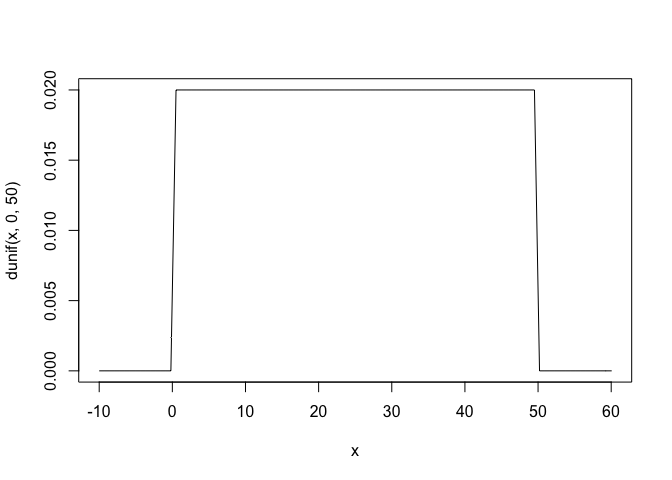

Howell1
================

# Instalation

``` r
rm(list=ls())
```

``` r
library(MASS)
library(rstan)
library(shape)
library(tidyr)
library(ggplot2)
library(dagitty)
library(gtools)
library(ellipse)
library(tidyverse)
library(rethinking)
```

``` r
options(mc.cores = parallel::detectCores())
rstan_options(auto_write = TRUE)
```

# Loading data

The data are partial census data for the Dobe area !Kung San which is
the most famous foraging population of the twentieth century.

``` r
data("Howell1")
d <- Howell1
```

``` r
str(d)
```

    ## 'data.frame':    544 obs. of  4 variables:
    ##  $ height: num  152 140 137 157 145 ...
    ##  $ weight: num  47.8 36.5 31.9 53 41.3 ...
    ##  $ age   : num  63 63 65 41 51 35 32 27 19 54 ...
    ##  $ male  : int  1 0 0 1 0 1 0 1 0 1 ...

``` r
d2 <- d[d$age >= 18, ]
```

# 1.Linear prediction

## Initial statistical models


## Prior predictive checks

The prior of alpha states that if an individual has an average height,
the average height centers around 178 cm.

``` r
curve(dnorm(x,178,20), from=100, to=250)
```

<!-- -->

The prior of sigma is a truly flat prior that constrain the variation to
have positive probability between 0 and 50 cm

``` r
curve(dunif(x,0,50), from=-10, to=60)
```

<!-- -->

Look at the prior of beta, its initial prior results in unreasonable
predictions of heights as some is smaller than 0 cm and some is higher
than 272 cm.

``` r
set.seed(2971)
N <- 100
a <- rnorm(n=N, mean = 178, sd = 20)
b <- rnorm(n=N, mean=0, sd=10)

plot(NULL, xlim=range(d2$weight), ylim=c(-100,400),
     xlab='weight', ylab='height')
abline(h=0, lty=2)
abline(h=272, lty=1, lwd=0.5)
mtext('b ~ dnorm(0,10)')
xbar <- mean(d2$weight)
for(i in 1:N){
  curve(a[i] + b[i]*(x - xbar),
        from=min(d2$weight), to=max(d2$weight), add=TRUE,
        col=col.alpha('black',0.2))
}
```

<!-- -->

Assume that average height increases with average weight, we should
restrict the value of beta to be positive. So, Log-Normal is an
alternative.

``` r
set.seed(2971)
N <- 100
a <- rnorm(n=N, mean = 178, sd = 20)
b <- rlnorm(n=N, meanlog=0, sdlog=1)

plot(NULL, xlim=range(d2$weight), ylim=c(-100,400),
     xlab='weight', ylab='height')
abline(h=0, lty=2)
abline(h=272, lty=1, lwd=0.5)
mtext('log(b) ~ dnorm(0,1)')
xbar <- mean(d2$weight)
for(i in 1:N){
  curve(a[i] + b[i]*(x - xbar),
        from=min(d2$weight), to=max(d2$weight), add=TRUE,
        col=col.alpha('black',0.2))
}
```

<!-- -->

## Adjusted statistical model


``` r
xbar <- mean(d2$weight)
xbar
```

    ## [1] 44.99049

``` r
dlist <- list(N=nrow(d2),weight=d2$weight,height=d2$height)
```

``` r
code_m1.1 <- "
data{
  int N;
  vector[N] height;
  vector[N] weight;
}
parameters{
  real a;
  real<lower=0> b;
  real<lower=0,upper=50> sigma;
}
model{
  vector[N] mu;
  sigma ~ uniform(0,50);
  a ~ normal(178,20);
  b ~ lognormal(0,1);
  for(i in 1:N){
    mu[i] = a + b*(weight[i] - 44.99049);
  }
  height ~ normal(mu, sigma);
}
generated quantities{
  vector[N] log_lik;
  vector[N] mu;
  for(i in 1:N){
    mu[i] = a + b*(weight[i] - 44.99049);
  }
  for(i in 1:N){
    log_lik[i] = normal_lpdf(height[i]|mu[i],sigma);
  }
}
"
```

``` r
m1.1 <- stan(model_code = code_m1.1, data = dlist, chains=4, cores=4)
precis(m1.1)
```

    ##              mean         sd        5.5%       94.5%    n_eff     Rhat4
    ## a     154.5980340 0.27452404 154.1632281 155.0425878 3899.881 0.9999897
    ## b       0.9031346 0.04234077   0.8344219   0.9713863 3685.888 0.9994727
    ## sigma   5.1058532 0.19400322   4.8066545   5.4276959 4344.830 1.0003352

The sampler performs well as the parameters have a very small tiny
correlation with each others

``` r
# round(vcov(m1.1),3)
```

## Posterior prediction check

### Posterior prediction means and intervals

``` r
post <- extract.samples(m1.1)
mu_at_50 <- post$a + post$b*(50-xbar)
dens(mu_at_50, col=rangi2, lwd=2, xlab="mu|weight=50")
```

<!-- -->

``` r
weight.seq <- seq( from=25 , to=70 , by=1 )
mu <- sapply( weight.seq , function(weight){post$a + post$b*(weight - xbar)})
# mu <- link(m1.1, data=data.frame(weight=weight.seq))
plot(height ~ weight, data=d2, type="n")
for (i in 1:100){
  points(weight.seq, mu[i,], pch=16, col=col.alpha(rangi2,0.1))
}
```

<!-- -->

``` r
post <- extract.samples(m1.1)
a_map <- mean(post$a)
b_map <- mean(post$b)

plot(height ~ weight, data=d2, col=rangi2, xlab="weight", ylab="height")
curve(a_map + b_map*(x-xbar),add=TRUE)
for (i in 1:50){
  curve(post$a[i] + post$b[i]*(x-xbar), col=col.alpha("black",0.1), add=TRUE)
}
```

<!-- -->

``` r
mu.mean <- apply(mu, 2, mean)
mu.pi <- apply(mu, 2, PI, prob=0.89)
plot(height ~ weight, data=d2, col=rangi2, xlab="weight", ylab="height")
lines(weight.seq, mu.mean)
shade(mu.pi, weight.seq)
```

<!-- -->

### Prediction intervals

``` r
post <- extract.samples(m1.1)
weight.seq <- 25:70
sim.height <- sapply( weight.seq , function(weight){rnorm(n=nrow(post$a),mean=post$a + post$b*(weight - xbar),sd=post$sigma)})
height.pi <- apply( sim.height , 2 , PI , prob=0.89 )
```

``` r
plot(height ~ weight, d2, col=col.alpha(rangi2, 0.5))
lines(weight.seq, mu.mean)
shade(mu.pi, weight.seq,col = col.alpha("black",0.5))
shade(height.pi, weight.seq)
```

<!-- -->

# 2.Polynomial models


### Prior predictive check

``` r
N <- 100
a <- rnorm(N,178,20)
b1 <- rlnorm(N,0,1)
b2 <- rnorm(N,0,1)
```

``` r
d$weight_s <- (d$weight - mean(d$weight))/sd(d$weight)
d$weight_s2 <- d$weight_s^2
```

``` r
plot(NULL, xlim=range(d$weight_s), ylim=c(-100,400),
     xlab="weight", ylab="height")
abline(h=0, lty=16)
abline(h=272, lty=16)
for (i in 1:50){
  curve(a[i] + b1[i]*x + b2[i]*x^2, from=min(d$weight_s), to=max(d$weight_s), add=TRUE)
}
```

<!-- --> These prior
predictive check shows that the average height is in a solid and
reasonable range.

``` r
dlist2 <- list(
  N = nrow(d),
  weight_s = d$weight_s,
  weight_s2 = d$weight_s2,
  height = d$height
)
```

``` r
code_m2.1 <- "
data{
  int N;
  vector[N] height;
  vector[N] weight_s;
  vector[N] weight_s2;
}
parameters{
  real a;
  real<lower=0> b1;
  real b2;
  real<lower=0,upper=50> sigma;
}
model{
  vector[N] mu;
  sigma ~ uniform(0,50);
  b1 ~ lognormal(0,1);
  b2 ~ normal(0,1);
  a ~ normal(178,20);
  for(i in 1:N){
    mu[i] = a + b1*weight_s[i] + b2*weight_s2[i];
  }
  height ~ normal(mu, sigma);
}
generated quantities{
  vector[N] log_lik;
  vector[N] mu;
  for(i in 1:N){
    mu[i] = a + b1*weight_s[i] + b2*weight_s2[i];
  }
  for(i in 1:N){
    log_lik[i] = normal_lpdf(height[i]|mu[i],sigma);
  }
}
"
```

``` r
m2.1 <- stan(model_code=code_m2.1, data=dlist2, chains=4, cores=4)
precis(m2.1)
```

    ##             mean        sd       5.5%      94.5%    n_eff    Rhat4
    ## a     146.047457 0.3665673 145.470653 146.625802 2492.141 1.002190
    ## b1     21.737448 0.2950850  21.272105  22.215986 2492.576 1.000487
    ## b2     -7.797174 0.2716610  -8.231358  -7.374557 2208.783 1.001921
    ## sigma   5.811369 0.1824652   5.529338   6.107237 3301.970 1.000749

### Posterior predictive check

``` r
post <- extract.samples(m2.1)
mu.link <- function(weight_s){post$a + post$b1*weight_s + post$b2*weight_s^2}
weight.seq <- seq(from=-2.2,to=2,length.out=50)
mu <- sapply(weight.seq, mu.link)
# mu <- link(m1.2,data=list(weight_s=weight.seq))
mu.mean <- apply(mu,2,mean)
mu.pi <- apply(mu,2,PI,prob=0.89)
```

``` r
height.sim <- function(weight_s){rnorm(n=nrow(post$a),mean=post$a + post$b1*weight_s + post$b2*weight_s^2,sd=post$sigma)}
sim.height <- sapply(X=weight.seq, FUN=height.sim)
# sim.height <- sim(m1.2,data=list(weight_s=weight.seq, weight_s2=weight.seq^2))
height.mean <- apply(sim.height,2,mean)
height.pi <- apply(sim.height,2,PI,prob=0.89)
```

``` r
plot(NULL, xlim=range(d$weight_s), ylim=range(d$height),xlab="weight_s", ylab="height")
points(x=d$weight_s,y=d$height, col=col.alpha(rangi2,0.5))
lines(weight.seq,mu.mean,col=col.alpha("black",1))
shade(mu.pi,weight.seq,col=col.alpha("blue",0.5))
shade(height.pi,weight.seq,col=col.alpha("grey",0.5))
```

<!-- -->

# 3.Categorical variables

We are going to model separately heights of male and female.

``` r
d$sex <- d$male+1
```

``` r
dlist3 <- list(
  N = nrow(d),
  sex = d$sex,
  height = d$height
)
```

``` r
code_m3.1 <- "
data{
  int N;
  vector[N] height;
  int sex[N];
}
parameters{
  vector[2] a;
  real<lower=0,upper=50> sigma;
}
model{
  vector[N] mu;
  sigma ~ uniform(0,50);
  a ~ normal(178,20);
  for(i in 1:N){
    mu[i] = a[sex[i]];
  }
  height ~ normal(mu,sigma);
}
generated quantities{
  vector[N] log_lik;
  vector[N] mu;
  for(i in 1:N){
    mu[i] = a[sex[i]];
  }
  for(i in 1:N){
    log_lik[i] = normal_lpdf(height[i]|mu[i], sigma);
  }
}
"
```

``` r
m3.1 <- stan(model_code = code_m3.1, data=dlist3, chains=4, cores=4)
precis(m3.1)
```

    ##          mean        sd     5.5%    94.5%    n_eff     Rhat4
    ## sigma 27.4156 0.8419551 26.10231 28.80117 3921.602 0.9992102

To get the difference between categories, we will compute the *contrast*

``` r
post <- extract.samples(m3.1)
post$diff <- post$a[,1] - post$a[,2]
precis(post$diff)
```

    ##                mean       sd      5.5%     94.5% histogram
    ## post.diff -7.639063 2.354344 -11.29964 -3.886953 ▁▁▂▇▇▃▁▁▁

# 4.Model comparison

``` r
compare(m1.1, m2.1, m3.1)
```

    ##          WAIC       SE    dWAIC      dSE    pWAIC        weight
    ## m1.1 2148.287 29.86152    0.000       NA 3.169835  1.000000e+00
    ## m2.1 3460.167 32.92046 1311.880 40.13272 4.502093 1.345569e-285
    ## m3.1 5148.322 38.59446 3000.035 42.88042 3.234464  0.000000e+00

# 5.Scientific model

Assume that a person is shaped like a cylinder. The weight of the
cylinder is a consequence of the volume of the cylinder. The volume of
the cylinder is a consequence of growth in the height and width of the
cylinder.

The volume of the cylinder is

While we do not know a person’s radius, we can assume that it is
constant proportion of height.

As weight is some proportion of volume. We have a formula below

## Transform data

``` r
d <- Howell1
```

We get rid of measurement scale by dividing the observed variables by
reference values. The two new variables have means of 1, which free
parameters’ prior from measurement scale.

``` r
d$w <- d$weight/mean(d$weight)
d$h <- d$height/mean(d$height)
```

## Define initial priors

p is the ratio of the radius to the height. So, it must be greater than
zero and less than one. It is also certainly less than one-half. Thus,
we need a prior distribution for p that is bounded between zero and one
with most of the prior mass below 0.5.

Beta distribution is an option for parameters whose values lie in range
of zero and one. Based on Beta distribution’s mean calculation, the
prior of p will be

The parameter k is the proportion of volume that is weight.
Theoretically, it just translates measurement scales. We know that k
must be greater than 1. As w and h have means of 1, let set its prior
mean around 2


## Initial statistical model


## Prior predictive check

``` r
N <- 100
k <- rexp(N,0.5)
p <- rbeta(N,2,18)
sigma <- rexp(N,1)
```

``` r
plot(NULL,xlim=range(d$h), ylim=c(0,2),xlab="height",ylab="weight")
curve(mean(k)*3.14*(mean(p)^2)*(x^3),from=min(d$h),to=max(d$h),add=TRUE,col=col.alpha("red",1))
for(i in 1:N){
  curve(k[i]*3.14*(p[i]^2)*(x^3), from=min(d$h),to=max(d$h),add=TRUE,col=col.alpha(rangi2,0.1))
}
```

<!-- --> The prior
produces a small median value of weight. So, we need to adjust it to
ensure the prior prediction to be reasonable.

One of the least informative parameter is k. Thus, we will change its
prior. As we need to increase the median value of weight, the mean of k
will be upped.

``` r
N <- 100
k <- rexp(N,0.1)
p <- rbeta(N,2,18)
sigma <- rexp(N,1)
```

``` r
plot(NULL,xlim=range(d$h), ylim=c(0,2),xlab="height",ylab="weight")
curve(mean(k)*3.14*(mean(p)^2)*(x^3),from=min(d$h),to=max(d$h),add=TRUE,col=col.alpha("red",1))
for(i in 1:N){
  curve(k[i]*3.14*(p[i]^2)*(x^3), from=min(d$h),to=max(d$h),add=TRUE,col=col.alpha(rangi2,0.1))
}
```

<!-- -->

## Adjusted statistical model


``` r
dlist5 <- list(
  N = nrow(d),
  w = d$w,
  h = d$h
)
```

``` r
code_m5.1 <- "
data{
  int N;
  vector[N] w;
  vector[N] h;
}
parameters{
  real<lower=0> k;
  real<lower=0,upper=1> p;
  real<lower=0> sigma;
}
model{
  vector[N] mu;
  sigma ~ exponential(1);
  k ~ exponential(0.1);
  p ~ beta(2,18);
  for(i in 1:N){
    mu[i] = log(k) + log(3.14) + 2*log(p) + 3*log(h[i]);
  }
  w ~ lognormal(mu, sigma);
}
generated quantities{
  vector[N] mu;
  vector[N] log_lik;
  for(i in 1:N){
    mu[i] = log(k) + log(3.14) + 2*log(p) + 3*log(h[i]);
  }
  for(i in 1:N){
    log_lik[i] = normal_lpdf(w[i]|mu[i],sigma);
  }
}
"
```

``` r
m5.1 <- stan(model_code=code_m5.1, data=dlist5, chains=4, cores=4)
precis(m5.1)
```

    ##             mean           sd       5.5%      94.5%    n_eff    Rhat4
    ## k     16.2395051 10.668851322 4.80066091 35.5475779 1058.483 1.002071
    ## p      0.1575196  0.050669969 0.09197019  0.2508381 1121.077 1.001546
    ## sigma  0.2062829  0.006292151 0.19661735  0.2165439 1358.230 1.001133

``` r
# round(vcov(m5.1),3)
```

k and p are highly correlated. It partially results in their low number
of effective samples. However, we need further information outside of
the data we have to resonate these parameters.

## Posterior predictive check

``` r
post <- extract.samples(m5.1)
h.seq <- seq(from=0.2,to=1.4,length.out=30)
w.sim <- sapply(h.seq, function(h){rlnorm(n=nrow(post$k),mean=log(post$k) + log(3.14) + 2*log(post$p) + 3*log(h),sd=post$sigma)})
# w.sim <- sim(m4.1, data = list(h=h.seq))
w.mean <- apply(w.sim,2,mean)
w.pi <- apply(w.sim,2,PI,prob=0.89)

# mu <- link(m4.1,dat=list(h=h.seq))
mu <- sapply(h.seq, function(h){log(post$k) + log(3.14) + 2*log(post$p) + 3*log(h)})
med <- exp(mu)
med.mean <- apply(med,2,mean)
med.pi <- apply(med,2,PI,prob=0.89)
```

``` r
plot(NULL, xlim=range(d$h), ylim=c(0,max(d$w)),xlab="height",ylab="weight")
points(x=d$h,y=d$w,col=col.alpha(rangi2,0.5))
lines(x=h.seq,y=w.mean)
shade(med.pi,h.seq,col=col.alpha("blue",0.5))
shade(w.pi,h.seq)
```

<!-- -->

## One more thing

We will relax the exponent of height in the cylinder model and let it be
a free parameter. We need to add a new prior.


### Prior predictive check

``` r
set.seed(123)
N <- 100
k <- rexp(N,0.1)
p <- rbeta(N,2,18)
sigma <- rexp(N,1)
e <- rexp(N,0.3)

plot(NULL,xlim=range(d$h), ylim=c(0,2),xlab="height",ylab="weight")
curve(mean(k)*3.14*(mean(p)^2)*(x^mean(e)),from=min(d$h),to=max(d$h),add=TRUE,col=col.alpha("red",1))
for(i in 1:N){
  curve(k[i]*3.14*(p[i]^2)*(x^e[i]), from=min(d$h),to=max(d$h),add=TRUE,col=col.alpha(rangi2,0.1))
}
```

<!-- -->

``` r
code_m5.2 <- "
data{
  int N;
  vector[N] w;
  vector[N] h;
}
parameters{
  real<lower=0> k;
  real<lower=0,upper=1> p;
  real<lower=0> sigma;
  real<lower=0> e;
}
model{
  vector[N] mu;
  sigma ~ exponential(1);
  k ~ exponential(0.1);
  p ~ beta(2,18);
  e ~ exponential(0.3);
  for(i in 1:N){
    mu[i] = log(k) + log(3.14) + 2*log(p) + e*log(h[i]);
  }
  w ~ lognormal(mu, sigma);
}
generated quantities{
  vector[N] mu;
  vector[N] log_lik;
  for(i in 1:N){
    mu[i] = log(k) + log(3.14) + 2*log(p) + 3*log(h[i]);
  }
  for(i in 1:N){
    log_lik[i] = normal_lpdf(w[i]|mu[i],sigma);
  }
}
"
```

``` r
m5.2 <- stan(model_code=code_m5.2, data=dlist5, chains=4, cores=4)
precis(m5.2)
```

    ##             mean           sd       5.5%      94.5%    n_eff    Rhat4
    ## k     15.9421913 10.455466157 4.67330005 35.0107432 1488.231 1.006367
    ## p      0.1579955  0.051503708 0.09182524  0.2519382 1308.017 1.006927
    ## sigma  0.1263633  0.003773658 0.12048822  0.1323304 2099.530 1.000525
    ## e      2.3245748  0.022855594 2.28768722  2.3611454 2700.033 1.001223

``` r
post <- extract.samples(m5.2)
h.seq <- seq(from=0.2,to=1.4,length.out=30)
w.sim <- sapply(h.seq, function(h){rlnorm(n=nrow(post$k),mean=log(post$k) + log(3.14) + 2*log(post$p) + post$e*log(h),sd=post$sigma)})
# w.sim <- sim(m4.2, data = list(h=h.seq))
w.mean <- apply(w.sim,2,mean)
w.pi <- apply(w.sim,2,PI,prob=0.89)

mu <- sapply(h.seq, function(h){log(post$k) + log(3.14) + 2*log(post$p) + post$e*log(h)})
# mu <- link(m4.2,dat=list(h=h.seq))
med <- exp(mu)
med.mean <- apply(med,2,mean)
med.pi <- apply(med,2,PI,prob=0.89)
```

``` r
plot(NULL, xlim=range(d$h), ylim=c(0,max(d$w)),xlab="height",ylab="weight")
points(x=d$h,y=d$w,col=col.alpha(rangi2,0.5))
lines(x=h.seq,y=w.mean)
shade(med.pi,h.seq,col=col.alpha("blue",0.5))
shade(w.pi,h.seq)
```

<!-- -->

``` r
compare(m5.1, m5.2, func=PSIS)
```

    ##          PSIS        SE    dPSIS      dSE     pPSIS weight
    ## m5.1 18679.18  799.0342     0.00       NA  952.3962      1
    ## m5.2 53950.33 2231.6460 35271.15 1432.842 4837.3674      0

The first model outperforms the second in terms of expected predictive
accuracy.
