Kline
================

# Instalation

``` r
rm(list=ls())
```

``` r
library(MASS)
library(rstan)
library(shape)
library(tidyr)
require(visdat)
library(ggplot2)
library(dagitty)
library(gtools)
library(ellipse)
library(tidyverse)
library(rethinking)
```

``` r
options(mc.cores = parallel::detectCores())
rstan_options(auto_write = TRUE)
```

# Introduction

We’re going to explore the technological evolution in the island
societies of Oceania. We focus on the development of tool kits such as
fish hooks, axes, boats, hand plows, and many other types of tools that
naturally grow up

The motivating question is whether larger populations will both develop
and sustain more complex tool kits

# Load data

``` r
data(Kline2)
d <- Kline2
head(d)
```

    ##      culture population contact total_tools mean_TU   lat   lon  lon2   logpop
    ## 1   Malekula       1100     low          13     3.2 -16.3 167.5 -12.5 7.003065
    ## 2    Tikopia       1500     low          22     4.7 -12.3 168.8 -11.2 7.313220
    ## 3 Santa Cruz       3600     low          24     4.0 -10.7 166.0 -14.0 8.188689
    ## 4        Yap       4791    high          43     5.0   9.5 138.1 -41.9 8.474494
    ## 5   Lau Fiji       7400    high          33     5.0 -17.7 178.1  -1.9 8.909235
    ## 6  Trobriand       8000    high          19     4.0  -8.7 150.9 -29.1 8.987197

As theories predict that the number of tools increases with the log
population size. We will work with log population, that is the order of
magnitude of the population, instead of the absolute size. We will use
the standardize log of population

``` r
d$P <- scale(log(d$population))
```

We also count in the binary variable, contact, that implies the
connections between societies in islands in the Pacific Ocean

``` r
d$contact_id <- ifelse(d$contact=="high",2,1)
```

# 1. Poisson regression models

## Initial statistical models


## Define priors

To determine priors for alpha and beta, we need to construct a prior
predictive distribution of the mean of a Poisson

We will test two priors of alpha, one flat and one weakly informative.
By using a normal distribution for alpha, the lambda will have a
log-normal distribution

A log-normal distribution has a mean of
*e**x**p*(*μ*+*σ*<sup>2</sup>/2). So, a flat prior of alpha will pile up
the lambda on zero

``` r
set.seed(1)
N <- 200
curve(dlnorm(x,0,10), from=0, to=100, n=N, xlab="mean number of tools", ylab="Density")
text(25,0.07,"a ~ dnorm(0,10)")
curve(dlnorm(x,3,0.5), from=0, to=100, n=N, col=rangi2, add=TRUE)
text(45,0.05,"a ~ dnorm(3,0.5)", col=rangi2)
curve(dlnorm(x,4,0.2), from=0, to=100, n=N, col="blue", add=TRUE)
text(82,0.03,"a ~ dnorm(4,0.2)",col="blue")
```

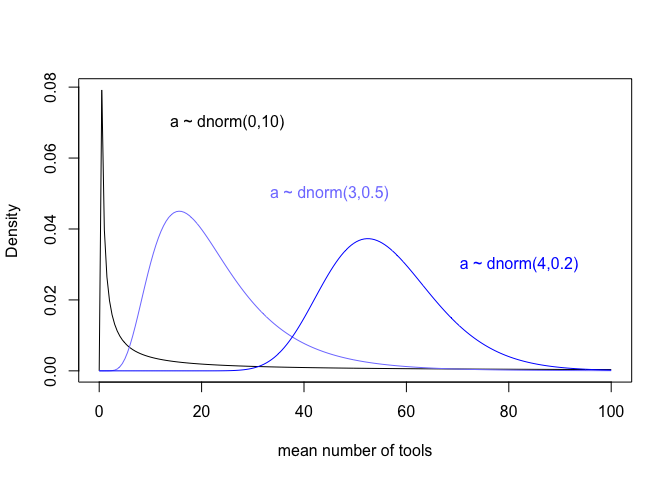<!-- -->

The prior of beta generates a exploding value of the outcome variable.
Even if the predictor variable is close to zero, total tools is
infinite. We can drop the prior

``` r
set.seed(2)
N <- 200
a <- rnorm(N,3,0.5)
b <- rnorm(N,0,10)
plot(NULL, xlim=c(-2,2), ylim=c(0,100), xlab="log population (std)", ylab="total tools")
for(i in 1:N){curve(exp(a[i]+b[i]*x), add=TRUE, col=grau())}
```

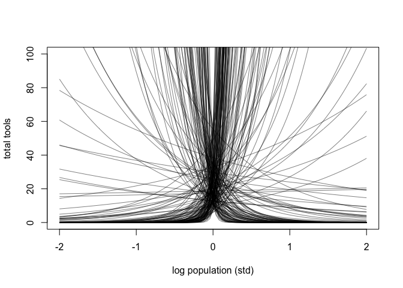<!-- -->

Adjusting the prior of beta gives us a more reasonable range as most of
lines stay below 40 and center around 20. That is seemingly in line with
the prior of alpha

``` r
set.seed(2)
N <- 200
a <- rnorm(N,3,0.5)
b <- rnorm(N,0,0.2)
plot(NULL, xlim=c(-2,2), ylim=c(0,100), xlab="log population (std)", ylab="total tools")
for(i in 1:N){curve(exp(a[i]+b[i]*x), add=TRUE, col=grau())}
```

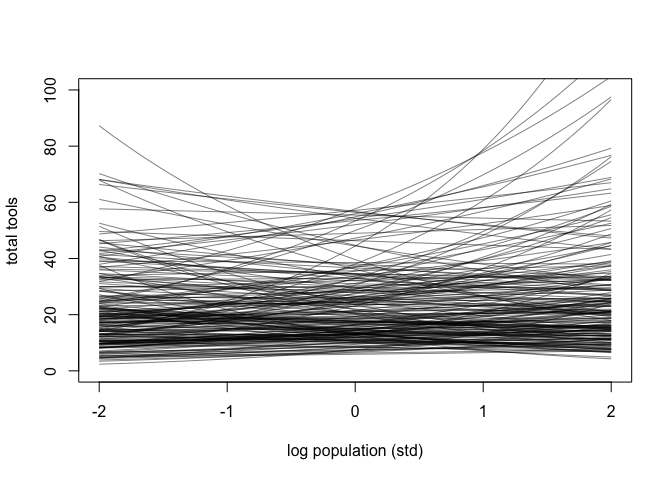<!-- -->

While population size has a natural size, standardizing the variable
destroy it. We will plot prior predictive trends between total tools and
un-standardized log population. Here, most of prior predictors lie
around 100 total tools and some explodes

``` r
set.seed(2)
N <- 200
a <- rnorm(N,3,0.5)
b <- rnorm(N,0,0.2)
x_seq <- seq( from=log(100) , to=log(200000) , length.out=100 )
lambda <- sapply( x_seq , function(x) exp( a + b*x ) )
plot( NULL , xlim=range(x_seq) , ylim=c(0,500) , xlab="log population" ,
    ylab="total tools" )
for ( i in 1:N ) lines( x_seq , lambda[i,] , col=grau() , lwd=1.5 )
```

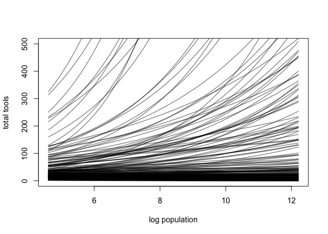<!-- -->

The chart below shows that relationship between total tools and the
absolute size of population. The model imposes diminishing returns on
population

``` r
set.seed(2)
N <- 200
a <- rnorm(N,3,0.5)
b <- rnorm(N,0,0.2)
x_seq <- seq( from=log(100) , to=log(200000) , length.out=100 )
lambda <- sapply( x_seq , function(x) exp( a + b*x ) )
plot( NULL , xlim=range(exp(x_seq)) , ylim=c(0,500) , xlab="population" ,
    ylab="total tools" )
for ( i in 1:N ) lines( exp(x_seq) , lambda[i,] , col=grau() , lwd=1.5 )
```

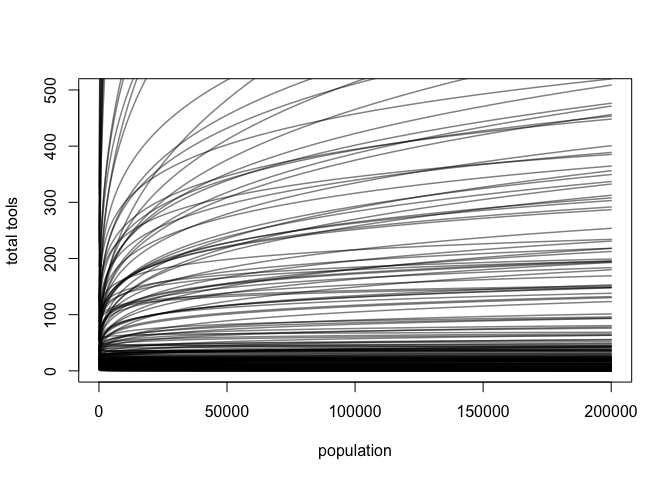<!-- -->

## Updated statistical models


``` r
dlist.1 <- list(
  T = d$total_tools,
  P = d$P,
  cid = d$contact_id,
  N = nrow(d)
)
```

``` r
code_m1.1 <- "
data{
  int N;
  int T[N];
}
parameters{
  real a;
}
model{
  real lambda;
  a ~ normal(3,0.5);
  lambda = a;
  lambda = exp(lambda);
  T ~ poisson(lambda);
}
generated quantities{
  vector[N] log_lik;
  real lambda;
  lambda = a;
  lambda = exp(lambda);
  for(i in 1:N){
    log_lik[i] = poisson_lpmf(T[i] | lambda);
  }
}
"
```

``` r
m.1.1 <- stan(model_code=code_m1.1, data=dlist.1, chains=4, cores=4)
```

``` r
precis(m.1.1)
```

    ##             mean         sd      5.5%     94.5%    n_eff    Rhat4
    ## a       3.542158 0.05433348  3.454234  3.627942 1279.300 1.004690
    ## lambda 34.592328 1.87837389 31.634045 37.635284 1282.621 1.004746

``` r
head(d)
```

    ##      culture population contact total_tools mean_TU   lat   lon  lon2   logpop
    ## 1   Malekula       1100     low          13     3.2 -16.3 167.5 -12.5 7.003065
    ## 2    Tikopia       1500     low          22     4.7 -12.3 168.8 -11.2 7.313220
    ## 3 Santa Cruz       3600     low          24     4.0 -10.7 166.0 -14.0 8.188689
    ## 4        Yap       4791    high          43     5.0   9.5 138.1 -41.9 8.474494
    ## 5   Lau Fiji       7400    high          33     5.0 -17.7 178.1  -1.9 8.909235
    ## 6  Trobriand       8000    high          19     4.0  -8.7 150.9 -29.1 8.987197
    ##              P contact_id
    ## 1 -1.291473310          1
    ## 2 -1.088550750          1
    ## 3 -0.515764892          1
    ## 4 -0.328773359          2
    ## 5 -0.044338980          2
    ## 6  0.006668287          2

``` r
dlist.1 <- list(
  T = d$total_tools,
  P = standardize(log(d$population)),
  cid = d$contact_id,
  N = nrow(d)
)
dlist.1$N_cid = length(unique(d$contact_id))
```

``` r
code_m1.2 <- "
data{
  int N;
  int N_cid;
  int T[N];
  vector[N] P;
  int cid[N];
}
parameters{
  vector[N_cid] a;
  vector[N_cid] b;
}
model{
  vector[N] lambda;
  a ~ normal(3,0.5);
  b ~ normal(0,0.2);
  for(i in 1:N){
    lambda[i] = a[cid[i]] + b[cid[i]]*P[i];
    lambda[i] = exp(lambda[i]);
  }
  T ~ poisson(lambda);
}
generated quantities{
  vector[N] log_lik;
  vector[N] lambda;
  for(i in 1:N){
    lambda[i] = a[cid[i]] + b[cid[i]]*P[i];
    lambda[i] = exp(lambda[i]);
  }
  for(i in 1:N){
    log_lik[i] = poisson_lpmf(T[i] | lambda[i]);
  }
}
"
```

``` r
m.1.2 <- stan(model_code=code_m1.2, data=dlist.1, chains=4, cores=4)
```

``` r
precis(m.1.2,2, pars=c("a", "b"))
```

    ##           mean         sd        5.5%     94.5%    n_eff    Rhat4
    ## a[1] 3.3200362 0.08907100  3.17649118 3.4609907 3313.375 1.000215
    ## a[2] 3.6104286 0.07259167  3.49548257 3.7245722 3669.860 1.000127
    ## b[1] 0.3770239 0.05418092  0.28921252 0.4634804 3713.713 1.000041
    ## b[2] 0.1977161 0.15993974 -0.05187912 0.4531353 3415.176 1.000645

## Model comparison

Before moving to the posterior predictive check, we take a quick look at
the model comparison

``` r
compare(m.1.1, m.1.2, func=WAIC)
```

    ##            WAIC       SE    dWAIC      dSE    pWAIC       weight
    ## m.1.2  83.61047 12.20313  0.00000       NA 6.135904 1.000000e+00
    ## m.1.1 141.86841 32.17131 58.25794 34.04693 8.516165 2.235885e-13

``` r
compare(m.1.1, m.1.2, func=PSIS)
```

    ##            PSIS       SE    dPSIS      dSE    pPSIS       weight
    ## m.1.2  85.88685 13.53757  0.00000       NA 7.274096 1.000000e+00
    ## m.1.1 141.80658 33.81333 55.91973 33.55959 8.485252 7.197559e-13

Two noteworthy things:

* We see warnings of unreliable sampling m1.1 has less free parameters but
more effective number of parameters than m1.2

* Intuitively, the comparison said that model m1.1 has a higher penalty
and less complexity than m1.2. It looks like a paradox. On one hand, the
penalty term is set to reduce the overfitting risk. On the other hand,
the larger effective number of parameters does not mean of an
overfitting risk. If we plot the posterior predictive check for m1.1,
there is a horizontal line

The observation reminds us that the overfitting risk of a model has less
to do with the number of parameters than with how the parameters are
related to one another

## Posterior predictive checks

There are some highlights:

* There are three highly influential points. The most one is Hawaii which
has extreme population size, the most tools and a low contact with the
others 

* The trend for societies with high contact is higher than the
trend of societies with low contact when population size is low. It is
reversed when population size is high. That patterns is because there
are no high population size societies with high contact. Thus, the model
has no idea where the trend for high contact societies goes at high
population sizes. However, it is reasonable that a counter-factual
Hawaii with the same population size but high contact should
theoretically have at least as many tools as the real Hawaii

These points encourage us to revise the statistical model

``` r
post1.2 <- extract.samples(m.1.2)
k <- PSIS( m.1.2 , pointwise=TRUE )$k
plot( dlist.1$P , dlist.1$T , xlab="log population (std)" , ylab="total tools" ,
    col=rangi2 , pch=ifelse( dlist.1$cid==1 , 1 , 16 ) , lwd=2 ,
    ylim=c(0,100) , cex=1+normalize(k), bty="l" )

ns <- 100
P_seq <- seq( from=-1.4 , to=3 , length.out=ns )
# predictions for cid=1 (low contact)
cid1 <-  1
lambda <- matrix(0,nrow = nrow(post1.2$a), ncol =ns)
for(i in 1:ns){lambda[,i] = exp(post1.2$a[,cid1] + post1.2$b[,cid1]*P_seq[i])}
# lambda <- link( m1.2 , data=data.frame( P=P_seq , cid=1 ) )
lmu <- apply( lambda , 2 , mean )
lci <- apply( lambda , 2 , PI )
lines( P_seq , lmu , lty=2 , lwd=1.5 )
shade( lci , P_seq , xpd=TRUE )
# predictions for cid=2 (high contact)
cid2 <- 2
lambda <- matrix(0,nrow = nrow(post1.2$a), ncol = ns)
for(i in 1:ns){lambda[,i] = exp(post1.2$a[,cid2] + post1.2$b[,cid2]*P_seq[i])}
# lambda <- link( m1.2 , data=data.frame( P=P_seq , cid=2 ) )
lmu <- apply( lambda , 2 , mean )
lci <- apply( lambda , 2 , PI )
lines( P_seq , lmu , lty=1 , lwd=1.5 )
shade( lci , P_seq , xpd=TRUE )
```

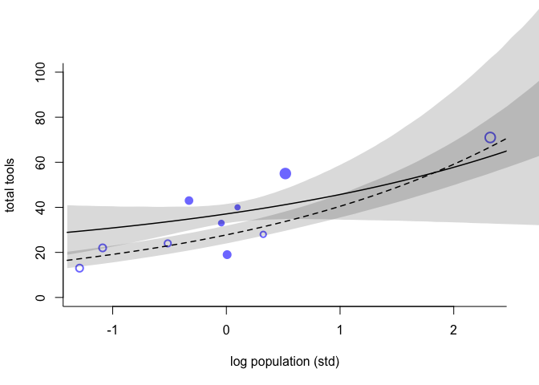<!-- -->

One more thing is that the statistical model shows no guarantee that the
trend of the mean of tool kits will pass through the origin where the
population size equals zero

``` r
plot( d$population , d$total_tools , xlab="population" , ylab="total tools" ,
    col=rangi2 , pch=ifelse( dlist.1$cid==1 , 1 , 16 ) , lwd=2 ,
    ylim=c(0,100) , cex=1+normalize(k) , bty="l")
ns <- 100
P_seq <- seq( from=-5 , to=3 , length.out=ns )
# 1.53 is sd of log(population)
# 9 is mean of log(population)
pop_seq <- exp( P_seq*1.53 + 9 )
cid1 <-  1
lambda <- matrix(0,nrow = nrow(post1.2$a), ncol =ns)
for(i in 1:ns){lambda[,i] = exp(post1.2$a[,cid1] + post1.2$b[,cid1]*P_seq[i])}
# lambda <- link( m1.2 , data=data.frame( P=P_seq , cid=1 ) )
lmu <- apply( lambda , 2 , mean )
lci <- apply( lambda , 2 , PI )
lines( pop_seq , lmu , lty=2 , lwd=1.5 )
shade( lci , pop_seq , xpd=TRUE )
cid2 <- 2
lambda <- matrix(0,nrow = nrow(post1.2$a), ncol = ns)
for(i in 1:ns){lambda[,i] = exp(post1.2$a[,cid2] + post1.2$b[,cid2]*P_seq[i])}
# lambda <- link( m1.2 , data=data.frame( P=P_seq , cid=2 ) )
lmu <- apply( lambda , 2 , mean )
lci <- apply( lambda , 2 , PI )
lines( pop_seq , lmu , lty=1 , lwd=1.5 )
shade( lci , pop_seq , xpd=TRUE )
```

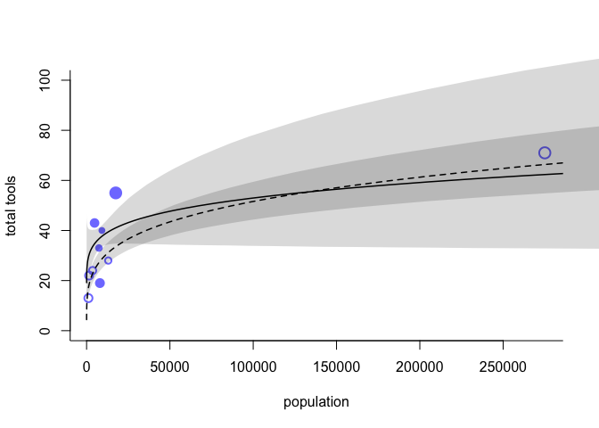<!-- -->

## Scientific models

The above analyse encourages us to encode scientific knowledge and
hypothetical causal effects to reconstruct the model. It’ll be a dynamic
model of the cultural evolution of tools which develop over time.

The change in the expected number of tools in one time step is


The equilibrium number of tools T is


### Statistical models


### Prior predictive checks

``` r
set.seed(4)
N <- 100
a <- rnorm(N,1,1)
b1 <- rexp(N,1)
b2 <- rexp(N,5)
g <- rexp(N,1)
plot(NULL, xlim=c(0,300000), ylim=c(0,200), xlab="log population (std)", ylab="total tools")
for(i in 1:100){
  curve(exp(a[i])*x^b1[i]/g[i], from=min(d$population), to=max(d$population), add=TRUE)
}
```

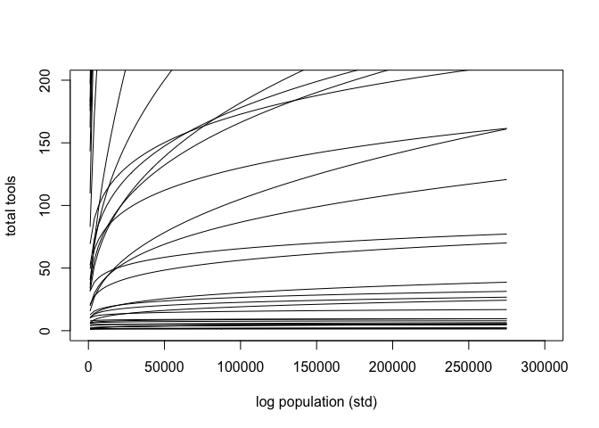<!-- -->

``` r
plot(NULL, xlim=c(0,300000), ylim=c(0,200), xlab="log population (std)", ylab="total tools")
for(i in 1:100){
  curve(exp(a[i])*x^b2[i]/g[i], from=min(d$population), to=max(d$population), add=TRUE)
}
```

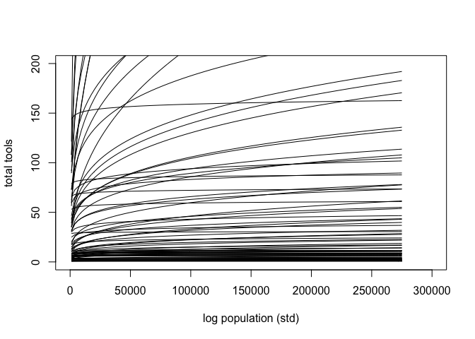<!-- --> ### Fitting
models

``` r
dlist.2 <- list(
  T = d$total_tools,
  P = d$population,
  cid = d$contact_id,
  N = nrow(d),
  N_cid = length(unique(d$contact_id))
)
```

``` r
code_m1.3 <- "
data{
  int N;
  int N_cid;
  int cid[N];
  int T[N];
  vector[N] P;
}
parameters{
  real<lower=0> g;
  vector[N_cid] a;
  vector<lower=0>[N_cid] b;
}
model{
  vector[N] lambda;
  g ~ exponential(1);
  a ~ normal(1,1);
  b ~ exponential(1);
  for(i in 1:N){
    lambda[i] = exp(a[cid[i]])*P[i]^b[cid[i]]/g;
  }
  T ~ poisson(lambda);
}
generated quantities{
  vector[N] log_lik;
  vector[N] lambda;
  for(i in 1:N){
    lambda[i] = exp(a[cid[i]])*P[i]^b[cid[i]]/g;
  }
  for(i in 1:N){
    log_lik[i] = poisson_lpmf(T[i] | lambda[i]);
  }
}
"
```

``` r
m.1.3 <- stan(model_code = code_m1.3, data = dlist.2, chains = 4, cores = 4)
```

``` r
precis(m.1.3, 2, pars=c("g", "a", "b"))
```

    ##           mean         sd       5.5%     94.5%    n_eff     Rhat4
    ## g    1.1423749 0.73987382  0.2974503 2.4983367 1606.335 0.9996411
    ## a[1] 0.9010479 0.66949088 -0.2053746 1.8943322 1408.551 1.0009842
    ## a[2] 0.9076738 0.82943970 -0.4122122 2.2325533 1694.985 0.9992320
    ## b[1] 0.2607535 0.03463246  0.2051800 0.3169744 2068.162 1.0021653
    ## b[2] 0.2926159 0.10247397  0.1309452 0.4574443 1583.635 0.9999647

``` r
code_m1.3b <- "
data{
  int N;
  int N_cid;
  int cid[N];
  int T[N];
  vector[N] P;
}
parameters{
  real<lower=0> g;
  vector[N_cid] a;
  vector<lower=0>[N_cid] b;
}
model{
  vector[N] lambda;
  g ~ exponential(1);
  a ~ normal(1,1);
  b ~ exponential(5);
  for(i in 1:N){
    lambda[i] = exp(a[cid[i]])*P[i]^b[cid[i]]/g;
  }
  T ~ poisson(lambda);
}
generated quantities{
  vector[N] log_lik;
  vector[N] lambda;
  for(i in 1:N){
    lambda[i] = exp(a[cid[i]])*P[i]^b[cid[i]]/g;
  }
  for(i in 1:N){
    log_lik[i] = poisson_lpmf(T[i] | lambda[i]);
  }
}
"
```

``` r
m.1.3b <- stan(model_code = code_m1.3b, data = dlist.2, chains = 4, cores = 4)
```

``` r
precis(m.1.3b, 2, pars=c("g", "a", "b"))
```

    ##           mean         sd        5.5%     94.5%    n_eff    Rhat4
    ## g    1.0125824 0.70078405  0.26179105 2.3391725 1201.795 1.001318
    ## a[1] 0.8246906 0.68493549 -0.32444422 1.8853298 1183.614 1.000706
    ## a[2] 1.2363448 0.81996853 -0.05390971 2.5565987 1418.555 1.001273
    ## b[1] 0.2548219 0.03349562  0.20134668 0.3069002 1963.505 1.000115
    ## b[2] 0.2409463 0.09561911  0.08176224 0.3930929 1278.722 1.002579

``` r
post1.3 <- extract.samples(m.1.3)
k <- PSIS(m.1.3, pointwise = TRUE)$k
plot(x=dlist.2$P, y=dlist.2$T, 
     xlab="Population",
     ylab="Total tools",
     col=rangi2, pch=ifelse(dlist.2$cid==1,1,16), lwd=2,
     cex=1+normalize(k), bty="l")

P_seq <- seq(from=min(dlist.2$P), to=max(dlist.2$P), length.out=100)

cid1 <- 1
lambda_lc <- matrix(0, nrow=nrow(post1.3$a), ncol=100)
for(i in 1:100){lambda_lc[,i] = exp(post1.3$a[,cid1])*P_seq[i]^post1.3$b[,cid1]/post1.3$g}
# lambda_lc <- link(m1.3, data=data.frame(P=P_seq, cid=1))
lc_mu <- apply(lambda_lc, 2, mean)
lc_pi <- apply(lambda_lc, 2, PI, prob=0.89)
lines(x=P_seq, y=lc_mu, lty=1, lwd=1.5)
shade(lc_pi, P_seq)

cid2 <- 2
lambda_hc <- matrix(0, nrow=nrow(post1.3$a), ncol=100)
for(i in 1:100){lambda_hc[,i] = exp(post1.3$a[,cid2])*P_seq[i]^post1.3$b[,cid2]/post1.3$g}
# lambda_hc <- link(m1.3, data=data.frame(P=P_seq, cid=2))
hc_mu <- apply(lambda_hc, 2, mean)
hc_pi <- apply(lambda_hc, 2, PI, prob=0.89)
lines(x=P_seq, y=hc_mu, lty=2, lwd=1.5)
shade(hc_pi, P_seq)
```

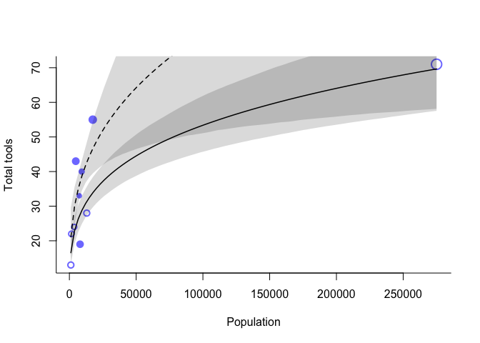<!-- -->

We get a forward step as the model that encodes science knowledge does a
better job than the previous ones. The trend for societies with high
contact is reasonably higher than the trend for societies with low
contact

Although we get a reasonable trend, using a binary contact predictor as
a proxy for possible exchange among societies is unsatisfying because

We should know which other societies each had contact with The total
number of tools for each society are truly not independent of one
another Closer islands may share unmeasured geographic features

Therefore, we’re going to expand the model and apply a general approach
known as *Gaussian Process Regression*

# 2. Gaussian Process Regression

## Load data

We start by loading the data inspecting the geographic distance matrix

``` r
data("islandsDistMatrix")
Dmat <- islandsDistMatrix
colnames(Dmat) <- c("Ml","Ti","SC","Ya","Fi","Tr","Ch","Mn","To","Ha")
round(Dmat,1)
```

    ##             Ml  Ti  SC  Ya  Fi  Tr  Ch  Mn  To  Ha
    ## Malekula   0.0 0.5 0.6 4.4 1.2 2.0 3.2 2.8 1.9 5.7
    ## Tikopia    0.5 0.0 0.3 4.2 1.2 2.0 2.9 2.7 2.0 5.3
    ## Santa Cruz 0.6 0.3 0.0 3.9 1.6 1.7 2.6 2.4 2.3 5.4
    ## Yap        4.4 4.2 3.9 0.0 5.4 2.5 1.6 1.6 6.1 7.2
    ## Lau Fiji   1.2 1.2 1.6 5.4 0.0 3.2 4.0 3.9 0.8 4.9
    ## Trobriand  2.0 2.0 1.7 2.5 3.2 0.0 1.8 0.8 3.9 6.7
    ## Chuuk      3.2 2.9 2.6 1.6 4.0 1.8 0.0 1.2 4.8 5.8
    ## Manus      2.8 2.7 2.4 1.6 3.9 0.8 1.2 0.0 4.6 6.7
    ## Tonga      1.9 2.0 2.3 6.1 0.8 3.9 4.8 4.6 0.0 5.0
    ## Hawaii     5.7 5.3 5.4 7.2 4.9 6.7 5.8 6.7 5.0 0.0

## Statistical models

We’ll use these distance as a measure of similarity in technology
exposure. That allows us to estimate varying intercepts for each society
that account for non-independence in tools as a function of their
geographical similarity


In compared with the previous model, we add k as a varying intercept for each societies. It
will be estimated in light of geographic distance, not distinct category
membership

``` r
d$society <- 1:10
```

``` r
dlist.3 <- list(
  T = d$total_tools,
  P = d$population,
  society = d$society,
  Dmat = islandsDistMatrix,
  N_society = 10,
  N = nrow(d)
)
```

``` r
code_m2.1 <- "
functions{
  matrix cov_GPL2(matrix x, real sq_alpha, real sq_rho, real delta){
    int N = dims(x)[1];
    matrix[N,N] K;
    for(i in 1:N){
      K[i,i] = sq_alpha + delta;
      for(j in (i+1):N){
        K[i,j] = sq_alpha*exp(-sq_rho * square(x[i,j]));
        K[j,i] = K[i,j];
      }
    }
    K[N, N] = sq_alpha + delta;
    return K;
  }
}
data{
  int N;
  int N_society;
  matrix[N_society, N_society] Dmat;
  int T[N];
  vector[N] P;
  int society[N];
}
parameters{
  real<lower=0> g;
  real<lower=0> b;
  real<lower=0> a;
  vector[N] k;
  real<lower=0> etasq;
  real<lower=0> rhosq;
}
model{
  vector[N] lambda;
  matrix[N, N] SIGMA;
  rhosq ~ exponential(0.5);
  etasq ~ exponential(2);
  SIGMA = cov_GPL2(Dmat, etasq, rhosq, 0.01);
  k ~ multi_normal(rep_vector(0,N), SIGMA);
  a ~ exponential(1);
  b ~ exponential(1);
  g ~ exponential(1);
  for(i in 1:N){
    lambda[i] = exp(k[society[i]]) * (a * P[i]^b/g);
  }
  T ~ poisson(lambda);
}
generated quantities{
  vector[N] log_lik;
  vector[N] lambda;
  matrix[N, N] SIGMA;
  SIGMA = cov_GPL2(Dmat, etasq, rhosq, 0.01);
  for(i in 1:N){
    lambda[i] = exp(k[society[i]]) * (a * P[i]^b/g);
  }
  for(i in 1:N){
    log_lik[i] = poisson_lpmf(T[i] | lambda[i]);
  }
}
"
```

``` r
m.2.1 <- stan(model_code=code_m2.1, data=dlist.3, chains=4, cores=4)
```

``` r
precis(m.2.1,3, pars=c("g", "b", "a", "k"))
```

    ##              mean         sd        5.5%       94.5%     n_eff     Rhat4
    ## g      0.60749775 0.57399931  0.07500171 1.634826172 1673.3756 1.0033131
    ## b      0.28185974 0.08517193  0.14727381 0.421489811 1256.2023 1.0062685
    ## a      1.42153847 1.12862723  0.22241449 3.434449736 1803.4220 1.0017768
    ## k[1]  -0.17789407 0.30121789 -0.67803580 0.282758300  864.7161 1.0065820
    ## k[2]  -0.02777443 0.29256891 -0.49713961 0.432292865  749.0492 1.0096247
    ## k[3]  -0.07730811 0.27999958 -0.53097845 0.340809376  747.2100 1.0106637
    ## k[4]   0.34393985 0.25436620 -0.03745272 0.745694398  802.5975 1.0063238
    ## k[5]   0.06428220 0.25012644 -0.32537093 0.450625304  804.1326 1.0044293
    ## k[6]  -0.39302976 0.26869392 -0.83684090 0.001442939  957.2799 1.0033216
    ## k[7]   0.12824403 0.24930359 -0.26866550 0.505894986  805.2065 1.0053771
    ## k[8]  -0.22789574 0.25886149 -0.65695045 0.149964373  923.4542 1.0032542
    ## k[9]   0.25164224 0.24116460 -0.12902068 0.631499952  891.4229 1.0025019
    ## k[10] -0.19086229 0.34255289 -0.74513319 0.329656877 1190.0495 0.9996583

The coefficient b is very much as it was in m1.3. This suggests that
it’s hard to explain all of the association between tool counts and
population as a side effect of geographic contact

## Reparameterized models

``` r
code_m2.1nc <- "
functions{
  matrix cov_GPL2(matrix x, real sq_alpha, real sq_rho, real delta){
    int N = dims(x)[1];
    matrix[N,N] K;
    for(i in 1:N){
      K[i,i] = sq_alpha + delta;
      for(j in (i+1):N){
        K[i,j] = sq_alpha*exp(-sq_rho * square(x[i,j]));
        K[j,i] = K[i,j];
      }
    }
    K[N, N] = sq_alpha + delta;
    return K;
  }
}
data{
  int N;
  int N_society;
  matrix[N_society, N_society] Dmat;
  int T[N];
  vector[N] P;
  int society[N];
}
parameters{
  real<lower=0> g;
  real<lower=0> b;
  real<lower=0> a;
  vector[N] z;
  real<lower=0> etasq;
  real<lower=0> rhosq;
}
transformed parameters{
  vector[N] k;
  matrix[N, N] L_SIGMA;
  matrix[N, N] SIGMA;
  SIGMA = cov_GPL2(Dmat, etasq, rhosq, 0.01);
  L_SIGMA = cholesky_decompose(SIGMA);
  k = L_SIGMA*z;
}
model{
  vector[N] lambda;
  
  rhosq ~ exponential(1);
  etasq ~ exponential(1);
  
  z ~ normal(0,1);
  a ~ exponential(1);
  b ~ exponential(1);
  g ~ exponential(1);
  for(i in 1:N){
    lambda[i] = exp(k[society[i]]) * (a * P[i]^b/g);
  }
  T ~ poisson(lambda);
}
generated quantities{
  vector[N] log_lik;
  vector[N] lambda;
  for(i in 1:N){
    lambda[i] = exp(k[society[i]]) * (a * P[i]^b/g);
  }
  for(i in 1:N){
    log_lik[i] = poisson_lpmf(T[i] | lambda[i]);
  }
}
"
```

``` r
m.2.1nc <- stan(model_code=code_m2.1nc, data=dlist.3, chains=4, cores=4)
```

``` r
precis(m.2.1nc,3, pars=c("g", "b", "a", "k"))
```

    ##              mean         sd        5.5%      94.5%    n_eff    Rhat4
    ## g      0.60568327 0.58786033  0.06900369 1.72718189 2387.315 1.001565
    ## b      0.27980321 0.09220232  0.13992068 0.43616757 1157.175 1.005985
    ## a      1.37231356 1.06513401  0.22710080 3.39906337 3185.717 1.000461
    ## k[1]  -0.15759720 0.37748580 -0.74965144 0.41784698 1895.395 1.006194
    ## k[2]  -0.02468105 0.36626803 -0.59629109 0.52738137 1872.829 1.006100
    ## k[3]  -0.07922254 0.35792716 -0.63493256 0.45860244 2177.610 1.005650
    ## k[4]   0.36061772 0.33577687 -0.12472442 0.88326100 1901.101 1.005237
    ## k[5]   0.09045778 0.33404531 -0.39956805 0.58901523 2111.025 1.002510
    ## k[6]  -0.39422055 0.34422580 -0.93052079 0.07371479 1998.827 1.005130
    ## k[7]   0.14532298 0.33872336 -0.33547965 0.63810010 2070.705 1.002806
    ## k[8]  -0.21395343 0.34000118 -0.71509066 0.28336284 2138.651 1.003476
    ## k[9]   0.26541907 0.33069794 -0.22750320 0.74224242 2101.297 1.001405
    ## k[10] -0.17516749 0.42638236 -0.82757714 0.43810917 1623.017 1.000646

``` r
precis.2.1c <- precis(m.2.1, 3)
precis.2.1nc <- precis(m.2.1nc,3)
pars <- c( paste("k[",1:10,"]",sep=""),"a","b","g","etasq","rhosq")
neff_table <- cbind(precis.2.1c[pars,"n_eff"] , precis.2.1nc[pars,"n_eff"] )
plot( neff_table , xlim=range(neff_table) , ylim=range(neff_table) ,
    xlab="n_eff (centered)" , ylab="n_eff (non-centered)" , lwd=2 )
abline( a=0 , b=1 , lty=2 )
```

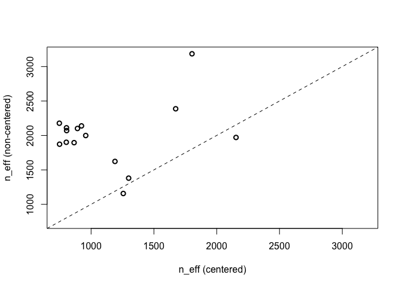<!-- -->

## Posterior predictive checks

``` r
post <- extract.samples(m.2.1)
```

``` r
plot(NULL, xlim=c(0,10), ylim=c(0,2),
     xlab="distance (thousand km)", ylab="covariance")
x_seq <- seq(from=0, to=10, length.out=100)
pmcov <- sapply(X=x_seq, FUN=function(x){post$etasq*exp(-post$rhosq*x^2)})
pmcov_mu <- apply(pmcov,2,mean)
lines(x_seq, pmcov_mu, lwd=2, col=col.alpha(rangi2,1))

for(i in 1:50){
  curve(post$etasq[i]*exp(-post$rhosq[i]*x^2),add=TRUE,col=col.alpha("black",0.1))
}
```

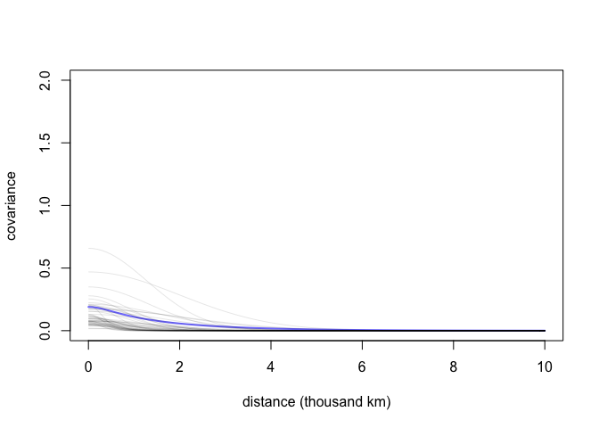<!-- -->

We’ll construct a correlation matrix between societies

``` r
K <- matrix(0,nrow=10,ncol=10)
for(i in 1:10){
  for(j in 1:10){
    K[i,j] <- median(post$etasq)*exp(-median(post$rhosq)*islandsDistMatrix[i,j]^2)
  }
}
diag(K) <- median(post$etasq) + 0.01
```

``` r
Rho <- round(cov2cor(K),2)
colnames(Rho) <- c("Ml","Ti","SC","Ya","Fi","Tr","Ch","Mn","To","Ha")
rownames(Rho) <- colnames(Rho)
Rho
```

    ##      Ml   Ti   SC   Ya   Fi   Tr   Ch   Mn   To Ha
    ## Ml 1.00 0.79 0.69 0.00 0.30 0.04 0.00 0.00 0.07  0
    ## Ti 0.79 1.00 0.87 0.00 0.30 0.05 0.00 0.00 0.05  0
    ## SC 0.69 0.87 1.00 0.00 0.16 0.11 0.01 0.02 0.02  0
    ## Ya 0.00 0.00 0.00 1.00 0.00 0.01 0.15 0.13 0.00  0
    ## Fi 0.30 0.30 0.16 0.00 1.00 0.00 0.00 0.00 0.60  0
    ## Tr 0.04 0.05 0.11 0.01 0.00 1.00 0.08 0.54 0.00  0
    ## Ch 0.00 0.00 0.01 0.15 0.00 0.08 1.00 0.31 0.00  0
    ## Mn 0.00 0.00 0.02 0.13 0.00 0.54 0.31 1.00 0.00  0
    ## To 0.07 0.05 0.02 0.00 0.60 0.00 0.00 0.00 1.00  0
    ## Ha 0.00 0.00 0.00 0.00 0.00 0.00 0.00 0.00 0.00  1

``` r
psize <- d$logpop/max(d$logpop)
psize <- exp(psize*1.5)-2
```

``` r
plot(d$lon2, d$lat,xlab="longtitude",ylab="latitude",
     col=rangi2,cex=psize,pch=16,xlim=c(-50,30),bty="l")
labels <- as.character(d$culture)
text(d$lon2,d$lat,labels=labels,cex=0.7,pos=c(2,4,3,3,4,1,3,2,4,2))
for(i in 1:10){
  for(j in 1:10){
    if(i<j){
      lines(x=c(d$lon2[i],d$lon2[j]),y=c(d$lat[i],d$lat[j]),
            lwd=2, col=col.alpha("black",alpha=Rho[i,j]^2))
    }
  }
}
```

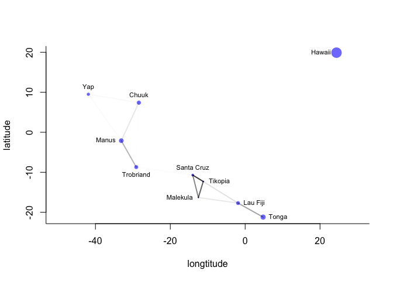<!-- -->

``` r
# Compare the simultaneous relationship between tools and log population
logpop.seq <- seq(from=6,to=14,length.out=30)
lambda <- sapply(logpop.seq,function(lp){
  exp(post$a + post$b*lp)
})
lambda.median <- apply(lambda,2,median)
lambda.pi <- apply(lambda,2,PI,prob=0.8)
```

``` r
plot(NULL,xlim=range(d$logpop),ylim=range(d$total_tools),
     xlab="log population", ylab="total tools",bty="l")
points(d$logpop,d$total_tools,col=rangi2,cex=psize,pch=16)
text(d$logpop,d$total_tools,labels=labels,cex=0.7,pos=c(4,3,4,2,2,1,4,4,4,2))

lines(logpop.seq, lambda.median, lty=2)
lines(logpop.seq, lambda.pi[1,], lty=2)
lines(logpop.seq, lambda.pi[2,], lty=2)
for(i in 1:10){
  for(j in 1:10){
    if(i<j){
      lines(x=c(d$logpop[i],d$logpop[j]),y=c(d$total_tools[i],d$total_tools[j]),
            lwd=2, col=col.alpha("black",alpha=Rho[i,j]^2))
    }
  }
}
```

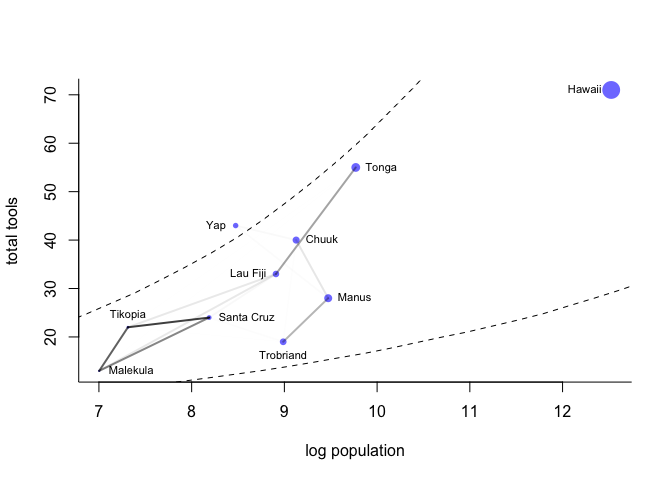<!-- -->
