Milk
================

# Instalation

``` r
rm(list=ls())
```

``` r
library(MASS)
library(rstan)
library(shape)
library(tidyr)
require(visdat)
library(ggplot2)
library(dagitty)
library(gtools)
library(ellipse)
library(tidyverse)
library(rethinking)
```

``` r
options(mc.cores = parallel::detectCores())
rstan_options(auto_write = TRUE)
```

# Load data

The research question is which factors causaly impact the energy content
of milk, measured by kilocarlories

``` r
data(milk)
d <- milk
str(d)
```

    ## 'data.frame':    29 obs. of  8 variables:
    ##  $ clade         : Factor w/ 4 levels "Ape","New World Monkey",..: 4 4 4 4 4 2 2 2 2 2 ...
    ##  $ species       : Factor w/ 29 levels "A palliata","Alouatta seniculus",..: 11 8 9 10 16 2 1 6 28 27 ...
    ##  $ kcal.per.g    : num  0.49 0.51 0.46 0.48 0.6 0.47 0.56 0.89 0.91 0.92 ...
    ##  $ perc.fat      : num  16.6 19.3 14.1 14.9 27.3 ...
    ##  $ perc.protein  : num  15.4 16.9 16.9 13.2 19.5 ...
    ##  $ perc.lactose  : num  68 63.8 69 71.9 53.2 ...
    ##  $ mass          : num  1.95 2.09 2.51 1.62 2.19 5.25 5.37 2.51 0.71 0.68 ...
    ##  $ neocortex.perc: num  55.2 NA NA NA NA ...

``` r
d$K <- standardize(d$kcal.per.g)
d$N <- standardize(d$neocortex.perc)
d$M <- standardize(log(d$mass))
```

There are missing values in the data. Firstly, we will do a complete
case analysis. Eventually, we will analyze the way to impute these
missing values and extract information from them

``` r
vis_dat(d)
```

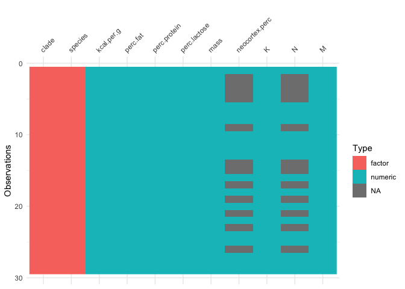<!-- -->

# 1.Mask relationship

``` r
dcc <- d[complete.cases(d$K,d$N,d$M),]
```

## Inital statistical models


## Prior predictive checks

``` r
set.seed(1)
N <- 100
a <- rnorm(N,0,1)
bN <- rnorm(N,0,1)
sigma <- rexp(N,1)
```

``` r
plot(NULL, xlim=range(dcc$N),ylim=c(-2,2),
     xlab="N (std)", ylab="K (std)")
for (i in 1:50){
  curve(a[i]+bN[i]*x, from=min(dcc$N), to=max(dcc$N), add=TRUE,
        col=col.alpha(rangi2))
}
```

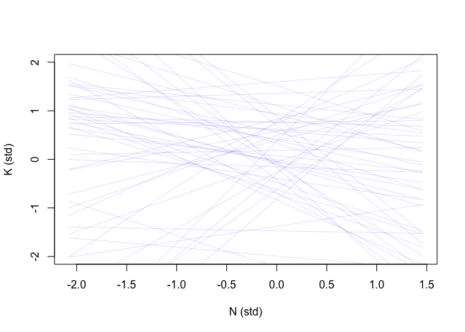<!-- -->

``` r
N.seq <- seq(from=-2, to=2, length.out=30)
sim.K <- sapply(N.seq,
                function(N){rnorm(n=length(a),mean=a+bN*N,sd=sigma)})
K.mu <- apply(sim.K,2,mean)
K.pi <- apply(sim.K,2,PI,prob=0.89)

plot(NULL, xlim=c(-2,2), ylim=c(-2,2),
     xlab="N (std)", ylab="K (std)")
lines(x=N.seq, y=K.mu)
shade(K.pi, N.seq)
```

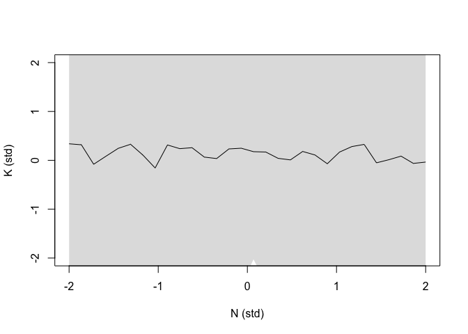<!-- -->

As we can see, the prior is very flat. We can make it stronger by
reducing the standard deviation of parameters

``` r
set.seed(2)
N <- 100
a <- rnorm(N,0,0.2)
bN <- rnorm(N,0,0.5)
sigma <- rexp(N,1)
```

``` r
plot(NULL, xlim=range(dcc$N),ylim=c(-2,2),
     xlab="N (std)", ylab="K (std)")
for (i in 1:50){
  curve(a[i]+bN[i]*x, from=min(dcc$N), to=max(dcc$N), add=TRUE,
        col=col.alpha(rangi2))
}
```

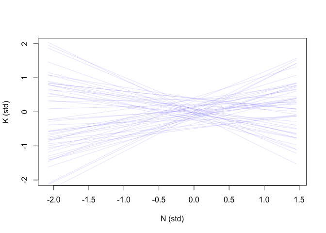<!-- -->

``` r
N.seq <- seq(from=-2, to=2, length.out=30)
sim.K <- sapply(N.seq,
                function(N){rnorm(n=length(a),mean=a+bN*N,sd=sigma)})
K.mu <- apply(sim.K,2,mean)
K.pi <- apply(sim.K,2,PI,prob=0.89)

plot(NULL, xlim=c(-2,2), ylim=c(-2,2),
     xlab="N (std)", ylab="K (std)")
lines(x=N.seq, y=K.mu)
shade(K.pi, N.seq)
```

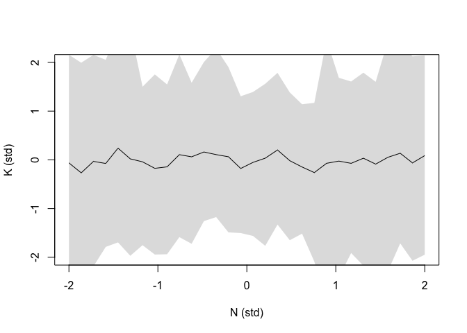<!-- -->

## Updated statistical models


``` r
dlist <- list(
  N = dcc$N,
  K = dcc$K,
  M = dcc$M,
  L = nrow(dcc)
)
```

``` r
code_m1.1 <- "
data{
  int L;
  vector[L] N;
  vector[L] M;
  vector[L] K;
}
parameters{
  real a;
  real bN;
  real<lower=0> sigma;
}
model{
  vector[L] mu;
  sigma ~ exponential(1);
  a ~ normal(0,0.2);
  bN ~ normal(0,0.5);
  for(i in 1:L){
    mu[i] = a + bN*N[i];
  }
  K ~ normal(mu, sigma);
}
generated quantities{
  vector[L] log_lik;
  vector[L] mu;
  for(i in 1:L){
    mu[i] = a + bN*N[i];
  }
  for(i in 1:L){
    log_lik[i] = normal_lpdf(K[i]|mu, sigma);
  }
}
"
```

``` r
m.1.1 <- stan(model_code=code_m1.1, data=dlist, chains=4, cores=4)
```

    ## Running /Library/Frameworks/R.framework/Resources/bin/R CMD SHLIB foo.c
    ## clang -mmacosx-version-min=10.13 -I"/Library/Frameworks/R.framework/Resources/include" -DNDEBUG   -I"/Library/Frameworks/R.framework/Versions/4.1/Resources/library/Rcpp/include/"  -I"/Library/Frameworks/R.framework/Versions/4.1/Resources/library/RcppEigen/include/"  -I"/Library/Frameworks/R.framework/Versions/4.1/Resources/library/RcppEigen/include/unsupported"  -I"/Library/Frameworks/R.framework/Versions/4.1/Resources/library/BH/include" -I"/Library/Frameworks/R.framework/Versions/4.1/Resources/library/StanHeaders/include/src/"  -I"/Library/Frameworks/R.framework/Versions/4.1/Resources/library/StanHeaders/include/"  -I"/Library/Frameworks/R.framework/Versions/4.1/Resources/library/RcppParallel/include/"  -I"/Library/Frameworks/R.framework/Versions/4.1/Resources/library/rstan/include" -DEIGEN_NO_DEBUG  -DBOOST_DISABLE_ASSERTS  -DBOOST_PENDING_INTEGER_LOG2_HPP  -DSTAN_THREADS  -DBOOST_NO_AUTO_PTR  -include '/Library/Frameworks/R.framework/Versions/4.1/Resources/library/StanHeaders/include/stan/math/prim/mat/fun/Eigen.hpp'  -D_REENTRANT -DRCPP_PARALLEL_USE_TBB=1   -I/usr/local/include   -fPIC  -Wall -g -O2  -c foo.c -o foo.o
    ## In file included from <built-in>:1:
    ## In file included from /Library/Frameworks/R.framework/Versions/4.1/Resources/library/StanHeaders/include/stan/math/prim/mat/fun/Eigen.hpp:13:
    ## In file included from /Library/Frameworks/R.framework/Versions/4.1/Resources/library/RcppEigen/include/Eigen/Dense:1:
    ## In file included from /Library/Frameworks/R.framework/Versions/4.1/Resources/library/RcppEigen/include/Eigen/Core:88:
    ## /Library/Frameworks/R.framework/Versions/4.1/Resources/library/RcppEigen/include/Eigen/src/Core/util/Macros.h:628:1: error: unknown type name 'namespace'
    ## namespace Eigen {
    ## ^
    ## /Library/Frameworks/R.framework/Versions/4.1/Resources/library/RcppEigen/include/Eigen/src/Core/util/Macros.h:628:16: error: expected ';' after top level declarator
    ## namespace Eigen {
    ##                ^
    ##                ;
    ## In file included from <built-in>:1:
    ## In file included from /Library/Frameworks/R.framework/Versions/4.1/Resources/library/StanHeaders/include/stan/math/prim/mat/fun/Eigen.hpp:13:
    ## In file included from /Library/Frameworks/R.framework/Versions/4.1/Resources/library/RcppEigen/include/Eigen/Dense:1:
    ## /Library/Frameworks/R.framework/Versions/4.1/Resources/library/RcppEigen/include/Eigen/Core:96:10: fatal error: 'complex' file not found
    ## #include <complex>
    ##          ^~~~~~~~~
    ## 3 errors generated.
    ## make: *** [foo.o] Error 1

``` r
precis(m.1.1)
```

    ##             mean        sd       5.5%     94.5%    n_eff     Rhat4
    ## a     0.03497464 0.1599302 -0.2228192 0.2868095 3202.250 0.9995401
    ## bN    0.12919428 0.2389835 -0.2471782 0.5082640 3538.301 1.0000517
    ## sigma 1.10865654 0.2018355  0.8328130 1.4594292 3700.925 0.9993898

The model outcome shows no association between N and K. Let’s try with
another predictor variable, M

``` r
code_m1.2 <- "
data{
  int L;
  vector[L] N;
  vector[L] M;
  vector[L] K;
}
parameters{
  real a;
  real bM;
  real<lower=0> sigma;
}
model{
  vector[L] mu;
  sigma ~ exponential(1);
  a ~ normal(0,0.2);
  bM ~ normal(0,0.5);
  for(i in 1:L){
    mu[i] = a + bM*M[i];
  }
  K ~ normal(mu, sigma);
}
generated quantities{
  vector[L] log_lik;
  vector[L] mu;
  for(i in 1:L){
    mu[i] = a + bM*M[i];
  }
  for(i in 1:L){
    log_lik[i] = normal_lpdf(K[i]|mu, sigma);
  }
}
"
```

``` r
m.1.2 <- stan(model_code=code_m1.2, data=dlist, chains=4, cores=4)
```

    ## Running /Library/Frameworks/R.framework/Resources/bin/R CMD SHLIB foo.c
    ## clang -mmacosx-version-min=10.13 -I"/Library/Frameworks/R.framework/Resources/include" -DNDEBUG   -I"/Library/Frameworks/R.framework/Versions/4.1/Resources/library/Rcpp/include/"  -I"/Library/Frameworks/R.framework/Versions/4.1/Resources/library/RcppEigen/include/"  -I"/Library/Frameworks/R.framework/Versions/4.1/Resources/library/RcppEigen/include/unsupported"  -I"/Library/Frameworks/R.framework/Versions/4.1/Resources/library/BH/include" -I"/Library/Frameworks/R.framework/Versions/4.1/Resources/library/StanHeaders/include/src/"  -I"/Library/Frameworks/R.framework/Versions/4.1/Resources/library/StanHeaders/include/"  -I"/Library/Frameworks/R.framework/Versions/4.1/Resources/library/RcppParallel/include/"  -I"/Library/Frameworks/R.framework/Versions/4.1/Resources/library/rstan/include" -DEIGEN_NO_DEBUG  -DBOOST_DISABLE_ASSERTS  -DBOOST_PENDING_INTEGER_LOG2_HPP  -DSTAN_THREADS  -DBOOST_NO_AUTO_PTR  -include '/Library/Frameworks/R.framework/Versions/4.1/Resources/library/StanHeaders/include/stan/math/prim/mat/fun/Eigen.hpp'  -D_REENTRANT -DRCPP_PARALLEL_USE_TBB=1   -I/usr/local/include   -fPIC  -Wall -g -O2  -c foo.c -o foo.o
    ## In file included from <built-in>:1:
    ## In file included from /Library/Frameworks/R.framework/Versions/4.1/Resources/library/StanHeaders/include/stan/math/prim/mat/fun/Eigen.hpp:13:
    ## In file included from /Library/Frameworks/R.framework/Versions/4.1/Resources/library/RcppEigen/include/Eigen/Dense:1:
    ## In file included from /Library/Frameworks/R.framework/Versions/4.1/Resources/library/RcppEigen/include/Eigen/Core:88:
    ## /Library/Frameworks/R.framework/Versions/4.1/Resources/library/RcppEigen/include/Eigen/src/Core/util/Macros.h:628:1: error: unknown type name 'namespace'
    ## namespace Eigen {
    ## ^
    ## /Library/Frameworks/R.framework/Versions/4.1/Resources/library/RcppEigen/include/Eigen/src/Core/util/Macros.h:628:16: error: expected ';' after top level declarator
    ## namespace Eigen {
    ##                ^
    ##                ;
    ## In file included from <built-in>:1:
    ## In file included from /Library/Frameworks/R.framework/Versions/4.1/Resources/library/StanHeaders/include/stan/math/prim/mat/fun/Eigen.hpp:13:
    ## In file included from /Library/Frameworks/R.framework/Versions/4.1/Resources/library/RcppEigen/include/Eigen/Dense:1:
    ## /Library/Frameworks/R.framework/Versions/4.1/Resources/library/RcppEigen/include/Eigen/Core:96:10: fatal error: 'complex' file not found
    ## #include <complex>
    ##          ^~~~~~~~~
    ## 3 errors generated.
    ## make: *** [foo.o] Error 1

``` r
precis(m.1.2)
```

    ##              mean        sd       5.5%      94.5%    n_eff     Rhat4
    ## a      0.04375792 0.1579875 -0.2068663 0.29808489 4086.426 1.0000638
    ## bM    -0.27569300 0.2101387 -0.5982999 0.06197646 3289.343 0.9993747
    ## sigma  1.05516646 0.1922691  0.7977089 1.39747163 3214.548 0.9998300

Again, there is no significant association between M and K. One more try
is to include both M and N as predictor variables for K

``` r
code_m1.3 <- "
data{
  int L;
  vector[L] N;
  vector[L] M;
  vector[L] K;
}
parameters{
  real a;
  real bM;
  real bN;
  real<lower=0> sigma;
}
model{
  vector[L] mu;
  sigma ~ exponential(1);
  a ~ normal(0,0.2);
  bM ~ normal(0,0.5);
  bN ~ normal(0,0.5);
  for(i in 1:L){
    mu[i] = a + bM*M[i] + bN*N[i];
  }
  K ~ normal(mu, sigma);
}
generated quantities{
  vector[L] log_lik;
  vector[L] mu;
  for(i in 1:L){
    mu[i] = a + bM*M[i] + bN*N[i];
  }
  for(i in 1:L){
    log_lik[i] = normal_lpdf(K[i]|mu, sigma);
  }
}
"
```

``` r
m.1.3 <- stan(model_code=code_m1.3, data=dlist, chains=4, cores=4)
```

    ## Running /Library/Frameworks/R.framework/Resources/bin/R CMD SHLIB foo.c
    ## clang -mmacosx-version-min=10.13 -I"/Library/Frameworks/R.framework/Resources/include" -DNDEBUG   -I"/Library/Frameworks/R.framework/Versions/4.1/Resources/library/Rcpp/include/"  -I"/Library/Frameworks/R.framework/Versions/4.1/Resources/library/RcppEigen/include/"  -I"/Library/Frameworks/R.framework/Versions/4.1/Resources/library/RcppEigen/include/unsupported"  -I"/Library/Frameworks/R.framework/Versions/4.1/Resources/library/BH/include" -I"/Library/Frameworks/R.framework/Versions/4.1/Resources/library/StanHeaders/include/src/"  -I"/Library/Frameworks/R.framework/Versions/4.1/Resources/library/StanHeaders/include/"  -I"/Library/Frameworks/R.framework/Versions/4.1/Resources/library/RcppParallel/include/"  -I"/Library/Frameworks/R.framework/Versions/4.1/Resources/library/rstan/include" -DEIGEN_NO_DEBUG  -DBOOST_DISABLE_ASSERTS  -DBOOST_PENDING_INTEGER_LOG2_HPP  -DSTAN_THREADS  -DBOOST_NO_AUTO_PTR  -include '/Library/Frameworks/R.framework/Versions/4.1/Resources/library/StanHeaders/include/stan/math/prim/mat/fun/Eigen.hpp'  -D_REENTRANT -DRCPP_PARALLEL_USE_TBB=1   -I/usr/local/include   -fPIC  -Wall -g -O2  -c foo.c -o foo.o
    ## In file included from <built-in>:1:
    ## In file included from /Library/Frameworks/R.framework/Versions/4.1/Resources/library/StanHeaders/include/stan/math/prim/mat/fun/Eigen.hpp:13:
    ## In file included from /Library/Frameworks/R.framework/Versions/4.1/Resources/library/RcppEigen/include/Eigen/Dense:1:
    ## In file included from /Library/Frameworks/R.framework/Versions/4.1/Resources/library/RcppEigen/include/Eigen/Core:88:
    ## /Library/Frameworks/R.framework/Versions/4.1/Resources/library/RcppEigen/include/Eigen/src/Core/util/Macros.h:628:1: error: unknown type name 'namespace'
    ## namespace Eigen {
    ## ^
    ## /Library/Frameworks/R.framework/Versions/4.1/Resources/library/RcppEigen/include/Eigen/src/Core/util/Macros.h:628:16: error: expected ';' after top level declarator
    ## namespace Eigen {
    ##                ^
    ##                ;
    ## In file included from <built-in>:1:
    ## In file included from /Library/Frameworks/R.framework/Versions/4.1/Resources/library/StanHeaders/include/stan/math/prim/mat/fun/Eigen.hpp:13:
    ## In file included from /Library/Frameworks/R.framework/Versions/4.1/Resources/library/RcppEigen/include/Eigen/Dense:1:
    ## /Library/Frameworks/R.framework/Versions/4.1/Resources/library/RcppEigen/include/Eigen/Core:96:10: fatal error: 'complex' file not found
    ## #include <complex>
    ##          ^~~~~~~~~
    ## 3 errors generated.
    ## make: *** [foo.o] Error 1

``` r
precis(m.1.3)
```

    ##             mean        sd       5.5%      94.5%    n_eff     Rhat4
    ## a      0.0623109 0.1403483 -0.1633629  0.2797350 3470.564 1.0000709
    ## bM    -0.6444420 0.2449623 -1.0223184 -0.2385051 2554.643 1.0010821
    ## bN     0.6111732 0.2765355  0.1422797  1.0410699 2520.003 1.0000405
    ## sigma  0.8624833 0.1777322  0.6286594  1.1664293 2604.926 0.9996264

``` r
# plot(coeftab(m.1.1, m.1.2, m.1.3), pars=c("bM", "bN"))
```

The outcome is contrast to the previous ones as both M and N have
significant association with K, but in the opposite ways. The reasonable
explanation is that M and N are correlated with the outcome variables,
but one is positive correlated with it and the other is negatively
correlated with it

## DAG and counterfactual plots

Given the data alone, it is hard to draw a causal diagram. Let’s try
with one diagram below

``` r
dag1.1 <- dagitty("dag{
                  U [unobserved]
                  M -> K
                  M <- U -> N
                  N -> K
}")
coordinates(dag1.1) <- list(x=c(M=0,K=1,U=1,N=2),
                            y=c(M=0,K=1,U=0,N=0))
drawdag(dag1.1)
```

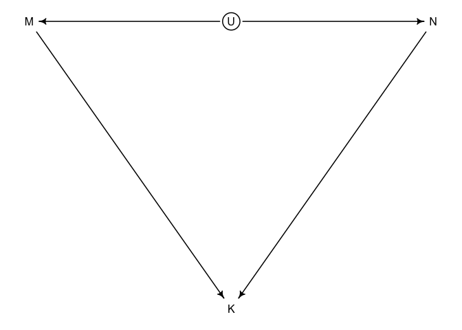<!-- --> Now, we can
make counter-factual plots

``` r
post1.3 <- extract.samples(m.1.3)
N <- 0
M.seq = seq(from=min(dcc$M)-0.15, to=max(dcc$M)+0.15, length.out=30)
mu <- matrix(0,nrow=length(post1.3$a), ncol=30)
for(i in 1:30){mu[,i] = post1.3$a + post1.3$bM*M.seq[i] + post1.3$bN*N}
# mu <- link(m1.3, data=data.frame(M=M.seq, N=0))
mu.mean <- apply(mu,2,mean)
mu.pi <- apply(mu,2,PI,prob=0.89)
```

``` r
plot(NULL, xlim=range(dcc$M), ylim=range(dcc$K),
     xlab="M (std)", ylab="K (std)")
lines(x=M.seq, y=mu.mean, lwd=2)
shade(mu.pi, M.seq)
mtext("Counterfactural holding N=0")
```

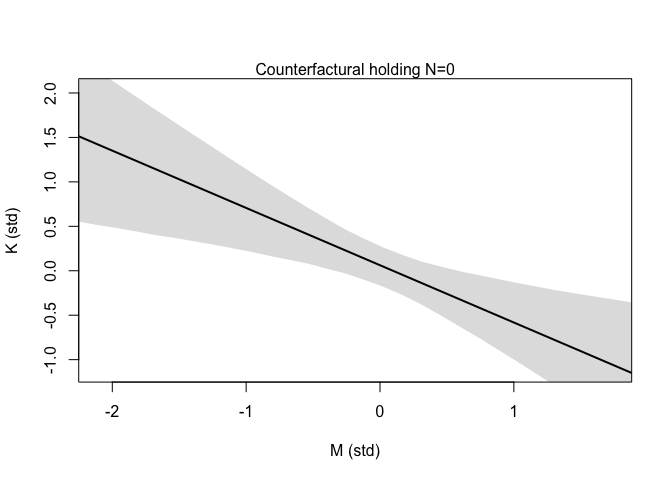<!-- -->

``` r
M <- 0
N.seq = seq(from=min(dcc$N)-0.15, to=max(dcc$N)+0.15, length.out=30)
mu <- matrix(0,nrow=length(post1.3$a), ncol=30)
for(i in 1:30){mu[,i] = post1.3$a + post1.3$bM*M + post1.3$bN*N.seq[i]}

mu.mean <- apply(mu,2,mean)
mu.pi <- apply(mu,2,PI,prob=0.89)
```

``` r
plot(NULL, xlim=range(dcc$N), ylim=range(dcc$K),
     xlab="N (std)", ylab="K (std)")
lines(x=N.seq, y=mu.mean, lwd=2)
shade(mu.pi, N.seq)
mtext("Counterfactural holding N=0")
```

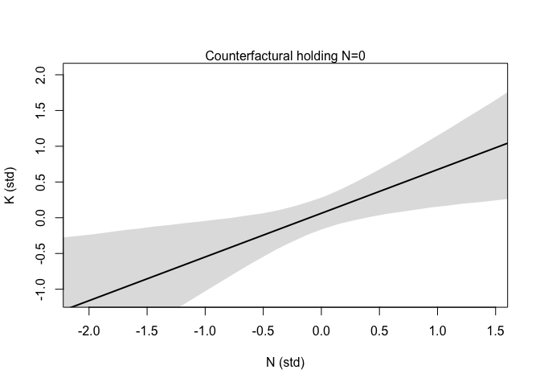<!-- -->

# 2.Imputation

In the original data set, there are 12 missing values in N. Previously,
dropping such rows with missing values left us with only 17 cases to
work with. In this section, we will try to impute these missing values
and extract information from them

## DAGs

We are going to draw a DAG that contains our assumption about the cause
of missing value of N. The simple DAG below implies of a missing
completely at random as nothing influences Rb

``` r
dag1.2 <- dagitty("dag{
                  B [unobserved]
                  U [unobserved]
                  M->K<-B
                  M<-U->B
                  Rb->B_obs<-B
}")
coordinates(dag1.2) <- list(x=c(M=0,K=1,U=1,Rb=1,B=2,B_obs=2),
                            y=c(M=0,K=1,U=0,Rb=-1,B=0,B_obs=-1))
drawdag(dag1.2)
```

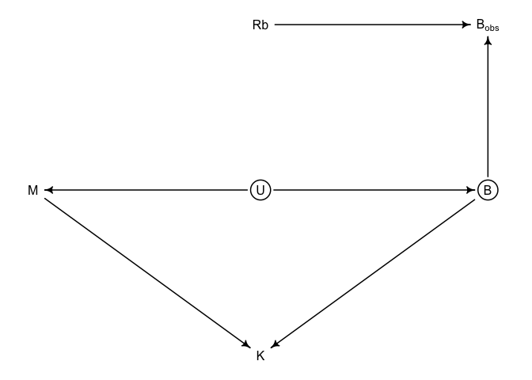<!-- -->

## Initial statistical models


## Prior predictive checks

``` r
set.seed(3)
N <- 100
a <- rnorm(N,0,0.5)
bN <- rnorm(N,0,0.5)
bM <- rnorm(N,0,0.5)
nu <- rnorm(N,0.5,1)
sigmaN <- rexp(N,1)
N.var <- rnorm(N,nu,sigmaN)
```

``` r
plot(NULL, xlim=range(M), ylim=c(-2,2),
     xlab="M (std)", ylab="K (std)")
for(i in 1:50){
  curve(a[i] + bN[i]*N.var[i] + bM[i]*x, from=min(dcc$M), to=max(dcc$M), add=TRUE,col=rangi2)
}
```

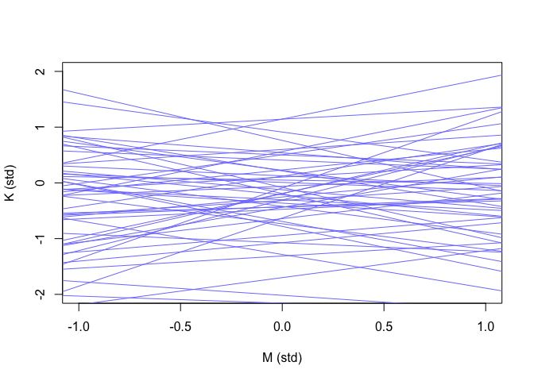<!-- -->

## Fit the model

``` r
d$neocortex.prop <- d$neocortex.perc/100
dlist2 <- list(
  N = ifelse(is.na(standardize(d$neocortex.prop)),-1,standardize(d$neocortex.prop)),
  K = d$K,
  M = d$M,
  L = nrow(d),
  L_miss = sum(apply(d, 1, anyNA)),
  N_missidx = unique(which(is.na(d), arr.ind=TRUE)[,1])
)
```

``` r
code_m2.1 <- "
functions{
  vector merge_missing(int[] miss_indexes, vector x_obs, vector x_miss){
    int N = dims(x_obs)[1];
    int N_miss = dims(x_miss)[1];
    vector[N] merged;
    merged = x_obs;
    for(i in 1:N_miss) merged[miss_indexes[i]] = x_miss[i];
    return merged;
  }
}
data{
  int L;
  int L_miss;
  vector[L] N;
  vector[L] K;
  vector[L] M;
  int N_missidx[L_miss];
}
parameters{
  real a;
  real bN;
  real bM;
  real nu;
  real<lower=0> sigma;
  real<lower=0> sigma_N;
  vector[L_miss] N_impute;
}
model{
  vector[L] mu;
  vector[L] N_merge;
  sigma_N ~ exponential(1);
  sigma ~ exponential(1);
  bN ~ normal(0,0.5);
  bM ~ normal(0,0.5);
  a ~ normal(0,0.5);
  nu ~ normal(0,0.5);
  
  N_merge = merge_missing(N_missidx, to_vector(N), N_impute);
  N_merge ~ normal(nu, sigma_N);
  
  for(i in 1:L){
    mu[i] = a + bN*N_merge[i] + bM*M[i];
  }
  K ~ normal(mu, sigma);
}
generated quantities{
  vector[L] mu;
  vector[L] log_lik;
  vector[L] N_merge;
  
  N_merge = merge_missing(N_missidx, to_vector(N), N_impute);
  
  for(i in 1:L){
    mu[i] = a + bN*N_merge[i] + bM*M[i];
  }
  for(i in 1:L){
    log_lik[i] = normal_lpdf(K[i] | mu[i], sigma);
  }
}
"
```

``` r
m.2.1 <- stan(model_code=code_m2.1, data=dlist2, chains=4, cores=4)
```

    ## Running /Library/Frameworks/R.framework/Resources/bin/R CMD SHLIB foo.c
    ## clang -mmacosx-version-min=10.13 -I"/Library/Frameworks/R.framework/Resources/include" -DNDEBUG   -I"/Library/Frameworks/R.framework/Versions/4.1/Resources/library/Rcpp/include/"  -I"/Library/Frameworks/R.framework/Versions/4.1/Resources/library/RcppEigen/include/"  -I"/Library/Frameworks/R.framework/Versions/4.1/Resources/library/RcppEigen/include/unsupported"  -I"/Library/Frameworks/R.framework/Versions/4.1/Resources/library/BH/include" -I"/Library/Frameworks/R.framework/Versions/4.1/Resources/library/StanHeaders/include/src/"  -I"/Library/Frameworks/R.framework/Versions/4.1/Resources/library/StanHeaders/include/"  -I"/Library/Frameworks/R.framework/Versions/4.1/Resources/library/RcppParallel/include/"  -I"/Library/Frameworks/R.framework/Versions/4.1/Resources/library/rstan/include" -DEIGEN_NO_DEBUG  -DBOOST_DISABLE_ASSERTS  -DBOOST_PENDING_INTEGER_LOG2_HPP  -DSTAN_THREADS  -DBOOST_NO_AUTO_PTR  -include '/Library/Frameworks/R.framework/Versions/4.1/Resources/library/StanHeaders/include/stan/math/prim/mat/fun/Eigen.hpp'  -D_REENTRANT -DRCPP_PARALLEL_USE_TBB=1   -I/usr/local/include   -fPIC  -Wall -g -O2  -c foo.c -o foo.o
    ## In file included from <built-in>:1:
    ## In file included from /Library/Frameworks/R.framework/Versions/4.1/Resources/library/StanHeaders/include/stan/math/prim/mat/fun/Eigen.hpp:13:
    ## In file included from /Library/Frameworks/R.framework/Versions/4.1/Resources/library/RcppEigen/include/Eigen/Dense:1:
    ## In file included from /Library/Frameworks/R.framework/Versions/4.1/Resources/library/RcppEigen/include/Eigen/Core:88:
    ## /Library/Frameworks/R.framework/Versions/4.1/Resources/library/RcppEigen/include/Eigen/src/Core/util/Macros.h:628:1: error: unknown type name 'namespace'
    ## namespace Eigen {
    ## ^
    ## /Library/Frameworks/R.framework/Versions/4.1/Resources/library/RcppEigen/include/Eigen/src/Core/util/Macros.h:628:16: error: expected ';' after top level declarator
    ## namespace Eigen {
    ##                ^
    ##                ;
    ## In file included from <built-in>:1:
    ## In file included from /Library/Frameworks/R.framework/Versions/4.1/Resources/library/StanHeaders/include/stan/math/prim/mat/fun/Eigen.hpp:13:
    ## In file included from /Library/Frameworks/R.framework/Versions/4.1/Resources/library/RcppEigen/include/Eigen/Dense:1:
    ## /Library/Frameworks/R.framework/Versions/4.1/Resources/library/RcppEigen/include/Eigen/Core:96:10: fatal error: 'complex' file not found
    ## #include <complex>
    ##          ^~~~~~~~~
    ## 3 errors generated.
    ## make: *** [foo.o] Error 1

``` r
precis(m.2.1)
```

    ##                mean        sd        5.5%      94.5%    n_eff     Rhat4
    ## a        0.02701524 0.1653233 -0.23288946  0.2905782 3422.606 0.9997071
    ## bN       0.48919069 0.2402840  0.08184544  0.8625686 1549.377 1.0012554
    ## bM      -0.54084502 0.2068836 -0.86340773 -0.1971515 1953.079 1.0002673
    ## nu      -0.04784584 0.2106990 -0.38250944  0.2855038 2703.622 1.0009150
    ## sigma    0.84897341 0.1414178  0.64639351  1.0922070 1826.806 1.0013371
    ## sigma_N  1.01666646 0.1744624  0.77592907  1.3295539 2318.344 1.0014089

## Posterior predictive checks

``` r
post <- extract.samples(m.2.1)
N.impute.mu <- apply(post$N_impute,2,mean)
N.impute.pi <- apply(post$N_impute, 2, PI, prob=0.89)
```

``` r
plot(NULL, xlim=c(-2,2), ylim=range(dlist2$K),
     col=rangi2, xlab="N (std)", ylab="K (std)")
points(x=d$N, y=d$K, col=rangi2, pch=16)
miss.idx <- unique(which(is.na(d), arr.ind=TRUE)[,1])
Ki <- dlist2$K[miss.idx]
points(N.impute.mu, Ki)
for(i in 1:12){
  lines(x=N.impute.pi[,i],y=rep(Ki[i],2))
}
```

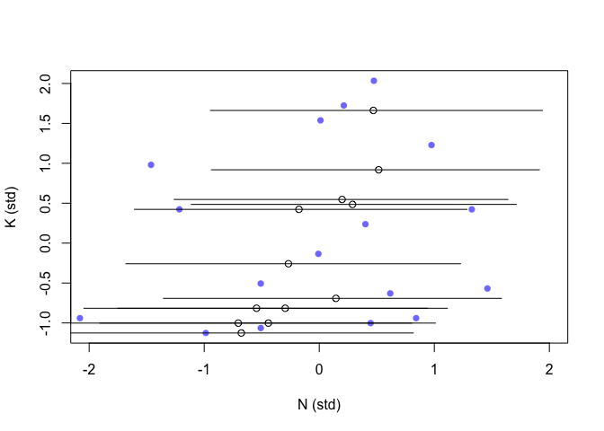<!-- -->

``` r
plot(NULL, xlim=c(-2,2), ylim=c(-2,2),
     xlab="M (std)", ylab="N (std)")
points(x=d$M, y=d$N, col=rangi2, pch=16)
miss.idx <- unique(which(is.na(d), arr.ind=TRUE)[,1])
Mi <- dlist2$M[miss.idx]
points(y=N.impute.mu,x=Mi)
for(i in 1:12){
  lines(x=rep(Mi[i],2), y=N.impute.pi[,i])
}
```

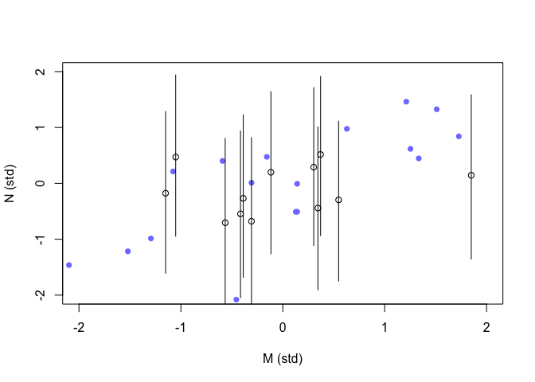<!-- -->

One thing we learn from these two charts is that the imputed values do
not fit well into the variables’ association caused by observed data
points. We expect to improve the imputation by encoding the information
of relationship between M and N into the imputing process

## Updated statistical models


``` r
code_m2.2 <- "
functions{
  vector merge_missing(int[] miss_indexes, vector x_obs, vector x_miss){
    int N = dims(x_obs)[1];
    int N_miss = dims(x_miss)[1];
    vector[N] merged;
    merged = x_obs;
    for(i in 1:N_miss) merged[miss_indexes[i]] = x_miss[i];
    return merged;
  }
}
data{
  int L;
  int L_miss;
  vector[L] N;
  vector[L] K;
  vector[L] M;
  int N_missidx[L_miss];
}
parameters{
  real muM;
  real muN;
  real a;
  real bN;
  real bM;
  real<lower=0> sigma;
  corr_matrix[2] Rho_NM;
  vector<lower=0>[2] Sigma_NM;
  vector[L_miss] N_impute;
}
model{
  vector[L] mu;
  matrix[L,2] MN;
  vector[L] N_merge;
  Sigma_NM ~ exponential(1);
  Rho_NM ~ lkj_corr(2);
  sigma ~ exponential(1);
  bN ~ normal(0,0.5);
  bM ~ normal(0,0.5);
  a ~ normal(0,0.5);
  muM ~ normal(0,0.5);
  muN ~ normal(0,0.5);
  
  N_merge = merge_missing(N_missidx, to_vector(N), N_impute);
  MN = append_col(M, N_merge);
  {
  vector[2] MU;
  MU = [muM, muN]';
  for(i in 1:L) MN[i,:] ~ multi_normal(MU, quad_form_diag(Rho_NM, Sigma_NM));
  }
  for(i in 1:L){
    mu[i] = a + bN*N_merge[i] + bM*M[i];
  }
  K ~ normal(mu, sigma);
}
generated quantities{
  vector[L] mu;
  vector[L] log_lik;
  vector[L] N_merge;
  matrix[L,2] MN;
  
  N_merge = merge_missing(N_missidx, to_vector(N), N_impute);
  MN = append_col(M, N_merge);
  for(i in 1:L){
    mu[i] = a + bN*N_merge[i] + bM*M[i];
  }
  for(i in 1:L){
    log_lik[i] = normal_lpdf(K[i] | mu[i], sigma);
  }
}
"
```

``` r
m.2.2 <- stan(model_code=code_m2.2, data=dlist2, chains=4, cores=4)
```

    ## Running /Library/Frameworks/R.framework/Resources/bin/R CMD SHLIB foo.c
    ## clang -mmacosx-version-min=10.13 -I"/Library/Frameworks/R.framework/Resources/include" -DNDEBUG   -I"/Library/Frameworks/R.framework/Versions/4.1/Resources/library/Rcpp/include/"  -I"/Library/Frameworks/R.framework/Versions/4.1/Resources/library/RcppEigen/include/"  -I"/Library/Frameworks/R.framework/Versions/4.1/Resources/library/RcppEigen/include/unsupported"  -I"/Library/Frameworks/R.framework/Versions/4.1/Resources/library/BH/include" -I"/Library/Frameworks/R.framework/Versions/4.1/Resources/library/StanHeaders/include/src/"  -I"/Library/Frameworks/R.framework/Versions/4.1/Resources/library/StanHeaders/include/"  -I"/Library/Frameworks/R.framework/Versions/4.1/Resources/library/RcppParallel/include/"  -I"/Library/Frameworks/R.framework/Versions/4.1/Resources/library/rstan/include" -DEIGEN_NO_DEBUG  -DBOOST_DISABLE_ASSERTS  -DBOOST_PENDING_INTEGER_LOG2_HPP  -DSTAN_THREADS  -DBOOST_NO_AUTO_PTR  -include '/Library/Frameworks/R.framework/Versions/4.1/Resources/library/StanHeaders/include/stan/math/prim/mat/fun/Eigen.hpp'  -D_REENTRANT -DRCPP_PARALLEL_USE_TBB=1   -I/usr/local/include   -fPIC  -Wall -g -O2  -c foo.c -o foo.o
    ## In file included from <built-in>:1:
    ## In file included from /Library/Frameworks/R.framework/Versions/4.1/Resources/library/StanHeaders/include/stan/math/prim/mat/fun/Eigen.hpp:13:
    ## In file included from /Library/Frameworks/R.framework/Versions/4.1/Resources/library/RcppEigen/include/Eigen/Dense:1:
    ## In file included from /Library/Frameworks/R.framework/Versions/4.1/Resources/library/RcppEigen/include/Eigen/Core:88:
    ## /Library/Frameworks/R.framework/Versions/4.1/Resources/library/RcppEigen/include/Eigen/src/Core/util/Macros.h:628:1: error: unknown type name 'namespace'
    ## namespace Eigen {
    ## ^
    ## /Library/Frameworks/R.framework/Versions/4.1/Resources/library/RcppEigen/include/Eigen/src/Core/util/Macros.h:628:16: error: expected ';' after top level declarator
    ## namespace Eigen {
    ##                ^
    ##                ;
    ## In file included from <built-in>:1:
    ## In file included from /Library/Frameworks/R.framework/Versions/4.1/Resources/library/StanHeaders/include/stan/math/prim/mat/fun/Eigen.hpp:13:
    ## In file included from /Library/Frameworks/R.framework/Versions/4.1/Resources/library/RcppEigen/include/Eigen/Dense:1:
    ## /Library/Frameworks/R.framework/Versions/4.1/Resources/library/RcppEigen/include/Eigen/Core:96:10: fatal error: 'complex' file not found
    ## #include <complex>
    ##          ^~~~~~~~~
    ## 3 errors generated.
    ## make: *** [foo.o] Error 1

``` r
precis(m.2.2)
```

    ##               mean        sd       5.5%      94.5%    n_eff     Rhat4
    ## muM    0.001394668 0.1703257 -0.2728281  0.2710349 3810.991 0.9997522
    ## muN   -0.051400606 0.1867413 -0.3513844  0.2405935 3072.803 0.9996072
    ## a      0.035313056 0.1588171 -0.2123498  0.2925529 3439.405 0.9994731
    ## bN     0.580163324 0.2583307  0.1586953  0.9669962 1794.465 1.0001298
    ## bM    -0.643348752 0.2218015 -0.9846180 -0.2793645 2120.377 1.0006465
    ## sigma  0.830637987 0.1373124  0.6334834  1.0672219 2588.045 1.0013085

``` r
post <- extract.samples(m.2.2)
N_impute_mu <- apply(post$N_impute, 2, mean)
N_impute_ci <- apply(post$N_impute, 2, PI)
```

``` r
plot(d$N, d$K, pch=16, col=rangi2,
     xlab="neucortex percent (std)",
     ylab="kcal milk (std)")

miss_idx <- unique(which(is.na(d), arr.ind=TRUE)[,1])
Ki <- d$K[miss_idx]
points(N_impute_mu, Ki)

for(i in 1:12){
  lines(N_impute_ci[,i], rep(Ki[i],2))
}
```

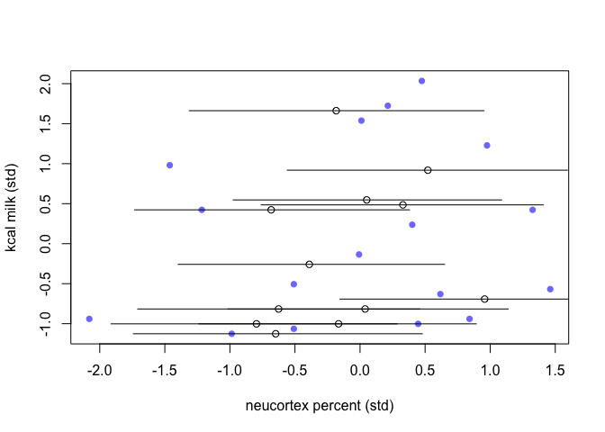<!-- -->

``` r
plot(d$M, d$N, pch=16, col=rangi2,
     ylab="neucortex percent (std)",
     xlab="log body mass (std)")

Mi <- d$M[miss_idx]
points(Mi, N_impute_mu)
for(i in 1:12){
  lines(rep(Mi[i],2), N_impute_ci[,i])
}
```

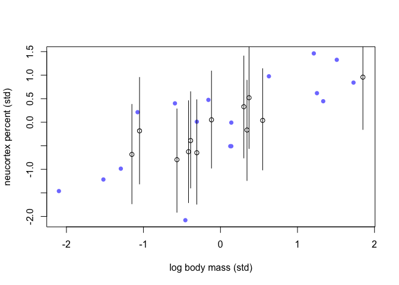<!-- --> That is what
we expected

#3. Categorical variables

We are going to analyze the difference in K between four groups covered
by the clade variable

``` r
d$clade_id <- as.integer(d$clade)
```

## Statistical models


``` r
dlist3 <- list(
  K = d$K,
  clade_id = d$clade_id,
  N = nrow(d),
  id = length(unique(d$clade_id))
)
```

``` r
code_m3.1 <- "
data{
  int N;
  int id;
  vector[N] K;
  int clade_id[N];
}
parameters{
  vector[id] a;
  real<lower=0> sigma;
}

model{
  vector[N] mu;
  sigma ~ exponential(1);
  a ~ normal(0,0.5);
  for(i in 1:N){
    mu[i] = a[clade_id[i]];
  }
  K ~ normal(mu, sigma);
}
generated quantities{
  vector[N] log_lik;
  vector[N] mu;
  for(i in 1:N){
    mu[i] = a[clade_id[i]];
  }
  for(i in 1:N) log_lik[i] = normal_lpdf(K[i] | mu[i], sigma);
}
"
```

``` r
m.3.1 <- stan(model_code=code_m3.1, data=dlist3, chains=4, cores=4)
```

    ## Running /Library/Frameworks/R.framework/Resources/bin/R CMD SHLIB foo.c
    ## clang -mmacosx-version-min=10.13 -I"/Library/Frameworks/R.framework/Resources/include" -DNDEBUG   -I"/Library/Frameworks/R.framework/Versions/4.1/Resources/library/Rcpp/include/"  -I"/Library/Frameworks/R.framework/Versions/4.1/Resources/library/RcppEigen/include/"  -I"/Library/Frameworks/R.framework/Versions/4.1/Resources/library/RcppEigen/include/unsupported"  -I"/Library/Frameworks/R.framework/Versions/4.1/Resources/library/BH/include" -I"/Library/Frameworks/R.framework/Versions/4.1/Resources/library/StanHeaders/include/src/"  -I"/Library/Frameworks/R.framework/Versions/4.1/Resources/library/StanHeaders/include/"  -I"/Library/Frameworks/R.framework/Versions/4.1/Resources/library/RcppParallel/include/"  -I"/Library/Frameworks/R.framework/Versions/4.1/Resources/library/rstan/include" -DEIGEN_NO_DEBUG  -DBOOST_DISABLE_ASSERTS  -DBOOST_PENDING_INTEGER_LOG2_HPP  -DSTAN_THREADS  -DBOOST_NO_AUTO_PTR  -include '/Library/Frameworks/R.framework/Versions/4.1/Resources/library/StanHeaders/include/stan/math/prim/mat/fun/Eigen.hpp'  -D_REENTRANT -DRCPP_PARALLEL_USE_TBB=1   -I/usr/local/include   -fPIC  -Wall -g -O2  -c foo.c -o foo.o
    ## In file included from <built-in>:1:
    ## In file included from /Library/Frameworks/R.framework/Versions/4.1/Resources/library/StanHeaders/include/stan/math/prim/mat/fun/Eigen.hpp:13:
    ## In file included from /Library/Frameworks/R.framework/Versions/4.1/Resources/library/RcppEigen/include/Eigen/Dense:1:
    ## In file included from /Library/Frameworks/R.framework/Versions/4.1/Resources/library/RcppEigen/include/Eigen/Core:88:
    ## /Library/Frameworks/R.framework/Versions/4.1/Resources/library/RcppEigen/include/Eigen/src/Core/util/Macros.h:628:1: error: unknown type name 'namespace'
    ## namespace Eigen {
    ## ^
    ## /Library/Frameworks/R.framework/Versions/4.1/Resources/library/RcppEigen/include/Eigen/src/Core/util/Macros.h:628:16: error: expected ';' after top level declarator
    ## namespace Eigen {
    ##                ^
    ##                ;
    ## In file included from <built-in>:1:
    ## In file included from /Library/Frameworks/R.framework/Versions/4.1/Resources/library/StanHeaders/include/stan/math/prim/mat/fun/Eigen.hpp:13:
    ## In file included from /Library/Frameworks/R.framework/Versions/4.1/Resources/library/RcppEigen/include/Eigen/Dense:1:
    ## /Library/Frameworks/R.framework/Versions/4.1/Resources/library/RcppEigen/include/Eigen/Core:96:10: fatal error: 'complex' file not found
    ## #include <complex>
    ##          ^~~~~~~~~
    ## 3 errors generated.
    ## make: *** [foo.o] Error 1

``` r
precis(m.3.1,2)
```

    ##              mean        sd        5.5%       94.5%    n_eff     Rhat4
    ## a[1]   -0.4629490 0.2256634 -0.82351100 -0.10251561 4910.896 1.0000313
    ## a[2]    0.3515680 0.2341897 -0.02112279  0.72388836 4920.737 0.9995296
    ## a[3]    0.6305756 0.2725968  0.19012245  1.05924513 4935.222 0.9993348
    ## a[4]   -0.5526556 0.2897404 -1.00593059 -0.09400685 4593.054 0.9994673
    ## sigma   0.7983737 0.1166929  0.63637563  1.00584163 3661.504 1.0001129
    ## mu[1]  -0.5526556 0.2897404 -1.00593059 -0.09400685 4593.054 0.9994673
    ## mu[2]  -0.5526556 0.2897404 -1.00593059 -0.09400685 4593.054 0.9994673
    ## mu[3]  -0.5526556 0.2897404 -1.00593059 -0.09400685 4593.054 0.9994673
    ## mu[4]  -0.5526556 0.2897404 -1.00593059 -0.09400685 4593.054 0.9994673
    ## mu[5]  -0.5526556 0.2897404 -1.00593059 -0.09400685 4593.054 0.9994673
    ## mu[6]   0.3515680 0.2341897 -0.02112279  0.72388836 4920.737 0.9995296
    ## mu[7]   0.3515680 0.2341897 -0.02112279  0.72388836 4920.737 0.9995296
    ## mu[8]   0.3515680 0.2341897 -0.02112279  0.72388836 4920.737 0.9995296
    ## mu[9]   0.3515680 0.2341897 -0.02112279  0.72388836 4920.737 0.9995296
    ## mu[10]  0.3515680 0.2341897 -0.02112279  0.72388836 4920.737 0.9995296
    ## mu[11]  0.3515680 0.2341897 -0.02112279  0.72388836 4920.737 0.9995296
    ## mu[12]  0.3515680 0.2341897 -0.02112279  0.72388836 4920.737 0.9995296
    ## mu[13]  0.3515680 0.2341897 -0.02112279  0.72388836 4920.737 0.9995296
    ## mu[14]  0.3515680 0.2341897 -0.02112279  0.72388836 4920.737 0.9995296
    ## mu[15]  0.6305756 0.2725968  0.19012245  1.05924513 4935.222 0.9993348
    ## mu[16]  0.6305756 0.2725968  0.19012245  1.05924513 4935.222 0.9993348
    ## mu[17]  0.6305756 0.2725968  0.19012245  1.05924513 4935.222 0.9993348
    ## mu[18]  0.6305756 0.2725968  0.19012245  1.05924513 4935.222 0.9993348
    ## mu[19]  0.6305756 0.2725968  0.19012245  1.05924513 4935.222 0.9993348
    ## mu[20]  0.6305756 0.2725968  0.19012245  1.05924513 4935.222 0.9993348
    ## mu[21] -0.4629490 0.2256634 -0.82351100 -0.10251561 4910.896 1.0000313
    ## mu[22] -0.4629490 0.2256634 -0.82351100 -0.10251561 4910.896 1.0000313
    ## mu[23] -0.4629490 0.2256634 -0.82351100 -0.10251561 4910.896 1.0000313
    ## mu[24] -0.4629490 0.2256634 -0.82351100 -0.10251561 4910.896 1.0000313
    ## mu[25] -0.4629490 0.2256634 -0.82351100 -0.10251561 4910.896 1.0000313
    ## mu[26] -0.4629490 0.2256634 -0.82351100 -0.10251561 4910.896 1.0000313
    ## mu[27] -0.4629490 0.2256634 -0.82351100 -0.10251561 4910.896 1.0000313
    ## mu[28] -0.4629490 0.2256634 -0.82351100 -0.10251561 4910.896 1.0000313
    ## mu[29] -0.4629490 0.2256634 -0.82351100 -0.10251561 4910.896 1.0000313

``` r
labels <- paste( "a[" , 1:4 , "]:" , levels(d$clade) , sep="" )
plot( precis( m.3.1 , depth=2 , pars="a" ) , labels=labels ,
    xlab="expected kcal (std)" )
```

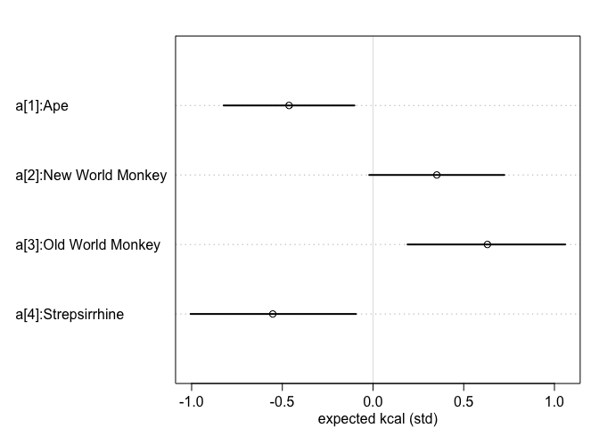<!-- -->
