Primates
================

# Instalation

``` r
rm(list=ls())
```

``` r
library(MASS)
library(rstan)
library(shape)
library(tidyr)
require(visdat)
library(ggplot2)
library(dagitty)
library(gtools)
library(ellipse)
library(tidyverse)
library(rethinking)
```

``` r
options(mc.cores = parallel::detectCores())
rstan_options(auto_write = TRUE)
```

# Load data

``` r
data("Primates301")
d <- Primates301
head(d)
```

    ##                          name          genus      species subspecies spp_id
    ## 1 Allenopithecus_nigroviridis Allenopithecus nigroviridis       <NA>      1
    ## 2         Allocebus_trichotis      Allocebus    trichotis       <NA>      2
    ## 3           Alouatta_belzebul       Alouatta     belzebul       <NA>      3
    ## 4             Alouatta_caraya       Alouatta       caraya       <NA>      4
    ## 5            Alouatta_guariba       Alouatta      guariba       <NA>      5
    ## 6           Alouatta_palliata       Alouatta     palliata       <NA>      6
    ##   genus_id social_learning research_effort brain    body group_size gestation
    ## 1        1               0               6 58.02 4655.00       40.0        NA
    ## 2        2               0               6    NA   78.09        1.0        NA
    ## 3        3               0              15 52.84 6395.00        7.4        NA
    ## 4        3               0              45 52.63 5383.00        8.9    185.92
    ## 5        3               0              37 51.70 5175.00        7.4        NA
    ## 6        3               3              79 49.88 6250.00       13.1    185.42
    ##   weaning longevity sex_maturity maternal_investment
    ## 1  106.15     276.0           NA                  NA
    ## 2      NA        NA           NA                  NA
    ## 3      NA        NA           NA                  NA
    ## 4  323.16     243.6      1276.72              509.08
    ## 5      NA        NA           NA                  NA
    ## 6  495.60     300.0      1578.42              681.02

``` r
str(d)
```

    ## 'data.frame':    301 obs. of  16 variables:
    ##  $ name               : Factor w/ 301 levels "Allenopithecus_nigroviridis",..: 1 2 3 4 5 6 7 8 9 10 ...
    ##  $ genus              : Factor w/ 68 levels "Allenopithecus",..: 1 2 3 3 3 3 3 3 3 4 ...
    ##  $ species            : Factor w/ 258 levels "abelii","aeeclis",..: 172 242 26 42 96 181 190 215 220 23 ...
    ##  $ subspecies         : Factor w/ 34 levels "alaotrensis",..: NA NA NA NA NA NA NA NA NA NA ...
    ##  $ spp_id             : int  1 2 3 4 5 6 7 8 9 10 ...
    ##  $ genus_id           : int  1 2 3 3 3 3 3 3 3 4 ...
    ##  $ social_learning    : int  0 0 0 0 0 3 0 0 0 0 ...
    ##  $ research_effort    : int  6 6 15 45 37 79 25 4 82 22 ...
    ##  $ brain              : num  58 NA 52.8 52.6 51.7 ...
    ##  $ body               : num  4655 78.1 6395 5383 5175 ...
    ##  $ group_size         : num  40 1 7.4 8.9 7.4 13.1 5.5 NA 7.9 4.1 ...
    ##  $ gestation          : num  NA NA NA 186 NA ...
    ##  $ weaning            : num  106 NA NA 323 NA ...
    ##  $ longevity          : num  276 NA NA 244 NA ...
    ##  $ sex_maturity       : num  NA NA NA 1277 NA ...
    ##  $ maternal_investment: num  NA NA NA 509 NA ...

``` r
vis_dat(d)
```

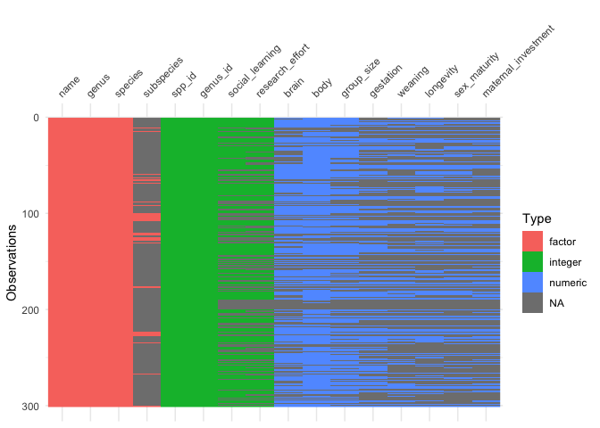<!-- -->

# 1. Poisson regression

``` r
d2 <- d[complete.cases(d$social_learning, d$brain, d$research_effort),]
dim(d2); dim(d)
```

    ## [1] 150  16

    ## [1] 301  16

``` r
d2$logbrain <- log(d2$brain)
d2$logresearch <- log(d2$research_effort)
```

``` r
dlist <- list(
  N = nrow(d2),
  S = d2$social_learning,
  B = d2$logbrain,
  R = d2$logresearch
)
```

## Initial statistical models


## Define priors

Weakly informative priors of alpha produces reasonable average values of
social learning in compared with flat prior of Normal(0,10). We’re going
to use the Normal(1,1) prior for alpha

``` r
set.seed(1)
N <- 200
plot(NULL, xlim=c(0,10), ylim=c(0,1),xlab="Average social learning", ylab="Density")
dens(exp(rnorm(N,0,1)), col=col.alpha(rangi2, 1), add=TRUE)
dens(exp(rnorm(N,1,1)), col=col.alpha("blue", 1), add=TRUE)
dens(exp(rnorm(N,0,10)), col=col.alpha("black", 1), add=TRUE)
```

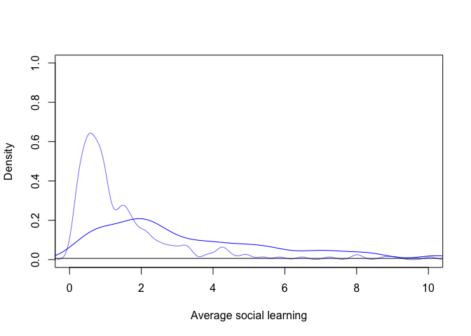<!-- -->

The Normal(0,0.5) prior of beta shows that most of prior predictions is
below 4 and some increases exponentially

``` r
set.seed(2)
N <- 200
a = rnorm(N,1,1)
b = rnorm(N,0,0.5)
B_seq = seq(from=min(d2$logbrain), to=max(d2$logbrain), length.out=30)
plot(NULL, xlim=c(min(B_seq),max(B_seq)), ylim=c(0,10), xlab="Log brain size", ylab="Average social learning")
for(i in 1:100){
  curve(exp(a[i] + b[i]*x), add=TRUE, col=col.alpha(rangi2,0.5))
}
```

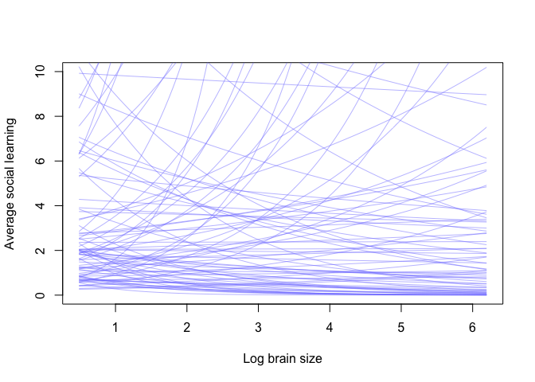<!-- -->

## Updated statistical models


``` r
code_m1.1 <- "
data{
  int N;
  vector<lower=0>[N] B;
  int S[N];
}
parameters{
  real a;
  real bB;
}
model{
  vector[N] lambda;
  bB ~ normal(0,0.5);
  a ~ normal(1,1);
  for(i in 1:N){
    lambda[i] = a + bB*B[i];
    lambda[i] = exp(lambda[i]);
  }
  S ~ poisson(lambda);
}
generated quantities{
  vector[N] log_lik;
  vector[N] lambda;
  for(i in 1:N){
    lambda[i] = a + bB*B[i];
    lambda[i] = exp(lambda[i]);
  }
  for(i in 1:N){
    log_lik[i] = poisson_lpmf(S[i] | lambda[i]);
  }
}
"
```

``` r
m.1.1 <- stan(model_code=code_m1.1,data=dlist,chains=4,cores=4)
```

``` r
precis(m.1.1)
```

    ##         mean         sd      5.5%     94.5%    n_eff    Rhat4
    ## a  -8.501763 0.30305617 -8.981819 -8.031238 690.9064 1.010226
    ## bB  2.100941 0.05647617  2.012511  2.189292 699.0075 1.010114

The estimates show a positive association of brain size with social
learning. However, the sampling is unreliable with low efficient number
of samples and high R_square.

## Posterior predictive checks

``` r
set.seed(3)
post.1.1 <- extract.samples(m.1.1)
B_seq = seq(from=min(d2$logbrain), to=max(d2$logbrain), length.out=30)
mu <- matrix(0,nrow=length(post.1.1$a),ncol=30)
for(i in 1:30){mu[,i] = exp(post.1.1$a + post.1.1$bB*B_seq[i])}
# mu <- link(m.1.1, data=list(B=B_seq))
mu.mean <- apply(mu,2,mean)
mu.pi <- apply(mu,2,PI,prob=0.89)
```

``` r
sim.social1.1 <- matrix(0,nrow=length(post.1.1$a),ncol=30)
for(i in 1:30){
  sim.social1.1[,i] = rpois(n=1e3, lambda=exp(post.1.1$a + post.1.1$bB*B_seq[i]))
}
# sim.social <- sim(m.1.1, data = list(B=B_seq))
sim.pi <- apply(sim.social1.1, 2, PI, prob=0.89)
```

``` r
plot(NULL, xlim=c(min(d2$logbrain),max(d2$logbrain)), ylim=c(min(d2$social_learning),max(d2$social_learning)),
     ylab="Social Learning", xlab="Log brain size")
points(x=d2$logbrain, y=d2$social_learning, col=rangi2)
lines(x=B_seq,y=mu.mean, col=col.alpha("black",1))
shade(mu.pi, B_seq, col=col.alpha("blue",0.5))
shade(sim.pi, B_seq, col=col.alpha("gray",0.5))
```

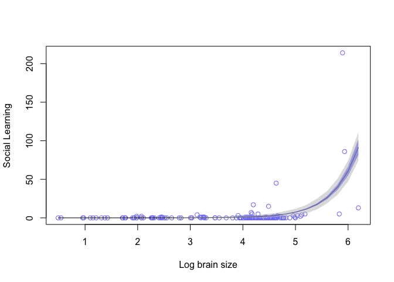<!-- -->

There are two information extracted from the chart \* Many zero values
of the outcome variable in the original data \* The posterior prediction
is curved by outliers with extreme high values given a large brain size.

We need more information to conclude the impact of brain size on social
learning due to the prevalence of zero values.

## Extended statistical models


### Prior predictive checks

``` r
set.seed(2)
N <- 200
a = rnorm(N,1,1)
b1 = rnorm(N,0,0.5)
b2 = rnorm(N,0,0.5)
B_seq = seq(from=min(d2$logbrain), to=max(d2$logbrain), length.out=30)
R_seq = seq(from=min(d2$logresearch), to=max(d2$logresearch), length.out=30)

prior.pred <- matrix(0,nrow=200,ncol=length(B_seq))
for(i in 1:length(B_seq)){
  prior.pred[,i] = exp(a + b1*B_seq[i] + b2*R_seq[i])
}

plot(NULL, xlim=c(min(B_seq),max(B_seq)), ylim=c(0,10), xlab="Log brain size", ylab="Average social learning")
for(i in 1:100){
  lines(x=B_seq,y=prior.pred[i,], add=TRUE, col=col.alpha(rangi2,0.5))
}
```

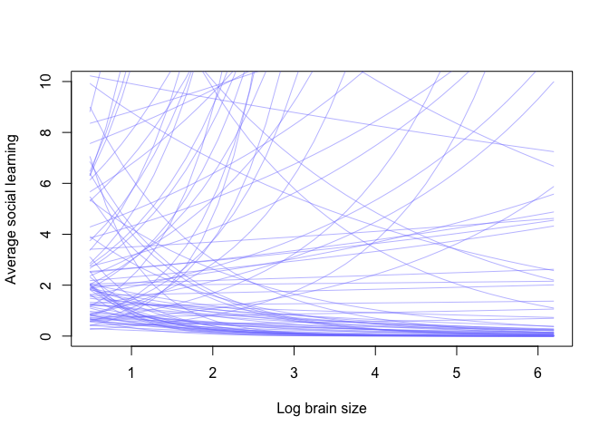<!-- -->

## Fit the model

``` r
code_m1.2 <- "
data{
  int N;
  vector<lower=0>[N] B;
  vector<lower=0>[N] R;
  int S[N];
}
parameters{
  real a;
  real b1;
  real b2;
}
model{
  vector[N] lambda;
  b1 ~ normal(0,0.5);
  b2 ~ normal(0,0.5);
  a ~ normal(1,1);
  for(i in 1:N){
    lambda[i] = a + b1*B[i] + b2*R[i];
    lambda[i] = exp(lambda[i]);
  }
  S ~ poisson(lambda);
}
generated quantities{
  vector[N] log_lik;
  vector[N] lambda;
  for(i in 1:N){
    lambda[i] = a + b1*B[i] + b2*R[i];
    lambda[i] = exp(lambda[i]);
  }
  for(i in 1:N){
    log_lik[i] = poisson_lpmf(S[i] | lambda[i]);
  }
}
"
```

``` r
m.1.2 <- stan(model_code=code_m1.2,data=dlist,chains=4,cores=4)
```

``` r
precis(m.1.2)
```

    ##          mean         sd       5.5%      94.5%    n_eff     Rhat4
    ## a  -7.0512125 0.27678666 -7.4857487 -6.6120581 1353.396 0.9991476
    ## b1  0.2840877 0.06254313  0.1819846  0.3863967 1669.768 1.0006597
    ## b2  1.5706792 0.06585884  1.4624740  1.6783459 1487.351 1.0003184

Adding research_effort did improve the sampling but not erase the
association of brain size with social learning. That likely implies that
research effort is a mediator.

## Posterior predictive checks

``` r
set.seed(4)
post.1.2 <- extract.samples(m.1.2)
B_seq = seq(from=min(d2$logbrain), to=max(d2$logbrain), length.out=30)
R_seq = seq(from=min(d2$logresearch), to=max(d2$logresearch), length.out=30)

mu <- matrix(0,nrow=length(post.1.2$a),ncol=30)
for(i in 1:30){mu[,i] = exp(post.1.2$a + post.1.2$b1*B_seq[i] + post.1.2$b2*R_seq[i])}
mu.mean <- apply(mu,2,mean)
mu.pi <- apply(mu,2,PI,prob=0.89)
```

``` r
sim.social1.2 <- matrix(0,nrow=length(post.1.2$a),ncol=30)
for(i in 1:30){sim.social1.2[,i] = rpois(1e3, lambda=exp(post.1.2$a + post.1.2$b1*B_seq[i] + post.1.2$b2*R_seq[i]))}
sim.pi <- apply(sim.social1.2, 2, PI, prob=0.89)
```

``` r
plot(NULL, xlim=c(min(d2$logbrain),max(d2$logbrain)), ylim=c(min(d2$social_learning),max(d2$social_learning)),
     ylab="Social Learning", xlab="Log brain size")
points(x=d2$logbrain, y=d2$social_learning, col=rangi2)
lines(x=B_seq,y=mu.mean, col=col.alpha("black",1))
shade(mu.pi, B_seq, col=col.alpha("blue",0.5))
shade(sim.pi, B_seq, col=col.alpha("gray",0.5))
```

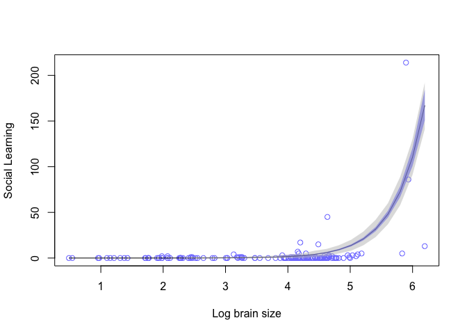<!-- -->

## DAGs

``` r
dag1.1 <- dagitty("dag{
                  B->R->S
                  B->S
}")
coordinates(dag1.1) <- list(x=c(B=0,R=1,S=2),
                            y=c(B=0,R=-1,S=0))
drawdag(dag1.1)
```

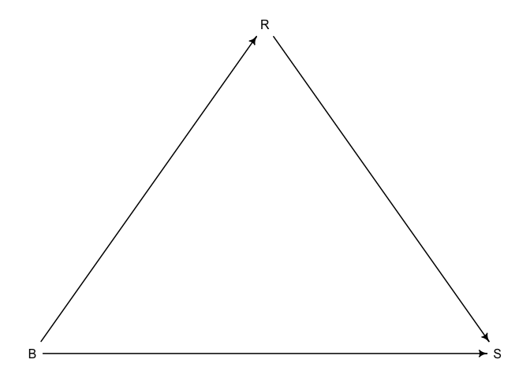<!-- -->

# 2. Zero-inflated Poisson

## Initial statistical models


``` r
code_m2.1 <- "
data{
  int N;
  vector<lower=0>[N] B;
  vector<lower=0>[N] R;
  int S[N];
}
parameters{
  real ap;
  real al;
  real b11;
  real b12;
  real b21;
  real b22;
}
model{
  vector[N] p;
  vector[N] lambda;
  b11 ~ normal(0,0.5);
  b12 ~ normal(0,0.5);
  b21 ~ normal(0,0.5);
  b22 ~ normal(0,0.5);
  ap ~ normal(0,1);
  al ~ normal(0,1);
  for(i in 1:N){
    lambda[i] = al + b21*B[i] + b22*R[i];
    lambda[i] = exp(lambda[i]);
  }
  for(i in 1:N){
    p[i] = ap + b11*B[i] + b12*R[i];
    p[i] = inv_logit(p[i]);
  }
  for(i in 1:N){
    if (S[i]==0) target += log_mix(p[i],0,poisson_lpmf(0|lambda[i]));
    if (S[i]>0) target += log1m(p[i]) + poisson_lpmf(S[i]|lambda[i]);
  }
}
generated quantities{
  vector[N] log_lik;
  vector[N] lambda;
  vector[N] p;
  for(i in 1:N){
    lambda[i] = al + b21*B[i] + b22*R[i];
    lambda[i] = exp(lambda[i]);
  }
  for(i in 1:N){
    p[i] = ap + b11*B[i] + b12*R[i];
    p[i] = inv_logit(p[i]);
  }
  for(i in 1:N){
    if(S[i]==0) log_lik[i] = log_mix(p[i],0,poisson_lpmf(0|lambda[i]));
    if(S[i]>0) log_lik[i] = log1m(p[i]) + poisson_lpmf(S[i]|lambda[i]);
  }
}
"
```

``` r
m.2.1 <- stan(model_code=code_m2.1,data=dlist,chains=4,cores=4)
```

``` r
precis(m.2.1)
```

    ##            mean         sd       5.5%      94.5%    n_eff     Rhat4
    ## ap   0.81402819 0.84832055 -0.5550833  2.1618942 3085.052 1.0021231
    ## al  -6.16307344 0.33695528 -6.6919304 -5.6282908 2552.979 1.0012275
    ## b11 -0.30545458 0.24937441 -0.7110587  0.0812102 2732.065 1.0004664
    ## b12 -0.08257843 0.24712526 -0.4654926  0.3106466 2488.502 1.0010324
    ## b21  0.21904865 0.06631657  0.1108124  0.3256436 2993.922 0.9992805
    ## b22  1.49032436 0.07642005  1.3666520  1.6117083 2152.354 1.0000966

## Posterior predictive checks

``` r
set.seed(5)
post2.1 <- extract.samples(m.2.1)
B_seq = seq(from=min(d2$logbrain), to=max(d2$logbrain), length.out=30)
R_seq = seq(from=min(d2$logresearch), to=max(d2$logresearch), length.out=30)
mu <- matrix(0,nrow=length(post2.1$al),ncol=30)
for(i in 1:30){mu[,i] = exp(post2.1$al + post2.1$b21*B_seq[i] + post2.1$b22*R_seq[i])}
# mu <- link(m2.1, data=list(B=B_seq, R=R_seq))
mu.mean <- apply(mu,2,mean)
mu.pi <- apply(mu,2,PI,prob=0.89)
```

``` r
sim.social <- matrix(0,nrow=length(post2.1$al),ncol=30)
for(i in 1:30){sim.social[,i] = rpois(1e3, lambda=exp(post2.1$al + post2.1$b21*B_seq[i] + post2.1$b22*R_seq[i]))}
# sim.social <- sim(m1.2, data = list(B=B_seq, R=R_seq))
sim.pi <- apply(sim.social, 2, PI, prob=0.89)
```

``` r
plot(NULL, xlim=c(min(d2$logbrain),max(d2$logbrain)), ylim=c(min(d2$social_learning),max(d2$social_learning)),
     ylab="Social Learning", xlab="Log brain size")
points(x=d2$logbrain, y=d2$social_learning, col=rangi2)
lines(x=B_seq,y=mu.mean, col=col.alpha("black",1))
shade(mu.pi, B_seq, col=col.alpha("blue",0.5))
shade(sim.pi, B_seq, col=col.alpha("gray",0.5))
```

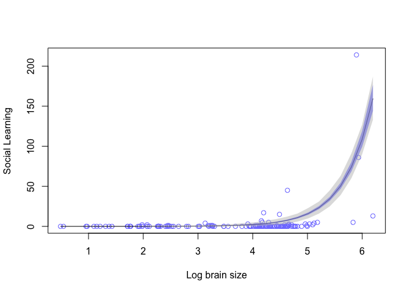<!-- -->

## Model comparison

``` r
compare(m.1.1, m.1.2, m.2.1)
```

    ##            WAIC       SE     dWAIC       dSE     pWAIC        weight
    ## m.2.1  556.9484 161.1398   0.00000        NA  55.50420  9.404527e-01
    ## m.1.2  562.4675 160.8184   5.51918  17.99246  49.57663  5.954731e-02
    ## m.1.1 1431.9189 487.9540 874.97058 407.40562 134.34633 9.459972e-191

``` r
compare(m.1.1, m.1.2, m.2.1, func = PSIS)
```

    ##            PSIS       SE     dPSIS       dSE    pPSIS        weight
    ## m.2.1  544.6367 152.8369   0.00000        NA 49.34836  9.861968e-01
    ## m.1.2  553.1746 153.6401   8.53791  16.80968 44.93016  1.380321e-02
    ## m.1.1 1352.4181 425.7537 807.78138 344.68943 94.59590 3.858911e-176

Both WAIC and PSIS agree on the outperformance of m2.1 in term of
expected predictive accuracy. Note that the slight different between
m1.2 and m2.1 is particular to the case study

# 3. Models with science knowledge

The models we are working with will consider the causal influence of
group size on brain size by taking into the impact of phylogenetic
distance and body mass

Theoretically, phylogenetic distance can have two important causal
influences: \* Two species that only recently separated tend to be more
similar \* Phylogentic distance is a proxy for unobserved variables that
generate covariance among species

## DAGs

``` r
dag3.1 <- dagitty("dag{
                  U[unobserved]
                  G->B
                  G<-M->B
                  G<-U->B
                  U->M
                  P->U
}")
coordinates(dag3.1) <- list(x=c(G=0,M=1,U=1,B=2,P=2),
                            y=c(G=0,M=1,U=2,B=0,P=2))
drawdag(dag3.1)
```

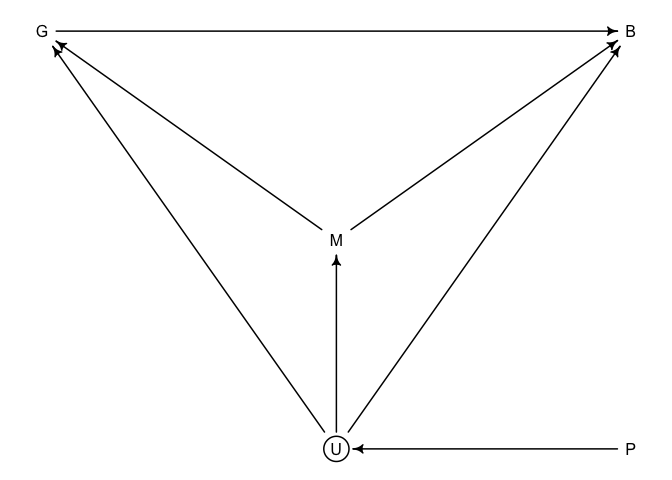<!-- -->

## Load data

``` r
data("Primates301")
data("Primates301_nex")
```

``` r
library(ape)
# plot(ladderize(Primates301_nex), type="fan", font=1, no.margin=TRUE,
#      label.offset=1, cex=0.5)
```

## An ordinary model in an un-ordinary style


``` r
d <- Primates301
d$name <- as.character(d$name)
dstan <- d[complete.cases(d$group_size, d$boby, d$brain),]
spp_obs <- dstan$name
```

``` r
dat_list <- list(
  N_spp = nrow(dstan),
  M = standardize(log(dstan$body)),
  B = standardize(log(dstan$brain)),
  G = standardize(log(dstan$group_size)),
  Imat = diag(nrow(dstan))
)
```

``` r
code_m3.1 <- "
data{
  int N_spp;
  vector[N_spp] M;
  vector[N_spp] B;
  vector[N_spp] G;
  matrix[N_spp,N_spp] Imat;
}
parameters{
  real a;
  real bG;
  real bM;
  real<lower=0> sigma_sq;
}
model{
  vector[N_spp] mu;
  matrix[N_spp,N_spp] SIGMA;
  
  sigma_sq ~ exponential(1);
  bM ~ normal(0,0.5);
  bG ~ normal(0,0.5);
  a ~ normal(0,1);
  
  SIGMA = Imat*sigma_sq;
  for(i in 1:N_spp){
    mu[i] = a + bM*M[i] + bG*G[i];
  }
  B ~ multi_normal(mu, SIGMA);
}
generated quantities{
  vector[N_spp] mu;
  vector[N_spp] log_lik;
  matrix[N_spp,N_spp] SIGMA;
  
  SIGMA = Imat*sigma_sq;
  for(i in 1:N_spp){
    mu[i] = a + bM*M[i] + bG*G[i];
  }
  for(i in 1:N_spp){
    log_lik[i] = multi_normal_lpdf(B | mu, SIGMA);
  }
}
"
```

``` r
m.3.1 <- stan(model_code=code_m3.1,data=dat_list,chains=4,cores=4)
```

``` r
precis(m.3.1)
```

    ##                  mean          sd        5.5%      94.5%    n_eff     Rhat4
    ## a        0.0002506137 0.017640207 -0.02756961 0.02877301 3788.440 0.9993696
    ## bG       0.1237384826 0.023261257  0.08692140 0.16023672 2920.822 0.9996053
    ## bM       0.8930603272 0.023195633  0.85659084 0.93030569 2881.400 1.0000746
    ## sigma_sq 0.0472879736 0.005693132  0.03901108 0.05721724 3214.753 0.9998127

## Brownian motion model

The Brownian motion means Gaussian random walks. If species traits drift
randomly with respect to one another after speciation, then the
covariance between a pair of species ends up being linearly related to
the phylogenetic branch distance between them.

``` r
tree_trimmed <- keep.tip( Primates301_nex, spp_obs )
Rbm <- corBrownian( phy=tree_trimmed )
V <- vcv(Rbm)
Dmat <- cophenetic( tree_trimmed )
plot( Dmat, V , xlab="phylogenetic distance" , ylab="covariance" )
```

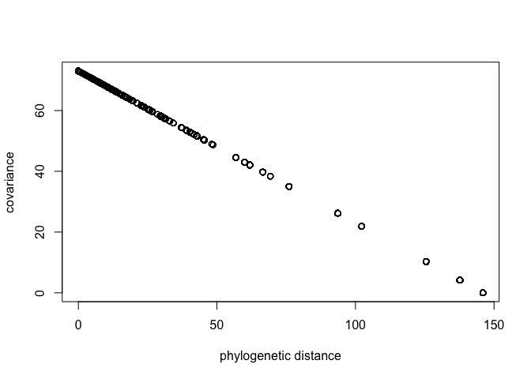<!-- -->

``` r
dat_list$V <- V[spp_obs, spp_obs]
dat_list$R <- dat_list$V/max(V)
```

We’ll replace the covariance matrix S with a matrix R that encodes
phylogenetic information

``` r
code_m3.2 <- "
data{
  int N_spp;
  vector[N_spp] M;
  vector[N_spp] B;
  vector[N_spp] G;
  matrix[N_spp,N_spp] R;
}
parameters{
  real a;
  real bG;
  real bM;
  real<lower=0> sigma_sq;
}
model{
  vector[N_spp] mu;
  matrix[N_spp,N_spp] SIGMA;
  
  sigma_sq ~ exponential(1);
  bM ~ normal(0,0.5);
  bG ~ normal(0,0.5);
  a ~ normal(0,1);
  
  SIGMA = R*sigma_sq;
  
  for(i in 1:N_spp){
    mu[i] = a + bM*M[i] + bG*G[i];
  }
  B ~ multi_normal(mu, SIGMA);
}
generated quantities{
  vector[N_spp] mu;
  vector[N_spp] log_lik;
  matrix[N_spp,N_spp] SIGMA;
  
  SIGMA = R*sigma_sq;
  
  for(i in 1:N_spp){
    mu[i] = a + bM*M[i] + bG*G[i];
  }
  for(i in 1:N_spp){
    log_lik[i] = multi_normal_lpdf(B | mu, SIGMA);
  }
}
"
```

``` r
m.3.2 <- stan(model_code=code_m3.2,data=dat_list,chains=4,cores=4)
```

``` r
precis(m.3.2)
```

    ##                 mean         sd        5.5%      94.5%    n_eff    Rhat4
    ## a        -0.19041727 0.16606208 -0.45937174 0.07077959 4504.540 0.999870
    ## bG       -0.01288621 0.01964945 -0.04426399 0.01915418 4580.905 1.000387
    ## bM        0.70066651 0.03758675  0.64022855 0.75953398 3901.776 1.000432
    ## sigma_sq  0.16086626 0.01850471  0.13348774 0.19251197 3989.212 1.000047

The estimate for bG implies of disappeared association between group
size and brain size.

In the model below, we’ll replace the Brownian motion with OU process
which constrain the variation and make the relationship between
phylogenetic distance and covariance non-linear as the formula


``` r
dat_list$Dmat <- Dmat[spp_obs, spp_obs]/max(Dmat)
```

``` r
code_m3.3 <- "
functions{
  matrix cov_GPL1(matrix x, real sq_alpha, real sq_rho, real delta){
    int N = dims(x)[1];
    matrix[N,N] K;
    for(i in 1:N-1){
      K[i,i] = sq_alpha + delta;
      for(j in (i+1):N){
        K[i,j] = sq_alpha * exp(-sq_rho * x[i,j]);
        K[j,i] = K[i,j];
      }
    }
    K[N,N] = sq_alpha + delta;
    return K;
  }
}
data{
  int N_spp;
  vector[N_spp] M;
  vector[N_spp] B;
  vector[N_spp] G;
  matrix[N_spp,N_spp] Dmat;
}
parameters{
  real a;
  real bG;
  real bM;
  real<lower=0> etasq;
  real<lower=0> rhosq;
}
model{
  vector[N_spp] mu;
  matrix[N_spp,N_spp] SIGMA;
  rhosq ~ normal(3,0.25);
  etasq ~ normal(1,0.25);
  bM ~ normal(0,0.5);
  bG ~ normal(0,0.5);
  a ~ normal(0,1);
  
  SIGMA = cov_GPL1(Dmat, etasq, rhosq, 0.01);
  
  for(i in 1:N_spp){
    mu[i] = a + bM*M[i] + bG*G[i];
  }
  B ~ multi_normal(mu, SIGMA);
}
generated quantities{
  vector[N_spp] mu;
  vector[N_spp] log_lik;
  matrix[N_spp,N_spp] SIGMA;
  
  SIGMA = cov_GPL1(Dmat, etasq, rhosq, 0.01);
  
  for(i in 1:N_spp){
    mu[i] = a + bM*M[i] + bG*G[i];
  }
  for(i in 1:N_spp){
    log_lik[i] = multi_normal_lpdf(B | mu, SIGMA);
  }
}
"
```

``` r
m.3.3 <- stan(model_code=code_m3.3,data=dat_list,chains=4,cores=4)
```

``` r
precis(m.3.3)
```

    ##              mean          sd        5.5%      94.5%    n_eff     Rhat4
    ## a     -0.06585716 0.076413066 -0.18624217 0.05552170 3592.525 0.9999773
    ## bG     0.04921366 0.023619833  0.01094681 0.08667719 4362.462 0.9995271
    ## bM     0.83413950 0.029779376  0.78579176 0.88201078 4328.411 1.0006057
    ## etasq  0.03518185 0.006948282  0.02528037 0.04711641 3583.009 1.0017924
    ## rhosq  2.79881064 0.248802445  2.39227950 3.19519884 4211.081 0.9996445

``` r
post <- extract.samples(m.3.3)
plot(NULL, xlim=c(0,max(dat_list$Dmat)), ylim=c(0,1.5),
     xlab="phylogenetic distance", ylab="covariance")

for(i in 1:30){
  curve(post$etasq[i]*exp(-post$rhosq[i]*x), add=TRUE, col=rangi2)
}

eta <- abs(rnorm(n=1e3,mean=1,sd=0.25))
rho <- abs(rnorm(n=1e3,mean=3,sd=0.25))
d_seq <- seq(from=0,to=1,length.out=50)
K <- sapply(d_seq, function(x){eta*exp(-rho*x)})

lines(d_seq, colMeans(K), lwd=2)
shade(apply(K,2,PI),d_seq)
text(0.5,0.5,"prior")
text(0.2,0.1,"posterior",col=rangi2)
```

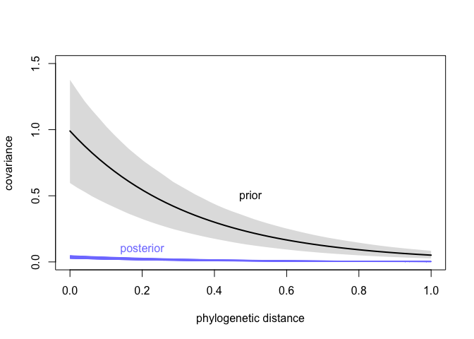<!-- -->

# 4. Models with measurement errors

We’ll make up some unknown errors that are supposed to be proportional
to the measurement of brain volume and body mass.

``` r
data(Primates301)
d <- Primates301
cc <- complete.cases( d$brain , d$body )
B <- d$brain[cc]
M <- d$body[cc]
B <- B / max(B)
M <- M / max(M)
```

That proportion makes the uncertainty not uniform across the values.
Here, error is 10% of the measurement.

``` r
Bse <- B*0.1
Mse <- M*0.1
```

## Fit a model without considering the errors

``` r
dat_list <- list(B=B, M=M, N=length(B))
```

``` r
code_m4.1 <- "
data{
  int N;
  vector[N] B;
  vector[N] M;
}
parameters{
  real a;
  real b;
  real<lower=0> sigma;
}
model{
  vector[N] mu;
  sigma ~ exponential(1);
  a ~ normal(0,1);
  b ~ normal(0,1);
  for(i in 1:N){
    mu[i] = a + b*log(M[i]);
  }
  B ~ lognormal(mu, sigma);
}
generated quantities{
  vector[N] log_lik;
  vector[N] mu;
  for(i in 1:N){
    mu[i] = a + b*log(M[i]);
  }
  for(i in 1:N){
    log_lik[i] = normal_lpdf(B[i] | mu[i], sigma);
  }
}
"
```

``` r
m.4.1 <- stan(model_code=code_m4.1,data=dat_list,chains=4,cores=4)
```

``` r
precis(m.4.1)
```

    ##            mean         sd      5.5%     94.5%    n_eff    Rhat4
    ## a     0.4275927 0.05637563 0.3401325 0.5185752 1712.149 1.001916
    ## b     0.7834096 0.01374375 0.7618049 0.8054433 1686.431 1.002455
    ## sigma 0.2928280 0.01561984 0.2692184 0.3183025 1982.103 1.001661

``` r
post4.1 <- extract.samples(m.4.1)
M_seq = seq(from=min(dat_list$M), to=max(dat_list$M), length.out=30)
med <- matrix(0,nrow=length(post4.1$a),ncol=30)
for(i in 1:30){med[,i] = exp(post4.1$a + post4.1$b*log(M_seq[i]))}
# med = exp(link(m4.1, data=list(M=M_seq)))
med.mean = apply(med,2,mean)
med.pi = apply(med,2,PI,prob=0.89)
```

``` r
plot(NULL,xlim=c(min(dat_list$M),max(dat_list$M)),
     ylim=c(min(dat_list$B),max(dat_list$B)),
     xlab="Body mass", ylab="Brain size")
points(x=dat_list$M, y=dat_list$B, col=col.alpha(rangi2,0.5))
lines(x=M_seq, med.mean)
shade(med.pi,M_seq)
```

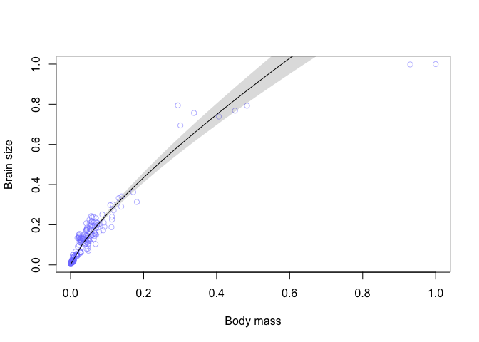<!-- -->

## Fit a model including the errors

``` r
dlist <- list(B_obs=B, M_obs=M, N=length(B), B_se=Bse, M_se=Mse)
```

``` r
code_m4.2 <- "
data{
  int N;
  vector[N] B_obs;
  vector[N] M_obs;
  vector[N] B_se;
  vector[N] M_se;
}
parameters{
  real<lower=0> sigma;
  real a;
  real b;
  vector<lower=0>[N] M_true;
  vector<lower=0>[N] B_true;
}
model{
  vector[N] mu;

  sigma ~ exponential(1);
  a ~ normal(0,1);
  b ~ normal(0,1);
  M_true ~ lognormal(0,1);
  M_obs ~ normal(M_true, M_se);
  for(i in 1:N){
    mu[i] = a + b*log(M_true[i]);
  }
  B_true ~ lognormal(mu, sigma);
  B_obs ~ normal(B_true, B_se);
}
generated quantities{
  vector[N] log_lik;
  vector[N] mu;
  for(i in 1:N){
    mu[i] = a + b*log(M_true[i]);
  }
  for(i in 1:N){
    log_lik[i] = normal_lpdf(B_obs[i] | B_true, B_se[i]);
  }
}
"
```

``` r
m.4.2 <- stan(model_code=code_m4.2,data=dlist,chains=4,cores=4)
```

``` r
precis(m.4.2)
```

    ##            mean         sd      5.5%     94.5%    n_eff     Rhat4
    ## sigma 0.2629618 0.01728056 0.2366218 0.2916107 3357.226 0.9998289
    ## a     0.4249890 0.05950461 0.3305422 0.5195754 2399.791 1.0004019
    ## b     0.7913791 0.01453159 0.7684719 0.8153733 2434.414 1.0005271

``` r
set.seed(11)
post4.2 <- extract.samples(m.4.2)

M_seq = seq(from=min(dlist$M_obs), to=max(dlist$M_obs), length.out=50)
B.med <- matrix(0,nrow=length(post4.2$a), ncol=50)
for(i in 1:50){B.med[,i] = exp(post4.2$a + post4.2$b*log(M_seq[i]))}
B.med_mean <- apply(B.med,2,mean)
B.med_pi <- apply(B.med,2,PI,prob=0.89)

B_true <- apply(post4.2$B_true,2,mean)
M_true <- apply(post4.2$M_true,2,mean)
plot(dlist$M_obs, dlist$B_obs, pch=1, col=rangi2,xlab="Body mass", ylab="Brain size")
# points(x=M_true, y=B_true)

lines(x=M_seq, y=B.med_mean)
shade(B.med_pi,M_seq)
```

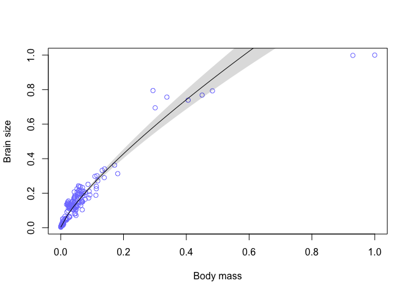<!-- -->

``` r
compare(m.4.2, m.4.1, func=PSIS)
```

    ##               PSIS           SE     dPSIS       dSE        pPSIS weight
    ## m.4.1     22875.75 1.464085e+03         0        NA     4493.155      1
    ## m.4.2 543156012.76 1.409499e+08 543133137 140948858 75630157.630      0

``` r
compare(m.4.2, m.4.1, func=WAIC)
```

    ##               WAIC           SE       dWAIC          dSE        pWAIC weight
    ## m.4.1 3.108674e+04 2.710997e+03 0.00000e+00           NA 8.598649e+03      1
    ## m.4.2 1.684320e+13 8.570691e+12 1.68432e+13 8.594335e+12 8.421405e+12      0

Three things should be highlighted:

-   m4.1 faces obstacles to deal with the data points with high brain
    size and high body mass. Meanwhile, accounting for measurement
    errors allows m4.2 to justify them.
-   m4.2 receives warnings of unreliable sampling that does not happen
    to m4.1
-   PSIS and WAIC agree on that m4.1 has a better expected predictive
    accuracy than m4.2
