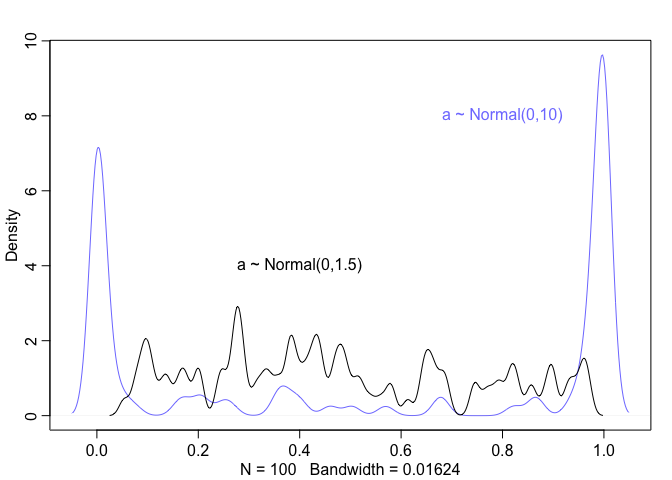
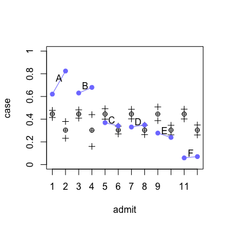
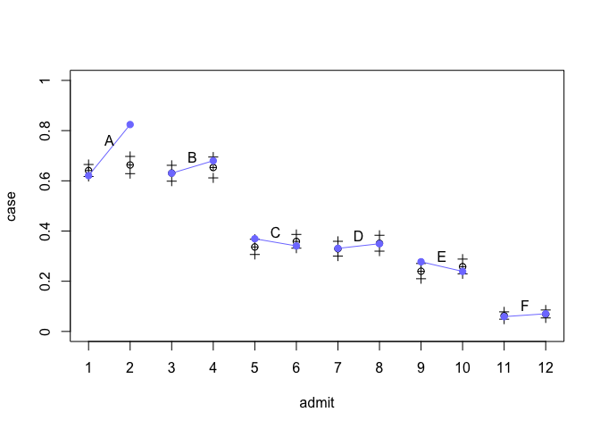
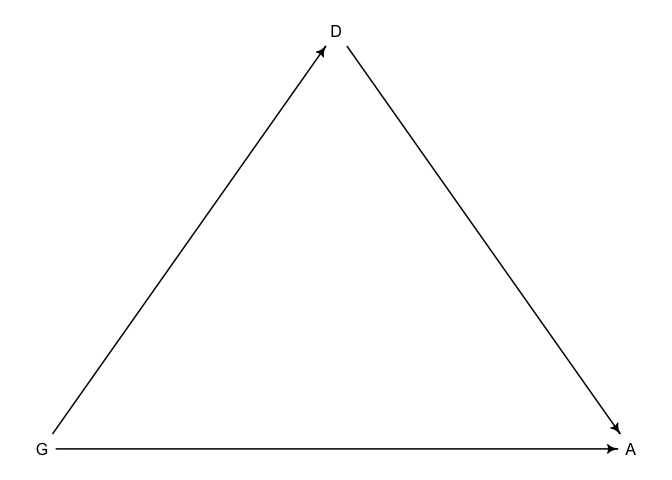
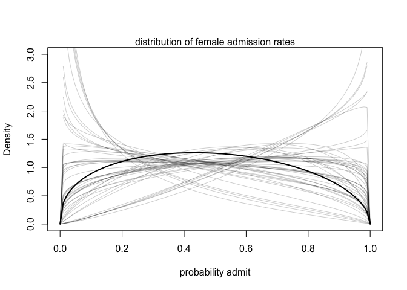
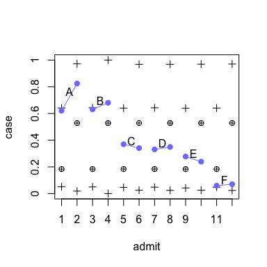

UCBadmit
================

# Instalation

``` r
rm(list=ls())
```

``` r
library(MASS)
library(rstan)
library(shape)
library(tidyr)
require(visdat)
library(ggplot2)
library(dagitty)
library(gtools)
library(ellipse)
library(tidyverse)
library(rethinking)
```

``` r
options(mc.cores = parallel::detectCores())
rstan_options(auto_write = TRUE)
```

# Load and process data

``` r
data("UCBadmit")
d <- UCBadmit
```

``` r
str(d)
```

    ## 'data.frame':    12 obs. of  5 variables:
    ##  $ dept            : Factor w/ 6 levels "A","B","C","D",..: 1 1 2 2 3 3 4 4 5 5 ...
    ##  $ applicant.gender: Factor w/ 2 levels "female","male": 2 1 2 1 2 1 2 1 2 1 ...
    ##  $ admit           : int  512 89 353 17 120 202 138 131 53 94 ...
    ##  $ reject          : int  313 19 207 8 205 391 279 244 138 299 ...
    ##  $ applications    : int  825 108 560 25 325 593 417 375 191 393 ...

# 1. Models with aggregated data

## Inital statistical models

$$
A\_{i} \\sim Binomial(N\_{i},p\_{i})\\\\
logit(p\_{i}) = \\alpha\_{GID\[i\]}\\\\
\\alpha\_{GID\[i\]} \\sim 
$$

## Define prior

We’re going to test a flat and tight prior of alpha, and plot the prior
predictive check

``` r
set.seed(1)
N <- 100
dens(inv_logit(rnorm(N,mean=0, sd=10)), adj=0.1, col=rangi2)
text(0.8,8,"a ~ Normal(0,10)", col=rangi2)
dens(inv_logit(rnorm(N,mean=0, sd=1.5)), adj=0.1, add=TRUE)
text(0.4,4,"a ~ Normal(0,1.5)")
```

<!-- -->

Apparently, a flat prior on the logit space piles up the probability on
zero and one. We will use the Normal(0,1.5) prior for alpha

## Updated statistical models

$$
A\_{i} \\sim Binomial(N\_{i},p\_{i})\\\\
logit(p\_{i}) = \\alpha\_{GID\[i\]}\\\\
\\alpha\_{GID\[i\]} \\sim Normal(0,1.5)
$$

``` r
dlist.1 <- list(
  admit = d$admit,
  applications = d$applications,
  gid = ifelse(d$applicant.gender=="male",1,2),
  N = nrow(d)
)
```

``` r
code_m1.1 <- "
data{
  int N;
  int admit[N];
  int applications[N];
  int gid[N];
}
parameters{
  vector[2] a;
}
model{
  vector[N] p;
  a ~ normal(0,1.5);
  for(i in 1:N){
    p[i] = a[gid[i]];
    p[i] = inv_logit(p[i]);
  }
  admit ~ binomial(applications, p);
}
generated quantities{
  vector[N] log_lik;
  vector[N] p;
  for(i in 1:N){
    p[i] = a[gid[i]];
    p[i] = inv_logit(p[i]);
  }
  for(i in 1:N){
    log_lik[i] = binomial_lpmf(admit[i] | applications[i], p[i]);
  }
}
"
```

``` r
m.1.1 <- stan(model_code=code_m1.1, data=dlist.1, chains=4, cores=4)
```

    ## Running /Library/Frameworks/R.framework/Resources/bin/R CMD SHLIB foo.c
    ## clang -mmacosx-version-min=10.13 -I"/Library/Frameworks/R.framework/Resources/include" -DNDEBUG   -I"/Library/Frameworks/R.framework/Versions/4.1/Resources/library/Rcpp/include/"  -I"/Library/Frameworks/R.framework/Versions/4.1/Resources/library/RcppEigen/include/"  -I"/Library/Frameworks/R.framework/Versions/4.1/Resources/library/RcppEigen/include/unsupported"  -I"/Library/Frameworks/R.framework/Versions/4.1/Resources/library/BH/include" -I"/Library/Frameworks/R.framework/Versions/4.1/Resources/library/StanHeaders/include/src/"  -I"/Library/Frameworks/R.framework/Versions/4.1/Resources/library/StanHeaders/include/"  -I"/Library/Frameworks/R.framework/Versions/4.1/Resources/library/RcppParallel/include/"  -I"/Library/Frameworks/R.framework/Versions/4.1/Resources/library/rstan/include" -DEIGEN_NO_DEBUG  -DBOOST_DISABLE_ASSERTS  -DBOOST_PENDING_INTEGER_LOG2_HPP  -DSTAN_THREADS  -DBOOST_NO_AUTO_PTR  -include '/Library/Frameworks/R.framework/Versions/4.1/Resources/library/StanHeaders/include/stan/math/prim/mat/fun/Eigen.hpp'  -D_REENTRANT -DRCPP_PARALLEL_USE_TBB=1   -I/usr/local/include   -fPIC  -Wall -g -O2  -c foo.c -o foo.o
    ## In file included from <built-in>:1:
    ## In file included from /Library/Frameworks/R.framework/Versions/4.1/Resources/library/StanHeaders/include/stan/math/prim/mat/fun/Eigen.hpp:13:
    ## In file included from /Library/Frameworks/R.framework/Versions/4.1/Resources/library/RcppEigen/include/Eigen/Dense:1:
    ## In file included from /Library/Frameworks/R.framework/Versions/4.1/Resources/library/RcppEigen/include/Eigen/Core:88:
    ## /Library/Frameworks/R.framework/Versions/4.1/Resources/library/RcppEigen/include/Eigen/src/Core/util/Macros.h:628:1: error: unknown type name 'namespace'
    ## namespace Eigen {
    ## ^
    ## /Library/Frameworks/R.framework/Versions/4.1/Resources/library/RcppEigen/include/Eigen/src/Core/util/Macros.h:628:16: error: expected ';' after top level declarator
    ## namespace Eigen {
    ##                ^
    ##                ;
    ## In file included from <built-in>:1:
    ## In file included from /Library/Frameworks/R.framework/Versions/4.1/Resources/library/StanHeaders/include/stan/math/prim/mat/fun/Eigen.hpp:13:
    ## In file included from /Library/Frameworks/R.framework/Versions/4.1/Resources/library/RcppEigen/include/Eigen/Dense:1:
    ## /Library/Frameworks/R.framework/Versions/4.1/Resources/library/RcppEigen/include/Eigen/Core:96:10: fatal error: 'complex' file not found
    ## #include <complex>
    ##          ^~~~~~~~~
    ## 3 errors generated.
    ## make: *** [foo.o] Error 1

``` r
precis(m.1.1,2, pars=c("a"))
```

    ##            mean         sd       5.5%      94.5%    n_eff    Rhat4
    ## a[1] -0.2189067 0.03838518 -0.2805785 -0.1582448 3559.448 1.001498
    ## a[2] -0.8291688 0.05055485 -0.9114897 -0.7471498 2979.134 1.000219

## Posterior predictive check

We’re interested in the difference in applications between gender. So,
we need to compute the contrast

``` r
post.1.1 <- extract.samples(m.1.1)
diff.a <- post.1.1$a[,1] - post.1.1$a[,2]
diff.p <- inv_logit(post.1.1$a[,1]) - inv_logit(post.1.1$a[,2])
precis(list(diff.a=diff.a, diff.p=diff.p))
```

    ##             mean         sd      5.5%     94.5%   histogram
    ## diff.a 0.6102621 0.06425241 0.5072778 0.7108458  ▁▁▁▃▇▇▅▂▁▁
    ## diff.p 0.1415839 0.01447121 0.1184298 0.1641637 ▁▁▁▂▃▇▇▅▂▁▁

The model estimates a higher posterior for male applicants than of
female applicants

``` r
mu_mean <- rep(0,12)
mu_pi_lower <- rep(0,12)
mu_pi_upper <- rep(0,12)
for(i in 1:12){
  app <- d$applications[i]
  gid <- ifelse(i%%2==0,2,1)
  sample <- rbinom(n=1e4, size=app, prob=inv_logit(post.1.1$a[,ifelse(i%%2==0,2,1)]))
  admit <- sample/app
  mu_mean[i] <- mean(admit)
  mu_pi_lower[i] <- PI(admit, prob=0.89)[1]
  mu_pi_upper[i] <- PI(admit, prob=0.89)[2]
}
```

``` r
plot(NULL, xlim=c(1,12),ylim=c(0,1),
     xlab="admit", ylab="case", xaxt="n", yaxt="n")
axis(side=2,at=seq(0,1,by=0.2), labels=c(0.0,0.2,0.4,0.6,0.8,1.0))
axis(side=1,at=seq(1,12,by=1), labels=seq(1,12,by=1))

points(x=1:12, y=mu_mean, pch=10)
for(i in 1:12){points(x=rep(i,2), y=c(mu_pi_lower[i],mu_pi_upper[i]), pch=3)}

points(x=1:12,y=d$admit/d$applications, pch=19, col=rangi2)
for(i in 1:6){lines(x=c(2*i-1,2*i),y=c(d$admit[2*i-1]/d$applications[2*i-1],d$admit[2*i]/d$applications[2*i]), col=rangi2)}

for(i in 1:6){text(x=2*i-0.5,y=mean(c(d$admit[2*i-1]/d$applications[2*i-1],d$admit[2*i]/d$applications[2*i]))+0.04, labels = d$dept[2*i])}
```

<!-- --> It is
obvious that the model badly fits the data and the posterior prediction
is off. That arises a motivating question of the average difference in
probability of admission between women and men within department

## Updated statistical models

$$
A\_{i} \\sim Binomial(N\_{i},p\_{i})\\\\
logit(p\_{i}) = \\alpha\_{GID\[i\]} + \\delta\_{DEPT\[i\]}\\\\
\\alpha\_{GID\[i\]} \\sim Normal(0,1.5)\\\\
\\delta\_{DEPT\[i\]} \\sim Normal(0,1.5)
$$

``` r
dlist.1$dept_id <- rep(1:6,each=2)
```

``` r
code_m1.2 <- "
data{
  int N;
  int admit[N];
  int applications[N];
  int gid[N];
  int dept_id[N];
}
parameters{
  vector[2] a;
  vector[6] b;
}
model{
  vector[N] p;
  b ~ normal(0,1.5);
  a ~ normal(0,1.5);
  for(i in 1:N){
    p[i] = a[gid[i]] + b[dept_id[i]];
    p[i] = inv_logit(p[i]);
  }
  admit ~ binomial(applications, p);
}
generated quantities{
  vector[N] log_lik;
  vector[N] p;
  for(i in 1:N){
    p[i] = a[gid[i]] + b[dept_id[i]];
    p[i] = inv_logit(p[i]);
  }
  for(i in 1:N){
    log_lik[i] = binomial_lpmf(admit[i] | applications[i], p[i]);
  }
}
"
```

``` r
m.1.2 <- stan(model_code = code_m1.2, data = dlist.1, chains = 4, cores = 4)
```

    ## Running /Library/Frameworks/R.framework/Resources/bin/R CMD SHLIB foo.c
    ## clang -mmacosx-version-min=10.13 -I"/Library/Frameworks/R.framework/Resources/include" -DNDEBUG   -I"/Library/Frameworks/R.framework/Versions/4.1/Resources/library/Rcpp/include/"  -I"/Library/Frameworks/R.framework/Versions/4.1/Resources/library/RcppEigen/include/"  -I"/Library/Frameworks/R.framework/Versions/4.1/Resources/library/RcppEigen/include/unsupported"  -I"/Library/Frameworks/R.framework/Versions/4.1/Resources/library/BH/include" -I"/Library/Frameworks/R.framework/Versions/4.1/Resources/library/StanHeaders/include/src/"  -I"/Library/Frameworks/R.framework/Versions/4.1/Resources/library/StanHeaders/include/"  -I"/Library/Frameworks/R.framework/Versions/4.1/Resources/library/RcppParallel/include/"  -I"/Library/Frameworks/R.framework/Versions/4.1/Resources/library/rstan/include" -DEIGEN_NO_DEBUG  -DBOOST_DISABLE_ASSERTS  -DBOOST_PENDING_INTEGER_LOG2_HPP  -DSTAN_THREADS  -DBOOST_NO_AUTO_PTR  -include '/Library/Frameworks/R.framework/Versions/4.1/Resources/library/StanHeaders/include/stan/math/prim/mat/fun/Eigen.hpp'  -D_REENTRANT -DRCPP_PARALLEL_USE_TBB=1   -I/usr/local/include   -fPIC  -Wall -g -O2  -c foo.c -o foo.o
    ## In file included from <built-in>:1:
    ## In file included from /Library/Frameworks/R.framework/Versions/4.1/Resources/library/StanHeaders/include/stan/math/prim/mat/fun/Eigen.hpp:13:
    ## In file included from /Library/Frameworks/R.framework/Versions/4.1/Resources/library/RcppEigen/include/Eigen/Dense:1:
    ## In file included from /Library/Frameworks/R.framework/Versions/4.1/Resources/library/RcppEigen/include/Eigen/Core:88:
    ## /Library/Frameworks/R.framework/Versions/4.1/Resources/library/RcppEigen/include/Eigen/src/Core/util/Macros.h:628:1: error: unknown type name 'namespace'
    ## namespace Eigen {
    ## ^
    ## /Library/Frameworks/R.framework/Versions/4.1/Resources/library/RcppEigen/include/Eigen/src/Core/util/Macros.h:628:16: error: expected ';' after top level declarator
    ## namespace Eigen {
    ##                ^
    ##                ;
    ## In file included from <built-in>:1:
    ## In file included from /Library/Frameworks/R.framework/Versions/4.1/Resources/library/StanHeaders/include/stan/math/prim/mat/fun/Eigen.hpp:13:
    ## In file included from /Library/Frameworks/R.framework/Versions/4.1/Resources/library/RcppEigen/include/Eigen/Dense:1:
    ## /Library/Frameworks/R.framework/Versions/4.1/Resources/library/RcppEigen/include/Eigen/Core:96:10: fatal error: 'complex' file not found
    ## #include <complex>
    ##          ^~~~~~~~~
    ## 3 errors generated.
    ## make: *** [foo.o] Error 1

``` r
precis(m.1.2,2, pars=c("a", "b"))
```

    ##            mean        sd       5.5%      94.5%    n_eff    Rhat4
    ## a[1] -0.4789207 0.5264939 -1.2842339  0.4152072 297.9388 1.008880
    ## a[2] -0.3810014 0.5269147 -1.1976630  0.5097491 297.7783 1.009311
    ## b[1]  1.0594740 0.5296359  0.1598257  1.8808392 301.9391 1.009138
    ## b[2]  1.0156674 0.5295784  0.1216130  1.8363039 303.8171 1.008475
    ## b[3] -0.2011413 0.5283440 -1.1109797  0.6070185 300.9506 1.009019
    ## b[4] -0.2335191 0.5295511 -1.1407627  0.5900850 302.0730 1.008847
    ## b[5] -0.6776444 0.5304559 -1.5836901  0.1424078 303.0172 1.009128
    ## b[6] -2.2331405 0.5414868 -3.1569337 -1.3775664 317.6766 1.008167

``` r
post <- extract.samples(m.1.2)
diff_a <- post$a[,1] - post$a[,2]
diff_p <- inv_logit(post$a[,1]) - inv_logit(post$a[,2])
precis( list( diff_a=diff_a , diff_p=diff_p ) )
```

    ##               mean         sd        5.5%       94.5%       histogram
    ## diff_a -0.09791931 0.08051447 -0.22541431 0.029343757    ▁▁▁▂▅▇▇▅▂▁▁▁
    ## diff_p -0.02206970 0.01846045 -0.05233485 0.006694517 ▁▁▁▁▂▃▅▇▇▅▂▁▁▁▁

``` r
dat <- list(gid=rep(1:2, times=6), dept_id=rep(1:6, each=2))

admit_post <- matrix(0, nrow=nrow(post$a), ncol=12)
for(i in 1:12){admit_post[,i] = inv_logit(post$a[,dat$gid[i]] + post$b[,dat$dept_id[i]])}

# admit_post <- link(m1.2, data=dat)
admit_mu <- apply(admit_post, 2, mean)
admit_pi <- apply(admit_post, 2,PI, prob=0.89)
```

``` r
plot(NULL, xlim=c(1,12),ylim=c(0,1),
     xlab="admit", ylab="case", xaxt="n", yaxt="n")
axis(side=2,at=seq(0,1,by=0.2), labels=c(0.0,0.2,0.4,0.6,0.8,1.0))
axis(side=1,at=seq(1,12,by=1), labels=seq(1,12,by=1))

points(x=1:12, y=admit_mu, pch=10)
for(i in 1:12){points(x=rep(i,2), y=admit_pi[,i], pch=3)}

points(x=1:12,y=d$admit/d$applications, pch=19, col=rangi2)
for(i in 1:6){lines(x=c(2*i-1,2*i),y=c(d$admit[2*i-1]/d$applications[2*i-1],d$admit[2*i]/d$applications[2*i]), col=rangi2)}

for(i in 1:6){text(x=2*i-0.5,y=mean(c(d$admit[2*i-1]/d$applications[2*i-1],d$admit[2*i]/d$applications[2*i]))+0.04, labels = d$dept[2*i])}
```

<!-- -->

The model fits the data very well. It proves that department is a
mediator. We can draw a causal diagram to illustrate the relationship

``` r
dag1.1 <- dagitty("dag{G->A
                  G->D->A}")
coordinates(dag1.1) <- list(x=c(G=0,D=1,A=2),y=c(G=0,D=-1,A=0))
drawdag(dag1.1)
```

<!-- -->

Although the model performs well, it is over-parameterized as we don’t
actually need either a\[1\] or a\[2\]

While including the mediator cures the model, another way is to
construct a beta-binomial model which deals with over-dispersed cases

#2. Beta-binomial models

The ultimate goal is to estimate the distribution of probabilities of
success instead of a single probability of success by using Beta
distribution

Note that a beta distribution has two parameters, an average probability
and a shape parameter

## Statistical model

$$
A\_{i} \\sim BetaBinomial(N\_{i},\\bar p\_{i}, \\theta)\\\\
logit(\\bar p\_{i}) = \\alpha\_{GID\[i\]}\\\\
\\alpha\_{GID\[i\]} \\sim Normal(0,1.5)\\\\
\\theta = \\phi + 2\\\\
\\phi \\sim Exponential(1)
$$

``` r
code_m2.1 <- "
data{
  int N;
  int admit[N];
  int applications[N];
  int gid[N];
}
parameters{
  vector[2] a;
  real<lower=0> phi;
}
transformed parameters{
  real theta;
  theta = phi + 2;
}
model{
  vector[N] p_bar;
  phi ~ exponential(1);
  a ~ normal(0, 1.5);
  for(i in 1:N){
    p_bar[i] = a[gid[i]];
    p_bar[i] = inv_logit(p_bar[i]);
  }
  admit ~ beta_binomial(applications, p_bar*theta, (1-p_bar)*theta);
}
generated quantities{
  vector[N] log_lik;
  vector[N] p_bar;
  for(i in 1:N){
    p_bar[i] = a[gid[i]];
    p_bar[i] = inv_logit(p_bar[i]);
  }
  for(i in 1:N){
    log_lik[i] = beta_binomial_lpmf(admit[i] | applications[i], p_bar*theta, (1-p_bar)*theta);
  }
}
"
```

``` r
m.2.1 <- stan(model_code=code_m2.1, data=dlist.1, chains=4, cores=4)
```

    ## Running /Library/Frameworks/R.framework/Resources/bin/R CMD SHLIB foo.c
    ## clang -mmacosx-version-min=10.13 -I"/Library/Frameworks/R.framework/Resources/include" -DNDEBUG   -I"/Library/Frameworks/R.framework/Versions/4.1/Resources/library/Rcpp/include/"  -I"/Library/Frameworks/R.framework/Versions/4.1/Resources/library/RcppEigen/include/"  -I"/Library/Frameworks/R.framework/Versions/4.1/Resources/library/RcppEigen/include/unsupported"  -I"/Library/Frameworks/R.framework/Versions/4.1/Resources/library/BH/include" -I"/Library/Frameworks/R.framework/Versions/4.1/Resources/library/StanHeaders/include/src/"  -I"/Library/Frameworks/R.framework/Versions/4.1/Resources/library/StanHeaders/include/"  -I"/Library/Frameworks/R.framework/Versions/4.1/Resources/library/RcppParallel/include/"  -I"/Library/Frameworks/R.framework/Versions/4.1/Resources/library/rstan/include" -DEIGEN_NO_DEBUG  -DBOOST_DISABLE_ASSERTS  -DBOOST_PENDING_INTEGER_LOG2_HPP  -DSTAN_THREADS  -DBOOST_NO_AUTO_PTR  -include '/Library/Frameworks/R.framework/Versions/4.1/Resources/library/StanHeaders/include/stan/math/prim/mat/fun/Eigen.hpp'  -D_REENTRANT -DRCPP_PARALLEL_USE_TBB=1   -I/usr/local/include   -fPIC  -Wall -g -O2  -c foo.c -o foo.o
    ## In file included from <built-in>:1:
    ## In file included from /Library/Frameworks/R.framework/Versions/4.1/Resources/library/StanHeaders/include/stan/math/prim/mat/fun/Eigen.hpp:13:
    ## In file included from /Library/Frameworks/R.framework/Versions/4.1/Resources/library/RcppEigen/include/Eigen/Dense:1:
    ## In file included from /Library/Frameworks/R.framework/Versions/4.1/Resources/library/RcppEigen/include/Eigen/Core:88:
    ## /Library/Frameworks/R.framework/Versions/4.1/Resources/library/RcppEigen/include/Eigen/src/Core/util/Macros.h:628:1: error: unknown type name 'namespace'
    ## namespace Eigen {
    ## ^
    ## /Library/Frameworks/R.framework/Versions/4.1/Resources/library/RcppEigen/include/Eigen/src/Core/util/Macros.h:628:16: error: expected ';' after top level declarator
    ## namespace Eigen {
    ##                ^
    ##                ;
    ## In file included from <built-in>:1:
    ## In file included from /Library/Frameworks/R.framework/Versions/4.1/Resources/library/StanHeaders/include/stan/math/prim/mat/fun/Eigen.hpp:13:
    ## In file included from /Library/Frameworks/R.framework/Versions/4.1/Resources/library/RcppEigen/include/Eigen/Dense:1:
    ## /Library/Frameworks/R.framework/Versions/4.1/Resources/library/RcppEigen/include/Eigen/Core:96:10: fatal error: 'complex' file not found
    ## #include <complex>
    ##          ^~~~~~~~~
    ## 3 errors generated.
    ## make: *** [foo.o] Error 1

``` r
precis(m.2.1,2, pars=c("a", "phi", "theta"))
```

    ##              mean       sd       5.5%     94.5%    n_eff    Rhat4
    ## a[1]  -1.61921394 1.098853 -2.8819324 0.7946142 3.130279 2.054090
    ## a[2]  -0.07826641 2.306696 -3.7801031 3.2758361 2.347696 3.339668
    ## phi    0.92598023 1.314244  0.0216275 3.9754452 3.599402 2.073297
    ## theta  2.92598023 1.314244  2.0216275 5.9754452 3.599402 2.073297

``` r
post <- extract.samples(m.2.1)
post$da <- post$a[,1] - post$a[,2]
precis(post$da)
```

    ##              mean       sd     5.5%    94.5%   histogram
    ## post.da -1.540948 2.788948 -5.26969 2.570101 ▅▅▂▇▂▂▃▅▅▁▁

While the contrast shows less evidence of a difference between male and
female admission rates, it is clear that the sampling is poor
performance with low number of efficient samples and high value of R
square.

``` r
gid <- 2
# draw posterior mean beta distribution
curve( dbeta2(x,mean(logistic(post$a[,gid])),mean(post$theta)) , from=0 , to=1 ,
    ylab="Density" , xlab="probability admit", ylim=c(0,3) , lwd=2 )
# draw 50 beta distributions sampled from posterior
for ( i in 1:50 ) {
    p <- logistic( post$a[i,gid] )
    theta <- post$theta[i]
    curve( dbeta2(x,p,theta) , add=TRUE , col=col.alpha("black",0.2) )
}
mtext( "distribution of female admission rates" )
```

<!-- -->

``` r
mu_mean <- rep(0,12)
mu_pi_lower <- rep(0,12)
mu_pi_upper <- rep(0,12)
for(i in 1:12){
  app <- d$applications[i]
  gid <- ifelse(i%%2==0,2,1)
  sample <- rbinom(n=1e4, size=app, prob=inv_logit(post$a[,ifelse(i%%2==0,2,1)]))
  admit <- sample/app
  mu_mean[i] <- mean(admit)
  mu_pi_lower[i] <- PI(admit, prob=0.89)[1]
  mu_pi_upper[i] <- PI(admit, prob=0.89)[2]
}
```

``` r
plot(NULL, xlim=c(1,12),ylim=c(0,1),
     xlab="admit", ylab="case", xaxt="n", yaxt="n")
axis(side=2,at=seq(0,1,by=0.2), labels=c(0.0,0.2,0.4,0.6,0.8,1.0))
axis(side=1,at=seq(1,12,by=1), labels=seq(1,12,by=1))

points(x=1:12, y=mu_mean, pch=10)
for(i in 1:12){points(x=rep(i,2), y=c(mu_pi_lower[i],mu_pi_upper[i]), pch=3)}

points(x=1:12,y=d$admit/d$applications, pch=19, col=rangi2)
for(i in 1:6){lines(x=c(2*i-1,2*i),y=c(d$admit[2*i-1]/d$applications[2*i-1],d$admit[2*i]/d$applications[2*i]), col=rangi2)}

for(i in 1:6){text(x=2*i-0.5,y=mean(c(d$admit[2*i-1]/d$applications[2*i-1],d$admit[2*i]/d$applications[2*i]))+0.04, labels = d$dept[2*i])}
```

<!-- -->

Although the model does not fit the data well, the point is that it does
see heterogeneity across rows and uses the beta distribution to estimate
and anticipate that heterogeneity

#3. Multilevel models ## Models with varying intercepts

``` r
dlist.2 <- list(
  male = ifelse(d$applicant.gender=="male",1,2),
  dept = rep(1:6, each=2),
  applications = d$applications,
  admit = d$admit,
  N = nrow(d)
)
```

``` r
code_m3.1 <- "
data{
  int N;
  int male[N];
  int dept[N];
  int applications[N];
  int admit[N];
}
parameters{
  vector[6] a;
  real a_bar;
  real b;
  real<lower=0> sigma;
}
model{
  vector[N] p;
  sigma ~ normal(0,1);
  b ~ normal(0,1);
  a_bar ~ normal(0,4);
  a ~ normal(a_bar, sigma);
  for(i in 1:N){
    p[i] = a[dept[i]] + b*male[i];
    p[i] = inv_logit(p[i]);
  }
  admit ~ binomial(applications, p);
}
generated quantities{
  vector[N] log_lik;
  vector[N] p;
  for(i in 1:N){
    p[i] = a[dept[i]] + b*male[i];
    p[i] = inv_logit(p[i]);
  }
  for(i in 1:N){
    log_lik[i] = binomial_lpmf(admit[i] | applications[i], p[i]);
  }
}
"
```

``` r
m.3.1 <- stan(model_code=code_m3.1, data=dlist.2, chains=4, cores=4)
```

    ## Running /Library/Frameworks/R.framework/Resources/bin/R CMD SHLIB foo.c
    ## clang -mmacosx-version-min=10.13 -I"/Library/Frameworks/R.framework/Resources/include" -DNDEBUG   -I"/Library/Frameworks/R.framework/Versions/4.1/Resources/library/Rcpp/include/"  -I"/Library/Frameworks/R.framework/Versions/4.1/Resources/library/RcppEigen/include/"  -I"/Library/Frameworks/R.framework/Versions/4.1/Resources/library/RcppEigen/include/unsupported"  -I"/Library/Frameworks/R.framework/Versions/4.1/Resources/library/BH/include" -I"/Library/Frameworks/R.framework/Versions/4.1/Resources/library/StanHeaders/include/src/"  -I"/Library/Frameworks/R.framework/Versions/4.1/Resources/library/StanHeaders/include/"  -I"/Library/Frameworks/R.framework/Versions/4.1/Resources/library/RcppParallel/include/"  -I"/Library/Frameworks/R.framework/Versions/4.1/Resources/library/rstan/include" -DEIGEN_NO_DEBUG  -DBOOST_DISABLE_ASSERTS  -DBOOST_PENDING_INTEGER_LOG2_HPP  -DSTAN_THREADS  -DBOOST_NO_AUTO_PTR  -include '/Library/Frameworks/R.framework/Versions/4.1/Resources/library/StanHeaders/include/stan/math/prim/mat/fun/Eigen.hpp'  -D_REENTRANT -DRCPP_PARALLEL_USE_TBB=1   -I/usr/local/include   -fPIC  -Wall -g -O2  -c foo.c -o foo.o
    ## In file included from <built-in>:1:
    ## In file included from /Library/Frameworks/R.framework/Versions/4.1/Resources/library/StanHeaders/include/stan/math/prim/mat/fun/Eigen.hpp:13:
    ## In file included from /Library/Frameworks/R.framework/Versions/4.1/Resources/library/RcppEigen/include/Eigen/Dense:1:
    ## In file included from /Library/Frameworks/R.framework/Versions/4.1/Resources/library/RcppEigen/include/Eigen/Core:88:
    ## /Library/Frameworks/R.framework/Versions/4.1/Resources/library/RcppEigen/include/Eigen/src/Core/util/Macros.h:628:1: error: unknown type name 'namespace'
    ## namespace Eigen {
    ## ^
    ## /Library/Frameworks/R.framework/Versions/4.1/Resources/library/RcppEigen/include/Eigen/src/Core/util/Macros.h:628:16: error: expected ';' after top level declarator
    ## namespace Eigen {
    ##                ^
    ##                ;
    ## In file included from <built-in>:1:
    ## In file included from /Library/Frameworks/R.framework/Versions/4.1/Resources/library/StanHeaders/include/stan/math/prim/mat/fun/Eigen.hpp:13:
    ## In file included from /Library/Frameworks/R.framework/Versions/4.1/Resources/library/RcppEigen/include/Eigen/Dense:1:
    ## /Library/Frameworks/R.framework/Versions/4.1/Resources/library/RcppEigen/include/Eigen/Core:96:10: fatal error: 'complex' file not found
    ## #include <complex>
    ##          ^~~~~~~~~
    ## 3 errors generated.
    ## make: *** [foo.o] Error 1

``` r
precis(m.3.1,2, pars=c("a", "a_bar", "b", "sigma"))
```

    ##              mean         sd        5.5%      94.5%     n_eff    Rhat4
    ## a[1]   0.48981207 0.11269320  0.30978567  0.6714631 1014.2880 1.002999
    ## a[2]   0.44276162 0.12081689  0.25438239  0.6396429 1112.6400 1.002573
    ## a[3]  -0.76415625 0.15184329 -1.00482945 -0.5234309  761.8983 1.003721
    ## a[4]  -0.79888546 0.14156360 -1.02584637 -0.5782081  913.3592 1.003668
    ## a[5]  -1.24216243 0.16794861 -1.51711627 -0.9786394  914.9133 1.003770
    ## a[6]  -2.78479671 0.19599537 -3.09614086 -2.4735963 1303.9079 1.003102
    ## a_bar -0.75207767 0.53893224 -1.60220836  0.1119815 2066.4716 1.000033
    ## b      0.09051158 0.08175715 -0.03973444  0.2208895  667.2848 1.004263
    ## sigma  1.26587628 0.35248710  0.82351947  1.8948319 2359.6358 1.000165

## Anagolous models with varying slopes

``` r
code_m3.2 <- "
data{
  int N;
  int dept[N];
  int male[N];
  int admit[N];
  int applications[N];
}
parameters{
  corr_matrix[2] Rho;
  vector<lower=0>[2] sigma;
  real a_bar;
  real b_bar;
  vector[6] a;
  vector[6] b;
}
model{
  vector[N] p;
  sigma ~ normal(0,1);
  Rho ~ lkj_corr(2);
  a_bar ~ normal(0,4);
  b_bar ~ normal(0,1);
  {
  vector[2] MU;
  vector[2] YY[6];
  
  MU = [a_bar, b_bar]';
  for(i in 1:6){YY[i] = [a[i], b[i]]';}
  YY ~ multi_normal(MU, quad_form_diag(Rho, sigma));
  }
  for(i in 1:N){
    p[i] = a[dept[i]] + b[dept[i]]*male[i];
    p[i] = inv_logit(p[i]);
  }
  admit ~ binomial(applications, p);
}
generated quantities{
  vector[N] log_lik;
  vector[N] p;
  for(i in 1:N){
    p[i] = a[dept[i]] + b[dept[i]]*male[i];
    p[i] = inv_logit(p[i]);
  }
  for(i in 1:N){
    log_lik[i] = binomial_lpmf(admit[i] | applications[i], p[i]);
  }
}
"
```

``` r
m.3.2 <- stan(model_code = code_m3.2, data = dlist.2, chains = 4, cores = 4)
```

    ## Running /Library/Frameworks/R.framework/Resources/bin/R CMD SHLIB foo.c
    ## clang -mmacosx-version-min=10.13 -I"/Library/Frameworks/R.framework/Resources/include" -DNDEBUG   -I"/Library/Frameworks/R.framework/Versions/4.1/Resources/library/Rcpp/include/"  -I"/Library/Frameworks/R.framework/Versions/4.1/Resources/library/RcppEigen/include/"  -I"/Library/Frameworks/R.framework/Versions/4.1/Resources/library/RcppEigen/include/unsupported"  -I"/Library/Frameworks/R.framework/Versions/4.1/Resources/library/BH/include" -I"/Library/Frameworks/R.framework/Versions/4.1/Resources/library/StanHeaders/include/src/"  -I"/Library/Frameworks/R.framework/Versions/4.1/Resources/library/StanHeaders/include/"  -I"/Library/Frameworks/R.framework/Versions/4.1/Resources/library/RcppParallel/include/"  -I"/Library/Frameworks/R.framework/Versions/4.1/Resources/library/rstan/include" -DEIGEN_NO_DEBUG  -DBOOST_DISABLE_ASSERTS  -DBOOST_PENDING_INTEGER_LOG2_HPP  -DSTAN_THREADS  -DBOOST_NO_AUTO_PTR  -include '/Library/Frameworks/R.framework/Versions/4.1/Resources/library/StanHeaders/include/stan/math/prim/mat/fun/Eigen.hpp'  -D_REENTRANT -DRCPP_PARALLEL_USE_TBB=1   -I/usr/local/include   -fPIC  -Wall -g -O2  -c foo.c -o foo.o
    ## In file included from <built-in>:1:
    ## In file included from /Library/Frameworks/R.framework/Versions/4.1/Resources/library/StanHeaders/include/stan/math/prim/mat/fun/Eigen.hpp:13:
    ## In file included from /Library/Frameworks/R.framework/Versions/4.1/Resources/library/RcppEigen/include/Eigen/Dense:1:
    ## In file included from /Library/Frameworks/R.framework/Versions/4.1/Resources/library/RcppEigen/include/Eigen/Core:88:
    ## /Library/Frameworks/R.framework/Versions/4.1/Resources/library/RcppEigen/include/Eigen/src/Core/util/Macros.h:628:1: error: unknown type name 'namespace'
    ## namespace Eigen {
    ## ^
    ## /Library/Frameworks/R.framework/Versions/4.1/Resources/library/RcppEigen/include/Eigen/src/Core/util/Macros.h:628:16: error: expected ';' after top level declarator
    ## namespace Eigen {
    ##                ^
    ##                ;
    ## In file included from <built-in>:1:
    ## In file included from /Library/Frameworks/R.framework/Versions/4.1/Resources/library/StanHeaders/include/stan/math/prim/mat/fun/Eigen.hpp:13:
    ## In file included from /Library/Frameworks/R.framework/Versions/4.1/Resources/library/RcppEigen/include/Eigen/Dense:1:
    ## /Library/Frameworks/R.framework/Versions/4.1/Resources/library/RcppEigen/include/Eigen/Core:96:10: fatal error: 'complex' file not found
    ## #include <complex>
    ##          ^~~~~~~~~
    ## 3 errors generated.
    ## make: *** [foo.o] Error 1

``` r
precis(m.3.2,2, pars=c("a_bar", "b_bar", "sigma"))
```

    ##                mean        sd       5.5%       94.5%    n_eff     Rhat4
    ## a_bar    -0.8120643 0.4753800 -1.5566497 -0.04591714 3176.665 1.0010397
    ## b_bar     0.1591793 0.2377175 -0.2198384  0.53043484 3233.780 0.9997590
    ## sigma[1]  1.0715393 0.3697362  0.5830111  1.73159426 3127.739 1.0001044
    ## sigma[2]  0.5311729 0.2424380  0.2371209  0.96380600 2114.983 0.9997373

``` r
code_m3.3 <- "
data{
  int N;
  int dept[N];
  int male[N];
  int admit[N];
  int applications[N];
}
parameters{
  corr_matrix[2] Rho;
  vector<lower=0>[2] sigma;
  real a_bar;
  real b_bar;
  vector[2] v[6];
}
model{
  vector[N] p;
  sigma ~ normal(0,1);
  Rho ~ lkj_corr(2);
  a_bar ~ normal(0,4);
  b_bar ~ normal(0,1);
  {
  vector[2] MU;

  MU = [a_bar, b_bar]';
  v ~ multi_normal(MU, quad_form_diag(Rho, sigma));
  }
  for(i in 1:N){
    p[i] = v[dept[i],1] + v[dept[i],2]*male[i];
    p[i] = inv_logit(p[i]);
  }
  admit ~ binomial(applications, p);
}
generated quantities{
  vector[N] log_lik;
  vector[N] p;
  for(i in 1:N){
    p[i] = v[dept[i],1] + v[dept[i],2]*male[i];
    p[i] = inv_logit(p[i]);
  }
  for(i in 1:N){
    log_lik[i] = binomial_lpmf(admit[i] | applications[i], p[i]);
  }
}
"
```

``` r
m.3.3 <- stan(model_code=code_m3.3, data=dlist.2, chains=4, cores=4)
```

    ## Running /Library/Frameworks/R.framework/Resources/bin/R CMD SHLIB foo.c
    ## clang -mmacosx-version-min=10.13 -I"/Library/Frameworks/R.framework/Resources/include" -DNDEBUG   -I"/Library/Frameworks/R.framework/Versions/4.1/Resources/library/Rcpp/include/"  -I"/Library/Frameworks/R.framework/Versions/4.1/Resources/library/RcppEigen/include/"  -I"/Library/Frameworks/R.framework/Versions/4.1/Resources/library/RcppEigen/include/unsupported"  -I"/Library/Frameworks/R.framework/Versions/4.1/Resources/library/BH/include" -I"/Library/Frameworks/R.framework/Versions/4.1/Resources/library/StanHeaders/include/src/"  -I"/Library/Frameworks/R.framework/Versions/4.1/Resources/library/StanHeaders/include/"  -I"/Library/Frameworks/R.framework/Versions/4.1/Resources/library/RcppParallel/include/"  -I"/Library/Frameworks/R.framework/Versions/4.1/Resources/library/rstan/include" -DEIGEN_NO_DEBUG  -DBOOST_DISABLE_ASSERTS  -DBOOST_PENDING_INTEGER_LOG2_HPP  -DSTAN_THREADS  -DBOOST_NO_AUTO_PTR  -include '/Library/Frameworks/R.framework/Versions/4.1/Resources/library/StanHeaders/include/stan/math/prim/mat/fun/Eigen.hpp'  -D_REENTRANT -DRCPP_PARALLEL_USE_TBB=1   -I/usr/local/include   -fPIC  -Wall -g -O2  -c foo.c -o foo.o
    ## In file included from <built-in>:1:
    ## In file included from /Library/Frameworks/R.framework/Versions/4.1/Resources/library/StanHeaders/include/stan/math/prim/mat/fun/Eigen.hpp:13:
    ## In file included from /Library/Frameworks/R.framework/Versions/4.1/Resources/library/RcppEigen/include/Eigen/Dense:1:
    ## In file included from /Library/Frameworks/R.framework/Versions/4.1/Resources/library/RcppEigen/include/Eigen/Core:88:
    ## /Library/Frameworks/R.framework/Versions/4.1/Resources/library/RcppEigen/include/Eigen/src/Core/util/Macros.h:628:1: error: unknown type name 'namespace'
    ## namespace Eigen {
    ## ^
    ## /Library/Frameworks/R.framework/Versions/4.1/Resources/library/RcppEigen/include/Eigen/src/Core/util/Macros.h:628:16: error: expected ';' after top level declarator
    ## namespace Eigen {
    ##                ^
    ##                ;
    ## In file included from <built-in>:1:
    ## In file included from /Library/Frameworks/R.framework/Versions/4.1/Resources/library/StanHeaders/include/stan/math/prim/mat/fun/Eigen.hpp:13:
    ## In file included from /Library/Frameworks/R.framework/Versions/4.1/Resources/library/RcppEigen/include/Eigen/Dense:1:
    ## /Library/Frameworks/R.framework/Versions/4.1/Resources/library/RcppEigen/include/Eigen/Core:96:10: fatal error: 'complex' file not found
    ## #include <complex>
    ##          ^~~~~~~~~
    ## 3 errors generated.
    ## make: *** [foo.o] Error 1

``` r
precis(m.3.3,2, pars=c("a_bar", "b_bar", "sigma"))
```

    ##                mean        sd       5.5%      94.5%    n_eff    Rhat4
    ## a_bar    -0.8096799 0.4854536 -1.5624910 -0.0359871 3246.085 1.000160
    ## b_bar     0.1658113 0.2405192 -0.2031313  0.5257589 3002.283 1.000812
    ## sigma[1]  1.0828938 0.3610602  0.6063938  1.7191605 2954.314 1.000041
    ## sigma[2]  0.5357183 0.2506505  0.2299567  0.9782799 1954.887 1.001293

``` r
code_m3.4 <- "
data{
  int N;
  int dept[N];
  int male[N];
  int admit[N];
  int applications[N];
}
parameters{
  corr_matrix[2] Rho;
  vector<lower=0>[2] sigma;
  vector[2] v[6];
  vector[2] v_mu;
}
model{
  vector[N] p;
  sigma ~ normal(0,1);
  Rho ~ lkj_corr(2);
  v_mu ~ normal(0,1);
  v ~ multi_normal(v_mu, quad_form_diag(Rho, sigma));
  for(i in 1:N){
    p[i] = v[dept[i],1] + v[dept[i],2]*male[i];
    p[i] = inv_logit(p[i]);
  }
  admit ~ binomial(applications, p);
}
generated quantities{
  vector[N] log_lik;
  vector[N] p;
  for(i in 1:N){
    p[i] = v[dept[i],1] + v[dept[i],2]*male[i];
    p[i] = inv_logit(p[i]);
  }
  for(i in 1:N){
    log_lik[i] = binomial_lpmf(admit[i] | applications[i], p[i]);
  }
}
"
```

``` r
m.3.4 <- stan(model_code=code_m3.4, data=dlist.2, chains=4, cores=4)
```

    ## Running /Library/Frameworks/R.framework/Resources/bin/R CMD SHLIB foo.c
    ## clang -mmacosx-version-min=10.13 -I"/Library/Frameworks/R.framework/Resources/include" -DNDEBUG   -I"/Library/Frameworks/R.framework/Versions/4.1/Resources/library/Rcpp/include/"  -I"/Library/Frameworks/R.framework/Versions/4.1/Resources/library/RcppEigen/include/"  -I"/Library/Frameworks/R.framework/Versions/4.1/Resources/library/RcppEigen/include/unsupported"  -I"/Library/Frameworks/R.framework/Versions/4.1/Resources/library/BH/include" -I"/Library/Frameworks/R.framework/Versions/4.1/Resources/library/StanHeaders/include/src/"  -I"/Library/Frameworks/R.framework/Versions/4.1/Resources/library/StanHeaders/include/"  -I"/Library/Frameworks/R.framework/Versions/4.1/Resources/library/RcppParallel/include/"  -I"/Library/Frameworks/R.framework/Versions/4.1/Resources/library/rstan/include" -DEIGEN_NO_DEBUG  -DBOOST_DISABLE_ASSERTS  -DBOOST_PENDING_INTEGER_LOG2_HPP  -DSTAN_THREADS  -DBOOST_NO_AUTO_PTR  -include '/Library/Frameworks/R.framework/Versions/4.1/Resources/library/StanHeaders/include/stan/math/prim/mat/fun/Eigen.hpp'  -D_REENTRANT -DRCPP_PARALLEL_USE_TBB=1   -I/usr/local/include   -fPIC  -Wall -g -O2  -c foo.c -o foo.o
    ## In file included from <built-in>:1:
    ## In file included from /Library/Frameworks/R.framework/Versions/4.1/Resources/library/StanHeaders/include/stan/math/prim/mat/fun/Eigen.hpp:13:
    ## In file included from /Library/Frameworks/R.framework/Versions/4.1/Resources/library/RcppEigen/include/Eigen/Dense:1:
    ## In file included from /Library/Frameworks/R.framework/Versions/4.1/Resources/library/RcppEigen/include/Eigen/Core:88:
    ## /Library/Frameworks/R.framework/Versions/4.1/Resources/library/RcppEigen/include/Eigen/src/Core/util/Macros.h:628:1: error: unknown type name 'namespace'
    ## namespace Eigen {
    ## ^
    ## /Library/Frameworks/R.framework/Versions/4.1/Resources/library/RcppEigen/include/Eigen/src/Core/util/Macros.h:628:16: error: expected ';' after top level declarator
    ## namespace Eigen {
    ##                ^
    ##                ;
    ## In file included from <built-in>:1:
    ## In file included from /Library/Frameworks/R.framework/Versions/4.1/Resources/library/StanHeaders/include/stan/math/prim/mat/fun/Eigen.hpp:13:
    ## In file included from /Library/Frameworks/R.framework/Versions/4.1/Resources/library/RcppEigen/include/Eigen/Dense:1:
    ## /Library/Frameworks/R.framework/Versions/4.1/Resources/library/RcppEigen/include/Eigen/Core:96:10: fatal error: 'complex' file not found
    ## #include <complex>
    ##          ^~~~~~~~~
    ## 3 errors generated.
    ## make: *** [foo.o] Error 1

``` r
precis(m.3.4,2, pars=c("sigma", "v_mu"))
```

    ##                mean        sd       5.5%       94.5%    n_eff    Rhat4
    ## sigma[1]  1.0703490 0.3616623  0.5891718 1.711167536 2990.090 1.002179
    ## sigma[2]  0.5388970 0.2515018  0.2266706 0.993763996 1709.124 1.000862
    ## v_mu[1]  -0.6853666 0.4330145 -1.3333461 0.007826456 3913.445 0.999956
    ## v_mu[2]   0.1655532 0.2523082 -0.2154549 0.564661067 2985.179 1.000610

``` r
code_m3.5 <- "
data{
  int N;
  int admit[N];
  int applications[N];
  int male[N];
  int dept[N];
}
parameters{
  matrix[2,6] z;
  vector[2] v_mu;
  vector<lower=0>[2] sigma;
  cholesky_factor_corr[2] L_Rho;
}
model{
  vector[N] p;
  matrix[6,2] v;
  
  L_Rho ~ lkj_corr_cholesky(2);
  sigma ~ normal(0,1);
  v_mu[1] ~ normal(0,4);
  v_mu[2] ~ normal(0,1);
  to_vector(z) ~ normal(0,1);
  
  v = (diag_pre_multiply(sigma, L_Rho)*z)';
  for(i in 1:N){
    p[i] = v_mu[1] + v[dept[i],1] + (v_mu[2] + v[dept[i],2])*male[i];
    p[i] = inv_logit(p[i]);
  }
  
  admit ~ binomial(applications, p);
}
generated quantities{
  vector[N] log_lik;
  vector[N] p;
  matrix[6,2] v;
  v = (diag_pre_multiply(sigma, L_Rho)*z)';
  for(i in 1:N){
    p[i] = v_mu[1] + v[dept[i],1] + (v_mu[2] + v[dept[i],2])*male[i];
    p[i] = inv_logit(p[i]);
  }
  for(i in 1:N){
    log_lik[i] = binomial_lpmf(admit[i] | applications[i], p[i]);
  }
}
"
```

``` r
m.3.5 <- stan(model_code=code_m3.5, data=dlist.2, chains=4, cores=4)
```

    ## Running /Library/Frameworks/R.framework/Resources/bin/R CMD SHLIB foo.c
    ## clang -mmacosx-version-min=10.13 -I"/Library/Frameworks/R.framework/Resources/include" -DNDEBUG   -I"/Library/Frameworks/R.framework/Versions/4.1/Resources/library/Rcpp/include/"  -I"/Library/Frameworks/R.framework/Versions/4.1/Resources/library/RcppEigen/include/"  -I"/Library/Frameworks/R.framework/Versions/4.1/Resources/library/RcppEigen/include/unsupported"  -I"/Library/Frameworks/R.framework/Versions/4.1/Resources/library/BH/include" -I"/Library/Frameworks/R.framework/Versions/4.1/Resources/library/StanHeaders/include/src/"  -I"/Library/Frameworks/R.framework/Versions/4.1/Resources/library/StanHeaders/include/"  -I"/Library/Frameworks/R.framework/Versions/4.1/Resources/library/RcppParallel/include/"  -I"/Library/Frameworks/R.framework/Versions/4.1/Resources/library/rstan/include" -DEIGEN_NO_DEBUG  -DBOOST_DISABLE_ASSERTS  -DBOOST_PENDING_INTEGER_LOG2_HPP  -DSTAN_THREADS  -DBOOST_NO_AUTO_PTR  -include '/Library/Frameworks/R.framework/Versions/4.1/Resources/library/StanHeaders/include/stan/math/prim/mat/fun/Eigen.hpp'  -D_REENTRANT -DRCPP_PARALLEL_USE_TBB=1   -I/usr/local/include   -fPIC  -Wall -g -O2  -c foo.c -o foo.o
    ## In file included from <built-in>:1:
    ## In file included from /Library/Frameworks/R.framework/Versions/4.1/Resources/library/StanHeaders/include/stan/math/prim/mat/fun/Eigen.hpp:13:
    ## In file included from /Library/Frameworks/R.framework/Versions/4.1/Resources/library/RcppEigen/include/Eigen/Dense:1:
    ## In file included from /Library/Frameworks/R.framework/Versions/4.1/Resources/library/RcppEigen/include/Eigen/Core:88:
    ## /Library/Frameworks/R.framework/Versions/4.1/Resources/library/RcppEigen/include/Eigen/src/Core/util/Macros.h:628:1: error: unknown type name 'namespace'
    ## namespace Eigen {
    ## ^
    ## /Library/Frameworks/R.framework/Versions/4.1/Resources/library/RcppEigen/include/Eigen/src/Core/util/Macros.h:628:16: error: expected ';' after top level declarator
    ## namespace Eigen {
    ##                ^
    ##                ;
    ## In file included from <built-in>:1:
    ## In file included from /Library/Frameworks/R.framework/Versions/4.1/Resources/library/StanHeaders/include/stan/math/prim/mat/fun/Eigen.hpp:13:
    ## In file included from /Library/Frameworks/R.framework/Versions/4.1/Resources/library/RcppEigen/include/Eigen/Dense:1:
    ## /Library/Frameworks/R.framework/Versions/4.1/Resources/library/RcppEigen/include/Eigen/Core:96:10: fatal error: 'complex' file not found
    ## #include <complex>
    ##          ^~~~~~~~~
    ## 3 errors generated.
    ## make: *** [foo.o] Error 1

``` r
precis(m.3.5,3, pars=c("v_mu", "sigma", "L_Rho"))
```

    ##                  mean        sd       5.5%       94.5%    n_eff     Rhat4
    ## v_mu[1]    -0.8141096 0.4788644 -1.5891985 -0.06149378 1048.432 1.0038265
    ## v_mu[2]     0.1608478 0.2406685 -0.2247666  0.55755846 1900.048 1.0015164
    ## sigma[1]    1.0831035 0.3709945  0.5947344  1.74354842 2310.179 0.9999076
    ## sigma[2]    0.5381796 0.2509417  0.2379839  0.97332745 1692.847 0.9997395
    ## L_Rho[1,1]  1.0000000 0.0000000  1.0000000  1.00000000      NaN       NaN
    ## L_Rho[1,2]  0.0000000 0.0000000  0.0000000  0.00000000      NaN       NaN
    ## L_Rho[2,1]  0.1511448 0.3505153 -0.4267596  0.70124139 2217.383 0.9998648
    ## L_Rho[2,2]  0.9181938 0.1060564  0.7028424  0.99946920 2051.352 1.0020514

``` r
compare(m.1.2, m.3.1, m.3.2, m.3.3, m.3.4, m.3.5)
```

    ##            WAIC        SE      dWAIC        dSE    pWAIC       weight
    ## m.3.5  90.75765  3.745297  0.0000000         NA 6.577495 3.212766e-01
    ## m.3.2  91.13019  3.706066  0.3725416  0.4076505 6.750873 2.666753e-01
    ## m.3.3  91.45626  3.860190  0.6986073  0.3193020 6.851745 2.265575e-01
    ## m.3.4  91.85753  3.947240  1.0998782  0.5146018 7.085789 1.853718e-01
    ## m.1.2 107.84134 15.375208 17.0836909 14.5431318 9.065153 6.269065e-05
    ## m.3.1 108.06098 15.932253 17.3033306 15.1850351 9.183410 5.617054e-05
